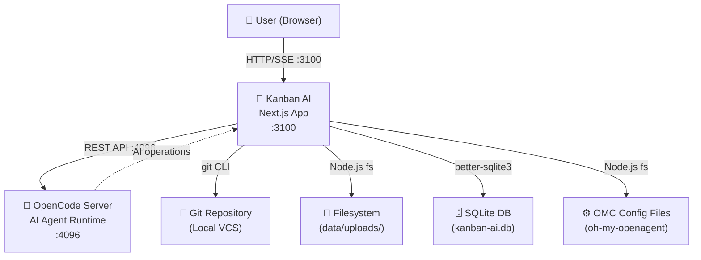
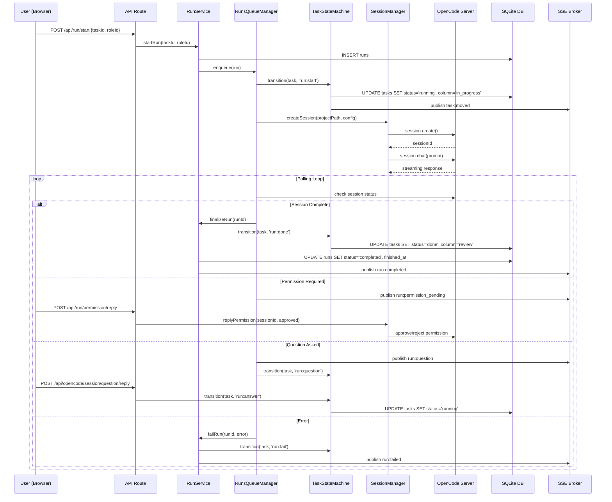
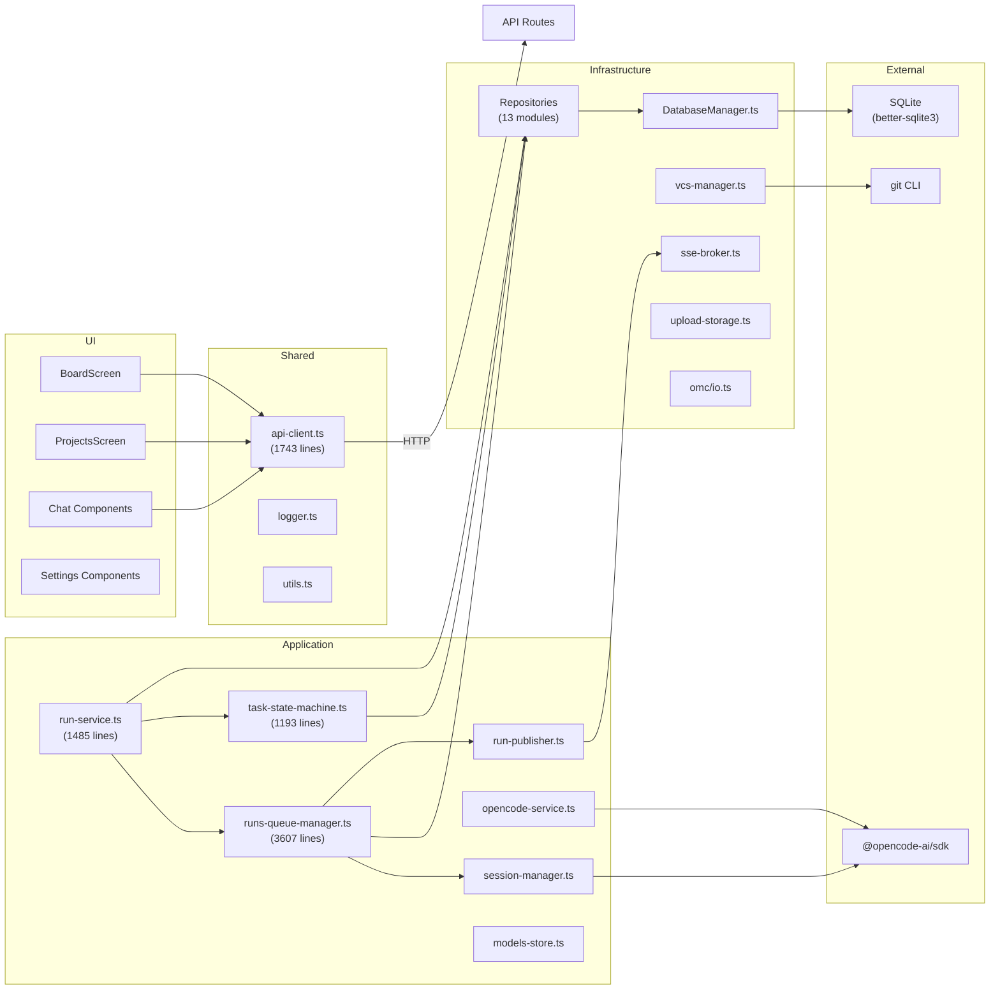

# ARCHITECTURE SNAPSHOT — kanban-ai

> Автоматически сгенерированный слепок архитектуры репозитория.

---

### Правила слепка

1. **Не придумывать.** Если данные неизвестны, писать `UNKNOWN` или `null`.
2. Все пути файлов указаны относительно корня репозитория (`.`).
3. Слепок состоит из 13 файлов (`00_*.md` ... `12_*.md`), которые склеиваются в один `ARCHITECTURE_SNAPSHOT.md`.
4. Каждая секция начинается с заголовка `## N) ...`.
5. Последний файл (`12_arch_index_json.md`) содержит только JSON-блок с индексом.
6. Используются диаграммы Mermaid (рендерятся GitHub и большинство Markdown-просмотрщиков).
7. Датировка: `generated_at = 2026-04-18`.
8. При изменении кода слепок нужно перегенерировать.

---
## 0) Метаданные слепка

| Поле | Значение |
|---|---|
| **Проект** | kanban-ai |
| **Назначение** | Web приложение для управления проектами и задачами (Kanban-доска) с интеграцией AI-агентов через Headless OpenCode и oh-my-openagent |
| **Тип репозитория** | Monorepo (pnpm workspaces), единственное приложение в `packages/next-js` |
| **Дата генерации** | 2026-04-18 |

### Языки и платформы

| Категория | Технология | Версия |
|---|---|---|
| Язык | TypeScript | UNKNOWN (см. `packages/tsconfig.base.json`) |
| Язык (вспомогательный) | SQL | SQLite dialect |
| Фреймворк | Next.js (App Router) | 15 |
| UI библиотека | React | 19 |
| База данных | SQLite (`better-sqlite3`) | WAL mode, без ORM |
| Стилизация | Tailwind CSS | 4 |
| Сборка | pnpm, Turbopack (dev) | UNKNOWN |
| Тестирование | Vitest (jsdom) | UNKNOWN |
| Линтер | ESLint | 9 |
| Форматирование | Prettier | UNKNOWN |

### Ключевые зависимости

| Пакет | Назначение |
|---|---|
| `@opencode-ai/sdk` | Интеграция с Headless OpenCode AI agent |
| `better-sqlite3` | SQLite драйвер |
| `@dnd-kit/core` + `@dnd-kit/sortable` | Drag-and-drop для Kanban доски |
| `@radix-ui/react-dialog`, `@radix-ui/react-dropdown-menu` | UI примитивы |
| `lucide-react` | Иконки |
| `mermaid` | Рендеринг диаграмм |
| `diff` | Unified diff |
| `ajv` | JSON Schema валидация |
| `jsonc-parser` | Парсинг JSON с комментариями |
| `@apidevtools/json-schema-ref-parser` | Dereference JSON Schema `$ref` |
| `clsx` + `tailwind-merge` | Утилиты для CSS классов |

### Команды

| Действие | Команда |
|---|---|
| Dev-сервер | `pnpm dev` → `next dev --port 3100 --turbo` |
| Production сборка | `pnpm build` → `next build` |
| Production запуск | `pnpm start` → `next start` |
| Тесты (single run) | `pnpm test:run` → `vitest run` |
| Тесты (watch) | `pnpm test` → `vitest` |
| Линтинг | `pnpm lint` → `next lint` |

### Конфигурация и секреты

| Файл | Переменные | Описание |
|---|---|---|
| `.env` / `.env.example` | `OPENCODE_PORT=4096`, `OPENCODE_URL`, `STORY_LANGUAGE=en\|ru` | Корневой env |
| `packages/next-js/.env.local.example` | `NEXT_PUBLIC_API_URL`, `NEXT_PUBLIC_APP_URL` | Frontend env |
| Runtime env | `DB_PATH` (default: `../../kanban-ai.db`), `LOG_LEVEL`, `RUNS_WORKTREE_ENABLED`, `RUNS_DEFAULT_CONCURRENCY`, `GENERATION_DEFAULT_CONCURRENCY`, `RUNS_PROVIDER_CONCURRENCY`, `RUNS_BLOCKED_RETRY_MS`, `RUNS_MAX_RETRY_COUNT`, `RUNS_RETRY_BASE_DELAY_MS` | Server-side конфигурация |
## 1) Карта репозитория

```
.
├── .claude/skills/repo-discovery/SKILL.md          # Claude skill для анализа репо
├── .env, .env.example                               # Env-конфигурация
├── .gitignore, .prettierrc                          # Git и форматирование
├── CLAUDE.md, README.md                             # Документация
├── architecture_snapshot/                           # ★ Этот слепок архитектуры
├── data/uploads/                                    # Загруженные файлы
├── docs/                                            # Дополнительная документация
│   ├── GIT_WORKTREES.md
│   ├── LLM_ERRORS_SAMPLES.md
│   ├── LLM_LOOP_SAMPLES.md
│   ├── STYLE_GUIDE.md
│   ├── llm-loop-detection.md
│   └── todo.md
├── eslint.config.js                                 # ESLint конфиг
├── kanban-ai.db                                     # ★ SQLite база данных
├── package.json                                     # Корневой package.json
├── packages/
│   ├── tsconfig.base.json                           # Базовый TS конфиг
│   └── next-js/                                     # ★ Единственное приложение
│       ├── .env.local, .env.local.example
│       ├── next.config.ts
│       ├── package.json
│       ├── postcss.config.mjs
│       ├── tsconfig.json
│       └── src/
│           ├── instrumentation.ts                   # Next.js instrumentation hook
│           ├── app/                                 # Next.js App Router
│           │   ├── globals.css
│           │   ├── layout.tsx                       # ★ Root layout (dark mode, ClientLayout)
│           │   ├── page.tsx                         # Redirect → /projects
│           │   ├── api/                             # ★ 21 группа API маршрутов
│           │   ├── board/                           # Страница Kanban доски
│           │   ├── events/                          # SSE endpoint
│           │   ├── projects/                        # Страница проектов
│           │   └── settings/                        # Страница настроек
│           ├── components/                          # ★ React UI компоненты
│           │   ├── BoardScreen.tsx                  # Главный экран доски
│           │   ├── ClientLayout.tsx                 # Client-side layout wrapper
│           │   ├── LightMarkdown.tsx                # Markdown рендерер
│           │   ├── ProjectSelect.tsx                # Селектор проектов
│           │   ├── ProjectsScreen.tsx               # Экран управления проектами
│           │   ├── Sidebar.tsx                      # Боковая навигация
│           │   ├── chat/                            # Компоненты чата с AI
│           │   ├── common/                          # Общие компоненты
│           │   ├── kanban/                          # Компоненты Kanban доски
│           │   ├── settings/                        # Компоненты настроек
│           │   └── voice/                           # Голосовой ввод
│           ├── features/                            # Feature-модули
│           │   ├── board/                           # Логика доски
│           │   └── task/                            # Логика задач
│           ├── lib/                                 # ★ Общие библиотеки
│           │   ├── api-client.ts                    # ★ 1743 строки - REST клиент
│           │   ├── config.ts                        # Конфигурация
│           │   ├── json-schema-types.ts             # JSON Schema типы
│           │   ├── lightmd/                         # Lightweight Markdown
│           │   ├── logger.ts                        # Структурное логирование
│           │   ├── opencode-status.ts               # Парсинг статуса OpenCode
│           │   ├── transport.ts                     # RPC типы
│           │   └── utils.ts                         # cn(), getContrastColor()
│           ├── server/                              # ★ Server-side логика
│           │   ├── types.ts                         # Доменные типы
│           │   ├── db/                              # База данных
│           │   │   ├── DatabaseManager.ts           # ★ 597 строк - SQLite + миграции
│           │   │   ├── index.ts                     # Singleton через globalThis
│           │   │   └── migrations/                  # SQL миграции v17-v33
│           │   ├── repositories/                    # ★ 13 репозиториев
│           │   ├── run/                             # ★ Ядро: управление выполнением
│           │   │   ├── run-service.ts               # ★ 1485 строк - lifecycle оркестрация
│           │   │   ├── runs-queue-manager.ts        # ★★★ 3607 строк - очередь, конкарентность
│           │   │   ├── task-state-machine.ts        # ★ 1193 строк - машина состояний
│           │   │   ├── run-publisher.ts             # SSE event publishing
│           │   │   └── prompts/                     # AI промпты (task, qa, user-story)
│           │   ├── opencode/                        # ★ Управление OpenCode процессом
│           │   │   ├── opencode-service.ts          # Spawn/manage opencode serve
│           │   │   ├── session-manager.ts           # Session CRUD + prompt + inspect
│           │   │   ├── session-store.ts             # Message sending
│           │   │   ├── models-store.ts              # Model CRUD
│           │   │   └── ...
│           │   ├── events/sse-broker.ts             # Pub/Sub для SSE
│           │   ├── vcs/vcs-manager.ts               # Git worktree provisioning
│           │   ├── workflow/                        # Workflow менеджер
│           │   ├── omc/io.ts                        # oh-my-openagent config
│           │   └── upload/                          # File upload storage
│           └── types/                               # Типы
│               ├── ipc.ts                           # Run, Message, Part, Permission
│               ├── kanban.ts                        # KanbanTask, Tags, TaskLink
│               ├── screen.ts                        # Screen type
│               └── workflow.ts                      # Workflow column icons
├── pnpm-lock.yaml
├── pnpm-workspace.yaml
├── tsconfig.base.json
├── tsconfig.json
├── vitest.config.ts
└── vitest.setup.ts
```

### Модули и зоны ответственности

| Модуль (директория) | Ответственность | Ключевые файлы |
|---|---|---|
| `packages/next-js/src/app/api/` | HTTP API (21 группа маршрутов) | `projects/route.ts`, `tasks/route.ts`, `run/route.ts` и др. |
| `packages/next-js/src/components/` | React UI: доска, чат, настройки, сайдбар | `BoardScreen.tsx`, `kanban/`, `chat/`, `settings/` |
| `packages/next-js/src/server/run/` | Оркестрация выполнения задач (runs) | `run-service.ts`, `runs-queue-manager.ts`, `task-state-machine.ts` |
| `packages/next-js/src/server/opencode/` | Управление OpenCode процессом и сессиями | `opencode-service.ts`, `session-manager.ts`, `session-store.ts` |
| `packages/next-js/src/server/db/` | SQLite подключение, миграции, сидинг | `DatabaseManager.ts`, `migrations/` |
| `packages/next-js/src/server/repositories/` | 13 data-access репозиториев | `task.ts`, `run.ts`, `project.ts`, `board.ts` и др. |
| `packages/next-js/src/server/vcs/` | Git worktree, merge, diff | `vcs-manager.ts` |
| `packages/next-js/src/lib/` | Shared: API клиент, логгер, утилиты | `api-client.ts`, `logger.ts`, `utils.ts` |
| `packages/next-js/src/types/` | Общие типы (IPC, Kanban, Workflow) | `ipc.ts`, `kanban.ts`, `workflow.ts` |
## 2) Контекст и границы системы

### Внешние системы

| # | Система | Тип подключения | Протокол | Назначение |
|---|---|---|---|---|
| 1 | **OpenCode Server** | Дочерний процесс (child_process) | REST API (`@opencode-ai/sdk`) | Headless AI-агент для выполнения задач, генерации user stories, QA тестирования |
| 2 | **Git** | CLI через child_process | git CLI | VCS: worktrees для параллельного выполнения, merge, diff, status |
| 3 | **Filesystem** | Node.js `fs` | Local I/O | Директории (browse), загрузки (`data/uploads/`), конфигурационные файлы |
| 4 | **OMC (oh-my-openagent)** | Node.js `fs` | Local I/O | Чтение/запись конфигурационных файлов oh-my-openagent с пресетами и бэкапами |

### Runtime процессы

| Процесс | Порт | Управление | Описание |
|---|---|---|---|
| **Next.js server** | 3100 | `pnpm dev` / `pnpm start` | Основной web-сервер: UI + API маршруты |
| **OpenCode server** | 4096 | Spawned как child process через `OpencodeService` | AI-агент runtime: сессии, сообщения, разрешения |
| **SQLite database** | N/A (file) | `better-sqlite3` (WAL mode) | Файл `kanban-ai.db`, in-process |

### Контракты с OpenCode Server

| Операция | Метод SDK | Вход | Выход |
|---|---|---|---|
| Создать сессию | `session.create()` | project path, config | `Session` |
| Отправить сообщение | `session.chat()` | session ID, prompt | `Message` (streaming) |
| Получить сообщения | `session.messages()` | session ID | `Message[]` |
| Завершить сессию | `session.abort()` | session ID | void |
| Список моделей | `model.list()` | — | `Model[]` |
| Разрешения | `session.permissions()` | session ID | `Permission[]` |
| Вопросы | `session.questions()` | session ID | `Question[]` |
| Todos | `session.todos()` | session ID | `Todo[]` |

### Границы системы

- **Входящие запросы**: браузер пользователя → HTTP/SSE → Next.js server (порт 3100)
- **Исходящие запросы**: Next.js server → HTTP → OpenCode server (порт 4096)
- **Файловая система**: чтение/запись в рамках рабочего пространства проекта и `data/uploads/`
- **Git**: операции в рамках клонированного репозитория проекта и его worktrees
- **Нет аутентификации**: все API endpoints открыты, предполагается localhost-only deployment
- **Нет rate limiting**: нет ограничения частоты запросов к API маршрутам
## 3) Основные сценарии (use-cases)

### UC-01: Создать проект

| Аспект | Описание |
|---|---|
| **Вход** | Название проекта, путь к директории |
| **Шаги** | 1. POST `/api/projects` с name + path. 2. Создаётся запись в `projects`. 3. Автоматически создаётся `boards` + 7 колонок `board_columns` (backlog, ready, deferred, in_progress, blocked, review, closed) |
| **Выход** | Объект Project с id |
| **Side effects** | INSERT в `projects`, `boards`, `board_columns` |
| **Ошибки** | Путь уже существует (UNIQUE constraint), невалидный путь |
| **Модули** | `app/api/projects/route.ts`, `server/repositories/project.ts`, `server/repositories/board.ts`, `server/db/DatabaseManager.ts` |
| **Сущности** | `Project`, `Board`, `BoardColumn` |
| **Интерфейсы** | `POST /api/projects` |

### UC-02: Просмотреть доску

| Аспект | Описание |
|---|---|
| **Вход** | project_id |
| **Шаги** | 1. GET `/api/boards/project/[projectId]`. 2. Загружаются board + columns. 3. GET `/api/tasks?boardId=`. 4. Загружаются задачи с тегами |
| **Выход** | Board с columns + tasks |
| **Side effects** | SELECT queries |
| **Ошибки** | Проект не найден |
| **Модули** | `app/api/boards/`, `app/api/tasks/`, `server/repositories/board.ts`, `server/repositories/task.ts` |
| **Сущности** | `Board`, `BoardColumn`, `Task`, `Tag` |
| **Интерфейсы** | `GET /api/boards/project/[projectId]`, `GET /api/tasks?boardId=` |

### UC-03: Создать задачу

| Аспект | Описание |
|---|---|
| **Вход** | title, description, board_id, column_id, priority, tags, etc. |
| **Шаги** | 1. POST `/api/tasks`. 2. Создаётся запись в `tasks` с order_in_column. 3. SSE event опубликован |
| **Выход** | Объект Task |
| **Side effects** | INSERT в `tasks`, SSE event `task:created` |
| **Ошибки** | Несуществующий board/column |
| **Модули** | `app/api/tasks/route.ts`, `server/repositories/task.ts`, `server/events/sse-broker.ts` |
| **Сущности** | `Task` |
| **Интерфейсы** | `POST /api/tasks` |

### UC-04: Переместить задачу (Drag-Drop)

| Аспект | Описание |
|---|---|
| **Вход** | task_id, target_column_id, new_order |
| **Шаги** | 1. PUT `/api/tasks/[id]/move`. 2. Обновляются `column_id` + `order_in_column`. 3. SSE event опубликован |
| **Выход** | Обновлённый Task |
| **Side effects** | UPDATE `tasks`, SSE event `task:moved` |
| **Ошибки** | Задача не найдена, несуществующая колонка |
| **Модули** | `app/api/tasks/[id]/move/route.ts`, `server/repositories/task.ts` |
| **Сущности** | `Task` |
| **Интерфейсы** | `PUT /api/tasks/[id]/move` |

### UC-05: Сгенерировать User Story (AI)

| Аспект | Описание |
|---|---|
| **Вход** | task_id |
| **Шаги** | 1. POST `/api/opencode/generate-user-story`. 2. Создаётся OpenCode session. 3. Отправляется промпт для генерации user story. 4. Ответ парсится и записывается в `tasks.description` |
| **Выход** | Обновлённая задача с сгенерированным описанием |
| **Side effects** | OpenCode session создана, UPDATE `tasks`, SSE event |
| **Ошибки** | OpenCode server недоступен, ошибка генерации |
| **Модули** | `app/api/opencode/`, `server/opencode/session-manager.ts`, `server/opencode/session-store.ts`, `server/run/prompts/user-story.ts` |
| **Сущности** | `Task`, OpenCode `Session` |
| **Интерфейсы** | `POST /api/opencode/generate-user-story` |

### UC-06: Запустить выполнение задачи (Start Run)

| Аспект | Описание |
|---|---|
| **Вход** | task_id, role_id, mode |
| **Шаги** | 1. POST `/api/run/start`. 2. Создаётся Run в БД. 3. Run добавляется в очередь `RunsQueueManager`. 4. Создаётся OpenCode session с role-specific промптом. 5. Task переходит в `in_progress` через `TaskStateMachine` |
| **Выход** | Объект Run |
| **Side effects** | INSERT `runs`, UPDATE `tasks` (status→running), git worktree может быть создан, SSE events |
| **Ошибки** | Задача уже в выполнении, нет доступных слотов, OpenCode server недоступен, dirty git |
| **Модули** | `app/api/run/route.ts`, `server/run/run-service.ts`, `server/run/runs-queue-manager.ts`, `server/run/task-state-machine.ts`, `server/opencode/session-manager.ts`, `server/vcs/vcs-manager.ts` |
| **Сущности** | `Run`, `Task`, `AgentRole`, OpenCode `Session` |
| **Интерфейсы** | `POST /api/run/start` |

### UC-07: Завершение Run (AI завершил работу)

| Аспект | Описание |
|---|---|
| **Вход** | Внутреннее событие: OpenCode session завершена |
| **Шаги** | 1. `RunsQueueManager` детектирует завершение сессии. 2. `RunService` финализирует run. 3. `TaskStateMachine.transition()` с `run:done`/`run:fail`. 4. Task перемещается в `review` / `done` / `failed`. 5. SSE event |
| **Выход** | Обновлённые Run + Task |
| **Side effects** | UPDATE `runs` (status, finished_at, tokens, cost), UPDATE `tasks` (status, column), SSE events |
| **Ошибки** | Несогласованные состояния, timeout |
| **Модули** | `server/run/run-service.ts`, `server/run/runs-queue-manager.ts`, `server/run/task-state-machine.ts`, `server/run/run-publisher.ts` |
| **Сущности** | `Run`, `Task` |
| **Интерфейсы** | Внутренний (polling/OpenCode callback) |

### UC-08: QA тестирование

| Аспект | Описание |
|---|---|
| **Вход** | task_id |
| **Шаги** | 1. POST `/api/opencode/start-qa-testing`. 2. Создаётся специализированный QA run. 3. Выполняется QA-специфичный промпт через OpenCode. 4. Результаты сохраняются в `tasks.qa_report` |
| **Выход** | QA report |
| **Side effects** | INSERT `runs`, UPDATE `tasks.qa_report`, SSE events |
| **Ошибки** | OpenCode server недоступен, нет модели для QA |
| **Модули** | `app/api/opencode/`, `server/run/run-service.ts`, `server/run/prompts/qa-testing.ts` |
| **Сущности** | `Run`, `Task` |
| **Интерфейсы** | `POST /api/opencode/start-qa-testing` |

### UC-09: Ревью задачи

| Аспект | Описание |
|---|---|
| **Вход** | task_id, действие (approve/reject) |
| **Шаги** | **Approve:** 1. Task → closed через `TaskStateMachine.transition('review:approve')`. **Reject:** 1. Task → ready с QA report. 2. Выполнение возобновляется |
| **Выход** | Обновлённый Task |
| **Side effects** | UPDATE `tasks` (status, column), возможен перезапуск run, SSE events |
| **Ошибки** | Задача не в статусе review |
| **Модули** | `app/api/tasks/[id]/reject/route.ts`, `server/run/task-state-machine.ts`, `server/run/run-service.ts` |
| **Сущности** | `Task` |
| **Интерфейсы** | `POST /api/tasks/[id]/reject` |

### UC-10: Автозапуск готовых задач

| Аспект | Описание |
|---|---|
| **Вход** | (нет, триггерится пользователем или polling) |
| **Шаги** | 1. POST `/api/run/startReadyTasks`. 2. Проверка dirty git, активных сессий. 3. Выбирается задача с наивысшим приоритетом из `ready`. 4. Запускается run (UC-06) |
| **Выход** | Статус запуска |
| **Side effects** | См. UC-06 |
| **Ошибки** | Нет готовых задач, dirty git, лимит concurrency |
| **Модули** | `app/api/run/route.ts`, `server/run/runs-queue-manager.ts` |
| **Сущности** | `Task`, `Run` |
| **Интерфейсы** | `POST /api/run/startReadyTasks` |

### UC-11: Управление ролями агентов

| Аспект | Описание |
|---|---|
| **Вход** | role: {name, description, preset_json, preferred_model, ...} |
| **Шаги** | 1. POST `/api/roles/save` или POST `/api/roles/delete`. 2. Сохранение/удаление в `agent_roles` |
| **Выход** | Обновлённый/удалённый AgentRole |
| **Side effects** | INSERT/UPDATE/DELETE `agent_roles` |
| **Ошибки** | Роль используется в активном run |
| **Модули** | `app/api/roles/`, `server/repositories/role.ts` |
| **Сущности** | `AgentRole` |
| **Интерфейсы** | `GET /api/roles/list`, `POST /api/roles/save`, `POST /api/roles/delete` |

### UC-12: Управление моделями

| Аспект | Описание |
|---|---|
| **Вход** | model: {name, enabled, difficulty, ...} |
| **Шаги** | 1. Enable/disable: POST `/api/opencode/models/toggle`. 2. Set difficulty: POST `/api/opencode/models/difficulty`. 3. Refresh: POST `/api/opencode/models/refresh`. 4. Config import/export: GET/POST `/api/opencode/models/config` |
| **Выход** | Список моделей или статус операции |
| **Side effects** | UPDATE `opencode_models`, возможен restart OpenCode server |
| **Ошибки** | Модель не найдена, OpenCode server недоступен |
| **Модули** | `app/api/opencode/`, `server/opencode/models-store.ts`, `server/opencode/opencode-service.ts` |
| **Сущности** | `OpencodeModel` |
| **Интерфейсы** | `GET /api/opencode/models`, `POST /api/opencode/models/toggle`, etc. |

### UC-13: Обработка запроса разрешения (Permission)

| Аспект | Описание |
|---|---|
| **Вход** | run_id, permission_id, действие (approve/reject) |
| **Шаги** | 1. Polling детектирует pending permission. 2. UI показывает запрос. 3. POST `/api/run/permission/reply`. 4. Ответ передаётся в OpenCode session. 5. Run возобновляется |
| **Выход** | Статус ответа |
| **Side effects** | OpenCode session продолжена или прервана, SSE events |
| **Ошибки** | Permission timeout, run уже завершён |
| **Модули** | `app/api/run/`, `server/run/runs-queue-manager.ts`, `server/opencode/session-manager.ts` |
| **Сущности** | `Run`, OpenCode `Permission` |
| **Интерфейсы** | `GET /api/opencode/sessions/[sessionId]/permissions`, `POST /api/run/permission/reply` |

### UC-14: Обработка вопроса AI (Question)

| Аспект | Описание |
|---|---|
| **Вход** | run_id, question_id, ответ |
| **Шаги** | 1. AI задаёт вопрос → polling детектирует pending question. 2. UI показывает вопрос. 3. POST `/api/opencode/session/question/reply`. 4. Ответ передаётся в OpenCode. 5. Task state: `question` → `running` |
| **Выход** | Статус ответа |
| **Side effects** | UPDATE `tasks` (status), OpenCode session продолжена, SSE events |
| **Ошибки** | Question timeout |
| **Модули** | `app/api/opencode/`, `server/run/runs-queue-manager.ts`, `server/run/task-state-machine.ts`, `server/opencode/session-manager.ts` |
| **Сущности** | `Task`, OpenCode `Question` |
| **Интерфейсы** | `GET /api/opencode/session/question/list`, `POST /api/opencode/session/question/reply`, `POST /api/opencode/session/question/reject` |

### UC-15: Git операции

| Аспект | Описание |
|---|---|
| **Вход** | project_id (status), run_id (merge/push) |
| **Шаги** | **Status:** GET `/api/git/status`. **Push:** POST `/api/git/push`. **Merge:** POST `/api/run/merge` (merge run worktree changes to main) |
| **Выход** | Git status / merge result / push result |
| **Side effects** | Git commit, push, merge, worktree cleanup |
| **Ошибки** | Merge conflict, dirty working tree, network error |
| **Модули** | `app/api/git/`, `app/api/run/`, `server/vcs/vcs-manager.ts` |
| **Сущности** | `Run`, `Project` |
| **Интерфейсы** | `GET /api/git/status`, `POST /api/git/push`, `POST /api/run/merge` |

### UC-16: Загрузка файлов

| Аспект | Описание |
|---|---|
| **Вход** | multipart form: file + task_id |
| **Шаги** | 1. POST `/api/uploads` (multipart). 2. Файл сохраняется в `data/uploads/`. 3. Запись в `uploads` таблицу с привязкой к task |
| **Выход** | Объект Upload |
| **Side effects** | File written to disk, INSERT `uploads` |
| **Ошибки** | Файл слишком большой, нет места на диске |
| **Модули** | `app/api/uploads/`, `server/upload/upload-storage.ts` |
| **Сущности** | `Upload` |
| **Интерфейсы** | `POST /api/uploads` |

### UC-17: Управление тегами

| Аспект | Описание |
|---|---|
| **Вход** | tag: {name, color} |
| **Шаги** | CRUD через `/api/tags` endpoints |
| **Выход** | Список тегов или созданный/обновлённый тег |
| **Side effects** | INSERT/UPDATE/DELETE `tags` |
| **Ошибки** | Дублирование имени тега |
| **Модули** | `app/api/tags/`, `server/repositories/tag.ts` |
| **Сущности** | `Tag` |
| **Интерфейсы** | `GET /api/tags`, `POST /api/tags`, `PUT /api/tags/[id]`, `DELETE /api/tags/[id]` |

### UC-18: Зависимости между задачами

| Аспект | Описание |
|---|---|
| **Вход** | link: {from_task_id, to_task_id, link_type (blocks/relates)} |
| **Шаги** | 1. POST `/api/deps` для создания. 2. DELETE `/api/deps/[linkId]` для удаления |
| **Выход** | Созданная/удалённая связь |
| **Side effects** | INSERT/DELETE `task_links` |
| **Ошибки** | Циклическая зависимость, несуществующие задачи |
| **Модули** | `app/api/deps/`, `server/repositories/task-link.ts` |
| **Сущности** | `TaskLink` |
| **Интерфейсы** | `GET /api/deps?taskId=`, `POST /api/deps`, `DELETE /api/deps/[linkId]` |

### UC-19: Управление OMC конфигурацией

| Аспект | Описание |
|---|---|
| **Вход** | config content, preset name, backup/restore |
| **Шаги** | 1. GET/POST `/api/omc` для чтения/записи. 2. Пресеты: GET/POST `/api/omc/presets`. 3. Backup/restore: POST `/api/omc/backup`, POST `/api/omc/restore` |
| **Выход** | Конфигурация или статус операции |
| **Side effects** | Файлы OMC изменены, бэкапы созданы |
| **Ошибки** | Файл не найден, невалидный JSON |
| **Модули** | `app/api/omc/`, `server/omc/io.ts` |
| **Сущности** | OMC Config |
| **Интерфейсы** | `GET /api/omc`, `POST /api/omc`, `GET /api/omc/presets`, etc. |

### UC-20: Real-time обновления (SSE)

| Аспект | Описание |
|---|---|
| **Вход** | SSE connection: GET `/api/events` |
| **Шаги** | 1. Browser открывает SSE connection. 2. `SSEBroker` публикует события при изменениях. 3. UI обновляется автоматически |
| **Выход** | SSE stream с событиями: task:created, task:moved, task:updated, run:updated, etc. |
| **Side effects** | Долгоживущее HTTP connection |
| **Ошибки** | Connection dropped, reconnect |
| **Модули** | `app/events/`, `server/events/sse-broker.ts`, `server/run/run-publisher.ts` |
| **Сущности** | SSE Events |
| **Интерфейсы** | `GET /api/events` (SSE) |
## 4) Архитектурные слои и зависимости

### Обзор слоев

```
┌─────────────────────────────────────────────────────────┐
│  UI Layer         components/, features/                │
│  React, Kanban board, Chat, Settings, Sidebar           │
├─────────────────────────────────────────────────────────┤
│  API Layer        app/api/ (21 route group)             │
│  Next.js Route Handlers, thin HTTP wrappers             │
├─────────────────────────────────────────────────────────┤
│  Application      server/run/, server/opencode/         │
│  Layer            Run orchestration, queue, sessions     │
├─────────────────────────────────────────────────────────┤
│  Domain Layer     server/run/task-state-machine.ts,     │
│                   server/types.ts, types/               │
│                   Task state machine, type definitions   │
├─────────────────────────────────────────────────────────┤
│  Infrastructure   server/db/, server/repositories/,     │
│  Layer            server/vcs/, server/events/           │
│                   Database, repos, git, SSE             │
├─────────────────────────────────────────────────────────┤
│  Shared           lib/                                  │
│                   API client, logger, utils, config     │
└─────────────────────────────────────────────────────────┘
```

### Детальное описание слоев

#### 1. UI Layer (`packages/next-js/src/components/`, `packages/next-js/src/features/`)

**Ответственность:** Рендеринг UI, обработка пользовательских действий, управление локальным state.

**Ключевые модули:**
- `components/BoardScreen.tsx` — главный экран Kanban доски
- `components/kanban/` — компоненты доски (колонки, карточки, drag-drop)
- `components/chat/` — чат с AI агентом
- `components/settings/` — экран настроек
- `components/Sidebar.tsx` — боковая навигация
- `components/ClientLayout.tsx` — клиентский layout wrapper
- `features/board/`, `features/task/` — feature-specific логика

**Зависимости:** API Layer (через `lib/api-client.ts`), Shared (`lib/utils.ts`)

**Где живёт бизнес-логика:** Минимально. UI делегирует серверу через API calls. Локальный state для UI interactions (drag-drop, modals).

#### 2. API Layer (`packages/next-js/src/app/api/`)

**Ответственность:** HTTP input/output, маршрутизация, валидация (минимальная).

**Ключевые модули:** 21 группа маршрутов (projects, tasks, boards, run, runs, opencode, tags, roles, deps, app-settings, schema, omc, filesystem, git, database, uploads, artifact, app, browse, events, joke).

**Зависимости:** Application Layer (run-service, session-manager), Infrastructure (repositories).

**Где живёт бизнес-логика:** Тонкая обёртка. Почти вся логика делегируется Application и Domain слоям. НО: некоторые route handlers содержат inline бизнес-логику вместо вызова service-методов.

#### 3. Application Layer (`packages/next-js/src/server/run/`, `packages/next-js/src/server/opencode/`)

**Ответственность:** Оркестрация бизнес-процессов: управление run lifecycle, очередь выполнения, управление сессиями OpenCode.

**Ключевые модули:**
- `run/run-service.ts` (1485 строк) — создание, старт, отмена, финализация run
- `run/runs-queue-manager.ts` (3607 строк) — очередь, concurrency control, polling, reconciliation
- `run/task-state-machine.ts` (1193 строк) — переходы между статусами/колонками
- `run/run-publisher.ts` — публикация SSE событий
- `run/prompts/` — генерация AI промптов
- `opencode/opencode-service.ts` — управление OpenCode процессом
- `opencode/session-manager.ts` — CRUD сессий, отправка промптов
- `opencode/session-store.ts` — отправка сообщений
- `opencode/models-store.ts` — CRUD моделей

**Зависимости:** Domain Layer (types, state machine), Infrastructure (repositories, db, vcs, events).

**Где живёт бизнес-логика:** Основная масса бизнес-логики. Это ядро системы. Управляет всем lifecycle выполнения задач.

#### 4. Domain Layer (`packages/next-js/src/server/run/task-state-machine.ts`, `packages/next-js/src/types/`)

**Ответственность:** Чистая бизнес-логика: правила переходов состояний, определения доменных типов.

**Ключевые модули:**
- `server/run/task-state-machine.ts` — правила переходов task status ↔ column
- `server/types.ts` — доменные типы: Project, Board, Task, Run, Tag, AgentRole
- `types/ipc.ts` — типы для IPC: Run, Message, Part, Permission, Question
- `types/kanban.ts` — KanbanTask, Tags, TaskLink, OpencodeModel
- `types/workflow.ts` — иконки для workflow колонок

**Зависимости:** Нет внешних зависимостей (чистые типы и логика переходов).

**Где живёт бизнес-логика:** Определение допустимых переходов, маппинг status → column.

#### 5. Infrastructure Layer (`packages/next-js/src/server/db/`, `server/repositories/`, `server/vcs/`, `server/events/`)

**Ответственность:** Ввод/вывод: доступ к БД, SQL запросы, git операции, SSE pub/sub, файловое хранилище.

**Ключевые модули:**
- `db/DatabaseManager.ts` (597 строк) — подключение, миграции, сидинг
- `repositories/` — 13 репозиториев: app-settings, artifact, board, context-snapshot, project, role, run-event, run, tag, task-link, task, upload + index.ts
- `vcs/vcs-manager.ts` — git worktree provisioning, merge, diff
- `events/sse-broker.ts` — простой pub/sub для SSE
- `upload/upload-storage.ts` — файловое хранилище
- `omc/io.ts` — чтение/запись OMC конфигурации

**Зависимости:** `better-sqlite3`, child_process (git), Node.js `fs`.

**Где живёт IO:** Весь IO сосредоточен здесь. SQL queries, git CLI calls, file system operations, SSE connections.

#### 6. Shared (`packages/next-js/src/lib/`)

**Ответственность:** Общий код для client и server: API клиент, логгер, утилиты.

**Ключевые модули:**
- `lib/api-client.ts` (1743 строки) — монолитный REST клиент
- `lib/logger.ts` — структурное логирование с transports
- `lib/utils.ts` — `cn()`, `getContrastColor()`
- `lib/config.ts` — конфигурация
- `lib/opencode-status.ts` — парсинг статуса OpenCode
- `lib/transport.ts` — RPC типы

### Карта зависимостей

```
UI Layer ──→ lib/api-client.ts ──→ API Layer
                                      │
                                      ▼
                              Application Layer
                              (run-service, queue-manager,
                               session-manager)
                                      │
                          ┌───────────┼───────────┐
                          ▼           ▼           ▼
                    Domain Layer  Infrastructure  Infrastructure
                    (types,       (repositories,  (vcs-manager,
                     state         db, events)     opencode-service)
                     machine)
```

### Нарушения чистой архитектуры

1. **API routes с inline бизнес-логикой** — некоторые route handlers содержат оркестрационную логику вместо делегирования service-слою
2. **`runs-queue-manager.ts` (3607 строк)** — объединяет application, domain и infrastructure в одном файле
3. **`api-client.ts` (1743 строки)** — монолитный клиент без разделения по доменам
4. **Отсутствие dependency injection** — сервисы создаются как синглтоны через module scope
5. **Repositories с SQL строками** — нет типобезопасного query builder, SQL захардкожен
## 5) Data flow и runtime flow (Mermaid)

### C4 Context Diagram



### C4 Container Diagram

```mermaid
graph TB
    subgraph "Kanban AI System"
        subgraph "Next.js App :3100"
            UI["React UI<br/>components/"]
            API["API Routes<br/>app/api/ (21 groups)"]
            SSE["SSE Endpoint<br/>/api/events"]
            AppLayer["Application Services<br/>run-service, queue-manager<br/>session-manager"]
            DomainLayer["Domain<br/>task-state-machine<br/>types"]
            Repos["Repositories<br/>13 data-access modules"]
            DBLayer["Database Manager<br/>DatabaseManager.ts"]
            VCS["VCS Manager<br/>vcs-manager.ts"]
        end

        DB["SQLite<br/>kanban-ai.db"]
    end

    OC["OpenCode Server :4096"]
    Git["Git (worktrees)"]

    UI -->|fetch/SSE| API
    UI -->|EventSource| SSE
    API -->|calls| AppLayer
    AppLayer -->|uses| DomainLayer
    AppLayer -->|uses| Repos
    AppLayer -->|uses| VCS
    Repos -->|SQL| DBLayer
    DBLayer -->|better-sqlite3| DB
    AppLayer -->|REST SDK| OC
    VCS -->|git CLI| Git
    SSE -->|subscribes| AppLayer
```



### Sequence: Run Execution Flow



### Dependency Graph (Module Level)


## 6) Модель данных и база данных

### Характеристики хранилища

| Свойство | Значение |
|---|---|
| **Тип** | Реляционная, файловая (SQLite) |
| **Драйвер** | `better-sqlite3` (synchronous, C++ addon) |
| **Режим** | WAL (Write-Ahead Logging) |
| **Файл** | `kanban-ai.db` (по умолчанию `../../kanban-ai.db`, настраивается через `DB_PATH`) |
| **ORM** | Нет. Ручной SQL |
| **Миграции** | Ручные, в `packages/next-js/src/server/db/migrations/`. Версионность через `schema_migrations`. Текущая версия: v33 |
| **Сидинг** | При создании: 7 board_columns, дефолтный AgentRole |
| **Управление соединением** | Singleton через `globalThis` (server/db/index.ts) |
| **FTS** | Полнотекстовый поиск через FTS5 (tasks, runs, run_events, artifacts) |

### Таблицы

#### schema_migrations
| Колонка | Тип | Ограничения |
|---|---|---|
| id | INTEGER | PK (auto) |
| version | INTEGER | UNIQUE |
| applied_at | TEXT | |

#### projects
| Колонка | Тип | Ограничения |
|---|---|---|
| id | TEXT | PK |
| name | TEXT | |
| path | TEXT | UNIQUE |
| color | TEXT | |
| created_at | TEXT | |
| updated_at | TEXT | |

#### boards
| Колонка | Тип | Ограничения |
|---|---|---|
| id | TEXT | PK |
| project_id | TEXT | FK → projects |
| name | TEXT | |
| created_at | TEXT | |
| updated_at | TEXT | |

**Индексы:** `idx_boards_project` (project_id)

#### board_columns
| Колонка | Тип | Ограничения |
|---|---|---|
| id | TEXT | PK |
| board_id | TEXT | FK → boards |
| name | TEXT | |
| system_key | TEXT | (backlog, ready, deferred, in_progress, blocked, review, closed) |
| order_index | INTEGER | |
| wip_limit | INTEGER | |
| color | TEXT | |
| created_at | TEXT | |
| updated_at | TEXT | |

**Индексы:** `idx_columns_board` (board_id), `idx_tasks_board_col` (board_id, column_id)

#### tasks
| Колонка | Тип | Ограничения |
|---|---|---|
| id | TEXT | PK |
| project_id | TEXT | FK → projects |
| title | TEXT | |
| description | TEXT | |
| status | TEXT | (pending, rejected, running, question, paused, done, failed, generating) |
| blocked_reason | TEXT | |
| blocked_reason_text | TEXT | |
| closed_reason | TEXT | |
| priority | TEXT | |
| difficulty | TEXT | |
| type | TEXT | |
| board_id | TEXT | FK → boards |
| column_id | TEXT | FK → board_columns |
| order_in_column | INTEGER | |
| tags_json | TEXT | (JSON array of tag IDs) |
| description_md | TEXT | |
| start_date | TEXT | |
| due_date | TEXT | |
| estimate_points | INTEGER | |
| estimate_hours | REAL | |
| assignee | TEXT | |
| model_name | TEXT | |
| commit_message | TEXT | |
| qa_report | TEXT | |
| is_generated | TEXT | |
| created_at | TEXT | |
| updated_at | TEXT | |

**Индексы:** `idx_tasks_project_id`, `idx_tasks_status`, `idx_tasks_board_id`, `idx_tasks_column_id`, `idx_tasks_board_col` (board_id, column_id)

**FTS:** `tasks_fts` (title, description)

#### tags
| Колонка | Тип | Ограничения |
|---|---|---|
| id | TEXT | PK |
| name | TEXT | UNIQUE |
| color | TEXT | |
| created_at | TEXT | |
| updated_at | TEXT | |

#### agent_roles
| Колонка | Тип | Ограничения |
|---|---|---|
| id | TEXT | PK |
| name | TEXT | |
| description | TEXT | |
| preset_json | TEXT | (JSON: model, skills, system prompt, behavior) |
| preferred_model_name | TEXT | |
| preferred_model_variant | TEXT | |
| preferred_llm_agent | TEXT | |
| created_at | TEXT | |
| updated_at | TEXT | |

#### context_snapshots
| Колонка | Тип | Ограничения |
|---|---|---|
| id | TEXT | PK |
| task_id | TEXT | FK → tasks |
| kind | TEXT | |
| summary | TEXT | |
| payload_json | TEXT | |
| hash | TEXT | |
| created_at | TEXT | |

#### runs
| Колонка | Тип | Ограничения |
|---|---|---|
| id | TEXT | PK |
| task_id | TEXT | FK → tasks |
| role_id | TEXT | FK → agent_roles |
| mode | TEXT | |
| kind | TEXT | |
| status | TEXT | |
| session_id | TEXT | |
| started_at | TEXT | |
| finished_at | TEXT | |
| error_text | TEXT | |
| budget_json | TEXT | |
| metadata_json | TEXT | |
| context_snapshot_id | TEXT | FK → context_snapshots |
| ai_tokens_in | INTEGER | |
| ai_tokens_out | INTEGER | |
| ai_cost_usd | REAL | |
| duration_sec | REAL | |
| created_at | TEXT | |
| updated_at | TEXT | |

**Индексы:** `idx_runs_task` (task_id)

**FTS:** `runs_fts`

#### run_events
| Колонка | Тип | Ограничения |
|---|---|---|
| id | TEXT | PK |
| run_id | TEXT | FK → runs |
| ts | TEXT | |
| event_type | TEXT | |
| payload_json | TEXT | |
| message_id | TEXT | |

**Индексы:** `idx_events_run` (run_id), `idx_run_events_message` (message_id)

**FTS:** `run_events_fts`

#### artifacts
| Колонка | Тип | Ограничения |
|---|---|---|
| id | TEXT | PK |
| run_id | TEXT | FK → runs |
| kind | TEXT | |
| title | TEXT | |
| content | TEXT | |
| metadata_json | TEXT | |
| created_at | TEXT | |

**Индексы:** `idx_artifacts_run` (run_id)

**FTS:** `artifacts_fts`

#### task_links
| Колонка | Тип | Ограничения |
|---|---|---|
| id | TEXT | PK |
| project_id | TEXT | FK → projects |
| from_task_id | TEXT | FK → tasks |
| to_task_id | TEXT | FK → tasks |
| link_type | TEXT | (blocks, relates) |
| created_at | TEXT | |
| updated_at | TEXT | |

**Индексы:** `idx_links_from`, `idx_links_to`, `idx_links_project`

#### opencode_models
| Колонка | Тип | Ограничения |
|---|---|---|
| name | TEXT | PK |
| enabled | INTEGER | |
| difficulty | TEXT | |
| variants | TEXT | |
| context_limit | INTEGER | |

#### app_settings
| Колонка | Тип | Ограничения |
|---|---|---|
| key | TEXT | PK |
| value | TEXT | |
| updated_at | TEXT | |

**Индексы:** `idx_app_settings_key`

#### uploads
| Колонка | Тип | Ограничения |
|---|---|---|
| id | TEXT | PK |
| task_id | TEXT | FK → tasks |
| stored_name | TEXT | |
| original_name | TEXT | |
| absolute_path | TEXT | |
| mime_type | TEXT | |
| size | INTEGER | |
| created_at | TEXT | |

**Индексы:** `idx_uploads_task_id`

### FTS5 таблицы (полнотекстовый поиск)

| Таблица | Источник | Триггер |
|---|---|---|
| `tasks_fts` | tasks (title, description) | AFTER INSERT/UPDATE/DELETE |
| `runs_fts` | runs | AFTER INSERT/UPDATE/DELETE |
| `run_events_fts` | run_events | AFTER INSERT/UPDATE/DELETE |
| `artifacts_fts` | artifacts | AFTER INSERT/UPDATE/DELETE |

### Миграции

- **Расположение:** `packages/next-js/src/server/db/migrations/`
- **Формат:** SQL строки в TypeScript файлах
- **Диапазон версий:** v17 до v33 (18 миграций)
- **Управление:** `DatabaseManager.ts` применяет миграции при старте
- **Риски:** Нет rollback. Нет checksum валидации. Миграции + сидинг в конструкторе

### Риски данных

1. **SQLite file lock contention** при конкурентных записях (WAL mode частично решает, но не полностью)
2. **Нет транзакционной консистентности** между несколькими INSERT/UPDATE в некоторых операциях
3. **JSON колонки** (tags_json, budget_json, metadata_json, preset_json, payload_json) не валидируются на уровне БД
4. **Нет foreign key enforcement** — SQLite FK constraints могут быть отключены
5. **Миграции в конструкторе** — при ошибке миграции приложение не стартует
6. **Путь к БД** по умолчанию `../../kanban-ai.db` (относительный, зависит от cwd)
## 7) Интерфейсы и контракты (API/IPC/Events/CLI)

### HTTP API Endpoints

Все маршруты находятся в `packages/next-js/src/app/api/`.

#### 1. projects

| Метод | Путь | Handler | Описание |
|---|---|---|---|
| GET | `/api/projects` | `projects/route.ts` | Список всех проектов |
| GET | `/api/projects/[id]` | `projects/[id]/route.ts` | Получить проект по ID |
| POST | `/api/projects` | `projects/route.ts` | Создать проект |
| PUT | `/api/projects/[id]` | `projects/[id]/route.ts` | Обновить проект |
| DELETE | `/api/projects/[id]` | `projects/[id]/route.ts` | Удалить проект |

#### 2. tasks

| Метод | Путь | Handler | Описание |
|---|---|---|---|
| GET | `/api/tasks` | `tasks/route.ts` | Список задач (фильтр: `boardId`) |
| GET | `/api/tasks/[id]` | `tasks/[id]/route.ts` | Получить задачу по ID |
| POST | `/api/tasks` | `tasks/route.ts` | Создать задачу |
| PUT | `/api/tasks/[id]` | `tasks/[id]/route.ts` | Обновить задачу |
| DELETE | `/api/tasks/[id]` | `tasks/[id]/route.ts` | Удалить задачу |
| PUT | `/api/tasks/[id]/move` | `tasks/[id]/move/route.ts` | Переместить задачу (drag-drop) |
| POST | `/api/tasks/[id]/reject` | `tasks/[id]/reject/route.ts` | Отклонить задачу (review reject) |

#### 3. boards

| Метод | Путь | Handler | Описание |
|---|---|---|---|
| GET | `/api/boards/project/[projectId]` | `boards/project/[projectId]/route.ts` | Получить доску проекта |
| PUT | `/api/boards/[boardId]/columns` | `boards/[boardId]/columns/route.ts` | Обновить колонки доски |
| POST | `/api/boards/project/[projectId]/polling` | `boards/project/[projectId]/polling/route.ts` | Включить polling для доски |
| DELETE | `/api/boards/project/[projectId]/polling` | `boards/project/[projectId]/polling/route.ts` | Отключить polling |

#### 4. run

| Метод | Путь | Handler | Описание |
|---|---|---|---|
| POST | `/api/run/start` | `run/route.ts` | Запустить выполнение задачи |
| POST | `/api/run/cancel` | `run/route.ts` | Отменить run |
| POST | `/api/run/delete` | `run/route.ts` | Удалить run |
| POST | `/api/run/merge` | `run/route.ts` | Слить изменения run в main |
| GET | `/api/run/get` | `run/route.ts` | Получить run по ID (`?runId=`) |
| GET | `/api/run/listByTask` | `run/route.ts` | Список runs по задаче (`?taskId=`) |
| GET | `/api/run/diff` | `run/route.ts` | Diff изменений run (`?runId=`) |
| GET | `/api/run/queueStats` | `run/route.ts` | Статистика очереди |
| POST | `/api/run/startReadyTasks` | `run/route.ts` | Автозапуск готовых задач |
| POST | `/api/run/permission/reply` | `run/permission/reply/route.ts` | Ответ на permission request |

#### 5. opencode

| Метод | Путь | Handler | Описание |
|---|---|---|---|
| POST | `/api/opencode/generate-user-story` | `opencode/route.ts` | Генерация user story |
| POST | `/api/opencode/start-qa-testing` | `opencode/route.ts` | Запуск QA тестирования |
| GET | `/api/opencode/skills` | `opencode/route.ts` | Список скиллов |
| GET | `/api/opencode/agents` | `opencode/route.ts` | Список агентов |
| GET | `/api/opencode/models` | `opencode/route.ts` | Список моделей |
| GET | `/api/opencode/models/enabled` | `opencode/route.ts` | Включённые модели |
| POST | `/api/opencode/models/toggle` | `opencode/route.ts` | Вкл/выкл модель |
| POST | `/api/opencode/models/difficulty` | `opencode/route.ts` | Установить difficulty модели |
| POST | `/api/opencode/models/refresh` | `opencode/route.ts` | Обновить список моделей |
| GET | `/api/opencode/models/config` | `opencode/route.ts` | Экспорт конфига моделей |
| POST | `/api/opencode/models/config` | `opencode/route.ts` | Импорт конфига моделей |
| POST | `/api/opencode/restart` | `opencode/route.ts` | Перезапустить OpenCode server |
| GET | `/api/opencode/session/active-stats` | `opencode/route.ts` | Статистика активных сессий |
| GET | `/api/opencode/sessions/[sessionId]/todos` | `opencode/sessions/[sessionId]/todos/route.ts` | Todos сессии |
| POST | `/api/opencode/sessions/[sessionId]/messages` | `opencode/sessions/[sessionId]/messages/route.ts` | Отправить сообщение |
| GET | `/api/opencode/sessions/[sessionId]/messages` | `opencode/sessions/[sessionId]/messages/route.ts` | Получить сообщения |
| GET | `/api/opencode/sessions/[sessionId]/permissions` | `opencode/sessions/[sessionId]/permissions/route.ts` | Получить permissions |
| GET | `/api/opencode/session/question/list` | `opencode/session/question/route.ts` | Список вопросов |
| POST | `/api/opencode/session/question/reply` | `opencode/session/question/route.ts` | Ответить на вопрос |
| POST | `/api/opencode/session/question/reject` | `opencode/session/question/route.ts` | Отклонить вопрос |
| POST | `/api/opencode/skills/refresh-assignments` | `opencode/route.ts` | Обновить назначения скиллов |

#### 6. tags

| Метод | Путь | Handler | Описание |
|---|---|---|---|
| GET | `/api/tags` | `tags/route.ts` | Список тегов |
| POST | `/api/tags` | `tags/route.ts` | Создать тег |
| DELETE | `/api/tags/[id]` | `tags/[id]/route.ts` | Удалить тег |
| PUT | `/api/tags/[id]` | `tags/[id]/route.ts` | Обновить тег |

#### 7. roles

| Метод | Путь | Handler | Описание |
|---|---|---|---|
| GET | `/api/roles/list` | `roles/list/route.ts` | Список ролей |
| GET | `/api/roles/list-full` | `roles/list-full/route.ts` | Полный список ролей |
| POST | `/api/roles/save` | `roles/save/route.ts` | Сохранить роль |
| POST | `/api/roles/delete` | `roles/delete/route.ts` | Удалить роль |

#### 8. deps (зависимости задач)

| Метод | Путь | Handler | Описание |
|---|---|---|---|
| GET | `/api/deps` | `deps/route.ts` | Зависимости задачи (`?taskId=`) |
| POST | `/api/deps` | `deps/route.ts` | Создать зависимость |
| DELETE | `/api/deps/[linkId]` | `deps/[linkId]/route.ts` | Удалить зависимость |

#### 9. app-settings

| Метод | Путь | Handler | Описание |
|---|---|---|---|
| GET | `/api/app-settings` | `app-settings/route.ts` | Получить настройку (`?key=`) |
| POST | `/api/app-settings` | `app-settings/route.ts` | Сохранить настройку |

#### 10. schema

| Метод | Путь | Handler | Описание |
|---|---|---|---|
| GET | `/api/schema` | `schema/route.ts` | Dereference JSON Schema (`?url=`) |

#### 11. omc

| Метод | Путь | Handler | Описание |
|---|---|---|---|
| GET | `/api/omc` | `omc/route.ts` | Прочитать OMC конфиг |
| POST | `/api/omc` | `omc/route.ts` | Записать OMC конфиг |
| GET | `/api/omc/presets` | `omc/presets/route.ts` | Список пресетов |
| POST | `/api/omc/presets/save` | `omc/presets/route.ts` | Сохранить пресет |
| POST | `/api/omc/presets/load` | `omc/presets/route.ts` | Загрузить пресет |
| POST | `/api/omc/backup` | `omc/backup/route.ts` | Создать бэкап |
| POST | `/api/omc/restore` | `omc/restore/route.ts` | Восстановить из бэкапа |

#### 12. filesystem

| Метод | Путь | Handler | Описание |
|---|---|---|---|
| GET | `/api/filesystem/exists` | `filesystem/route.ts` | Проверить существование пути (`?path=`) |

#### 13. git

| Метод | Путь | Handler | Описание |
|---|---|---|---|
| POST | `/api/git/push` | `git/push/route.ts` | Push изменений |
| GET | `/api/git/status` | `git/status/route.ts` | Git статус проекта (`?projectId=`) |

#### 14. database

| Метод | Путь | Handler | Описание |
|---|---|---|---|
| POST | `/api/database/delete` | `database/delete/route.ts` | Удалить данные (admin) |

#### 15. uploads

| Метод | Путь | Handler | Описание |
|---|---|---|---|
| POST | `/api/uploads` | `uploads/route.ts` | Загрузить файл (multipart) |

#### 16. artifact

| Метод | Путь | Handler | Описание |
|---|---|---|---|
| GET | `/api/artifact/list` | `artifact/route.ts` | Список артефактов run (`?runId=`) |
| GET | `/api/artifact/get` | `artifact/route.ts` | Получить артефакт (`?artifactId=`) |

#### 17. app

| Метод | Путь | Handler | Описание |
|---|---|---|---|
| POST | `/api/app/open-path` | `app/route.ts` | Открыть путь в системе |
| POST | `/api/app/shutdown` | `app/route.ts` | Завершить приложение |

#### 18. browse

| Метод | Путь | Handler | Описание |
|---|---|---|---|
| GET | `/api/browse` | `browse/route.ts` | Просмотр директории (`?path=`) |

#### 19. events (SSE)

| Метод | Путь | Handler | Описание |
|---|---|---|---|
| GET | `/api/events` | `events/route.ts` | SSE endpoint (real-time updates) |

#### 20. settings

| Метод | Путь | Handler | Описание |
|---|---|---|---|
| * | `/api/settings/*` | `settings/` | API для страницы настроек |

#### 21. joke

| Метод | Путь | Handler | Описание |
|---|---|---|---|
| GET | `/api/joke` | `joke/route.ts` | Случайная шутка |

### SSE Events

| Event | Payload | Источник |
|---|---|---|
| `task:created` | Task | Repositories / API routes |
| `task:moved` | Task (with column change) | TaskStateMachine |
| `task:updated` | Task | Repositories |
| `run:updated` | Run | RunService |
| `run:completed` | Run | RunService |
| `run:failed` | Run (with error) | RunService |
| `run:permission_pending` | Permission | RunsQueueManager |
| `run:question` | Question | RunsQueueManager |

### IPC контракты (OpenCode SDK)

Типы определены в `packages/next-js/src/types/ipc.ts`:

- `Run` — модель выполнения задачи
- `Message` — сообщение в сессии
- `Part` — часть сообщения (text, tool_call, tool_result)
- `Permission` — запрос разрешения от AI
- `Question` — вопрос от AI к пользователю
## 8) Критические места, риски, качество

### Top-10 критических модулей

| # | Файл | Строк | Риск | Описание |
|---|---|---|---|---|
| 1 | `packages/next-js/src/server/run/runs-queue-manager.ts` | 3607 | 🔴 CRITICAL | Ядро системы: очередь, concurrency control, polling, reconciliation. Слишком много ответственностей в одном файле. Любая ошибка здесь блокирует выполнение задач |
| 2 | `packages/next-js/src/server/run/run-service.ts` | 1485 | 🔴 HIGH | Оркестрация lifecycle run. Содержит бизнес-логику создания, старта, отмены, финализации. Тесно связан с queue-manager |
| 3 | `packages/next-js/src/lib/api-client.ts` | 1743 | 🟡 MEDIUM | Монолитный REST клиент. Дублирование error handling. Нет типобезопасного разделения по доменам |
| 4 | `packages/next-js/src/server/run/task-state-machine.ts` | 1193 | 🔴 HIGH | Машина состояний задач. Ошибки в transitions приводят к неконсистентным состояниям на доске |
| 5 | `packages/next-js/src/server/db/DatabaseManager.ts` | 597 | 🟡 MEDIUM | Миграции + сидинг в конструкторе. Ошибка миграции = приложение не стартует |
| 6 | `packages/next-js/src/server/vcs/vcs-manager.ts` | UNKNOWN | 🟡 MEDIUM | Git worktree provisioning. Утечки worktrees при ошибках могут заблокировать проект |
| 7 | `packages/next-js/src/server/opencode/opencode-service.ts` | 338 | 🟡 MEDIUM | Управление дочерним процессом OpenCode. Утечки процессов при крашах |
| 8 | `packages/next-js/src/server/opencode/session-manager.ts` | UNKNOWN | 🟡 MEDIUM | CRUD сессий. Некорректное управление сессиями может привести к orphaned sessions |
| 9 | `packages/next-js/src/server/repositories/` | UNKNOWN | 🟢 LOW | 13 репозиториев. Ручной SQL без типизации, но простая CRUD логика |
| 10 | `packages/next-js/src/app/api/` | UNKNOWN | 🟡 MEDIUM | 21 группа маршрутов. Нет валидации входных данных, нет аутентификации |

### Hotspots (код с наибольшей cyclomatic complexity)

1. **`runs-queue-manager.ts`** — polling loop, concurrency checks, reconciliation logic, error recovery. Содержит 3607 строк в одном файле, что указывает на нарушение SRP (Single Responsibility Principle)
2. **`run-service.ts`** — branch-линейная логика с множеством состояний run (created, queued, running, completed, failed, cancelled)
3. **`task-state-machine.ts`** — матрица переходов status ↔ column, каждый переход может иметь side effects
4. **`api-client.ts`** — 1743 строки монолитного клиента с дублированием try/catch и error handling

### Риски производительности

| Риск | Влияние | Вероятность | Митигация |
|---|---|---|---|
| SQLite file lock contention при конкурентных writes | Блокировка операций | Средняя | WAL mode частично решает, но при множественных runs может быть bottleneck |
| Polling OpenCode server с высокой частотой | Нагрузка на CPU и память | Средняя | Нет backpressure mechanism |
| Рост `run_events` без очистки | Деградация запросов | Высокая | Нет retention policy |
| FTS5 auto-sync triggers на INSERT | Замедление writes | Низкая | Триггеры на каждую запись |
| SSE connections не закрываются | Утечка memory | Низкая | Нет heartbeat/timeout |

### Риски безопасности

| Риск | Серьёзность | Описание |
|---|---|---|
| **Нет аутентификации** | 🔴 CRITICAL | Все API endpoints открыты. Предполагается localhost-only deployment |
| **Нет rate limiting** | 🔴 HIGH | Нет ограничения частоты запросов |
| **Нет input validation** | 🔴 HIGH | API routes не валидируют входные данные (нет Zod/schemas) |
| **SQL Injection** | 🟡 MEDIUM | Ручной SQL без параметризации в некоторых местах (используется в репозиториях) |
| **Path traversal** | 🟡 MEDIUM | Endpoints с path-параметрами (`/api/browse?path=`, `/api/filesystem/exists?path=`) |
| **Command injection** | 🟡 MEDIUM | Git операции через child_process без санитизации |
| **Process management** | 🟡 MEDIUM | OpenCode process может утечь при краше |

### Наблюдаемость (Observability)

| Аспект | Текущее состояние |
|---|---|
| **Логирование** | Структурный логгер (`lib/logger.ts`) с transports. UNKNOWN уровень покрытия |
| **Метрики** | Нет. Нет Prometheus, StatsD или аналогов |
| **Трейсинг** | Нет. Нет OpenTelemetry или аналогов |
| **Health checks** | UNKNOWN |
| **Error tracking** | Локальный логгер, нет Sentry или аналогов |
| **Monitoring** | Нет. Нет dashboard для отслеживания здоровья системы |

### Качество кода

| Аспект | Оценка |
|---|---|
| **Тестовое покрытие** | 🟡 Низкое. Только core server modules (run-service, queue-manager, state-machine, session-manager, vcs-manager). Нет API route тестов, нет component тестов (кроме BoardScreen) |
| **Типобезопасность** | 🟡 Средняя. TypeScript, но JSON колонки не типизированы, API responses не валидируются |
| **Консистентность стиля** | 🟢 Хорошая. ESLint + Prettier |
| **Документация кода** | 🟡 Средняя. Есть docs/, STYLE_GUIDE.md, но нет JSDoc покрытия |
| **Обработка ошибок** | 🟡 Средняя. Есть error handling, но не систематический |
## 9) Тестирование

### Инфраструктура

| Свойство | Значение |
|---|---|
| **Фреймворк** | Vitest |
| **Environment** | jsdom |
| **Конфиг** | `vitest.config.ts`, `vitest.setup.ts` |
| **Команда (single)** | `pnpm test:run` → `vitest run` |
| **Команда (watch)** | `pnpm test` → `vitest` |

### Существующие тесты

| Тестовый файл | Что тестирует | Модуль |
|---|---|---|
| `packages/next-js/src/server/run/run-service.test.ts` | Run lifecycle: create, start, cancel, finalize | `run-service.ts` |
| `packages/next-js/src/server/run/runs-queue-manager.test.ts` | Queue management, concurrency, polling, reconciliation | `runs-queue-manager.ts` |
| `packages/next-js/src/server/run/task-state-machine.test.ts` | Task status ↔ column transitions, valid/invalid transitions | `task-state-machine.ts` |
| `packages/next-js/src/server/opencode/session-manager.test.ts` | Session CRUD, prompt sending, inspect, abort | `session-manager.ts` |
| `packages/next-js/src/server/vcs/vcs-manager.test.ts` | Git worktree provisioning, merge, diff | `vcs-manager.ts` |
| `packages/next-js/src/server/workflow/task-workflow-manager.test.ts` | Task workflow management | `task-workflow-manager.ts` |
| `packages/next-js/src/components/BoardScreen.test.ts` | Board screen component rendering and interactions | `BoardScreen.tsx` |
| `packages/next-js/src/lib/opencode-status.test.ts` | OpenCode status token parsing | `opencode-status.ts` |

### Покрытие по типам

| Тип теста | Наличие | Детали |
|---|---|---|
| **Unit tests** | ✅ Частично | 8 тестовых файлов, core server modules |
| **Integration tests** | ❌ Нет | Нет тестов API routes end-to-end |
| **Component tests** | ❌ Минимально | Только `BoardScreen.test.ts` |
| **E2E tests** | ❌ Нет | Нет Playwright/Cypress/аналогов |
| **Snapshot tests** | ❌ Нет | Нет snapshot testing |
| **Contract tests** | ❌ Нет | Нет валидации API контрактов |

### Пробелы в покрытии

1. **API Routes (21 группа)** — нет тестов для HTTP endpoints. Нет валидации request/response форматов
2. **Repositories (13 модулей)** — нет unit тестов для SQL queries и data access логики
3. **Components** — почти нет тестов для React компонентов. Нет тестов для kanban board, chat, settings, sidebar
4. **`opencode-service.ts`** — нет тестов для управления дочерним процессом
5. **`api-client.ts`** — нет тестов для REST клиента (1743 строки)
6. **Database migrations** — нет тестов для миграций (корректность SQL, rollback)
7. **SSE broker** — нет тестов для pub/sub логики
8. **Feature modules** — нет тестов для `features/board/` и `features/task/`
9. **Error scenarios** — ограниченное покрытие error paths
10. **Concurrency** — нет тестов для конкурентных сценариев (multiple runs, SQLite contention)

### Smoke Set (минимальный набор для проверки)

Для быстрой валидации после изменений рекомендуется запускать:

```bash
pnpm test:run
pnpm build
pnpm lint
```

Если все три команды проходят, базовая функциональность, скорее всего, не сломана. Однако из-за пробелов в покрытии это не гарантирует корректность API routes и UI компонентов.
## 10) Рефакторинг: предложения

### Проблемы и предложения

#### P-1: Расщепить `runs-queue-manager.ts` (3607 строк)

| Аспект | Описание |
|---|---|
| **Проблема** | Один файл содержит очередь, executor, reconciler, polling, concurrency management. Это делает код трудным для понимания, тестирования и изменения |
| **Влияние** | 🔴 HIGH — любая ошибка блокирует выполнение задач |
| **Усилие** | 🟡 MEDIUM — логически разделимые зоны ответственности |
| **Решение** | Разделить на 4 модуля: `queue.ts` (очередь), `executor.ts` (запуск runs), `reconciler.ts` (сверка состояний), `polling.ts` (polling OpenCode) |

#### P-2: Расщепить `api-client.ts` (1743 строки)

| Аспект | Описание |
|---|---|
| **Проблема** | Монолитный REST клиент с дублированием error handling. Все домены (project, task, run, opencode) в одном классе |
| **Влияние** | 🟡 MEDIUM — дублирование, риск ошибок при добавлении новых endpoints |
| **Усилие** | 🟢 LOW — механическое разделение по методам |
| **Решение** | Разделить на domain-specific клиенты: `project-client.ts`, `task-client.ts`, `run-client.ts`, `opencode-client.ts`, etc. с общим base client |

#### P-3: Добавить Zod input validation

| Аспект | Описание |
|---|---|
| **Проблема** | API routes не валидируют входные данные. Нет гарантий типа и формата request body/query params |
| **Влияние** | 🔴 HIGH — риск невалидных данных в БД, unexpected errors |
| **Усилие** | 🟡 MEDIUM — нужен schema для каждого endpoint |
| **Решение** | Добавить Zod schemas для каждого API route. Создать shared validation middleware |

#### P-4: Добавить аутентификацию

| Аспект | Описание |
|---|---|
| **Проблема** | Все API endpoints открыты. Нет аутентификации и авторизации |
| **Влияние** | 🔴 CRITICAL — при expose в сеть любой может управлять проектами и задачами |
| **Усилие** | 🟡 MEDIUM — Next.js middleware + session/token management |
| **Решение** | Добавить Next.js middleware с API key или session-based auth. Minimum: API key в header |

#### P-5: Типобезопасный query builder

| Аспект | Описание |
|---|---|
| **Проблема** | Ручной SQL в строках без типизации. Легко допустить ошибку в имени колонки или типе |
| **Влияние** | 🟡 MEDIUM — runtime errors при опечатках, нет compile-time проверки |
| **Усилие** | 🔴 HIGH — переписывание всех 13 репозиториев |
| **Решение** | Миграция на Drizzle ORM или аналогичный type-safe query builder. Можно делать постепенно, репозиторий за репозиторием |

#### P-6: Каталог error codes

| Аспект | Описание |
|---|---|
| **Проблема** | Нет единого каталога кодов ошибок. Каждый handler формирует error response по-своему |
| **Влияние** | 🟡 MEDIUM — неконсистентная обработка ошибок на клиенте |
| **Усилие** | 🟢 LOW — создание shared error catalogue |
| **Решение** | Создать `lib/errors.ts` с типизированными error codes, centralized error handler |

#### P-7: API route integration tests

| Аспект | Описание |
|---|---|
| **Проблема** | Нет тестов для 21 группы API маршрутов. Изменения могут сломать API контракты без обнаружения |
| **Влияние** | 🟡 MEDIUM — regressions не детектируются |
| **Усилие** | 🟡 MEDIUM — по одному тесту на критический endpoint |
| **Решение** | Добавить integration tests с in-memory SQLite. Приоритет: run/start, tasks CRUD, opencode session management |

#### P-8: Component tests для критических UI flows

| Аспект | Описание |
|---|---|
| **Проблема** | Почти нет тестов для React компонентов. Kanban board drag-drop, chat, settings не протестированы |
| **Влияние** | 🟡 MEDIUM — UI regressions не детектируются |
| **Усилие** | 🟡 MEDIUM — настройка testing library + MSW для API mocking |
| **Решение** | Добавить component tests для BoardScreen (drag-drop), ChatInterface, TaskCard, Settings |

#### P-9: Структурная наблюдаемость

| Аспект | Описание |
|---|---|
| **Проблема** | Нет метрик, трейсинга, health checks. Невозможно отслеживать здоровье системы |
| **Влияние** | 🟡 MEDIUM — проблемы не детектируются proactively |
| **Усилие** | 🟡 MEDIUM — добавление instrumentation |
| **Решение** | Добавить `/api/health` endpoint, basic metrics (run queue size, active sessions, DB size), structured logging improvements |

#### P-10: Process management для OpenCode

| Аспект | Описание |
|---|---|
| **Проблема** | OpenCode process управляется как child_process без надёжного cleanup. При краше основного процесса может утечь |
| **Влияние** | 🟡 MEDIUM — утечки процессов, orphaned worktrees |
| **Усилие** | 🟢 LOW — улучшение lifecycle management |
| **Решение** | Добавить PID file, graceful shutdown handler, periodic stale process detection |

### Целевая структура (после рефакторинга)

```
packages/next-js/src/
├── app/
│   ├── api/
│   │   ├── _shared/                    # Shared API utilities
│   │   │   ├── validation.ts           # Zod schemas per endpoint
│   │   │   ├── errors.ts               # Error codes catalogue
│   │   │   ├── auth.ts                 # Auth middleware
│   │   │   └── response.ts             # Typed response helpers
│   │   ├── projects/
│   │   ├── tasks/
│   │   ├── boards/
│   │   ├── run/
│   │   ├── opencode/
│   │   └── ...
│   └── ...
├── components/                         # (без изменений)
├── lib/
│   ├── api/
│   │   ├── base-client.ts              # Base HTTP client
│   │   ├── project-client.ts           # Project domain client
│   │   ├── task-client.ts              # Task domain client
│   │   ├── run-client.ts               # Run domain client
│   │   └── opencode-client.ts          # OpenCode domain client
│   └── ...
├── server/
│   ├── run/
│   │   ├── run-service.ts              # (без изменений, ~1485 lines)
│   │   ├── queue/
│   │   │   ├── queue.ts                # Queue management
│   │   │   ├── executor.ts             # Run execution
│   │   │   ├── reconciler.ts           # State reconciliation
│   │   │   └── polling.ts              # OpenCode polling
│   │   ├── task-state-machine.ts       # (без изменений)
│   │   └── prompts/
│   ├── repositories/                   # (можно мигрировать на Drizzle постепенно)
│   └── ...
└── ...
```

### Пошаговый план

1. **Шаг 1** (1-2 дня): Создать `lib/api/base-client.ts` + domain clients, мигрировать `api-client.ts`. Обновить все imports. Запустить тесты.
2. **Шаг 2** (2-3 дня): Расщепить `runs-queue-manager.ts` на queue/executor/reconciler/polling. Сохранить существующие тесты, добавить новые для каждого модуля.
3. **Шаг 3** (2-3 дня): Добавить Zod schemas для критических API routes (run/start, tasks CRUD, opencode sessions). Создать validation middleware.
4. **Шаг 4** (1 день): Создать каталог error codes + centralized error handler.
5. **Шаг 5** (2-3 дня): Добавить integration tests для критических API routes (run lifecycle, task CRUD).
6. **Шаг 6** (1-2 дня): Добавить health endpoint + basic metrics + improve structured logging.
7. **Шаг 7** (2-3 дня): Добавить basic auth (API key) через Next.js middleware.
8. **Шаг 8** (по мере возможности): Мигрировать repositories на Drizzle ORM, один за другим.
9. **Шаг 9** (1-2 дня): Улучшить process management для OpenCode (PID file, graceful shutdown).
10. **Шаг 10** (ongoing): Добавлять component tests при изменении UI компонентов.
```json
{
  "snapshot_version": "1.0",
  "generated_at": "2026-04-18",
  "project": {
    "name": "kanban-ai",
    "type": "monorepo",
    "primary_language": "TypeScript",
    "frameworks": ["Next.js 15", "React 19", "Tailwind CSS 4", "@opencode-ai/sdk"],
    "build_tools": ["pnpm", "Vitest", "ESLint 9", "Prettier"],
    "how_to_run": {
      "dev": "pnpm dev",
      "prod": "pnpm build && pnpm start",
      "tests": "pnpm test:run"
    }
  },
  "repo": {
    "root": ".",
    "tree_depth": 5,
    "entrypoints": [
      { "id": "EP-01", "path": "packages/next-js/src/app/layout.tsx", "runtime": "next.js", "notes": "Root layout, dark mode, ClientLayout wrapper" },
      { "id": "EP-02", "path": "packages/next-js/src/app/page.tsx", "runtime": "next.js", "notes": "Redirects to /projects" },
      { "id": "EP-03", "path": "packages/next-js/src/instrumentation.ts", "runtime": "next.js-nodejs", "notes": "Bootstraps OpenCode service + stale upload cleanup on server start" },
      { "id": "EP-04", "path": "packages/next-js/src/app/api", "runtime": "next.js-api", "notes": "21 API route groups (REST endpoints)" },
      { "id": "EP-05", "path": "packages/next-js/src/app/events/route.ts", "runtime": "next.js-api", "notes": "SSE endpoint for real-time updates" }
    ],
    "important_files": [
      { "id": "IF-01", "path": ".env.example", "kind": "config", "notes": "OPENCODE_PORT, OPENCODE_URL, STORY_LANGUAGE" },
      { "id": "IF-02", "path": "packages/next-js/next.config.ts", "kind": "config", "notes": "serverExternalPackages: better-sqlite3" },
      { "id": "IF-03", "path": "packages/next-js/src/server/db/migrations/sql.ts", "kind": "migration", "notes": "18 migrations v17-v33 + INIT_DB_SQL" },
      { "id": "IF-04", "path": "packages/next-js/src/server/db/DatabaseManager.ts", "kind": "other", "notes": "SQLite connection, migrations, agent role seeding" },
      { "id": "IF-05", "path": "vitest.config.ts", "kind": "config", "notes": "Vitest config with jsdom, @ alias" },
      { "id": "IF-06", "path": "eslint.config.js", "kind": "config", "notes": "ESLint 9 flat config" },
      { "id": "IF-07", "path": "pnpm-workspace.yaml", "kind": "build", "notes": "packages/* workspace definition" },
      { "id": "IF-08", "path": "kanban-ai.db", "kind": "other", "notes": "SQLite database file (WAL mode)" }
    ]
  },
  "modules": [
    { "id": "M-01", "name": "UI Components", "paths": ["packages/next-js/src/components/", "packages/next-js/src/features/"], "responsibility": "React UI: kanban board, chat, settings, sidebar, projects screen", "layer": "ui", "depends_on": ["M-06", "M-05"], "exports": ["BoardScreen", "ProjectsScreen", "Sidebar", "ClientLayout"], "hotspot": { "is_hotspot": false, "reasons": [] } },
    { "id": "M-02", "name": "API Routes", "paths": ["packages/next-js/src/app/api/"], "responsibility": "Next.js Route Handlers — 21 route groups exposing REST endpoints", "layer": "application", "depends_on": ["M-03", "M-04", "M-05"], "exports": [], "hotspot": { "is_hotspot": false, "reasons": [] } },
    { "id": "M-03", "name": "Run Orchestration", "paths": ["packages/next-js/src/server/run/"], "responsibility": "Run lifecycle: create/start/cancel/finalize, queue management, task state machine, prompts", "layer": "application", "depends_on": ["M-04", "M-05", "M-07", "M-09"], "exports": ["RunService", "RunsQueueManager", "TaskStateMachine"], "hotspot": { "is_hotspot": true, "reasons": ["runs-queue-manager.ts is 3607 lines", "run-service.ts is 1485 lines", "task-state-machine.ts is 1193 lines", "Multiple responsibilities: queue, concurrency, polling, reconciliation"] } },
    { "id": "M-04", "name": "Repositories", "paths": ["packages/next-js/src/server/repositories/"], "responsibility": "Data access layer — 13 repos for all DB tables (project, task, run, role, tag, etc.)", "layer": "infra", "depends_on": ["M-08"], "exports": ["projectRepo", "taskRepo", "runRepo", "roleRepo", "tagRepo", "boardRepo", "runEventRepo", "artifactRepo", "contextSnapshotRepo", "taskLinkRepo", "appSettingsRepo", "uploadRepo"], "hotspot": { "is_hotspot": false, "reasons": [] } },
    { "id": "M-05", "name": "Domain Types", "paths": ["packages/next-js/src/types/", "packages/next-js/src/server/types.ts"], "responsibility": "TypeScript type definitions for IPC, kanban, workflow, screen, and server domain objects", "layer": "shared", "depends_on": [], "exports": ["KanbanTask", "Run", "Project", "Task", "Board", "Tag", "AgentRole", "OpenCodeMessage", "Part", "PermissionData", "QuestionData"], "hotspot": { "is_hotspot": false, "reasons": [] } },
    { "id": "M-06", "name": "API Client", "paths": ["packages/next-js/src/lib/api-client.ts"], "responsibility": "Monolithic REST client class (1743 lines) for all frontend API calls", "layer": "shared", "depends_on": ["M-05"], "exports": ["ApiClient", "api"], "hotspot": { "is_hotspot": true, "reasons": ["1743 lines monolithic client", "Duplicated error handling pattern across every method"] } },
    { "id": "M-07", "name": "OpenCode Integration", "paths": ["packages/next-js/src/server/opencode/"], "responsibility": "Manages OpenCode server process, sessions, model CRUD, storage reading", "layer": "infra", "depends_on": ["M-08"], "exports": ["OpencodeService", "SessionManager", "ModelsStore", "SessionTracker"], "hotspot": { "is_hotspot": true, "reasons": ["Process management can leak child processes", "Complex lifecycle with startup retries"] } },
    { "id": "M-08", "name": "Database Manager", "paths": ["packages/next-js/src/server/db/"], "responsibility": "SQLite connection (better-sqlite3, WAL), migrations (v17-v33), agent role seeding, singleton via globalThis", "layer": "infra", "depends_on": [], "exports": ["DatabaseManager", "dbManager"], "hotspot": { "is_hotspot": true, "reasons": ["Manual SQL without type safety", "Migrations + seeding in constructor", "JSON columns not validated at DB level"] } },
    { "id": "M-09", "name": "SSE Events", "paths": ["packages/next-js/src/server/events/sse-broker.ts"], "responsibility": "Simple pub/sub for real-time task/run updates to frontend", "layer": "infra", "depends_on": [], "exports": ["publishSseEvent", "subscribeSse"], "hotspot": { "is_hotspot": false, "reasons": [] } },
    { "id": "M-10", "name": "VCS Manager", "paths": ["packages/next-js/src/server/vcs/vcs-manager.ts"], "responsibility": "Git worktree provisioning, merge, diff, status operations via child_process", "layer": "infra", "depends_on": [], "exports": ["VcsManager"], "hotspot": { "is_hotspot": false, "reasons": [] } },
    { "id": "M-11", "name": "Workflow Manager", "paths": ["packages/next-js/src/server/workflow/task-workflow-manager.ts"], "responsibility": "Task workflow management", "layer": "application", "depends_on": ["M-04"], "exports": [], "hotspot": { "is_hotspot": false, "reasons": [] } },
    { "id": "M-12", "name": "OMC Config", "paths": ["packages/next-js/src/server/omc/io.ts"], "responsibility": "oh-my-openagent config file read/write with presets and backups", "layer": "infra", "depends_on": [], "exports": [], "hotspot": { "is_hotspot": false, "reasons": [] } },
    { "id": "M-13", "name": "Upload Storage", "paths": ["packages/next-js/src/server/upload/"], "responsibility": "File upload storage and stale upload cleanup", "layer": "infra", "depends_on": ["M-04"], "exports": [], "hotspot": { "is_hotspot": false, "reasons": [] } },
    { "id": "M-14", "name": "Shared Libs", "paths": ["packages/next-js/src/lib/"], "responsibility": "Logger, config, utilities (cn, getContrastColor), opencode status parsing, JSON schema types, light markdown, RPC transport types", "layer": "shared", "depends_on": [], "exports": ["createLogger", "API_URL", "APP_URL", "cn", "getContrastColor", "extractOpencodeStatus", "buildOpencodeStatusLine"], "hotspot": { "is_hotspot": false, "reasons": [] } }
  ],
  "use_cases": [
    { "id": "UC-01", "name": "Create Project", "trigger_interfaces": ["I-03"], "main_modules": ["M-04", "M-02"], "data_entities": ["T-02", "T-03", "T-04"], "side_effects": ["Auto-creates board with 7 default columns", "SSE event published"], "errors": ["E-01"] },
    { "id": "UC-02", "name": "View Board", "trigger_interfaces": ["I-05"], "main_modules": ["M-02", "M-04", "M-01"], "data_entities": ["T-03", "T-04", "T-05", "T-06"], "side_effects": ["Starts board polling for real-time updates"], "errors": [] },
    { "id": "UC-03", "name": "Create Task", "trigger_interfaces": ["I-07"], "main_modules": ["M-02", "M-04"], "data_entities": ["T-05"], "side_effects": ["FTS index updated via trigger"], "errors": ["E-01"] },
    { "id": "UC-04", "name": "Move Task (Drag-Drop)", "trigger_interfaces": ["I-09"], "main_modules": ["M-02", "M-04", "M-09"], "data_entities": ["T-05"], "side_effects": ["SSE event published"], "errors": [] },
    { "id": "UC-05", "name": "Generate User Story", "trigger_interfaces": ["I-12"], "main_modules": ["M-03", "M-07", "M-04"], "data_entities": ["T-05", "T-08"], "side_effects": ["OpenCode session created", "Task status→generating", "AI response parsed into description/title/tags"], "errors": ["E-02", "E-03"] },
    { "id": "UC-06", "name": "Start Run (Execute Task)", "trigger_interfaces": ["I-10"], "main_modules": ["M-03", "M-07", "M-04", "M-09"], "data_entities": ["T-05", "T-08", "T-07"], "side_effects": ["Context snapshot created", "Run enqueued", "Task moved to in_progress column", "OpenCode session started with role prompt"], "errors": ["E-02", "E-03", "E-04"] },
    { "id": "UC-07", "name": "Run Completion", "trigger_interfaces": ["I-16"], "main_modules": ["M-03", "M-04", "M-09"], "data_entities": ["T-08", "T-05"], "side_effects": ["Task state machine transitions", "SSE events", "Auto-merge if worktree enabled"], "errors": ["E-03"] },
    { "id": "UC-08", "name": "QA Testing", "trigger_interfaces": ["I-13"], "main_modules": ["M-03", "M-07", "M-04"], "data_entities": ["T-05", "T-08"], "side_effects": ["QA role session created", "Results stored in run artifacts"], "errors": ["E-02", "E-03"] },
    { "id": "UC-09", "name": "Review Task", "trigger_interfaces": ["I-07"], "main_modules": ["M-03", "M-04", "M-09"], "data_entities": ["T-05"], "side_effects": ["Approve→closed column, Reject→ready with qaReport, execution may resume"], "errors": [] },
    { "id": "UC-10", "name": "Auto-start Ready Tasks", "trigger_interfaces": ["I-11"], "main_modules": ["M-03", "M-04", "M-07"], "data_entities": ["T-05", "T-08"], "side_effects": ["Starts highest priority ready task", "Checks dirty git and active sessions"], "errors": ["E-04", "E-05"] },
    { "id": "UC-11", "name": "Manage Agent Roles", "trigger_interfaces": ["I-20", "I-21", "I-22", "I-23"], "main_modules": ["M-02", "M-04"], "data_entities": ["T-07"], "side_effects": [], "errors": ["E-01"] },
    { "id": "UC-12", "name": "Manage Models", "trigger_interfaces": ["I-14", "I-15"], "main_modules": ["M-02", "M-07"], "data_entities": ["T-13"], "side_effects": ["OpenCode models refreshed"], "errors": ["E-02"] },
    { "id": "UC-13", "name": "Handle Permission Request", "trigger_interfaces": ["I-18"], "main_modules": ["M-03", "M-07"], "data_entities": ["T-08"], "side_effects": ["Run paused until permission replied", "Resume after approval"], "errors": ["E-02"] },
    { "id": "UC-14", "name": "Handle AI Question", "trigger_interfaces": ["I-19"], "main_modules": ["M-03", "M-07"], "data_entities": ["T-08"], "side_effects": ["Run paused until question answered", "Resume after answer"], "errors": ["E-02"] },
    { "id": "UC-15", "name": "Git Operations", "trigger_interfaces": ["I-24", "I-25"], "main_modules": ["M-02", "M-10"], "data_entities": [], "side_effects": ["Push to remote", "Merge run changes"], "errors": ["E-06"] },
    { "id": "UC-16", "name": "Upload Files", "trigger_interfaces": ["I-26"], "main_modules": ["M-02", "M-13"], "data_entities": ["T-15"], "side_effects": ["Files stored in data/uploads/"], "errors": [] },
    { "id": "UC-17", "name": "Manage Tags", "trigger_interfaces": ["I-16"], "main_modules": ["M-02", "M-04"], "data_entities": ["T-06"], "side_effects": [], "errors": ["E-01"] },
    { "id": "UC-18", "name": "Task Dependencies", "trigger_interfaces": ["I-08"], "main_modules": ["M-02", "M-04"], "data_entities": ["T-12"], "side_effects": [], "errors": ["E-01"] },
    { "id": "UC-19", "name": "OMC Config Management", "trigger_interfaces": ["I-27"], "main_modules": ["M-02", "M-12"], "data_entities": [], "side_effects": ["Config file backup before changes"], "errors": [] },
    { "id": "UC-20", "name": "Real-time Updates", "trigger_interfaces": ["I-02"], "main_modules": ["M-09", "M-01"], "data_entities": [], "side_effects": ["SSE events pushed to connected clients"], "errors": [] }
  ],
  "interfaces": [
    { "id": "I-01", "type": "http", "name": "Projects API", "signature": { "http": { "method": null, "path": "/api/projects" }, "ipc": { "channel": null }, "event": { "topic": null }, "cli": { "command": null } }, "request_schema_path": null, "response_schema_path": null, "handler_path": "packages/next-js/src/app/api/projects/route.ts", "auth": null, "timeouts_retries": null, "error_codes": ["E-01"] },
    { "id": "I-02", "type": "http", "name": "SSE Events", "signature": { "http": { "method": "GET", "path": "/api/events" }, "ipc": { "channel": null }, "event": { "topic": null }, "cli": { "command": null } }, "request_schema_path": null, "response_schema_path": null, "handler_path": "packages/next-js/src/app/events/route.ts", "auth": null, "timeouts_retries": null, "error_codes": [] },
    { "id": "I-03", "type": "http", "name": "Create Project", "signature": { "http": { "method": "POST", "path": "/api/projects" }, "ipc": { "channel": null }, "event": { "topic": null }, "cli": { "command": null } }, "request_schema_path": null, "response_schema_path": null, "handler_path": "packages/next-js/src/app/api/projects/route.ts", "auth": null, "timeouts_retries": null, "error_codes": ["E-01"] },
    { "id": "I-04", "type": "http", "name": "Tasks API", "signature": { "http": { "method": "GET", "path": "/api/tasks" }, "ipc": { "channel": null }, "event": { "topic": null }, "cli": { "command": null } }, "request_schema_path": null, "response_schema_path": null, "handler_path": "packages/next-js/src/app/api/tasks/route.ts", "auth": null, "timeouts_retries": null, "error_codes": ["E-01"] },
    { "id": "I-05", "type": "http", "name": "Get Board", "signature": { "http": { "method": "GET", "path": "/api/boards/project/[projectId]" }, "ipc": { "channel": null }, "event": { "topic": null }, "cli": { "command": null } }, "request_schema_path": null, "response_schema_path": null, "handler_path": "packages/next-js/src/app/api/boards/project/[projectId]/route.ts", "auth": null, "timeouts_retries": null, "error_codes": [] },
    { "id": "I-06", "type": "http", "name": "Update Board Columns", "signature": { "http": { "method": "PUT", "path": "/api/boards/[boardId]/columns" }, "ipc": { "channel": null }, "event": { "topic": null }, "cli": { "command": null } }, "request_schema_path": null, "response_schema_path": null, "handler_path": "packages/next-js/src/app/api/boards/[boardId]/columns/route.ts", "auth": null, "timeouts_retries": null, "error_codes": [] },
    { "id": "I-07", "type": "http", "name": "Task CRUD", "signature": { "http": { "method": null, "path": "/api/tasks/[id]" }, "ipc": { "channel": null }, "event": { "topic": null }, "cli": { "command": null } }, "request_schema_path": null, "response_schema_path": null, "handler_path": "packages/next-js/src/app/api/tasks/[id]/route.ts", "auth": null, "timeouts_retries": null, "error_codes": ["E-01"] },
    { "id": "I-08", "type": "http", "name": "Task Dependencies", "signature": { "http": { "method": null, "path": "/api/deps" }, "ipc": { "channel": null }, "event": { "topic": null }, "cli": { "command": null } }, "request_schema_path": null, "response_schema_path": null, "handler_path": "packages/next-js/src/app/api/deps/route.ts", "auth": null, "timeouts_retries": null, "error_codes": ["E-01"] },
    { "id": "I-09", "type": "http", "name": "Move Task", "signature": { "http": { "method": "PUT", "path": "/api/tasks/[id]/move" }, "ipc": { "channel": null }, "event": { "topic": null }, "cli": { "command": null } }, "request_schema_path": null, "response_schema_path": null, "handler_path": "packages/next-js/src/app/api/tasks/[id]/move/route.ts", "auth": null, "timeouts_retries": null, "error_codes": [] },
    { "id": "I-10", "type": "http", "name": "Start Run", "signature": { "http": { "method": "POST", "path": "/api/run/start" }, "ipc": { "channel": null }, "event": { "topic": null }, "cli": { "command": null } }, "request_schema_path": null, "response_schema_path": null, "handler_path": "packages/next-js/src/app/api/run/route.ts", "auth": null, "timeouts_retries": null, "error_codes": ["E-02", "E-03", "E-04"] },
    { "id": "I-11", "type": "http", "name": "Start Ready Tasks", "signature": { "http": { "method": "POST", "path": "/api/run/startReadyTasks" }, "ipc": { "channel": null }, "event": { "topic": null }, "cli": { "command": null } }, "request_schema_path": null, "response_schema_path": null, "handler_path": "packages/next-js/src/app/api/run/route.ts", "auth": null, "timeouts_retries": null, "error_codes": ["E-04", "E-05"] },
    { "id": "I-12", "type": "http", "name": "Generate User Story", "signature": { "http": { "method": "POST", "path": "/api/opencode/generate-user-story" }, "ipc": { "channel": null }, "event": { "topic": null }, "cli": { "command": null } }, "request_schema_path": null, "response_schema_path": null, "handler_path": "packages/next-js/src/app/api/opencode/route.ts", "auth": null, "timeouts_retries": null, "error_codes": ["E-02", "E-03"] },
    { "id": "I-13", "type": "http", "name": "Start QA Testing", "signature": { "http": { "method": "POST", "path": "/api/opencode/start-qa-testing" }, "ipc": { "channel": null }, "event": { "topic": null }, "cli": { "command": null } }, "request_schema_path": null, "response_schema_path": null, "handler_path": "packages/next-js/src/app/api/opencode/route.ts", "auth": null, "timeouts_retries": null, "error_codes": ["E-02", "E-03"] },
    { "id": "I-14", "type": "http", "name": "Models API", "signature": { "http": { "method": "GET", "path": "/api/opencode/models" }, "ipc": { "channel": null }, "event": { "topic": null }, "cli": { "command": null } }, "request_schema_path": null, "response_schema_path": null, "handler_path": "packages/next-js/src/app/api/opencode/route.ts", "auth": null, "timeouts_retries": null, "error_codes": ["E-02"] },
    { "id": "I-15", "type": "http", "name": "Toggle Model", "signature": { "http": { "method": "POST", "path": "/api/opencode/models/toggle" }, "ipc": { "channel": null }, "event": { "topic": null }, "cli": { "command": null } }, "request_schema_path": null, "response_schema_path": null, "handler_path": "packages/next-js/src/app/api/opencode/route.ts", "auth": null, "timeouts_retries": null, "error_codes": ["E-02"] },
    { "id": "I-16", "type": "http", "name": "Tags API", "signature": { "http": { "method": null, "path": "/api/tags" }, "ipc": { "channel": null }, "event": { "topic": null }, "cli": { "command": null } }, "request_schema_path": null, "response_schema_path": null, "handler_path": "packages/next-js/src/app/api/tags/route.ts", "auth": null, "timeouts_retries": null, "error_codes": ["E-01"] },
    { "id": "I-17", "type": "http", "name": "App Settings", "signature": { "http": { "method": null, "path": "/api/app-settings" }, "ipc": { "channel": null }, "event": { "topic": null }, "cli": { "command": null } }, "request_schema_path": null, "response_schema_path": null, "handler_path": "packages/next-js/src/app/api/app-settings/route.ts", "auth": null, "timeouts_retries": null, "error_codes": [] },
    { "id": "I-18", "type": "http", "name": "Permission Reply", "signature": { "http": { "method": "POST", "path": "/api/run/permission/reply" }, "ipc": { "channel": null }, "event": { "topic": null }, "cli": { "command": null } }, "request_schema_path": null, "response_schema_path": null, "handler_path": "packages/next-js/src/app/api/run/permission/reply/route.ts", "auth": null, "timeouts_retries": null, "error_codes": ["E-02"] },
    { "id": "I-19", "type": "http", "name": "Question Reply", "signature": { "http": { "method": "POST", "path": "/api/opencode/session/question/reply" }, "ipc": { "channel": null }, "event": { "topic": null }, "cli": { "command": null } }, "request_schema_path": null, "response_schema_path": null, "handler_path": "packages/next-js/src/app/api/opencode/session/question/route.ts", "auth": null, "timeouts_retries": null, "error_codes": ["E-02"] },
    { "id": "I-20", "type": "http", "name": "Roles List", "signature": { "http": { "method": "GET", "path": "/api/roles/list" }, "ipc": { "channel": null }, "event": { "topic": null }, "cli": { "command": null } }, "request_schema_path": null, "response_schema_path": null, "handler_path": "packages/next-js/src/app/api/roles/list/route.ts", "auth": null, "timeouts_retries": null, "error_codes": [] },
    { "id": "I-21", "type": "http", "name": "Roles List Full", "signature": { "http": { "method": "GET", "path": "/api/roles/list-full" }, "ipc": { "channel": null }, "event": { "topic": null }, "cli": { "command": null } }, "request_schema_path": null, "response_schema_path": null, "handler_path": "packages/next-js/src/app/api/roles/list-full/route.ts", "auth": null, "timeouts_retries": null, "error_codes": [] },
    { "id": "I-22", "type": "http", "name": "Roles Save", "signature": { "http": { "method": "POST", "path": "/api/roles/save" }, "ipc": { "channel": null }, "event": { "topic": null }, "cli": { "command": null } }, "request_schema_path": null, "response_schema_path": null, "handler_path": "packages/next-js/src/app/api/roles/save/route.ts", "auth": null, "timeouts_retries": null, "error_codes": ["E-01"] },
    { "id": "I-23", "type": "http", "name": "Roles Delete", "signature": { "http": { "method": "POST", "path": "/api/roles/delete" }, "ipc": { "channel": null }, "event": { "topic": null }, "cli": { "command": null } }, "request_schema_path": null, "response_schema_path": null, "handler_path": "packages/next-js/src/app/api/roles/delete/route.ts", "auth": null, "timeouts_retries": null, "error_codes": ["E-01"] },
    { "id": "I-24", "type": "http", "name": "Git Push", "signature": { "http": { "method": "POST", "path": "/api/git/push" }, "ipc": { "channel": null }, "event": { "topic": null }, "cli": { "command": null } }, "request_schema_path": null, "response_schema_path": null, "handler_path": "packages/next-js/src/app/api/git/push/route.ts", "auth": null, "timeouts_retries": null, "error_codes": ["E-06"] },
    { "id": "I-25", "type": "http", "name": "Git Status", "signature": { "http": { "method": "GET", "path": "/api/git/status" }, "ipc": { "channel": null }, "event": { "topic": null }, "cli": { "command": null } }, "request_schema_path": null, "response_schema_path": null, "handler_path": "packages/next-js/src/app/api/git/status/route.ts", "auth": null, "timeouts_retries": null, "error_codes": [] },
    { "id": "I-26", "type": "http", "name": "Upload Files", "signature": { "http": { "method": "POST", "path": "/api/uploads" }, "ipc": { "channel": null }, "event": { "topic": null }, "cli": { "command": null } }, "request_schema_path": null, "response_schema_path": null, "handler_path": "packages/next-js/src/app/api/uploads/route.ts", "auth": null, "timeouts_retries": null, "error_codes": [] },
    { "id": "I-27", "type": "http", "name": "OMC Config", "signature": { "http": { "method": null, "path": "/api/omc" }, "ipc": { "channel": null }, "event": { "topic": null }, "cli": { "command": null } }, "request_schema_path": null, "response_schema_path": null, "handler_path": "packages/next-js/src/app/api/omc/route.ts", "auth": null, "timeouts_retries": null, "error_codes": [] },
    { "id": "I-28", "type": "event", "name": "SSE task:event", "signature": { "http": { "method": null, "path": null }, "ipc": { "channel": null }, "event": { "topic": "task:event" }, "cli": { "command": null } }, "request_schema_path": null, "response_schema_path": null, "handler_path": "packages/next-js/src/server/events/sse-broker.ts", "auth": null, "timeouts_retries": null, "error_codes": [] },
    { "id": "I-29", "type": "event", "name": "SSE run:update", "signature": { "http": { "method": null, "path": null }, "ipc": { "channel": null }, "event": { "topic": "run:update" }, "cli": { "command": null } }, "request_schema_path": null, "response_schema_path": null, "handler_path": "packages/next-js/src/server/run/run-publisher.ts", "auth": null, "timeouts_retries": null, "error_codes": [] }
  ],
  "data_model": {
    "datastores": [
      { "id": "DS-01", "type": "sqlite", "driver_orm": "better-sqlite3 (raw SQL, no ORM)" }
    ],
    "tables_or_collections": [
      { "id": "T-01", "name": "schema_migrations", "store": "DS-01", "primary_key": ["id"], "columns": [{ "name": "id", "type": "INTEGER", "nullable": false, "notes": "AUTOINCREMENT PK" }, { "name": "version", "type": "INTEGER", "nullable": false, "notes": "UNIQUE" }, { "name": "applied_at", "type": "TEXT", "nullable": false, "notes": "DEFAULT datetime('now')" }], "foreign_keys": [], "indexes": [] },
      { "id": "T-02", "name": "projects", "store": "DS-01", "primary_key": ["id"], "columns": [{ "name": "id", "type": "TEXT", "nullable": false, "notes": "PK" }, { "name": "name", "type": "TEXT", "nullable": false, "notes": null }, { "name": "path", "type": "TEXT", "nullable": false, "notes": "UNIQUE" }, { "name": "color", "type": "TEXT", "nullable": false, "notes": "DEFAULT ''" }, { "name": "created_at", "type": "TEXT", "nullable": false, "notes": null }, { "name": "updated_at", "type": "TEXT", "nullable": false, "notes": null }], "foreign_keys": [], "indexes": [] },
      { "id": "T-03", "name": "boards", "store": "DS-01", "primary_key": ["id"], "columns": [{ "name": "id", "type": "TEXT", "nullable": false, "notes": "PK" }, { "name": "project_id", "type": "TEXT", "nullable": false, "notes": "FK→projects" }, { "name": "name", "type": "TEXT", "nullable": false, "notes": null }, { "name": "created_at", "type": "TEXT", "nullable": false, "notes": null }, { "name": "updated_at", "type": "TEXT", "nullable": false, "notes": null }], "foreign_keys": [{ "from": "project_id", "to_table": "projects", "to": "id" }], "indexes": [{ "name": "idx_boards_project", "columns": ["project_id"], "unique": false }] },
      { "id": "T-04", "name": "board_columns", "store": "DS-01", "primary_key": ["id"], "columns": [{ "name": "id", "type": "TEXT", "nullable": false, "notes": "PK" }, { "name": "board_id", "type": "TEXT", "nullable": false, "notes": "FK→boards" }, { "name": "name", "type": "TEXT", "nullable": false, "notes": null }, { "name": "system_key", "type": "TEXT", "nullable": false, "notes": "e.g. backlog, ready, in_progress" }, { "name": "order_index", "type": "INTEGER", "nullable": false, "notes": null }, { "name": "wip_limit", "type": "INTEGER", "nullable": true, "notes": null }, { "name": "color", "type": "TEXT", "nullable": false, "notes": "DEFAULT ''" }, { "name": "created_at", "type": "TEXT", "nullable": false, "notes": null }, { "name": "updated_at", "type": "TEXT", "nullable": false, "notes": null }], "foreign_keys": [{ "from": "board_id", "to_table": "boards", "to": "id" }], "indexes": [{ "name": "idx_columns_board", "columns": ["board_id", "order_index"], "unique": false }] },
      { "id": "T-05", "name": "tasks", "store": "DS-01", "primary_key": ["id"], "columns": [{ "name": "id", "type": "TEXT", "nullable": false, "notes": "PK" }, { "name": "project_id", "type": "TEXT", "nullable": false, "notes": "FK→projects" }, { "name": "title", "type": "TEXT", "nullable": false, "notes": null }, { "name": "description", "type": "TEXT", "nullable": true, "notes": null }, { "name": "status", "type": "TEXT", "nullable": false, "notes": "pending|running|done|failed|question|paused|generating|rejected" }, { "name": "blocked_reason", "type": "TEXT", "nullable": true, "notes": "question|paused|failed" }, { "name": "blocked_reason_text", "type": "TEXT", "nullable": true, "notes": null }, { "name": "closed_reason", "type": "TEXT", "nullable": true, "notes": "done|failed" }, { "name": "priority", "type": "TEXT", "nullable": false, "notes": "postpone|low|normal|urgent" }, { "name": "difficulty", "type": "TEXT", "nullable": false, "notes": "easy|medium|hard|epic" }, { "name": "type", "type": "TEXT", "nullable": false, "notes": "feature|bug|chore|improvement" }, { "name": "board_id", "type": "TEXT", "nullable": true, "notes": "FK→boards" }, { "name": "column_id", "type": "TEXT", "nullable": true, "notes": "FK→board_columns" }, { "name": "order_in_column", "type": "INTEGER", "nullable": true, "notes": "DEFAULT 0" }, { "name": "tags_json", "type": "TEXT", "nullable": false, "notes": "JSON string of tag names" }, { "name": "model_name", "type": "TEXT", "nullable": true, "notes": null }, { "name": "commit_message", "type": "TEXT", "nullable": true, "notes": null }, { "name": "qa_report", "type": "TEXT", "nullable": true, "notes": null }, { "name": "is_generated", "type": "TEXT", "nullable": false, "notes": "DEFAULT '0'" }], "foreign_keys": [{ "from": "project_id", "to_table": "projects", "to": "id" }, { "from": "board_id", "to_table": "boards", "to": "id" }, { "from": "column_id", "to_table": "board_columns", "to": "id" }], "indexes": [{ "name": "idx_tasks_project_id", "columns": ["project_id"], "unique": false }, { "name": "idx_tasks_status", "columns": ["status"], "unique": false }, { "name": "idx_tasks_board_id", "columns": ["board_id"], "unique": false }, { "name": "idx_tasks_column_id", "columns": ["column_id"], "unique": false }, { "name": "idx_tasks_board_col", "columns": ["board_id", "column_id", "order_in_column"], "unique": false }] },
      { "id": "T-06", "name": "tags", "store": "DS-01", "primary_key": ["id"], "columns": [{ "name": "id", "type": "TEXT", "nullable": false, "notes": "PK" }, { "name": "name", "type": "TEXT", "nullable": false, "notes": "UNIQUE" }, { "name": "color", "type": "TEXT", "nullable": false, "notes": null }, { "name": "created_at", "type": "TEXT", "nullable": false, "notes": null }, { "name": "updated_at", "type": "TEXT", "nullable": false, "notes": null }], "foreign_keys": [], "indexes": [] },
      { "id": "T-07", "name": "agent_roles", "store": "DS-01", "primary_key": ["id"], "columns": [{ "name": "id", "type": "TEXT", "nullable": false, "notes": "PK e.g. ba, tl, fe, be, qa, sre, sec, data, translator" }, { "name": "name", "type": "TEXT", "nullable": false, "notes": null }, { "name": "description", "type": "TEXT", "nullable": false, "notes": "DEFAULT ''" }, { "name": "preset_json", "type": "TEXT", "nullable": false, "notes": "JSON with version, provider, modelName, skills, systemPrompt, mustDo, outputContract, behavior" }, { "name": "preferred_model_name", "type": "TEXT", "nullable": true, "notes": null }, { "name": "preferred_model_variant", "type": "TEXT", "nullable": true, "notes": null }, { "name": "preferred_llm_agent", "type": "TEXT", "nullable": true, "notes": null }, { "name": "created_at", "type": "TEXT", "nullable": false, "notes": null }, { "name": "updated_at", "type": "TEXT", "nullable": false, "notes": null }], "foreign_keys": [], "indexes": [] },
      { "id": "T-08", "name": "runs", "store": "DS-01", "primary_key": ["id"], "columns": [{ "name": "id", "type": "TEXT", "nullable": false, "notes": "PK" }, { "name": "task_id", "type": "TEXT", "nullable": false, "notes": "FK→tasks" }, { "name": "role_id", "type": "TEXT", "nullable": false, "notes": "FK→agent_roles" }, { "name": "mode", "type": "TEXT", "nullable": false, "notes": "DEFAULT 'execute'" }, { "name": "kind", "type": "TEXT", "nullable": false, "notes": "task-run|task-description-improve|task-qa-testing" }, { "name": "status", "type": "TEXT", "nullable": false, "notes": "queued|running|completed|failed|cancelled|timeout|paused" }, { "name": "session_id", "type": "TEXT", "nullable": true, "notes": "OpenCode session ID" }, { "name": "metadata_json", "type": "TEXT", "nullable": false, "notes": "JSON with vcs, lastExecutionStatus, errorText, budget, tokens, cost" }, { "name": "started_at", "type": "TEXT", "nullable": true, "notes": null }, { "name": "finished_at", "type": "TEXT", "nullable": true, "notes": null }], "foreign_keys": [{ "from": "task_id", "to_table": "tasks", "to": "id" }, { "from": "role_id", "to_table": "agent_roles", "to": "id" }], "indexes": [{ "name": "idx_runs_task", "columns": ["task_id", "created_at"], "unique": false }] },
      { "id": "T-09", "name": "run_events", "store": "DS-01", "primary_key": ["id"], "columns": [{ "name": "id", "type": "TEXT", "nullable": false, "notes": "PK" }, { "name": "run_id", "type": "TEXT", "nullable": false, "notes": "FK→runs" }, { "name": "event_type", "type": "TEXT", "nullable": false, "notes": "status|permission|question|stdout|stderr|message" }, { "name": "payload_json", "type": "TEXT", "nullable": false, "notes": null }, { "name": "ts", "type": "TEXT", "nullable": false, "notes": null }], "foreign_keys": [{ "from": "run_id", "to_table": "runs", "to": "id" }], "indexes": [{ "name": "idx_events_run", "columns": ["run_id", "ts"], "unique": false }] },
      { "id": "T-10", "name": "artifacts", "store": "DS-01", "primary_key": ["id"], "columns": [{ "name": "id", "type": "TEXT", "nullable": false, "notes": "PK" }, { "name": "run_id", "type": "TEXT", "nullable": false, "notes": "FK→runs" }, { "name": "kind", "type": "TEXT", "nullable": false, "notes": "json|patch|markdown" }, { "name": "title", "type": "TEXT", "nullable": false, "notes": null }, { "name": "content", "type": "TEXT", "nullable": false, "notes": null }], "foreign_keys": [{ "from": "run_id", "to_table": "runs", "to": "id" }], "indexes": [{ "name": "idx_artifacts_run", "columns": ["run_id", "created_at"], "unique": false }] },
      { "id": "T-11", "name": "context_snapshots", "store": "DS-01", "primary_key": ["id"], "columns": [{ "name": "id", "type": "TEXT", "nullable": false, "notes": "PK" }, { "name": "task_id", "type": "TEXT", "nullable": false, "notes": "FK→tasks" }, { "name": "kind", "type": "TEXT", "nullable": false, "notes": "run-start|user-story|qa-testing" }, { "name": "payload_json", "type": "TEXT", "nullable": false, "notes": null }], "foreign_keys": [{ "from": "task_id", "to_table": "tasks", "to": "id" }], "indexes": [] },
      { "id": "T-12", "name": "task_links", "store": "DS-01", "primary_key": ["id"], "columns": [{ "name": "id", "type": "TEXT", "nullable": false, "notes": "PK" }, { "name": "project_id", "type": "TEXT", "nullable": false, "notes": "FK→projects" }, { "name": "from_task_id", "type": "TEXT", "nullable": false, "notes": "FK→tasks" }, { "name": "to_task_id", "type": "TEXT", "nullable": false, "notes": "FK→tasks" }, { "name": "link_type", "type": "TEXT", "nullable": false, "notes": "blocks|relates" }], "foreign_keys": [{ "from": "project_id", "to_table": "projects", "to": "id" }, { "from": "from_task_id", "to_table": "tasks", "to": "id" }, { "from": "to_task_id", "to_table": "tasks", "to": "id" }], "indexes": [{ "name": "idx_links_from", "columns": ["from_task_id"], "unique": false }, { "name": "idx_links_to", "columns": ["to_task_id"], "unique": false }] },
      { "id": "T-13", "name": "opencode_models", "store": "DS-01", "primary_key": ["name"], "columns": [{ "name": "name", "type": "TEXT", "nullable": false, "notes": "PK" }, { "name": "enabled", "type": "INTEGER", "nullable": false, "notes": "0|1" }, { "name": "difficulty", "type": "TEXT", "nullable": false, "notes": "easy|medium|hard|epic" }, { "name": "variants", "type": "TEXT", "nullable": false, "notes": null }, { "name": "context_limit", "type": "INTEGER", "nullable": false, "notes": "DEFAULT 0" }], "foreign_keys": [], "indexes": [] },
      { "id": "T-14", "name": "app_settings", "store": "DS-01", "primary_key": ["key"], "columns": [{ "name": "key", "type": "TEXT", "nullable": false, "notes": "PK" }, { "name": "value", "type": "TEXT", "nullable": false, "notes": null }, { "name": "updated_at", "type": "TEXT", "nullable": false, "notes": "DEFAULT datetime('now')" }], "foreign_keys": [], "indexes": [{ "name": "idx_app_settings_key", "columns": ["key"], "unique": false }] },
      { "id": "T-15", "name": "uploads", "store": "DS-01", "primary_key": ["id"], "columns": [{ "name": "id", "type": "TEXT", "nullable": false, "notes": "PK" }, { "name": "task_id", "type": "TEXT", "nullable": true, "notes": "FK→tasks" }, { "name": "stored_name", "type": "TEXT", "nullable": false, "notes": null }, { "name": "original_name", "type": "TEXT", "nullable": false, "notes": null }, { "name": "absolute_path", "type": "TEXT", "nullable": false, "notes": null }, { "name": "mime_type", "type": "TEXT", "nullable": false, "notes": null }, { "name": "size", "type": "INTEGER", "nullable": false, "notes": null }], "foreign_keys": [{ "from": "task_id", "to_table": "tasks", "to": "id" }], "indexes": [{ "name": "idx_uploads_task_id", "columns": ["task_id"], "unique": false }] }
    ],
    "migrations": {
      "path": "packages/next-js/src/server/db/migrations/",
      "how_to_run": "Automatic on server startup via DatabaseManager.connect()"
    }
  },
  "diagrams": [
    { "id": "D-01", "type": "c4_context", "title": "System Context — Kanban AI", "mermaid": "graph TB\\n  User([User / Developer])\\n  KA[Kanban AI Web App]\\n  OC[OpenCode Server]\\n  Git[Git VCS]\\n  FS[Filesystem]\\n  DB[(SQLite DB)]\\n\\n  User -->|HTTP/SSE| KA\\n  KA -->|REST API :4096| OC\\n  KA -->|git CLI| Git\\n  KA -->|Node.js fs| FS\\n  KA -->|better-sqlite3| DB" },
    { "id": "D-02", "type": "c4_container", "title": "Container Diagram — Kanban AI Internals", "mermaid": "graph TB\\n  subgraph NextJS[Next.js Server :3100]\\n    UI[React UI Components]\\n    API[API Route Handlers]\\n    RS[Run Service]\\n    QM[Runs Queue Manager]\\n    TSM[Task State Machine]\\n    SM[Session Manager]\\n    OS[Opencode Service]\\n    Repo[Repositories]\\n    DBM[Database Manager]\\n    SSE[SSE Broker]\\n    VCS[VCS Manager]\\n  end\\n\\n  subgraph External\\n    OC[OpenCode Server :4096]\\n    Git[Git CLI]\\n    SQLite[(SQLite WAL)]\\n  end\\n\\n  UI -->|fetch| API\\n  API --> RS\\n  RS --> QM\\n  QM --> TSM\\n  QM --> SM\\n  SM --> OS\\n  OS --> OC\\n  API --> Repo\\n  Repo --> DBM\\n  DBM --> SQLite\\n  SSE -->|SSE| UI\\n  QM --> VCS\\n  VCS --> Git" },
    { "id": "D-03", "type": "sequence", "title": "Run Execution — End-to-End Sequence", "mermaid": "sequenceDiagram\\n  participant User\\n  participant API\\n  participant RunService\\n  participant QueueManager\\n  participant SessionManager\\n  participant OpenCode\\n  participant TaskStateMachine\\n\\n  User->>API: POST /api/run/start {taskId}\\n  API->>RunService: start(input)\\n  RunService->>RunService: Create context snapshot\\n  RunService->>RunService: Create run record\\n  RunService->>QueueManager: enqueue(runId, input)\\n  QueueManager->>TaskStateMachine: transition(run:start)\\n  QueueManager->>SessionManager: createSession(title, path)\\n  SessionManager->>OpenCode: create session via SDK\\n  QueueManager->>SessionManager: sendPrompt(sessionId, prompt)\\n  SessionManager->>OpenCode: send message via SDK\\n  OpenCode-->>QueueManager: AI completes (polling detects status)\\n  QueueManager->>TaskStateMachine: transition(run:done)\\n  QueueManager->>API: SSE run:update event" },
    { "id": "D-04", "type": "dependency", "title": "Module Dependency Graph", "mermaid": "graph TD\\n  UI[UI Components] --> AC[API Client]\\n  AC --> AR[API Routes]\\n  AR --> RS[Run Service]\\n  AR --> RP[Repositories]\\n  RS --> QM[Queue Manager]\\n  RS --> RP\\n  QM --> SM[Session Manager]\\n  QM --> TSM[Task State Machine]\\n  QM --> RP\\n  SM --> OS[Opencode Service]\\n  SM --> RP\\n  RP --> DM[Database Manager]\\n  TSM --> RP\\n  QM --> VCS[VCS Manager]\\n  QM --> SSE[SSE Broker]\\n  UI --> SSE" }
  ],
  "hotspots": [
    { "id": "H-01", "path": "packages/next-js/src/server/run/runs-queue-manager.ts", "reasons": ["3607 lines — single file manages queue, concurrency, polling, reconciliation, retry logic, stale run recovery"], "suggested_actions": ["Split into: QueueManager, RunExecutor, RunReconciler, PollingService, RetryManager"] },
    { "id": "H-02", "path": "packages/next-js/src/lib/api-client.ts", "reasons": ["1743 lines monolithic client with duplicated error handling"], "suggested_actions": ["Split into domain-specific clients: ProjectClient, TaskClient, RunClient, OpencodeClient, etc."] },
    { "id": "H-03", "path": "packages/next-js/src/server/run/run-service.ts", "reasons": ["1485 lines with run lifecycle, user story generation, QA testing, and role resolution"], "suggested_actions": ["Extract UserStoryService and QaTestingService as separate classes"] },
    { "id": "H-04", "path": "packages/next-js/src/server/run/task-state-machine.ts", "reasons": ["1193 lines — complex state transitions, story parsing, column resolution"], "suggested_actions": ["Extract story parsing into separate module, simplify transition table"] },
    { "id": "H-05", "path": "packages/next-js/src/app/api/", "reasons": ["No input validation on any endpoint", "No authentication/authorization"], "suggested_actions": ["Add Zod validation middleware", "Add auth middleware"] }
  ],
  "errors_catalog": [
    { "id": "E-01", "code": "GENERIC_ERROR", "meaning": "General API error from failed DB operations or validation", "where_thrown": ["packages/next-js/src/app/api/*/route.ts"] },
    { "id": "E-02", "code": "OPENCODE_ERROR", "meaning": "OpenCode server unreachable, session creation failed, or SDK error", "where_thrown": ["packages/next-js/src/server/opencode/", "packages/next-js/src/server/run/"] },
    { "id": "E-03", "code": "RUN_EXECUTION_FAILED", "meaning": "Run failed during execution — network error, session error, or AI failure", "where_thrown": ["packages/next-js/src/server/run/runs-queue-manager.ts"] },
    { "id": "E-04", "code": "DIRTY_GIT", "meaning": "Working tree has uncommitted changes, cannot start run", "where_thrown": ["packages/next-js/src/server/run/run-service.ts"] },
    { "id": "E-05", "code": "ACTIVE_EXECUTION_SESSION", "meaning": "Another task already has an active execution session in the project", "where_thrown": ["packages/next-js/src/server/run/run-service.ts"] },
    { "id": "E-06", "code": "GIT_ERROR", "meaning": "Git operation failed (push, merge, diff)", "where_thrown": ["packages/next-js/src/server/vcs/vcs-manager.ts"] }
  ],
  "tests": {
    "frameworks": ["Vitest", "jsdom"],
    "suites": [
      { "id": "TS-01", "type": "unit", "path": "packages/next-js/src/server/run/run-service.test.ts", "how_to_run": "pnpm test:run" },
      { "id": "TS-02", "type": "unit", "path": "packages/next-js/src/server/run/runs-queue-manager.test.ts", "how_to_run": "pnpm test:run" },
      { "id": "TS-03", "type": "unit", "path": "packages/next-js/src/server/run/task-state-machine.test.ts", "how_to_run": "pnpm test:run" },
      { "id": "TS-04", "type": "unit", "path": "packages/next-js/src/server/opencode/session-manager.test.ts", "how_to_run": "pnpm test:run" },
      { "id": "TS-05", "type": "unit", "path": "packages/next-js/src/server/vcs/vcs-manager.test.ts", "how_to_run": "pnpm test:run" },
      { "id": "TS-06", "type": "unit", "path": "packages/next-js/src/server/workflow/task-workflow-manager.test.ts", "how_to_run": "pnpm test:run" },
      { "id": "TS-07", "type": "unit", "path": "packages/next-js/src/components/BoardScreen.test.ts", "how_to_run": "pnpm test:run" },
      { "id": "TS-08", "type": "unit", "path": "packages/next-js/src/lib/opencode-status.test.ts", "how_to_run": "pnpm test:run" }
    ],
    "coverage_notes": "Low coverage. No API route integration tests, minimal component tests (only BoardScreen), no E2E tests. Core server logic (run-service, queue-manager, state-machine) has unit tests but no coverage metrics configured."
  },
  "refactor_plan": [
    { "id": "PR-01", "title": "Split runs-queue-manager.ts into smaller modules", "scope": ["packages/next-js/src/server/run/"], "steps": ["Extract RunExecutor from executeRun()", "Extract RunReconciler from reconcileRuns/reconcileTaskStatuses", "Extract PollingService from pollProjectRuns/pollViewedProjects", "Extract RetryManager from retry logic", "Update imports in dependent modules"], "dod": ["Each module < 500 lines", "All existing tests pass", "No behavioral changes"], "risks": ["Breaking circular dependencies", "Missed shared state in closures"] },
    { "id": "PR-02", "title": "Add Zod input validation to all API routes", "scope": ["packages/next-js/src/app/api/"], "steps": ["Define Zod schemas for all request bodies", "Create validation middleware helper", "Apply to all POST/PUT handlers"], "dod": ["All endpoints validate input", "Invalid requests return 400 with details"], "risks": ["Breaking existing clients with strict validation"] },
    { "id": "PR-03", "title": "Split api-client.ts into domain-specific clients", "scope": ["packages/next-js/src/lib/api-client.ts"], "steps": ["Create ProjectClient, TaskClient, RunClient, OpencodeClient, TagClient, RoleClient, DepsClient, OmClient, GitClient, UploadClient, ArtifactClient, SettingsClient", "Create shared base class with error handling", "Export composed api object for backward compat"], "dod": ["No single file > 200 lines", "All API calls work identically", "Shared error handling centralized"], "risks": ["Import path changes across components"] },
    { "id": "PR-04", "title": "Add authentication middleware", "scope": ["packages/next-js/src/app/api/"], "steps": ["Choose auth strategy (API key, session, JWT)", "Create Next.js middleware for /api/* routes", "Add user context to request handlers"], "dod": ["All API endpoints require auth", "Unauthenticated requests return 401"], "risks": ["Breaking existing local-only usage"] },
    { "id": "PR-05", "title": "Add API route integration tests", "scope": ["packages/next-js/src/app/api/"], "steps": ["Setup test database fixture", "Write tests for each route group (CRUD operations)", "Test error responses", "Add to CI"], "dod": ["All 21 route groups have at least 1 integration test", "Tests run in CI"], "risks": ["Test database state management complexity"] },
    { "id": "PR-06", "title": "Improve OpenCode process management", "scope": ["packages/next-js/src/server/opencode/opencode-service.ts"], "steps": ["Add PID file tracking", "Implement graceful shutdown with timeout", "Add health check polling", "Clean up leaked processes on startup"], "dod": ["No leaked processes after graceful shutdown", "Startup auto-cleans stale PID files"], "risks": ["Process management edge cases on different OS"] },
    { "id": "PR-07", "title": "Extract database schema to type-safe query builder", "scope": ["packages/next-js/src/server/db/", "packages/next-js/src/server/repositories/"], "steps": ["Evaluate Drizzle ORM or Kysely", "Define schema from existing tables", "Migrate repositories one by one", "Add type-safe query building"], "dod": ["All queries type-checked at compile time", "Migrations still work", "No raw SQL in repositories"], "risks": ["Large migration effort", "Runtime behavior differences"] },
    { "id": "PR-08", "title": "Add structured observability", "scope": ["packages/next-js/src/server/"], "steps": ["Add health check endpoint (/api/health)", "Add request timing middleware", "Enhance structured logging with request IDs", "Add basic metrics (run durations, queue depth)"], "dod": ["Health endpoint returns DB + OpenCode status", "Request logs include timing"], "risks": ["Performance overhead from logging"] }
  ],
  "missing_data": [
    { "what": "OpenCode SDK exact API contract (method signatures, error types)", "where_to_find": "node_modules/@opencode-ai/sdk or https://www.npmjs.com/package/@opencode-ai/sdk", "impact": "medium" },
    { "what": "Exact SSE event payload schemas", "where_to_find": "packages/next-js/src/server/events/ and frontend subscription handlers", "impact": "low" },
    { "what": "Upload file size limits", "where_to_find": "packages/next-js/src/app/api/uploads/route.ts", "impact": "low" },
    { "what": "Database foreign key enforcement status (PRAGMA foreign_keys)", "where_to_find": "packages/next-js/src/server/db/migrations/index.ts (INIT_DB_SQL sets PRAGMA foreign_keys = ON)", "impact": "low" },
    { "what": "BoardScreen.test.ts coverage details", "where_to_find": "packages/next-js/src/components/BoardScreen.test.ts", "impact": "low" },
    { "what": "Session timeout/cleanup policy", "where_to_find": "packages/next-js/src/server/opencode/session-manager.ts", "impact": "medium" },
    { "what": "Git worktree cleanup/retention policy", "where_to_find": "packages/next-js/src/server/vcs/vcs-manager.ts", "impact": "low" },
    { "what": "Exact package versions (resolved from pnpm-lock.yaml)", "where_to_find": "pnpm-lock.yaml", "impact": "low" }
  ]
}
```