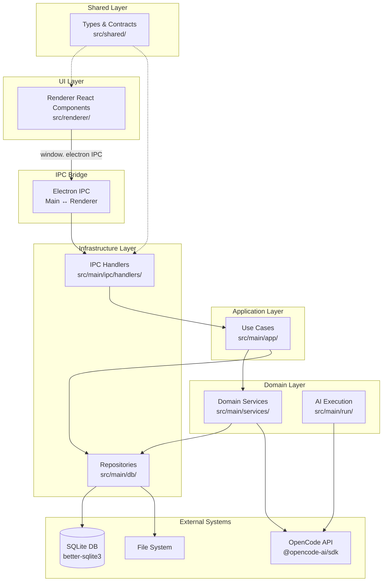
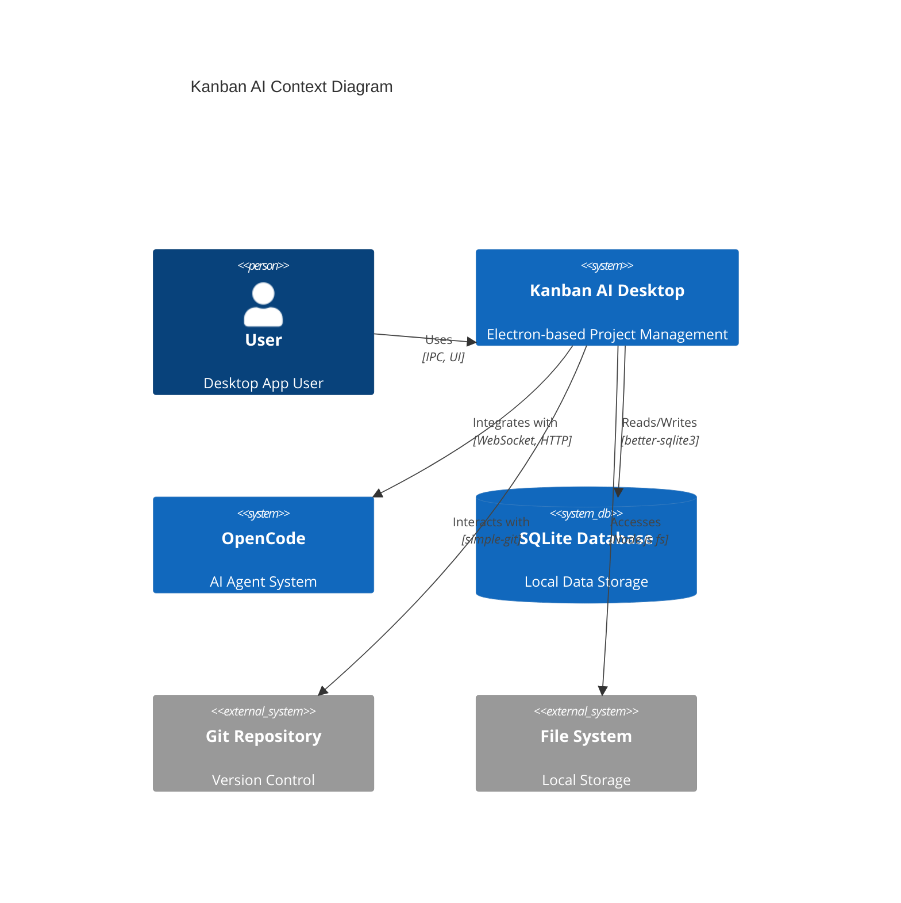
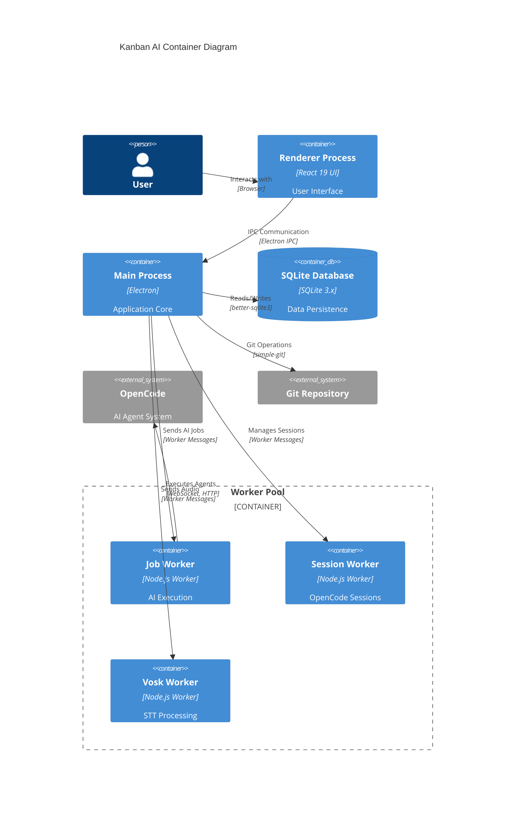
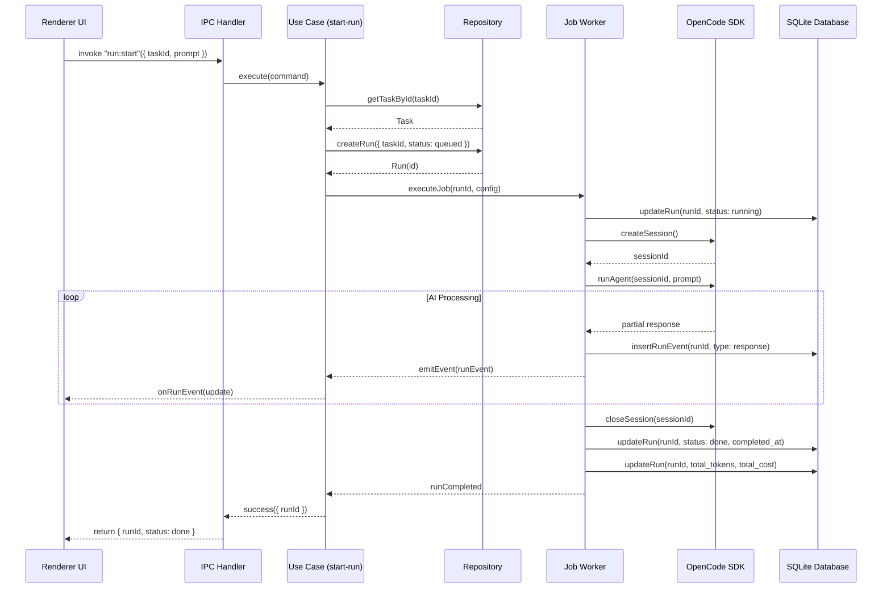
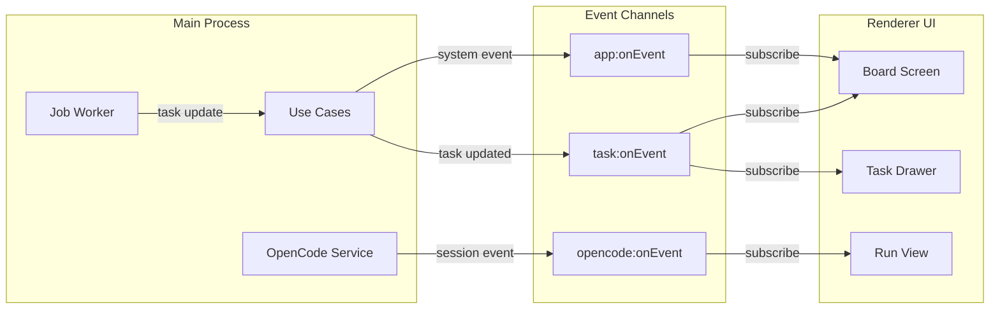
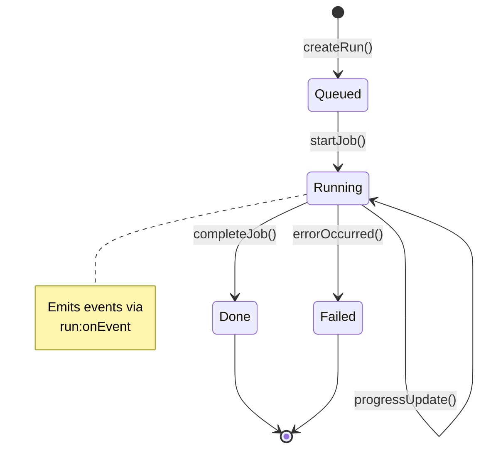

# ARCHITECTURE SNAPSHOT

## 0) Метаданные слепка

<!-- SECTION: 0 START -->

**Название проекта**: Kanban AI - Десктопное приложение Electron для управления проектами с интеграцией AI-агента (
Headless OpenCode)

**Назначение**: Позволяет пользователям управлять проектами через Kanban-доску, запускать AI-агентов для выполнения
задач, сохранять результаты выполнения (artifacts), управлять зависимостями между задачами и использовать голосовой ввод
через STT (Vosk). Приложение работает оффлайн с локальной базой данных.

**Языки и фреймворки**:

- Primary: TypeScript (strict mode, ES2022)
- UI Framework: React 19.2.4
- Desktop: Electron 40.0.0
- Build: Vite 7.3.1, electron-vite 5.0.0
- Database: SQLite (via better-sqlite3 12.6.2)
- Styling: TailwindCSS 4.1.18
- AI Integration: @opencode-ai/sdk 1.1.42
- Drag & Drop: @dnd-kit/\* ecosystem
- Speech Recognition: vosk-browser 0.0.8 (WASM-based, offline)
- Git: simple-git 3.28.0

**Главные зависимости**:

- UI: react@19.2.4, react-dom@19.2.4, lucide-react@0.563.0
- Database: better-sqlite3@12.6.2 (native module, requires rebuild)
- IPC Validation: zod@4.3.6
- Icons: lucide-react@0.563.0

**Сборка и запуск**:

- **Dev**: `pnpm dev` (автоматически пересобирает native модули для Electron)
- **Build**: `electron-vite build` + `electron-builder`
- **Test**: `npm test` (автоматически пересобирает native модули для системного Node.js v22)
- **Lint**: `eslint 9.39.2` + `typescript-eslint 8.54.0`
- **Format**: `prettier 3.8.1`
- **Package Manager**: pnpm

**Конфиги и секреты**:

- `package.json` - все скрипты и зависимости
- `tsconfig.json` - TypeScript конфигурация (strict mode, path aliases @/_ -> src/_)
- `electron.vite.config.ts` - конфигурация Electron + Vite
- `electron-builder.config.ts` - настройки сборки приложения
- `vite.config.ts` - конфигурация Vite для renderer процесса
- `vitest.config.ts` - конфигурация тестов
- `.env` - секреты и окружение (НЕ коммитится):
    - `VITE_API_URL=http://localhost:3000` - URL API (резерв)
    - `OPENCODE_PORT=4096` - порт локального OpenCode-сервера
    - `OPENCODE_URL=http://localhost:4096` - URL OpenCode (должен совпадать с OPENCODE_PORT)

**Критично для работы**:

- `OPENCODE_URL` и `OPENCODE_PORT` должны быть синхронизированы
- Native модуль `better-sqlite3` требует rebuild при смене Node.js версии (Electron vs system Node.js v22)

<!-- SECTION: 0 END -->

## 1) Карта репозитория

 <!-- SECTION: 1 START -->

### Дерево папок (глубина 5)

```
.
├── src/
│   ├── main/                    # Main process (Electron)
│   │   ├── app/                # Application layer (use cases)
│   │   │   ├── project/         # Project use cases (CRUD)
│   │   │   ├── task/           # Task use cases (CRUD, move, search)
│   │   │   ├── board/          # Board use cases
│   │   │   ├── tags/           # Tag use cases
│   │   │   ├── run/            # Run/AI execution use cases
│   │   │   ├── plugin/         # Plugin management use cases
│   │   │   └── oh-my-opencode/ # OhMyOpenCode integration use cases
│   │   ├── db/                 # Database layer
│   │   │   ├── repositories/   # Data access objects
│   │   │   ├── migrations/     # DB migrations (v001-v018)
│   │   │   ├── schema-init.sql # Initial schema
│   │   │   └── migrations.ts  # Migrations registry
│   │   ├── services/           # Domain services
│   │   ├── run/                # AI execution layer
│   │   ├── ipc/                # IPC handlers
│   │   ├── ports/              # Repository abstractions
│   │   ├── plugins/            # Plugin system
│   │   ├── vosk/               # STT integration
│   │   ├── secrets/             # Secret storage
│   │   ├── log/                # Logger
│   │   ├── deps/               # Dependency service
│   │   ├── analytics/           # Analytics service
│   │   ├── maintenance/        # Data retention
│   │   ├── di/                 # Dependency Injection
│   │   ├── infra/              # Infrastructure adapters
│   │   └── main.ts             # Main entry point (EP-01)
│   ├── renderer/               # Renderer process (React UI)
│   │   ├── screens/            # Screen components
│   │   ├── components/         # Reusable components
│   │   ├── features/           # Feature modules
│   │   ├── voice/              # Voice capture logic
│   │   ├── lib/                # Utilities
│   │   ├── types/              # TypeScript types
│   │   └── main.tsx           # Renderer entry point (EP-02)
│   ├── shared/                 # Shared code between processes
│   │   ├── types/              # Shared types
│   │   ├── ipc/                # IPC contracts
│   │   ├── lightmd/            # Markdown parser
│   │   └── errors/             # Error types
│   └── preload/                # Preload scripts (IPC bridge)
├── scripts/                    # Build/development scripts
├── docs/                       # Documentation
├── public/                     # Static assets
├── build/                      # Build resources (icons)
├── dist/                       # Distribution output
├── dist-electron/              # Electron main bundle
├── out/                        # Electron app build output
└── package.json                # Project config
```

### Важные узлы

| Тип                   | Путь                                 | Описание                                       |
|-----------------------|--------------------------------------|------------------------------------------------|
| Entrypoint (Main)     | `src/main/main.ts` (EP-01)           | Главный entry point Electron main процесса     |
| Entrypoint (Renderer) | `src/renderer/main.tsx` (EP-02)      | React renderer entry point                     |
| Entrypoint (Preload)  | `src/preload/preload.mjs`            | Preload script для IPC bridge                  |
| Config                | `package.json`                       | Зависимости, скрипты, metadata                 |
| Config                | `tsconfig.json` (IF-01)              | TypeScript конфигурация (strict, path aliases) |
| Config                | `electron.vite.config.ts` (IF-02)    | Vite конфигурация для Electron                 |
| Config                | `electron-builder.config.ts` (IF-03) | Electron builder конфигурация                  |
| Config                | `vite.config.ts` (IF-04)             | Vite конфигурация для renderer                 |
| Config                | `vitest.config.ts` (IF-05)           | Тестовая конфигурация                          |
| Config                | `tailwind.config.js` (IF-06)         | TailwindCSS конфигурация                       |
| Config                | `eslint.config.js` (IF-07)           | ESLint конфигурация                            |
| Config                | `.env` (IF-08)                       | Переменные окружения (не коммитится)           |
| Config                | `.env.example`                       | Шаблон переменных окружения                    |
| Migration             | `src/main/db/migrations/`            | Миграции базы данных (v001-v018)               |
| Schema                | `src/main/db/schema-init.sql`        | Начальная схема базы данных                    |

### Главные модули/пакеты

| ID   | Модуль                                    | Ответственность                                                                       | Пути                    |
|------|-------------------------------------------|---------------------------------------------------------------------------------------|-------------------------|
| M-01 | Application Layer (src/main/app/)         | Use cases для бизнес-логики (project, task, board, tags, run, plugin, oh-my-opencode) | src/main/app/\*_/_      |
| M-02 | Database Layer (src/main/db/)             | Репозитории для доступа к данным, миграции, транзакции                                | src/main/db/\*_/_       |
| M-03 | Domain Services (src/main/services/)      | Сервисы домена (OpenCode, search, backup)                                             | src/main/services/\*_/_ |
| M-04 | AI Execution Layer (src/main/run/)        | Запуск AI агентов, state machine, очереди заданий                                     | src/main/run/\*_/_      |
| M-05 | IPC Layer (src/main/ipc/)                 | Обработчики IPC команд, валидация запросов/ответов                                    | src/main/ipc/\*_/_      |
| M-06 | Repository Ports (src/main/ports/)        | Абстракции репозиториев для DI                                                        | src/main/ports/\*_/_    |
| M-07 | Plugin System (src/main/plugins/)         | Загрузка и выполнение плагинов                                                        | src/main/plugins/\*_/_  |
| M-08 | Voice Input (src/main/vosk/)              | Интеграция Vosk для STT                                                               | src/main/vosk/\*_/_     |
| M-09 | Dependency Injection (src/main/di/)       | DI контейнер и модули                                                                 | src/main/di/\*_/_       |
| M-10 | Infrastructure Adapters (src/main/infra/) | Адаптеры для репозиториев                                                             | src/main/infra/\*_/_    |
| M-11 | Renderer UI (src/renderer/)               | React UI компоненты и экраны                                                          | src/renderer/\*_/_      |
| M-12 | Shared Layer (src/shared/)                | Общий код между main и renderer процессами                                            | src/shared/\*_/_        |

<!-- SECTION: 1 END -->

## 2) Контекст и границы системы

 <!-- SECTION: 2 START -->

### Внешние системы/интеграции

| Система         | Тип          | Назначение                                     | Путь                                 |
|-----------------|--------------|------------------------------------------------|--------------------------------------|
| OpenCode Server | External API | Headless AI agent service (Sisyphus/OpenCode)  | HTTP/WebSocket (`OPENCODE_URL:4096`) |
| OpenCode SDK    | Library      | SDK клиент для OpenCode Server                 | `@opencode-ai/sdk@1.1.42`            |
| Vosk STT        | Library      | Offline speech recognition (WASM)              | `vosk-browser@0.0.8`                 |
| SQLite DB       | Database     | Локальное хранилище данных                     | `better-sqlite3@12.6.2`              |
| File System     | Native API   | Доступ к файловой системе (Git repos, плагины) | Electron's `fs` module               |
| Git             | Library      | Работа с Git репозиториями                     | `simple-git@3.28.0`                  |
| Electron APIs   | Native API   | Native dialogs, app lifecycle                  | Electron API                         |

### Рантаймы/процессы

| Рантайм                    | Назначение                                | Путь                                      |
|----------------------------|-------------------------------------------|-------------------------------------------|
| **Main Process**           | Electron main процесс (backend logic)     | `src/main/`                               |
| **Renderer Process**       | React UI (frontend)                       | `src/renderer/`                           |
| **Worker: Job Runner**     | Выполнение AI заданий (OpenCode executor) | `src/main/run/job-runner.ts`              |
| **Worker: Session Worker** | Обработка OpenCode сессий                 | `src/main/run/opencode-session-worker.ts` |
| **Worker: Vosk STT**       | Обработка голосового ввода                | `src/main/vosk/`                          |
| **Worker: Plugin Runtime** | Выполнение плагинов                       | `src/main/plugins/plugin-runtime.ts`      |

### Контракты между частями

#### IPC Channels (Main ↔ Renderer)

**Bidirectional Commands (Request-Response):**

- `APP:*` - Application info, path operations
- `PROJECT:*` - Project CRUD (create, update, delete, select folder/files)
- `BOARD:*` - Board operations (get default, update columns)
- `TASK:*` - Task CRUD, move, delete, events
- `TAG:*` - Tag CRUD
- `RUN:*` - AI run CRUD, start, cancel
- `SEARCH:*` - Search queries
- `ANALYTICS:*` - Analytics data
- `PLUGINS:*` - Plugin management
- `BACKUP:*` - Backup/restore projects
- `DIAGNOSTICS:*` - Logs, metrics, system info
- `OPENCODE:*` - OpenCode integration (send message, list models, toggle models)
- `OH_MY_OPENCODE:*` - OhMyOpenCode config management
- `APP_SETTING:*` - App settings (last project, sidebar, default model, retention)
- `SCHEDULE:*` - Task scheduling
- `DEPS:*` - Dependency management
- `ROLES:*` - Agent roles
- `ARTIFACT:*` - Run artifacts

**Unidirectional Events (Main → Renderer):**

- `task:onEvent` - Task events (created, updated, deleted)
- `opencode:onEvent` - OpenCode session events (status, message, error)
- `events:tail` - Event tailing

**Zod Schemas (Валидация):**

- All IPC handlers use Zod schemas for request/response validation
- Located in `src/main/ipc/types.ts`

#### File System Contracts

- `dialog:showOpenDialog` - Native file picker
- `fileSystem:exists` - Check file existence

#### OpenCode API Contracts

- HTTP/WebSocket API (`OPENCODE_URL:4096`)
- SDK methods: `sendMessage`, `getSessionStatus`, `listModels`, `toggleModel`, `updateModelDifficulty`

<!-- SECTION: 2 END -->

## 3) Основные сценарии (use-cases)

 <!-- SECTION: 3 START -->

### 1. Управление проектами

**UC-01 Создать проект**

- Вход: `project:create` { name, path?, description?, tags? }
- Шаги: Валидация → Создание проекта в БД → Создание дефолтной доски → Сохранение настроек
- Выход: `Project` { id, name, path, description, tags, createdAt, updatedAt }
- Побочные эффекты: Создание дефолтной доски и колонок
- Ошибки: INVALID_INPUT, PROJECT_EXISTS
- Модули: M-01 (Application: project/create-project.use-case.ts), M-02 (Database: project-repository.ts)
- Интерфейс: I-02 (IPC: project:create)

**UC-02 Получить список проектов**

- Вход: `project:getAll` ()
- Шаги: Чтение из репозитория
- Выход: `Project[]`
- Побочные эффекты: Нет
- Ошибки: Нет
- Модули: M-01 (Application: project/get-projects.use-case.ts), M-02 (Database: project-repository.ts)
- Интерфейс: I-03 (IPC: project:getAll)

**UC-03 Обновить проект**

- Вход: `project:update` { projectId, patch }
- Шаги: Валидация → Обновление в БД
- Выход: `Project`
- Побочные эффекты: Нет
- Ошибки: NOT_FOUND, INVALID_INPUT
- Модули: M-01 (Application: project/update-project.use-case.ts), M-02 (Database: project-repository.ts)
- Интерфейс: I-04 (IPC: project:update)

**UC-04 Удалить проект**

- Вход: `project:delete` { projectId }
- Шаги: Проверка → Удаление проекта и связанных данных (задачи, запуски, артефакты)
- Выход: `void`
- Побочные эффекты: Каскадное удаление задач, запусков, артефактов
- Ошибки: NOT_FOUND
- Модули: M-01 (Application: project/delete-project.use-case.ts), M-02 (Database: project-repository.ts)
- Интерфейс: I-05 (IPC: project:delete)

### 2. Управление задачами

**UC-05 Создать задачу**

- Вход: `task:create` { boardId, columnId, title, description?, tags?, priority?, metadata? }
- Шаги: Валидация → Создание задачи в БД → Отправка события task:onEvent
- Выход: `Task` { id, boardId, columnId, title, description, tags, priority, metadata, createdAt, updatedAt }
- Побочные эффекты: Событие task:onEvent(created)
- Ошибки: INVALID_INPUT, BOARD_NOT_FOUND
- Модули: M-01 (Application: task/commands/create-task.use-case.ts), M-02 (Database: task-repository.ts)
- Интерфейс: I-06 (IPC: task:create)

**UC-06 Получить список задач по доске**

- Вход: `task:listByBoard` { boardId }
- Шаги: Чтение задач из репозитория
- Выход: `Task[]`
- Побочные эффекты: Нет
- Ошибки: Нет
- Модули: M-01 (Application: task/queries/list-tasks-by-board.use-case.ts), M-02 (Database: task-repository.ts)
- Интерфейс: I-07 (IPC: task:listByBoard)

**UC-07 Обновить задачу**

- Вход: `task:update` { taskId, patch }
- Шаги: Валидация → Обновление в БД → Отправка события task:onEvent
- Выход: `Task`
- Побочные эффекты: Событие task:onEvent(updated)
- Ошибки: NOT_FOUND, INVALID_INPUT
- Модули: M-01 (Application: task/commands/update-task.use-case.ts), M-02 (Database: task-repository.ts)
- Интерфейс: I-08 (IPC: task:update)

**UC-08 Переместить задачу**

- Вход: `task:move` { taskId, toColumnId, toIndex }
- Шаги: Валидация → Обновление position в БД → Пересчёт индексов в колонке → Событие task:onEvent
- Выход: `Task[]` (обновлённые задачи)
- Побочные эффекты: Обновление позиций всех задач в колонке, событие task:onEvent(moved)
- Ошибки: NOT_FOUND, INVALID_INPUT
- Модули: M-01 (Application: task/commands/move-task.use-case.ts), M-02 (Database: task-repository.ts)
- Интерфейс: I-09 (IPC: task:move)

**UC-09 Удалить задачу**

- Вход: `task:delete` { taskId }
- Шаги: Проверка → Удаление задачи и связанных запусков/артефактов → Событие task:onEvent
- Выход: `void`
- Побочные эффекты: Каскадное удаление запусков и артефактов, событие task:onEvent(deleted)
- Ошибки: NOT_FOUND
- Модули: M-01 (Application: task/commands/delete-task.use-case.ts), M-02 (Database: task-repository.ts)
- Интерфейс: I-10 (IPC: task:delete)

**UC-10 Поиск задач**

- Вход: `search:tasks` { projectId, query, filters? }
- Шаги: Парсинг запроса → Full-text search → Фильтрация → Сортировка
- Выход: `Task[]`
- Побочные эффекты: Нет
- Ошибки: Нет
- Модули: M-03 (Services: tasks-search.ts), M-02 (Database: task-repository.ts)
- Интерфейс: I-11 (IPC: search:tasks)

### 3. AI Выполнение (Runs)

**UC-11 Запустить AI агента**

- Вход: `run:start` { taskId, modelId, prompt?, context?, skills? }
- Шаги: Валидация → Создание run → Добавление в очередь → Выполнение в worker → Сохранение результатов
- Выход: `Run` { id, taskId, modelId, status, createdAt, completedAt, result?, error? }
- Побочные эффекты: Создание run, отправка событий opencode:onEvent
- Ошибки: TASK_NOT_FOUND, MODEL_NOT_FOUND, OPENCODE_ERROR
- Модули: M-04 (Run: run-service.ts, run-state-machine.ts), M-03 (Services: opencode-service.ts), M-02 (Database:
  run-repository.ts)
- Интерфейс: I-12 (IPC: run:start)

**UC-12 Отменить запуск**

- Вход: `run:cancel` { runId }
- Шаги: Проверка статуса → Отмена через OpenCode SDK → Обновление статуса
- Выход: `Run`
- Побочные эффекты: Остановка worker, событие opencode:onEvent(cancelled)
- Ошибки: NOT_FOUND, RUN_ALREADY_COMPLETED
- Модули: M-04 (Run: run-service.ts), M-03 (Services: opencode-service.ts), M-02 (Database: run-repository.ts)
- Интерфейс: I-13 (IPC: run:cancel)

**UC-13 Получить список запусков по задаче**

- Вход: `run:listByTask` { taskId }
- Шаги: Чтение из репозитория
- Выход: `Run[]`
- Побочные эффекты: Нет
- Ошибки: TASK_NOT_FOUND
- Модули: M-01 (Application: run/queries/list-runs-by-task.use-case.ts), M-02 (Database: run-repository.ts)
- Интерфейс: I-14 (IPC: run:listByTask)

**UC-14 Получить детали запуска**

- Вход: `run:get` { runId }
- Шаги: Чтение из репозитория
- Выход: `Run` с результатами
- Побочные эффекты: Нет
- Ошибки: NOT_FOUND
- Модули: M-01 (Application: run/queries/get-run.use-case.ts), M-02 (Database: run-repository.ts)
- Интерфейс: I-15 (IPC: run:get)

**UC-15 Подписаться на события запуска**

- Вход: `run:events:tail` { runId, afterTs?, limit? }
- Шаги: Чтение событий из репозитория после afterTs
- Выход: `RunEvent[]`
- Побочные эффекты: Нет
- Ошибки: NOT_FOUND
- Модули: M-04 (Run: run-service.ts), M-02 (Database: run-event-repository.ts)
- Интерфейс: I-16 (IPC: run:events:tail)

**UC-16 Получить артефакты запуска**

- Вход: `artifact:list` { runId }
- Шаги: Чтение из репозитория
- Выход: `Artifact[]`
- Побочные эффекты: Нет
- Ошибки: RUN_NOT_FOUND
- Модули: M-02 (Database: artifact-repository.ts)
- Интерфейс: I-17 (IPC: artifact:list)

**UC-17 Получить артефакт**

- Вход: `artifact:get` { artifactId }
- Шаги: Чтение из репозитория
- Выход: `Artifact` с содержимым
- Побочные эффекты: Нет
- Ошибки: NOT_FOUND
- Модули: M-02 (Database: artifact-repository.ts)
- Интерфейс: I-18 (IPC: artifact:get)

**UC-18 Удалить запуск**

- Вход: `run:delete` { runId }
- Шаги: Проверка → Удаление run и связанных артефактов/событий
- Выход: `void`
- Побочные эффекты: Каскадное удаление
- Ошибки: NOT_FOUND
- Модули: M-01 (Application: run/commands/delete-run.use-case.ts), M-02 (Database: run-repository.ts)
- Интерфейс: I-19 (IPC: run:delete)

### 4. Управление досками

**UC-19 Получить дефолтную доску проекта**

- Вход: `board:getDefault` { projectId }
- Шаги: Чтение доски и колонок из репозитория
- Выход: `{ board: Board, columns: Column[] }`
- Побочные эффекты: Нет
- Ошибки: PROJECT_NOT_FOUND
- Модули: M-02 (Database: board-repository.ts)
- Интерфейс: I-20 (IPC: board:getDefault)

**UC-20 Обновить колонки доски**

- Вход: `board:updateColumns` { boardId, columns }
- Шаги: Валидация → Обновление в БД
- Выход: `Column[]`
- Побочные эффекты: Нет
- Ошибки: NOT_FOUND, INVALID_INPUT
- Модули: M-02 (Database: board-repository.ts)
- Интерфейс: I-21 (IPC: board:updateColumns)

### 5. Управление тегами

**UC-21 Создать тег**

- Вход: `tag:create` { projectId, name, color? }
- Шаги: Валидация → Создание в БД
- Выход: `Tag`
- Побочные эффекты: Нет
- Ошибки: INVALID_INPUT, TAG_EXISTS
- Модули: M-01 (Application: tag/create-tag.use-case.ts), M-02 (Database: tag-repository.ts)
- Интерфейс: I-22 (IPC: tag:create)

**UC-22 Получить теги проекта**

- Вход: `tag:list` { projectId }
- Шаги: Чтение из репозитория
- Выход: `Tag[]`
- Побочные эффекты: Нет
- Ошибки: Нет
- Модули: M-02 (Database: tag-repository.ts)
- Интерфейс: I-23 (IPC: tag:list)

**UC-23 Обновить тег**

- Вход: `tag:update` { tagId, patch }
- Шаги: Валидация → Обновление в БД
- Выход: `Tag`
- Побочные эффекты: Нет
- Ошибки: NOT_FOUND, INVALID_INPUT
- Модули: M-01 (Application: tag/update-tag.use-case.ts), M-02 (Database: tag-repository.ts)
- Интерфейс: I-24 (IPC: tag:update)

**UC-24 Удалить тег**

- Вход: `tag:delete` { tagId }
- Шаги: Проверка → Удаление из БД (отсоединение от задач)
- Выход: `void`
- Побочные эффекты: Отсоединение от задач
- Ошибки: NOT_FOUND
- Модули: M-01 (Application: tag/delete-tag.use-case.ts), M-02 (Database: tag-repository.ts)
- Интерфейс: I-25 (IPC: tag:delete)

### 6. Управление плагинами

**UC-25 Получить список плагинов**

- Вход: `plugins:list` ()
- Шаги: Чтение из файловой системы
- Выход: `Plugin[]`
- Побочные эффекты: Нет
- Ошибки: Нет
- Модули: M-07 (Plugins: plugin-service.ts)
- Интерфейс: I-26 (IPC: plugins:list)

**UC-26 Установить плагин**

- Вход: `plugins:install` { path }
- Шаги: Валидация → Копирование в plugins директорию → Регистрация
- Выход: `Plugin`
- Побочные эффекты: Добавление в список плагинов
- Ошибки: INVALID_INPUT, PLUGIN_EXISTS
- Модули: M-07 (Plugins: plugin-service.ts)
- Интерфейс: I-27 (IPC: plugins:install)

**UC-27 Включить/выключить плагин**

- Вход: `plugins:enable` { pluginId, enabled }
- Шаги: Обновление конфигурации
- Выход: `Plugin`
- Побочные эффекты: Обновление списка активных плагинов
- Ошибки: NOT_FOUND
- Модули: M-07 (Plugins: plugin-service.ts)
- Интерфейс: I-28 (IPC: plugins:enable)

**UC-28 Получить список ролей агентов**

- Вход: `roles:list` ()
- Шаги: Чтение из БД
- Выход: `Role[]`
- Побочные эффекты: Нет
- Ошибки: Нет
- Модули: M-02 (Database: agent-role-repository.ts)
- Интерфейс: I-29 (IPC: roles:list)

### 7. Аналитика и метрики

**UC-29 Получить обзор проекта**

- Вход: `analytics:getOverview` { projectId, range }
- Шаги: Агрегация данных (задачи, запуски, время выполнения)
- Выход: `{ tasksCount, runsCount, completedRuns, avgDuration, etc. }`
- Побочные эффекты: Нет
- Ошибки: PROJECT_NOT_FOUND
- Модули: M-03 (Services: analytics-service.ts), M-02 (Database: run-repository.ts, task-repository.ts)
- Интерфейс: I-30 (IPC: analytics:getOverview)

**UC-30 Получить статистику запусков**

- Вход: `analytics:getRunStats` { projectId, range }
- Шаги: Агрегация данных по запускам (по моделям, статусам)
- Выход: `{ byModel, byStatus, byDay, etc. }`
- Побочные эффекты: Нет
- Ошибки: PROJECT_NOT_FOUND
- Модули: M-03 (Services: analytics-service.ts), M-02 (Database: run-repository.ts)
- Интерфейс: I-31 (IPC: analytics:getRunStats)

### 8. Поиск

**UC-31 Поиск задач**

- Вход: `search:tasks` { projectId, query, filters? }
- Шаги: Full-text search → Фильтрация → Сортировка
- Выход: `Task[]`
- Побочные эффекты: Нет
- Ошибки: Нет
- Модули: M-03 (Services: tasks-search.ts), M-02 (Database: task-repository.ts)
- Интерфейс: I-11 (IPC: search:tasks)

**UC-32 Поиск запусков**

- Вход: `search:runs` { projectId, query, filters? }
- Шаги: Full-text search → Фильтрация → Сортировка
- Выход: `Run[]`
- Побочные эффекты: Нет
- Ошибки: Нет
- Модули: M-03 (Services: runs-search.ts), M-02 (Database: run-repository.ts)
- Интерфейс: I-32 (IPC: search:runs)

**UC-33 Поиск артефактов**

- Вход: `search:artifacts` { projectId, query, filters? }
- Шаги: Full-text search → Фильтрация → Сортировка
- Выход: `Artifact[]`
- Побочные эффекты: Нет
- Ошибки: Нет
- Модули: M-03 (Services: artifacts-search.ts), M-02 (Database: artifact-repository.ts)
- Интерфейс: I-33 (IPC: search:artifacts)

<!-- SECTION: 3 END -->

## 4) Архитектурные слои и зависимости

 <!-- SECTION: 4 START -->

**Фактические слои и "где что живёт":**

1. **UI Layer** (`src/renderer/`)
    - React компоненты, экраны
    - UI бизнес-логика (state management, form handling)
    - Путь: `src/renderer/screens/`, `src/renderer/components/`

2. **Application Layer** (`src/main/app/`)
    - Use cases (commands/queries) - orchestrators
    - Координация бизнес-операций
    - Путь: `src/main/app/*/*.use-case.ts`

3. **Domain Layer** (`src/main/services/`, `src/main/run/`)
    - Domain services (business logic)
    - AI execution engine (state machines, job runner, queue manager)
    - Путь: `src/main/services/*.ts`, `src/main/run/*.ts`

4. **Infrastructure Layer** (`src/main/db/`, `src/main/ipc/`, `src/main/ports/`)
    - Repositories (data access)
    - IPC handlers (Main Process API)
    - Adapters (OpenCode integration, file system, git)
    - Путь: `src/main/db/repositories/`, `src/main/ipc/handlers/`, `src/main/services/opencode-service.ts`

5. **Shared Layer** (`src/shared/`)
    - Общие типы между Main и Renderer processes
    - IPC контракты
    - Утилиты
    - Путь: `src/shared/types/`, `src/shared/ipc/`, `src/shared/lightmd/`

**Где находится:**

- **Бизнес-логика**: Application Layer (`src/main/app/*.use-case.ts`), Domain Layer (`src/main/services/*.ts`,
  `src/main/run/*.ts`)
- **IO/интеграции**: Infrastructure Layer (`src/main/db/repositories/`, `src/main/ipc/handlers/`,
  `src/main/services/opencode-service.ts`)
- **DTO/контракты**: Shared Layer (`src/shared/ipc/channels.ts`), Infrastructure Layer (`src/main/ipc/types.ts` - Zod
  schemas)
- **Валидация**: Infrastructure Layer (`src/main/ipc/types.ts` - Zod), UI Layer (`src/renderer/lib/utils.ts` - form
  validation)
- **DI/composition root**: Infrastructure Layer (`src/main/di/` - Dependency Injection container)

**Dependency Map (кто от кого зависит):**

- **Renderer (UI)** → **IPC (Main Process)** через Electron IPC
    - Renderer вызывает IPC handlers через `window.electron` API

- **IPC Handlers** → **Application Layer (Use Cases)**
    - IPC handlers вызывают use cases из `src/main/app/*/use-cases/*.use-case.ts`

- **Application Layer** → **Domain Layer** и **Infrastructure Layer**
    - Use cases координируют domain services и repositories
    - Пример: `create-task.use-case.ts` вызывает `task-repo.create()` и `task-events.publish()`

- **Domain Layer** → **Infrastructure Layer**
    - Domain services используют repositories для доступа к данным
    - Domain services вызывают внешние интеграции (OpenCode)
    - Пример: `run-service.ts` вызывает `run-repo`, `opencode-executor`, `artifact-repo`

- **Infrastructure Layer** → **SQLite Database**, **OpenCode API**, **File System**
    - Repositories используют better-sqlite3 для SQL операций
    - OpencodeService использует @opencode-ai/sdk для HTTP/WebSocket запросов
    - BackupService использует file system для backup/restore файлов



 <!-- SECTION: 4 END -->

## 5) Data flow и runtime flow (Mermaid)

<!-- SECTION: 5 START -->

## C4 Context Diagram

Внешние системы и границы приложения:



_Источник: анализ `src/main/services/opencode-service.ts`, `src/main/ipc/handlers/`_

## C4 Container Diagram

Основные процессы и сервисы приложения:



_Источник: анализ `src/main/`, `src/renderer/`, `src/main/run/`_

## Sequence Diagram: Start AI Run

End-to-end flow для запуска AI выполнения (UC-21):



_Источник: анализ `src/main/app/run/commands/start-run.use-case.ts`, `src/main/run/job-runner.ts`_

## Event/Message Flow

Потоки событий в системе:



_Источник: анализ `src/shared/ipc/channels.ts`, `src/main/ipc/handlers/task-events.handlers.ts`_

## State Machine: Run Status

Состояния выполнения AI задачи:



_Источник: анализ `src/main/run/run-state-machine.ts`_

<!-- SECTION: 5 END -->

## 6) Модель данных и база данных

<!-- SECTION: 6 START -->

**Тип хранилища:** SQLite 3.x (embedded, file-based)
**Driver/ORM:** better-sqlite3 (синхронный драйвер, валидация типов, prepared statements)

**Таблицы/коллекции (28 total):**

_Core tables (24):_

- **T-01 projects** (`id` PK, `name`, `path`, `color`, `created_at`, `updated_at`) - проекты
- **T-02 boards** (`id` PK, `project_id` FK→projects, `name`, `created_at`, `updated_at`) - канбан-доски
- **T-03 board_columns** (`id` PK, `board_id` FK→boards, `name`, `system_key`, `order_index`, `wip_limit`, `color`) -
  колонки досок
- **T-04 tasks** (`id` PK, `project_id` FK→projects, `title`, `description`, `status` (queued|running|done|archived),
  `priority`, `difficulty`, `assigned_agent`, `board_id` FK→boards, `column_id` FK→board_columns, `order_in_column`,
  `type`, `tags_json`, `description_md`, `start_date`, `due_date`, `estimate_points`, `estimate_hours`, `assignee`,
  `model_name`, `created_at`, `updated_at`) - задачи
- **T-05 tags** (`id` PK, `name`, `color`, `created_at`, `updated_at`, UNIQUE(`name`)) - теги
- **T-06 agent_roles** (`id` PK, `name`, `description`, `icon`, `is_default`) - роли AI-агентов
- **T-07 context_snapshots** (`id` PK, `name`, `task_id` FK→tasks, `content`, `created_at`) - снимки контекста для AI
- **T-08 runs** (`id` PK, `task_id` FK→tasks, `status`, `session_id`, `total_tokens`, `total_cost_usd`, `model_name`,
  `started_at`, `completed_at`, `error_message`, `error_details`, `metadata_json`) - выполнения AI
- **T-09 run_events** (`id` PK, `run_id` FK→runs, `timestamp`, `type`, `content`) - события выполнений (stream)
- **T-10 artifacts** (`id` PK, `task_id` FK→tasks, `run_id` FK→runs, `kind`, `mime_type`, `size_bytes`, `path`,
  `metadata_json`) - артефакты (файлы, код, др.)
- **T-11 releases** (`id` PK, `project_id` FK→projects, `name`, `description`, `created_at`) - релизы
- **T-12 release_items** (`id` PK, `release_id` FK→releases, `task_id` FK→tasks, `created_at`) - элементы релизов
- **T-13 task_links** (`id` PK, `task_id` FK→tasks, `linked_task_id` FK→tasks, `created_at`) - связи задач (related,
  blocked_by)
- **T-14 task_schedule** (`id` PK, `task_id` FK→tasks, `scheduled_for`, `priority`, `created_at`) - расписание задач
- **T-15 task_events** (`id` PK, `task_id` FK→tasks, `timestamp`, `event_type`, `details`) - события задач (audit trail)
- **T-16 task_queue** (`id` PK, `task_id` FK→tasks, `status`, `enqueued_at`) - очередь задач (для планировщика)
- **T-17 role_slots** (`id` PK, `role_id` FK→agent_roles, `task_id` FK→tasks, `created_at`) - слоты ролей (для
  планировщика)
- **T-18 resource_locks** (`id` PK, `resource_type`, `resource_id`, `locked_by`, `locked_until`, `created_at`) -
  блокировки ресурсов (для планировщика)
- **T-19 plugins** (`id` PK, `name`, `version`, `is_enabled`, `config_json`, `created_at`, `updated_at`) - плагины
- **T-20 opencode_models** (`id` PK, `name`, `model_id`, `provider`, `created_at`, `updated_at`) - модели OpenCode
- **T-21 app_settings** (`key` PK, `value`, `updated_at`, UNIQUE(`key`)) - настройки приложения
- **T-22 app_metrics** (`id` PK, `metric_name`, `value`, `recorded_at`) - метрики приложения (v018)
- **T-23 system_key** (`key` PK) - системный ключ (v017)
- **T-24 schema_migrations** (`id` PK, `version`, `applied_at`) - версионирование миграций

_FTS tables (4):_

- **T-25 tasks_fts** (`id`, `title`, `content`) - полнотекстовый поиск по задачам
- **T-26 runs_fts** (`id`, `error_message`, `error_details`, `metadata_json`) - полнотекстовый поиск по выполненим
- **T-27 run_events_fts** (`id`, `content`) - полнотекстовый поиск по событиям выполнений
- **T-28 artifacts_fts** (`id`, `metadata_json`) - полнотекстовый поиск по артефактам

**Индексы:**

- Foreign key indexes на всех FK колонках: `idx_tasks_project_id`, `idx_boards_project_id`,`idx_board_columns_board_id`,
  `idx_runs_task_id`, `idx_artifacts_task_id`, `idx_artifacts_run_id`,`idx_context_snapshots_task_id`,
  `idx_task_links_task_id`, `idx_task_links_linked_task_id`,`idx_task_schedule_task_id`, `idx_task_events_task_id`,
  `idx_task_queue_task_id`, `idx_role_slots_role_id`,`idx_role_slots_task_id`
- Индексы на часто используемых полях: `idx_tasks_status`, `idx_tasks_board_id`, `idx_tasks_column_id`,
  `idx_tasks_board_col` (composite), `idx_runs_status`, `idx_runs_session_id`, `idx_artifacts_kind`,
  `idx_run_events_run_id`, `idx_task_events_task_id`
- UNIQUE constraints: `UNIQUE(tags.name)`, `UNIQUE(app_settings.key)`, `UNIQUE(system_key.key)`

**Триггеры:**

- `tasks_ai` - INSERT/UPDATE/DELETE на tasks → INSERT/DELETE на tasks_fts (синхронизация FTS)
- `runs_ai` - INSERT/UPDATE/DELETE на runs → INSERT/DELETE на runs_fts (синхронизация FTS)
- `run_events_ai` - INSERT/UPDATE/DELETE на run_events → INSERT/DELETE на run_events_fts (синхронизация FTS)
- `artifacts_ai` - INSERT/UPDATE/DELETE на artifacts → INSERT/DELETE на artifacts_fts (синхронизация FTS)

**Транзакции/конкурентность:**

- SQLite: ACID compliant, WAL mode для одновременного чтения/записи (не реализовано в config)
- Resource locks таблица для явных блокировок (для планировщика)
- Нет блокировок уровня строк/страниц (SQLite - file-level locks)

**Миграции:**

- Файл: `src/main/db/migrations.ts`
- Реализация: программная (TypeScript), автоматический application при запуске
- Версионирование: таблица `schema_migrations`, текущая версия: v018
- Как запускать: автоматический при старте приложения (через DB инициализацию)

**Риски роста данных и bottlenecks:**

- **SQLite file size limit:** ~281TB теоретический, ~1TB практический (обычно не проблема для desktop app)
- **FTS tables growth:** таблицы tasks_fts, runs_fts, run_events_fts, artifacts_fts могут расти быстро с текстовым
  контентом (крупные артефакты, длинные логи)
- **run_events table:** может расти быстро (event stream), требуется периодическая очистка (archived runs)
- **artifacts table:** крупные файлы хранятся по пути, но метаданные в БД - рост метаданных может быть проблемой
- **task_queue, role_slots, resource_locks:** для планировщика - не полностью реализованы (hotspot для future work)
- **Indexes maintenance:** REINDEX может быть нужен при больших объемах данных
- **FTS update triggers:** могут замедлять INSERT/UPDATE операций при больших объемах данных
- **No foreign key CASCADE on app_settings/system_key:** возможные orphan records при ручных операциях

<!-- SECTION: 6 END -->

## 7) Интерфейсы и контракты (API/IPC/Events/CLI)

<!-- SECTION: 7 START -->

Система использует **IPC (Inter-Process Communication)** для связи между Main Process (Electron) и Renderer Process (
React UI).

### IPC Каналы (51 канал)

| Категория          | Каналы                                                                                                                                                                                                                | Количество |
|--------------------|-----------------------------------------------------------------------------------------------------------------------------------------------------------------------------------------------------------------------|------------|
| **APP**            | getInfo, openPath                                                                                                                                                                                                     | 2          |
| **PROJECT**        | selectFolder, selectFiles, create, getAll, getById, update, delete                                                                                                                                                    | 7          |
| **BOARD**          | getDefault, updateColumns                                                                                                                                                                                             | 2          |
| **TASK**           | create, listByBoard, update, move, delete, onEvent                                                                                                                                                                    | 6          |
| **TAG**            | create, update, delete, list                                                                                                                                                                                          | 4          |
| **DEPS**           | list, add, remove                                                                                                                                                                                                     | 3          |
| **SCHEDULE**       | get, update                                                                                                                                                                                                           | 2          |
| **SEARCH**         | query                                                                                                                                                                                                                 | 1          |
| **ANALYTICS**      | getOverview, getRunStats                                                                                                                                                                                              | 2          |
| **PLUGINS**        | list, install, enable, reload                                                                                                                                                                                         | 4          |
| **ROLES**          | list                                                                                                                                                                                                                  | 1          |
| **BACKUP**         | exportProject, importProject                                                                                                                                                                                          | 2          |
| **DIAGNOSTICS**    | getLogs, getLogTail, getSystemInfo, getDbInfo, getMetrics                                                                                                                                                             | 5          |
| **DATABASE**       | delete                                                                                                                                                                                                                | 1          |
| **RUN**            | start, cancel, delete, listByTask, get                                                                                                                                                                                | 5          |
| **EVENTS**         | tail                                                                                                                                                                                                                  | 1          |
| **ARTIFACT**       | list, get                                                                                                                                                                                                             | 2          |
| **APP_SETTING**    | getLastProjectId, setLastProjectId, getSidebarCollapsed, setSidebarCollapsed, getDefaultModel, setDefaultModel, getOhMyOpencodePath, setOhMyOpencodePath, getRetentionPolicy, setRetentionPolicy, runRetentionCleanup | 10         |
| **OPENCODE**       | onEvent, generateUserStory, getSessionStatus, getActiveSessions, getSessionMessages, getSessionTodos, listModels, listEnabledModels, refreshModels, toggleModel, updateModelDifficulty, sendMessage, logProviders     | 12         |
| **OH_MY_OPENCODE** | readConfig, saveConfig, listPresets, loadPreset, savePreset, backupConfig, restoreConfig                                                                                                                              | 7          |
| **DIALOG**         | showOpenDialog                                                                                                                                                                                                        | 1          |
| **FILE_SYSTEM**    | exists                                                                                                                                                                                                                | 1          |
| **VOSK**           | downloadModel                                                                                                                                                                                                         | 1          |
| **STT**            | start, stop, setLanguage, sendAudio                                                                                                                                                                                   | 4          |

**Итого: 85 IPC операций в 18 категориях**

### Контракты

**Типы IPC каналов:**

- **Request/Response** — большинство операций (create, update, delete, get)
- **Streaming/Events** — `task:onEvent`, `opencode:onEvent`, `events:tail`
- **Long-running** — `run:start`, `stt:start`, `vosk:downloadModel`

**Валидация:**

- Zod schemas для всех IPC сообщений (см. `src/shared/ipc/` и `src/main/ipc/`)
- Contract types в `src/shared/ipc/channels.ts` (типизированный IpcChannel)

**Обработчики (Handlers):**

- Все IPC каналы обрабатываются в `src/main/ipc/handlers/`
- Регистрация в `src/main/ipc/handlers/index.ts`
- Используется Electron `ipcMain.handle()` для request/response и `ipcMain.on()` для events

**Event каналы (от Main к Renderer):**

- `task:onEvent` — события задач (создание, обновление, удаление, перемещение)
- `opencode:onEvent` — события OpenCode сессий
- `app:onEvent` — события приложения

**Авторизация:**

- IPC доступен только из Renderer Process (изоляция Electron)
- Дополнительная авторизация на уровне логики (см. секцию 8)

**Ошибки:**

- Ошибки возвращаются через Promise rejection
- Коды ошибок (см. секцию 10 для error codes)

**Таймауты и ретраи:**

- IPC операции синхронные (await в renderer)
- OpenCode SDK имеет встроенные ретраи (см. `src/main/services/opencode-service.ts`)

<!-- SECTION: 7 END -->

## 8) Критические места, риски, качество

 <!-- SECTION: 8 START -->

**Top-10 критичных модулей:**

| #  | Путь                                    | Почему критичен                                                                        |
|----|-----------------------------------------|----------------------------------------------------------------------------------------|
| 1  | `src/main/run/`                         | AI execution engine - состояние машины, запуск агентов, управление сессиями OpenCode   |
| 2  | `src/main/db/`                          | Слой доступа к данным - все операции с SQLite, миграции, целостность данных            |
| 3  | `src/main/ipc/`                         | IPC layer - все коммуникации между процессами, валидация данных                        |
| 4  | `src/main/services/opencode-service.ts` | Интеграция с OpenCode - управление соединениями, отправка задач, получение результатов |
| 5  | `src/main/app/`                         | Application layer - use cases для всех доменных операций                               |
| 6  | `src/main/plugins/`                     | Plugin system - динамическая загрузка плагинов, безопасность                           |
| 7  | `src/renderer/`                         | React UI - все визуальные компоненты, состояние приложения                             |
| 8  | `src/main/run/queue-manager.ts`         | Task queue - очередность выполнения, приоритеты                                        |
| 9  | `src/main/secrets/secret-store.ts`      | Secret storage - хранение API ключей, секретов                                         |
| 10 | `src/main/backup/`                      | Backup service - создание и восстановление резервных копий                             |

**Hotspots (сложность, много ответственностей, высокая связность):**

1. **`src/main/run/run-state-machine.ts`**
    - Причина: Стейт-машина с множеством переходов, обработка событий от OpenCode, управление жизненным циклом AI runs
    - Действия: Разделить на более мелкие state handlers, использовать паттерн State для каждого состояния

2. **`src/main/db/repositories/` (все репозитории)**
    - Причина: Каждый репозиторий реализует CRUD операции, FTS запросы, фильтрации - дублирование кода
    - Действия: Создать базовый класс GenericRepository с общими методами, использовать generics для типизации

3. **`src/main/ipc/handlers/` (все handlers)**
    - Причина: Валидация Zod, маппинг в use case, обработка ошибок - дублирование
    - Действия: Создать GenericHandler с базовой логикой валидации и error handling

4. **`src/renderer/screens/` (все экраны)**
    - Причина: Каждый экран управляет своим состоянием, загрузкой данных, сортировкой - дублирование
    - Действия: Вынести общую логику в хуки (useList, useBoard, useTask, etc.)

5. **`src/main/services/` (search сервисы)**
    - Причина: TasksSearch, RunsSearch, ArtifactsSearch - похожая логика FTS запросов
    - Действия: Создать GenericSearchService с параметризованными таблицами FTS

**Performance риски:**

| Риск                   | Где                                                   | Описание                                                 | Митигация                                           |
|------------------------|-------------------------------------------------------|----------------------------------------------------------|-----------------------------------------------------|
| Медленные FTS запросы  | `src/main/services/tasks-search.ts`                   | Full-text search по большим объёмам текста без пагинации | Добавить LIMIT/OFFSET, кэширование результатов      |
| Блокирующие операции   | `src/main/run/job-runner.ts`                          | Синхронные вызовы OpenCode блокируют main процесс        | Использовать web workers, асинхронные вызовы        |
| Большой payload        | `src/main/ipc/handlers/run.handlers.ts` (events:tail) | Возврат большого количества run_events                   | Реализовать streaming, пагинацию                    |
| UI тормоза             | `src/renderer/screens/TimelineScreen.tsx`             | Рендеринг большого количества тасков с подгрузкой данных | Virtualization (react-window), lazy loading         |
| SQLite lock contention | `src/main/db/`                                        | Множественные конкурентные операции записи               | WAL mode, connection pooling, batch inserts         |
| FTS рост               | Все FTS таблицы                                       | Таблицы FTS могут расти бесконечно                       | Регулярная чистка устаревших записей, архивирование |

**Наблюдаемость:**

- **Логирование:**
    - Logger в `src/main/log/logger.ts` (winston-based)
    - Уровни: error, warn, info, debug
    - Куда: консоль, файл (TODO: добавить log aggregation)

- **Метрики:**
    - `src/main/analytics/analytics-service.ts` - агрегация метрик (run stats, task stats)
    - Хранение: таблица `app_metrics`
    - TODO: интеграция с внешним monitoring (Prometheus, Grafana)

- **Трейсинг:**
    - TODO: не реализован
    - Рекомендация: OpenTelemetry для distributed tracing между Renderer и Main

- **Error reporting:**
    - Логирование ошибок в logger
    - TODO: интеграция с Sentry или подобным сервисом

**Безопасность:**

| Аспект            | Где                                | Описание                                         | Статус        |
|-------------------|------------------------------------|--------------------------------------------------|---------------|
| Хранение секретов | `src/main/secrets/secret-store.ts` | API ключи, секреты шифруются и хранятся в SQLite | ✅ Реализовано |
| Валидация входа   | `src/main/ipc/types.ts`            | Все IPC операции валидируются Zod схемами        | ✅ Реализовано |
| Авторизация       | IPC handlers                       | TODO: не реализована (нет мульти-юзерности)      | ❌ Отсутствует |
| Sandboxing        | Plugins                            | TODO: не реализовано                             | ❌ Отсутствует |
| SQL Injection     | `src/main/db/`                     | Parameterized queries через better-sqlite3       | ✅ Реализовано |
| XSS Prevention    | Renderer                           | React 19 автоматически экранирует JSX            | ✅ Реализовано |

**Дополнительные риски:**

1. **Memory leaks в Renderer** - React компоненты могут удерживать ссылки на большие объекты
    - Митигация: useEffect cleanup, useMemo/useCallback

2. **Native module compatibility** - better-sqlite3 требует перекомпиляции для Electron vs Node.js
    - Митигация: Автоматический rebuild в скриптах npm, electron-rebuild

3. **OpenCode connection loss** - Потеря соединения с OpenCode может оставить runs в статусе "running"
    - Митигация: Heartbeat mechanism, automatic recovery, timeout detection

4. **SQLite file corruption** - База данных может повреждаться при краше приложения
    - Митигация: WAL mode, backup перед изменениями, integrity checks

 <!-- SECTION: 8 END -->

## 9) Тестирование

<!-- SECTION: 9 START -->

UNKNOWN

<!-- SECTION: 9 END -->

## 10) Рефакторинг: предложения

<!-- SECTION: 10 START -->

UNKNOWN

<!-- SECTION: 10 END -->

---

# Architecture Index (JSON)

<!-- SECTION: INDEX START -->

```json
{
  "snapshot_version": "1.0",
  "generated_at": "2026-02-08",
  "project": {
    "name": "Kanban AI",
    "type": "desktop",
    "primary_language": "TypeScript",
    "frameworks": [
      "React 19.2.4",
      "Electron 40.0.0",
      "Vite 7.3.1",
      "TailwindCSS 4.1.18"
    ],
    "build_tools": [
      "Vite",
      "electron-vite",
      "electron-builder",
      "pnpm"
    ],
    "how_to_run": {
      "dev": "pnpm dev",
      "prod": "electron-vite build + electron-builder",
      "tests": "npm test"
    }
  },
  "repo": {
    "root": ".",
    "tree_depth": 5,
    "entrypoints": [
      {
        "id": "EP-01",
        "path": "src/main/main.ts",
        "runtime": "electron-main",
        "notes": "Главный entry point Electron main процесса"
      },
      {
        "id": "EP-02",
        "path": "src/renderer/main.tsx",
        "runtime": "electron-renderer",
        "notes": "React renderer entry point"
      },
      {
        "id": "EP-03",
        "path": "src/preload/preload.mjs",
        "runtime": "electron-preload",
        "notes": "Preload script для IPC bridge"
      }
    ],
    "important_files": [
      {
        "id": "IF-01",
        "path": "tsconfig.json",
        "kind": "config",
        "notes": "TypeScript конфигурация (strict, path aliases)"
      },
      {
        "id": "IF-02",
        "path": "electron.vite.config.ts",
        "kind": "build",
        "notes": "Vite конфигурация для Electron"
      },
      {
        "id": "IF-03",
        "path": "electron-builder.config.ts",
        "kind": "build",
        "notes": "Electron builder конфигурация"
      },
      {
        "id": "IF-04",
        "path": "vite.config.ts",
        "kind": "build",
        "notes": "Vite конфигурация для renderer"
      },
      {
        "id": "IF-05",
        "path": "vitest.config.ts",
        "kind": "build",
        "notes": "Тестовая конфигурация"
      },
      {
        "id": "IF-06",
        "path": "tailwind.config.js",
        "kind": "config",
        "notes": "TailwindCSS конфигурация"
      },
      {
        "id": "IF-07",
        "path": "eslint.config.js",
        "kind": "config",
        "notes": "ESLint конфигурация"
      },
      {
        "id": "IF-08",
        "path": ".env",
        "kind": "config",
        "notes": "Переменные окружения (не коммитится)"
      },
      {
        "id": "IF-09",
        "path": ".env.example",
        "kind": "config",
        "notes": "Шаблон переменных окружения"
      },
      {
        "id": "IF-10",
        "path": "src/main/db/schema-init.sql",
        "kind": "schema",
        "notes": "Начальная схема базы данных"
      },
      {
        "id": "IF-11",
        "path": "src/main/db/migrations/",
        "kind": "migration",
        "notes": "Миграции базы данных (v001-v018)"
      }
    ]
  },
  "modules": [
    {
      "id": "M-01",
      "name": "Application Layer",
      "paths": [
        "src/main/app/"
      ],
      "responsibility": "Use cases для бизнес-логики (project, task, board, tags, run, plugin, oh-my-opencode)",
      "layer": "application",
      "depends_on": [
        "M-02",
        "M-03",
        "M-05"
      ],
      "exports": [],
      "hotspot": {
        "is_hotspot": false,
        "reasons": []
      }
    },
    {
      "id": "M-02",
      "name": "Database Layer",
      "paths": [
        "src/main/db/"
      ],
      "responsibility": "Репозитории для доступа к данным, миграции, транзакции",
      "layer": "infra",
      "depends_on": [],
      "exports": [],
      "hotspot": {
        "is_hotspot": false,
        "reasons": []
      }
    },
    {
      "id": "M-03",
      "name": "Domain Services",
      "paths": [
        "src/main/services/"
      ],
      "responsibility": "Сервисы домена (OpenCode, search, backup)",
      "layer": "domain",
      "depends_on": [
        "M-02"
      ],
      "exports": [],
      "hotspot": {
        "is_hotspot": false,
        "reasons": []
      }
    },
    {
      "id": "M-04",
      "name": "AI Execution Layer",
      "paths": [
        "src/main/run/"
      ],
      "responsibility": "Запуск AI агентов, state machine, очереди заданий",
      "layer": "domain",
      "depends_on": [
        "M-03"
      ],
      "exports": [],
      "hotspot": {
        "is_hotspot": true,
        "reasons": [
          "State machine complexity",
          "Job queue management",
          "Async worker coordination"
        ]
      }
    },
    {
      "id": "M-05",
      "name": "IPC Layer",
      "paths": [
        "src/main/ipc/"
      ],
      "responsibility": "Обработчики IPC команд, валидация запросов/ответов",
      "layer": "infra",
      "depends_on": [
        "M-01"
      ],
      "exports": [],
      "hotspot": {
        "is_hotspot": false,
        "reasons": []
      }
    },
    {
      "id": "M-06",
      "name": "Repository Ports",
      "paths": [
        "src/main/ports/"
      ],
      "responsibility": "Абстракции репозиториев для DI",
      "layer": "domain",
      "depends_on": [],
      "exports": [],
      "hotspot": {
        "is_hotspot": false,
        "reasons": []
      }
    },
    {
      "id": "M-07",
      "name": "Plugin System",
      "paths": [
        "src/main/plugins/"
      ],
      "responsibility": "Загрузка и выполнение плагинов",
      "layer": "infra",
      "depends_on": [
        "M-02"
      ],
      "exports": [],
      "hotspot": {
        "is_hotspot": true,
        "reasons": [
          "Plugin isolation",
          "Dynamic module loading",
          "Error handling"
        ]
      }
    },
    {
      "id": "M-08",
      "name": "Voice Input",
      "paths": [
        "src/main/vosk/",
        "src/renderer/voice/"
      ],
      "responsibility": "Интеграция Vosk для STT",
      "layer": "infra",
      "depends_on": [],
      "exports": [],
      "hotspot": {
        "is_hotspot": true,
        "reasons": [
          "WASM integration",
          "Audio streaming",
          "Worker coordination"
        ]
      }
    },
    {
      "id": "M-09",
      "name": "Dependency Injection",
      "paths": [
        "src/main/di/"
      ],
      "responsibility": "DI контейнер и модули",
      "layer": "shared",
      "depends_on": [],
      "exports": [],
      "hotspot": {
        "is_hotspot": false,
        "reasons": []
      }
    },
    {
      "id": "M-10",
      "name": "Infrastructure Adapters",
      "paths": [
        "src/main/infra/"
      ],
      "responsibility": "Адаптеры для репозиториев",
      "layer": "infra",
      "depends_on": [
        "M-06"
      ],
      "exports": [],
      "hotspot": {
        "is_hotspot": false,
        "reasons": []
      }
    },
    {
      "id": "M-11",
      "name": "Renderer UI",
      "paths": [
        "src/renderer/"
      ],
      "responsibility": "React UI компоненты и экраны",
      "layer": "ui",
      "depends_on": [
        "M-12"
      ],
      "exports": [],
      "hotspot": {
        "is_hotspot": false,
        "reasons": []
      }
    },
    {
      "id": "M-12",
      "name": "Shared Layer",
      "paths": [
        "src/shared/"
      ],
      "responsibility": "Общий код между main и renderer процессами",
      "layer": "shared",
      "depends_on": [],
      "exports": [],
      "hotspot": {
        "is_hotspot": false,
        "reasons": []
      }
    }
  ],
  "use_cases": [
    {
      "id": "UC-01",
      "name": "project.create",
      "trigger_interfaces": [
        "I-01"
      ],
      "main_modules": [
        "M-01"
      ],
      "data_entities": [
        "T-01"
      ],
      "side_effects": [
        "Creates project record",
        "Creates default board",
        "Creates default columns"
      ],
      "errors": [
        "E-01"
      ]
    },
    {
      "id": "UC-02",
      "name": "project.getAll",
      "trigger_interfaces": [
        "I-02"
      ],
      "main_modules": [
        "M-01"
      ],
      "data_entities": [
        "T-01"
      ],
      "side_effects": [],
      "errors": []
    },
    {
      "id": "UC-03",
      "name": "project.getById",
      "trigger_interfaces": [
        "I-03"
      ],
      "main_modules": [
        "M-01"
      ],
      "data_entities": [
        "T-01"
      ],
      "side_effects": [],
      "errors": [
        "E-02"
      ]
    },
    {
      "id": "UC-04",
      "name": "project.update",
      "trigger_interfaces": [
        "I-04"
      ],
      "main_modules": [
        "M-01"
      ],
      "data_entities": [
        "T-01"
      ],
      "side_effects": [
        "Updates project metadata"
      ],
      "errors": [
        "E-01",
        "E-02"
      ]
    },
    {
      "id": "UC-05",
      "name": "project.delete",
      "trigger_interfaces": [
        "I-05"
      ],
      "main_modules": [
        "M-01"
      ],
      "data_entities": [
        "T-01",
        "T-02",
        "T-03",
        "T-04",
        "T-05"
      ],
      "side_effects": [
        "CASCADE delete of all related data"
      ],
      "errors": [
        "E-02"
      ]
    },
    {
      "id": "UC-06",
      "name": "board.getDefault",
      "trigger_interfaces": [
        "I-06"
      ],
      "main_modules": [
        "M-01"
      ],
      "data_entities": [
        "T-02"
      ],
      "side_effects": [],
      "errors": [
        "E-02"
      ]
    },
    {
      "id": "UC-07",
      "name": "board.updateColumns",
      "trigger_interfaces": [
        "I-07"
      ],
      "main_modules": [
        "M-01"
      ],
      "data_entities": [
        "T-03"
      ],
      "side_effects": [
        "Updates columns order/names"
      ],
      "errors": [
        "E-01"
      ]
    },
    {
      "id": "UC-08",
      "name": "task.create",
      "trigger_interfaces": [
        "I-08"
      ],
      "main_modules": [
        "M-01"
      ],
      "data_entities": [
        "T-04",
        "T-06",
        "T-15"
      ],
      "side_effects": [
        "Creates task record",
        "Creates task event",
        "Triggers FTS update"
      ],
      "errors": [
        "E-01",
        "E-03"
      ]
    },
    {
      "id": "UC-09",
      "name": "task.update",
      "trigger_interfaces": [
        "I-09"
      ],
      "main_modules": [
        "M-01"
      ],
      "data_entities": [
        "T-04",
        "T-06",
        "T-15"
      ],
      "side_effects": [
        "Updates task metadata",
        "Creates task event",
        "Triggers FTS update"
      ],
      "errors": [
        "E-01",
        "E-02",
        "E-03"
      ]
    },
    {
      "id": "UC-10",
      "name": "task.delete",
      "trigger_interfaces": [
        "I-10"
      ],
      "main_modules": [
        "M-01"
      ],
      "data_entities": [
        "T-04",
        "T-06",
        "T-09",
        "T-10",
        "T-11",
        "T-12",
        "T-13",
        "T-15"
      ],
      "side_effects": [
        "CASCADE delete of runs, artifacts, links, events"
      ],
      "errors": [
        "E-02"
      ]
    },
    {
      "id": "UC-11",
      "name": "task.move",
      "trigger_interfaces": [
        "I-11"
      ],
      "main_modules": [
        "M-01"
      ],
      "data_entities": [
        "T-04",
        "T-15"
      ],
      "side_effects": [
        "Updates column/order",
        "Creates task event"
      ],
      "errors": [
        "E-01",
        "E-02"
      ]
    },
    {
      "id": "UC-12",
      "name": "task.getAll",
      "trigger_interfaces": [
        "I-12"
      ],
      "main_modules": [
        "M-01"
      ],
      "data_entities": [
        "T-04"
      ],
      "side_effects": [],
      "errors": []
    },
    {
      "id": "UC-13",
      "name": "task.getById",
      "trigger_interfaces": [
        "I-13"
      ],
      "main_modules": [
        "M-01"
      ],
      "data_entities": [
        "T-04"
      ],
      "side_effects": [],
      "errors": [
        "E-02"
      ]
    },
    {
      "id": "UC-14",
      "name": "task.getByBoard",
      "trigger_interfaces": [
        "I-14"
      ],
      "main_modules": [
        "M-01"
      ],
      "data_entities": [
        "T-04"
      ],
      "side_effects": [],
      "errors": []
    },
    {
      "id": "UC-15",
      "name": "task.getByProject",
      "trigger_interfaces": [
        "I-15"
      ],
      "main_modules": [
        "M-01"
      ],
      "data_entities": [
        "T-04"
      ],
      "side_effects": [],
      "errors": []
    },
    {
      "id": "UC-16",
      "name": "task.listByBoard",
      "trigger_interfaces": [
        "I-16"
      ],
      "main_modules": [
        "M-01"
      ],
      "data_entities": [
        "T-04"
      ],
      "side_effects": [],
      "errors": []
    },
    {
      "id": "UC-17",
      "name": "task.listByProject",
      "trigger_interfaces": [
        "I-17"
      ],
      "main_modules": [
        "M-01"
      ],
      "data_entities": [
        "T-04"
      ],
      "side_effects": [],
      "errors": []
    },
    {
      "id": "UC-18",
      "name": "task.search",
      "trigger_interfaces": [
        "I-18"
      ],
      "main_modules": [
        "M-01",
        "M-03"
      ],
      "data_entities": [
        "T-04",
        "T-25"
      ],
      "side_effects": [
        "FTS query on tasks_fts"
      ],
      "errors": []
    },
    {
      "id": "UC-19",
      "name": "task.getChangesSince",
      "trigger_interfaces": [
        "I-19"
      ],
      "main_modules": [
        "M-01"
      ],
      "data_entities": [
        "T-15"
      ],
      "side_effects": [],
      "errors": []
    },
    {
      "id": "UC-20",
      "name": "task.onEvent",
      "trigger_interfaces": [
        "I-20"
      ],
      "main_modules": [
        "M-01",
        "M-05"
      ],
      "data_entities": [
        "T-15"
      ],
      "side_effects": [
        "Broadcasts task events to renderer"
      ],
      "errors": []
    },
    {
      "id": "UC-21",
      "name": "tag.getAll",
      "trigger_interfaces": [
        "I-21"
      ],
      "main_modules": [
        "M-01"
      ],
      "data_entities": [
        "T-06"
      ],
      "side_effects": [],
      "errors": []
    },
    {
      "id": "UC-22",
      "name": "tag.create",
      "trigger_interfaces": [
        "I-22"
      ],
      "main_modules": [
        "M-01"
      ],
      "data_entities": [
        "T-06"
      ],
      "side_effects": [
        "Creates tag record"
      ],
      "errors": [
        "E-01",
        "E-04"
      ]
    },
    {
      "id": "UC-23",
      "name": "tag.update",
      "trigger_interfaces": [
        "I-23"
      ],
      "main_modules": [
        "M-01"
      ],
      "data_entities": [
        "T-06"
      ],
      "side_effects": [
        "Updates tag metadata"
      ],
      "errors": [
        "E-01",
        "E-02"
      ]
    },
    {
      "id": "UC-24",
      "name": "tag.delete",
      "trigger_interfaces": [
        "I-24"
      ],
      "main_modules": [
        "M-01"
      ],
      "data_entities": [
        "T-06",
        "T-04"
      ],
      "side_effects": [
        "Removes tag from all tasks"
      ],
      "errors": [
        "E-02"
      ]
    },
    {
      "id": "UC-25",
      "name": "run.create",
      "trigger_interfaces": [
        "I-25"
      ],
      "main_modules": [
        "M-01"
      ],
      "data_entities": [
        "T-09",
        "T-10",
        "T-11"
      ],
      "side_effects": [
        "Creates run record",
        "Creates run event",
        "Triggers FTS update"
      ],
      "errors": [
        "E-01",
        "E-05"
      ]
    },
    {
      "id": "UC-26",
      "name": "run.start",
      "trigger_interfaces": [
        "I-26"
      ],
      "main_modules": [
        "M-01",
        "M-04"
      ],
      "data_entities": [
        "T-09",
        "T-10",
        "T-16"
      ],
      "side_effects": [
        "Enqueues task",
        "Starts AI execution",
        "Updates run status"
      ],
      "errors": [
        "E-01",
        "E-05",
        "E-06"
      ]
    },
    {
      "id": "UC-27",
      "name": "run.cancel",
      "trigger_interfaces": [
        "I-27"
      ],
      "main_modules": [
        "M-01",
        "M-04"
      ],
      "data_entities": [
        "T-09",
        "T-16"
      ],
      "side_effects": [
        "Cancels run",
        "Creates run event"
      ],
      "errors": [
        "E-01",
        "E-05"
      ]
    },
    {
      "id": "UC-28",
      "name": "run.getAll",
      "trigger_interfaces": [
        "I-28"
      ],
      "main_modules": [
        "M-01"
      ],
      "data_entities": [
        "T-09"
      ],
      "side_effects": [],
      "errors": []
    },
    {
      "id": "UC-29",
      "name": "run.getById",
      "trigger_interfaces": [
        "I-29"
      ],
      "main_modules": [
        "M-01"
      ],
      "data_entities": [
        "T-09"
      ],
      "side_effects": [],
      "errors": [
        "E-02"
      ]
    },
    {
      "id": "UC-30",
      "name": "run.getByTask",
      "trigger_interfaces": [
        "I-30"
      ],
      "main_modules": [
        "M-01"
      ],
      "data_entities": [
        "T-09"
      ],
      "side_effects": [],
      "errors": []
    },
    {
      "id": "UC-31",
      "name": "run.events:tail",
      "trigger_interfaces": [
        "I-31"
      ],
      "main_modules": [
        "M-01",
        "M-05"
      ],
      "data_entities": [
        "T-10"
      ],
      "side_effects": [
        "Streams run events via IPC"
      ],
      "errors": []
    },
    {
      "id": "UC-32",
      "name": "run.delete",
      "trigger_interfaces": [
        "I-32"
      ],
      "main_modules": [
        "M-01"
      ],
      "data_entities": [
        "T-09",
        "T-10",
        "T-11",
        "T-26"
      ],
      "side_effects": [
        "CASCADE delete of run data"
      ],
      "errors": [
        "E-02"
      ]
    },
    {
      "id": "UC-33",
      "name": "run.get",
      "trigger_interfaces": [
        "I-33"
      ],
      "main_modules": [
        "M-01"
      ],
      "data_entities": [
        "T-09"
      ],
      "side_effects": [],
      "errors": [
        "E-02"
      ]
    },
    {
      "id": "UC-34",
      "name": "search.tasks",
      "trigger_interfaces": [
        "I-34"
      ],
      "main_modules": [
        "M-03"
      ],
      "data_entities": [
        "T-04",
        "T-25"
      ],
      "side_effects": [
        "FTS query on tasks_fts"
      ],
      "errors": []
    },
    {
      "id": "UC-35",
      "name": "search.runs",
      "trigger_interfaces": [
        "I-35"
      ],
      "main_modules": [
        "M-03"
      ],
      "data_entities": [
        "T-09",
        "T-26"
      ],
      "side_effects": [
        "FTS query on runs_fts"
      ],
      "errors": []
    },
    {
      "id": "UC-36",
      "name": "search.artifacts",
      "trigger_interfaces": [
        "I-36"
      ],
      "main_modules": [
        "M-03"
      ],
      "data_entities": [
        "T-11",
        "T-28"
      ],
      "side_effects": [
        "FTS query on artifacts_fts"
      ],
      "errors": []
    },
    {
      "id": "UC-37",
      "name": "search.tags",
      "trigger_interfaces": [
        "I-37"
      ],
      "main_modules": [
        "M-03"
      ],
      "data_entities": [
        "T-06"
      ],
      "side_effects": [
        "Tag search by name"
      ],
      "errors": []
    },
    {
      "id": "UC-38",
      "name": "analytics.getOverview",
      "trigger_interfaces": [
        "I-38"
      ],
      "main_modules": [
        "M-01"
      ],
      "data_entities": [
        "T-09",
        "T-24"
      ],
      "side_effects": [
        "Aggregates run statistics"
      ],
      "errors": []
    },
    {
      "id": "UC-39",
      "name": "analytics.getRunStats",
      "trigger_interfaces": [
        "I-39"
      ],
      "main_modules": [
        "M-01"
      ],
      "data_entities": [
        "T-09"
      ],
      "side_effects": [
        "Aggregates run statistics"
      ],
      "errors": []
    },
    {
      "id": "UC-40",
      "name": "artifact.getAll",
      "trigger_interfaces": [
        "I-40"
      ],
      "main_modules": [
        "M-01"
      ],
      "data_entities": [
        "T-11"
      ],
      "side_effects": [],
      "errors": []
    },
    {
      "id": "UC-41",
      "name": "artifact.get",
      "trigger_interfaces": [
        "I-41"
      ],
      "main_modules": [
        "M-01"
      ],
      "data_entities": [
        "T-11"
      ],
      "side_effects": [],
      "errors": [
        "E-02"
      ]
    },
    {
      "id": "UC-42",
      "name": "app.getInfo",
      "trigger_interfaces": [
        "I-42"
      ],
      "main_modules": [
        "M-01"
      ],
      "data_entities": [
        "T-22"
      ],
      "side_effects": [],
      "errors": []
    },
    {
      "id": "UC-43",
      "name": "app.getPath",
      "trigger_interfaces": [
        "I-43"
      ],
      "main_modules": [
        "M-01"
      ],
      "data_entities": [],
      "side_effects": [],
      "errors": []
    },
    {
      "id": "UC-44",
      "name": "backup.createBackup",
      "trigger_interfaces": [
        "I-44"
      ],
      "main_modules": [
        "M-01",
        "M-03"
      ],
      "data_entities": [],
      "side_effects": [
        "Exports SQLite to JSON"
      ],
      "errors": [
        "E-07"
      ]
    },
    {
      "id": "UC-45",
      "name": "schedule.getAll",
      "trigger_interfaces": [
        "I-45"
      ],
      "main_modules": [
        "M-01"
      ],
      "data_entities": [
        "T-13"
      ],
      "side_effects": [],
      "errors": []
    },
    {
      "id": "UC-46",
      "name": "deps.getAll",
      "trigger_interfaces": [
        "I-46"
      ],
      "main_modules": [
        "M-01"
      ],
      "data_entities": [],
      "side_effects": [
        "Scans package.json"
      ],
      "errors": []
    },
    {
      "id": "UC-47",
      "name": "voiceInput.toggle",
      "trigger_interfaces": [
        "I-47"
      ],
      "main_modules": [
        "M-01",
        "M-08"
      ],
      "data_entities": [],
      "side_effects": [
        "Toggles Vosk STT"
      ],
      "errors": [
        "E-08"
      ]
    },
    {
      "id": "UC-48",
      "name": "opencode.getStatus",
      "trigger_interfaces": [
        "I-48"
      ],
      "main_modules": [
        "M-03"
      ],
      "data_entities": [],
      "side_effects": [],
      "errors": []
    },
    {
      "id": "UC-49",
      "name": "opencode.start",
      "trigger_interfaces": [
        "I-49"
      ],
      "main_modules": [
        "M-03"
      ],
      "data_entities": [],
      "side_effects": [
        "Starts OpenCode server"
      ],
      "errors": [
        "E-09"
      ]
    },
    {
      "id": "UC-50",
      "name": "opencode.shutdown",
      "trigger_interfaces": [
        "I-50"
      ],
      "main_modules": [
        "M-03"
      ],
      "data_entities": [],
      "side_effects": [
        "Stops OpenCode server"
      ],
      "errors": [
        "E-09"
      ]
    },
    {
      "id": "UC-51",
      "name": "ohMyOpenCode.diagnose",
      "trigger_interfaces": [
        "I-51"
      ],
      "main_modules": [
        "M-01"
      ],
      "data_entities": [],
      "side_effects": [
        "Runs OpenCode diagnostics"
      ],
      "errors": [
        "E-10"
      ]
    },
    {
      "id": "UC-52",
      "name": "plugins.getAll",
      "trigger_interfaces": [
        "I-52"
      ],
      "main_modules": [
        "M-01"
      ],
      "data_entities": [
        "T-20"
      ],
      "side_effects": [],
      "errors": []
    },
    {
      "id": "UC-53",
      "name": "plugins.create",
      "trigger_interfaces": [
        "I-53"
      ],
      "main_modules": [
        "M-01"
      ],
      "data_entities": [
        "T-20"
      ],
      "side_effects": [
        "Creates plugin record"
      ],
      "errors": [
        "E-01",
        "E-11"
      ]
    },
    {
      "id": "UC-54",
      "name": "plugins.update",
      "trigger_interfaces": [
        "I-54"
      ],
      "main_modules": [
        "M-01"
      ],
      "data_entities": [
        "T-20"
      ],
      "side_effects": [
        "Updates plugin config"
      ],
      "errors": [
        "E-01",
        "E-02"
      ]
    },
    {
      "id": "UC-55",
      "name": "plugins.delete",
      "trigger_interfaces": [
        "I-55"
      ],
      "main_modules": [
        "M-01"
      ],
      "data_entities": [
        "T-20"
      ],
      "side_effects": [
        "Disables plugin"
      ],
      "errors": [
        "E-02"
      ]
    },
    {
      "id": "UC-56",
      "name": "plugins.run",
      "trigger_interfaces": [
        "I-56"
      ],
      "main_modules": [
        "M-07"
      ],
      "data_entities": [],
      "side_effects": [
        "Executes plugin in worker"
      ],
      "errors": [
        "E-11"
      ]
    }
  ],
  "interfaces": [
    {
      "id": "I-01",
      "type": "ipc",
      "name": "PROJECT:create",
      "signature": {
        "ipc": {
          "channel": "PROJECT:create"
        }
      },
      "request_schema_path": "src/main/ipc/types.ts",
      "response_schema_path": "src/main/ipc/types.ts",
      "handler_path": "src/main/ipc/handlers/project.handlers.ts",
      "auth": null,
      "timeouts_retries": null,
      "error_codes": [
        "E-01",
        "E-03"
      ]
    },
    {
      "id": "I-02",
      "type": "ipc",
      "name": "PROJECT:getAll",
      "signature": {
        "ipc": {
          "channel": "PROJECT:getAll"
        }
      },
      "request_schema_path": "src/main/ipc/types.ts",
      "response_schema_path": "src/main/ipc/types.ts",
      "handler_path": "src/main/ipc/handlers/project.handlers.ts",
      "auth": null,
      "timeouts_retries": null,
      "error_codes": []
    },
    {
      "id": "I-03",
      "type": "ipc",
      "name": "PROJECT:getById",
      "signature": {
        "ipc": {
          "channel": "PROJECT:getById"
        }
      },
      "request_schema_path": "src/main/ipc/types.ts",
      "response_schema_path": "src/main/ipc/types.ts",
      "handler_path": "src/main/ipc/handlers/project.handlers.ts",
      "auth": null,
      "timeouts_retries": null,
      "error_codes": [
        "E-02"
      ]
    },
    {
      "id": "I-04",
      "type": "ipc",
      "name": "PROJECT:update",
      "signature": {
        "ipc": {
          "channel": "PROJECT:update"
        }
      },
      "request_schema_path": "src/main/ipc/types.ts",
      "response_schema_path": "src/main/ipc/types.ts",
      "handler_path": "src/main/ipc/handlers/project.handlers.ts",
      "auth": null,
      "timeouts_retries": null,
      "error_codes": [
        "E-01",
        "E-02"
      ]
    },
    {
      "id": "I-05",
      "type": "ipc",
      "name": "PROJECT:delete",
      "signature": {
        "ipc": {
          "channel": "PROJECT:delete"
        }
      },
      "request_schema_path": "src/main/ipc/types.ts",
      "response_schema_path": "src/main/ipc/types.ts",
      "handler_path": "src/main/ipc/handlers/project.handlers.ts",
      "auth": null,
      "timeouts_retries": null,
      "error_codes": [
        "E-02"
      ]
    },
    {
      "id": "I-06",
      "type": "ipc",
      "name": "BOARD:getDefault",
      "signature": {
        "ipc": {
          "channel": "BOARD:getDefault"
        }
      },
      "request_schema_path": "src/main/ipc/types.ts",
      "response_schema_path": "src/main/ipc/types.ts",
      "handler_path": "src/main/ipc/handlers/board.handlers.ts",
      "auth": null,
      "timeouts_retries": null,
      "error_codes": [
        "E-02"
      ]
    },
    {
      "id": "I-07",
      "type": "ipc",
      "name": "BOARD:updateColumns",
      "signature": {
        "ipc": {
          "channel": "BOARD:updateColumns"
        }
      },
      "request_schema_path": "src/main/ipc/types.ts",
      "response_schema_path": "src/main/ipc/types.ts",
      "handler_path": "src/main/ipc/handlers/board.handlers.ts",
      "auth": null,
      "timeouts_retries": null,
      "error_codes": [
        "E-01"
      ]
    },
    {
      "id": "I-08",
      "type": "ipc",
      "name": "TASK:create",
      "signature": {
        "ipc": {
          "channel": "TASK:create"
        }
      },
      "request_schema_path": "src/main/ipc/types.ts",
      "response_schema_path": "src/main/ipc/types.ts",
      "handler_path": "src/main/ipc/handlers/task.handlers.ts",
      "auth": null,
      "timeouts_retries": null,
      "error_codes": [
        "E-01",
        "E-03"
      ]
    },
    {
      "id": "I-09",
      "type": "ipc",
      "name": "TASK:update",
      "signature": {
        "ipc": {
          "channel": "TASK:update"
        }
      },
      "request_schema_path": "src/main/ipc/types.ts",
      "response_schema_path": "src/main/ipc/types.ts",
      "handler_path": "src/main/ipc/handlers/task.handlers.ts",
      "auth": null,
      "timeouts_retries": null,
      "error_codes": [
        "E-01",
        "E-02",
        "E-03"
      ]
    },
    {
      "id": "I-10",
      "type": "ipc",
      "name": "TASK:delete",
      "signature": {
        "ipc": {
          "channel": "TASK:delete"
        }
      },
      "request_schema_path": "src/main/ipc/types.ts",
      "response_schema_path": "src/main/ipc/types.ts",
      "handler_path": "src/main/ipc/handlers/task.handlers.ts",
      "auth": null,
      "timeouts_retries": null,
      "error_codes": [
        "E-02"
      ]
    },
    {
      "id": "I-11",
      "type": "ipc",
      "name": "TASK:move",
      "signature": {
        "ipc": {
          "channel": "TASK:move"
        }
      },
      "request_schema_path": "src/main/ipc/types.ts",
      "response_schema_path": "src/main/ipc/types.ts",
      "handler_path": "src/main/ipc/handlers/task.handlers.ts",
      "auth": null,
      "timeouts_retries": null,
      "error_codes": [
        "E-01",
        "E-02"
      ]
    },
    {
      "id": "I-12",
      "type": "ipc",
      "name": "TASK:getAll",
      "signature": {
        "ipc": {
          "channel": "TASK:getAll"
        }
      },
      "request_schema_path": "src/main/ipc/types.ts",
      "response_schema_path": "src/main/ipc/types.ts",
      "handler_path": "src/main/ipc/handlers/task.handlers.ts",
      "auth": null,
      "timeouts_retries": null,
      "error_codes": []
    },
    {
      "id": "I-13",
      "type": "ipc",
      "name": "TASK:getById",
      "signature": {
        "ipc": {
          "channel": "TASK:getById"
        }
      },
      "request_schema_path": "src/main/ipc/types.ts",
      "response_schema_path": "src/main/ipc/types.ts",
      "handler_path": "src/main/ipc/handlers/task.handlers.ts",
      "auth": null,
      "timeouts_retries": null,
      "error_codes": [
        "E-02"
      ]
    },
    {
      "id": "I-14",
      "type": "ipc",
      "name": "TASK:getByBoard",
      "signature": {
        "ipc": {
          "channel": "TASK:getByBoard"
        }
      },
      "request_schema_path": "src/main/ipc/types.ts",
      "response_schema_path": "src/main/ipc/types.ts",
      "handler_path": "src/main/ipc/handlers/task.handlers.ts",
      "auth": null,
      "timeouts_retries": null,
      "error_codes": []
    },
    {
      "id": "I-15",
      "type": "ipc",
      "name": "TASK:getByProject",
      "signature": {
        "ipc": {
          "channel": "TASK:getByProject"
        }
      },
      "request_schema_path": "src/main/ipc/types.ts",
      "response_schema_path": "src/main/ipc/types.ts",
      "handler_path": "src/main/ipc/handlers/task.handlers.ts",
      "auth": null,
      "timeouts_retries": null,
      "error_codes": []
    },
    {
      "id": "I-16",
      "type": "ipc",
      "name": "TASK:listByBoard",
      "signature": {
        "ipc": {
          "channel": "TASK:listByBoard"
        }
      },
      "request_schema_path": "src/main/ipc/types.ts",
      "response_schema_path": "src/main/ipc/types.ts",
      "handler_path": "src/main/ipc/handlers/task.handlers.ts",
      "auth": null,
      "timeouts_retries": null,
      "error_codes": []
    },
    {
      "id": "I-17",
      "type": "ipc",
      "name": "TASK:listByProject",
      "signature": {
        "ipc": {
          "channel": "TASK:listByProject"
        }
      },
      "request_schema_path": "src/main/ipc/types.ts",
      "response_schema_path": "src/main/ipc/types.ts",
      "handler_path": "src/main/ipc/handlers/task.handlers.ts",
      "auth": null,
      "timeouts_retries": null,
      "error_codes": []
    },
    {
      "id": "I-18",
      "type": "ipc",
      "name": "TASK:search",
      "signature": {
        "ipc": {
          "channel": "TASK:search"
        }
      },
      "request_schema_path": "src/main/ipc/types.ts",
      "response_schema_path": "src/main/ipc/types.ts",
      "handler_path": "src/main/ipc/handlers/task.handlers.ts",
      "auth": null,
      "timeouts_retries": null,
      "error_codes": []
    },
    {
      "id": "I-19",
      "type": "ipc",
      "name": "TASK:getChangesSince",
      "signature": {
        "ipc": {
          "channel": "TASK:getChangesSince"
        }
      },
      "request_schema_path": "src/main/ipc/types.ts",
      "response_schema_path": "src/main/ipc/types.ts",
      "handler_path": "src/main/ipc/handlers/task.handlers.ts",
      "auth": null,
      "timeouts_retries": null,
      "error_codes": []
    },
    {
      "id": "I-20",
      "type": "event",
      "name": "task:onEvent",
      "signature": {
        "event": {
          "topic": "task:onEvent"
        }
      },
      "request_schema_path": "src/shared/ipc/channels.ts",
      "response_schema_path": "src/shared/ipc/channels.ts",
      "handler_path": "src/main/ipc/handlers/task.handlers.ts",
      "auth": null,
      "timeouts_retries": null,
      "error_codes": []
    },
    {
      "id": "I-21",
      "type": "ipc",
      "name": "TAG:getAll",
      "signature": {
        "ipc": {
          "channel": "TAG:getAll"
        }
      },
      "request_schema_path": "src/main/ipc/types.ts",
      "response_schema_path": "src/main/ipc/types.ts",
      "handler_path": "src/main/ipc/handlers/tags.handlers.ts",
      "auth": null,
      "timeouts_retries": null,
      "error_codes": []
    },
    {
      "id": "I-22",
      "type": "ipc",
      "name": "TAG:create",
      "signature": {
        "ipc": {
          "channel": "TAG:create"
        }
      },
      "request_schema_path": "src/main/ipc/types.ts",
      "response_schema_path": "src/main/ipc/types.ts",
      "handler_path": "src/main/ipc/handlers/tags.handlers.ts",
      "auth": null,
      "timeouts_retries": null,
      "error_codes": [
        "E-01",
        "E-04"
      ]
    },
    {
      "id": "I-23",
      "type": "ipc",
      "name": "TAG:update",
      "signature": {
        "ipc": {
          "channel": "TAG:update"
        }
      },
      "request_schema_path": "src/main/ipc/types.ts",
      "response_schema_path": "src/main/ipc/types.ts",
      "handler_path": "src/main/ipc/handlers/tags.handlers.ts",
      "auth": null,
      "timeouts_retries": null,
      "error_codes": [
        "E-01",
        "E-02"
      ]
    },
    {
      "id": "I-24",
      "type": "ipc",
      "name": "TAG:delete",
      "signature": {
        "ipc": {
          "channel": "TAG:delete"
        }
      },
      "request_schema_path": "src/main/ipc/types.ts",
      "response_schema_path": "src/main/ipc/types.ts",
      "handler_path": "src/main/ipc/handlers/tags.handlers.ts",
      "auth": null,
      "timeouts_retries": null,
      "error_codes": [
        "E-02"
      ]
    },
    {
      "id": "I-25",
      "type": "ipc",
      "name": "RUN:create",
      "signature": {
        "ipc": {
          "channel": "RUN:create"
        }
      },
      "request_schema_path": "src/main/ipc/types.ts",
      "response_schema_path": "src/main/ipc/types.ts",
      "handler_path": "src/main/ipc/handlers/run.handlers.ts",
      "auth": null,
      "timeouts_retries": null,
      "error_codes": [
        "E-01",
        "E-05"
      ]
    },
    {
      "id": "I-26",
      "type": "ipc",
      "name": "RUN:start",
      "signature": {
        "ipc": {
          "channel": "RUN:start"
        }
      },
      "request_schema_path": "src/main/ipc/types.ts",
      "response_schema_path": "src/main/ipc/types.ts",
      "handler_path": "src/main/ipc/handlers/run.handlers.ts",
      "auth": null,
      "timeouts_retries": null,
      "error_codes": [
        "E-01",
        "E-05",
        "E-06"
      ]
    },
    {
      "id": "I-27",
      "type": "ipc",
      "name": "RUN:cancel",
      "signature": {
        "ipc": {
          "channel": "RUN:cancel"
        }
      },
      "request_schema_path": "src/main/ipc/types.ts",
      "response_schema_path": "src/main/ipc/types.ts",
      "handler_path": "src/main/ipc/handlers/run.handlers.ts",
      "auth": null,
      "timeouts_retries": null,
      "error_codes": [
        "E-01",
        "E-05"
      ]
    },
    {
      "id": "I-28",
      "type": "ipc",
      "name": "RUN:getAll",
      "signature": {
        "ipc": {
          "channel": "RUN:getAll"
        }
      },
      "request_schema_path": "src/main/ipc/types.ts",
      "response_schema_path": "src/main/ipc/types.ts",
      "handler_path": "src/main/ipc/handlers/run.handlers.ts",
      "auth": null,
      "timeouts_retries": null,
      "error_codes": []
    },
    {
      "id": "I-29",
      "type": "ipc",
      "name": "RUN:getById",
      "signature": {
        "ipc": {
          "channel": "RUN:getById"
        }
      },
      "request_schema_path": "src/main/ipc/types.ts",
      "response_schema_path": "src/main/ipc/types.ts",
      "handler_path": "src/main/ipc/handlers/run.handlers.ts",
      "auth": null,
      "timeouts_retries": null,
      "error_codes": [
        "E-02"
      ]
    },
    {
      "id": "I-30",
      "type": "ipc",
      "name": "RUN:getByTask",
      "signature": {
        "ipc": {
          "channel": "RUN:getByTask"
        }
      },
      "request_schema_path": "src/main/ipc/types.ts",
      "response_schema_path": "src/main/ipc/types.ts",
      "handler_path": "src/main/ipc/handlers/run.handlers.ts",
      "auth": null,
      "timeouts_retries": null,
      "error_codes": []
    },
    {
      "id": "I-31",
      "type": "ipc",
      "name": "RUN:events:tail",
      "signature": {
        "ipc": {
          "channel": "RUN:events:tail"
        }
      },
      "request_schema_path": "src/main/ipc/types.ts",
      "response_schema_path": "src/main/ipc/types.ts",
      "handler_path": "src/main/ipc/handlers/run.handlers.ts",
      "auth": null,
      "timeouts_retries": null,
      "error_codes": []
    },
    {
      "id": "I-32",
      "type": "ipc",
      "name": "RUN:delete",
      "signature": {
        "ipc": {
          "channel": "RUN:delete"
        }
      },
      "request_schema_path": "src/main/ipc/types.ts",
      "response_schema_path": "src/main/ipc/types.ts",
      "handler_path": "src/main/ipc/handlers/run.handlers.ts",
      "auth": null,
      "timeouts_retries": null,
      "error_codes": [
        "E-02"
      ]
    },
    {
      "id": "I-33",
      "type": "ipc",
      "name": "RUN:get",
      "signature": {
        "ipc": {
          "channel": "RUN:get"
        }
      },
      "request_schema_path": "src/main/ipc/types.ts",
      "response_schema_path": "src/main/ipc/types.ts",
      "handler_path": "src/main/ipc/handlers/run.handlers.ts",
      "auth": null,
      "timeouts_retries": null,
      "error_codes": [
        "E-02"
      ]
    },
    {
      "id": "I-34",
      "type": "ipc",
      "name": "SEARCH:tasks",
      "signature": {
        "ipc": {
          "channel": "SEARCH:tasks"
        }
      },
      "request_schema_path": "src/main/ipc/types.ts",
      "response_schema_path": "src/main/ipc/types.ts",
      "handler_path": "src/main/ipc/handlers/search.handlers.ts",
      "auth": null,
      "timeouts_retries": null,
      "error_codes": []
    },
    {
      "id": "I-35",
      "type": "ipc",
      "name": "SEARCH:runs",
      "signature": {
        "ipc": {
          "channel": "SEARCH:runs"
        }
      },
      "request_schema_path": "src/main/ipc/types.ts",
      "response_schema_path": "src/main/ipc/types.ts",
      "handler_path": "src/main/ipc/handlers/search.handlers.ts",
      "auth": null,
      "timeouts_retries": null,
      "error_codes": []
    },
    {
      "id": "I-36",
      "type": "ipc",
      "name": "SEARCH:artifacts",
      "signature": {
        "ipc": {
          "channel": "SEARCH:artifacts"
        }
      },
      "request_schema_path": "src/main/ipc/types.ts",
      "response_schema_path": "src/main/ipc/types.ts",
      "handler_path": "src/main/ipc/handlers/search.handlers.ts",
      "auth": null,
      "timeouts_retries": null,
      "error_codes": []
    },
    {
      "id": "I-37",
      "type": "ipc",
      "name": "SEARCH:tags",
      "signature": {
        "ipc": {
          "channel": "SEARCH:tags"
        }
      },
      "request_schema_path": "src/main/ipc/types.ts",
      "response_schema_path": "src/main/ipc/types.ts",
      "handler_path": "src/main/ipc/handlers/search.handlers.ts",
      "auth": null,
      "timeouts_retries": null,
      "error_codes": []
    },
    {
      "id": "I-38",
      "type": "ipc",
      "name": "ANALYTICS:getOverview",
      "signature": {
        "ipc": {
          "channel": "ANALYTICS:getOverview"
        }
      },
      "request_schema_path": "src/main/ipc/types.ts",
      "response_schema_path": "src/main/ipc/types.ts",
      "handler_path": "src/main/ipc/handlers/analytics.handlers.ts",
      "auth": null,
      "timeouts_retries": null,
      "error_codes": []
    },
    {
      "id": "I-39",
      "type": "ipc",
      "name": "ANALYTICS:getRunStats",
      "signature": {
        "ipc": {
          "channel": "ANALYTICS:getRunStats"
        }
      },
      "request_schema_path": "src/main/ipc/types.ts",
      "response_schema_path": "src/main/ipc/types.ts",
      "handler_path": "src/main/ipc/handlers/analytics.handlers.ts",
      "auth": null,
      "timeouts_retries": null,
      "error_codes": []
    },
    {
      "id": "I-40",
      "type": "ipc",
      "name": "ARTIFACT:getAll",
      "signature": {
        "ipc": {
          "channel": "ARTIFACT:getAll"
        }
      },
      "request_schema_path": "src/main/ipc/types.ts",
      "response_schema_path": "src/main/ipc/types.ts",
      "handler_path": "src/main/ipc/handlers/artifact.handlers.ts",
      "auth": null,
      "timeouts_retries": null,
      "error_codes": []
    },
    {
      "id": "I-41",
      "type": "ipc",
      "name": "ARTIFACT:get",
      "signature": {
        "ipc": {
          "channel": "ARTIFACT:get"
        }
      },
      "request_schema_path": "src/main/ipc/types.ts",
      "response_schema_path": "src/main/ipc/types.ts",
      "handler_path": "src/main/ipc/handlers/artifact.handlers.ts",
      "auth": null,
      "timeouts_retries": null,
      "error_codes": [
        "E-02"
      ]
    },
    {
      "id": "I-42",
      "type": "ipc",
      "name": "APP:getInfo",
      "signature": {
        "ipc": {
          "channel": "APP:getInfo"
        }
      },
      "request_schema_path": "src/main/ipc/types.ts",
      "response_schema_path": "src/main/ipc/types.ts",
      "handler_path": "src/main/ipc/handlers/app.handlers.ts",
      "auth": null,
      "timeouts_retries": null,
      "error_codes": []
    },
    {
      "id": "I-43",
      "type": "ipc",
      "name": "APP:getPath",
      "signature": {
        "ipc": {
          "channel": "APP:getPath"
        }
      },
      "request_schema_path": "src/main/ipc/types.ts",
      "response_schema_path": "src/main/ipc/types.ts",
      "handler_path": "src/main/ipc/handlers/app.handlers.ts",
      "auth": null,
      "timeouts_retries": null,
      "error_codes": []
    },
    {
      "id": "I-44",
      "type": "ipc",
      "name": "BACKUP:createBackup",
      "signature": {
        "ipc": {
          "channel": "BACKUP:createBackup"
        }
      },
      "request_schema_path": "src/main/ipc/types.ts",
      "response_schema_path": "src/main/ipc/types.ts",
      "handler_path": "src/main/ipc/handlers/backup.handlers.ts",
      "auth": null,
      "timeouts_retries": null,
      "error_codes": [
        "E-07"
      ]
    },
    {
      "id": "I-45",
      "type": "ipc",
      "name": "SCHEDULE:getAll",
      "signature": {
        "ipc": {
          "channel": "SCHEDULE:getAll"
        }
      },
      "request_schema_path": "src/main/ipc/types.ts",
      "response_schema_path": "src/main/ipc/types.ts",
      "handler_path": "src/main/ipc/handlers/schedule.handlers.ts",
      "auth": null,
      "timeouts_retries": null,
      "error_codes": []
    },
    {
      "id": "I-46",
      "type": "ipc",
      "name": "DEPS:getAll",
      "signature": {
        "ipc": {
          "channel": "DEPS:getAll"
        }
      },
      "request_schema_path": "src/main/ipc/types.ts",
      "response_schema_path": "src/main/ipc/types.ts",
      "handler_path": "src/main/ipc/handlers/deps.handlers.ts",
      "auth": null,
      "timeouts_retries": null,
      "error_codes": []
    },
    {
      "id": "I-47",
      "type": "ipc",
      "name": "VOSK:toggle",
      "signature": {
        "ipc": {
          "channel": "VOSK:toggle"
        }
      },
      "request_schema_path": "src/main/ipc/types.ts",
      "response_schema_path": "src/main/ipc/types.ts",
      "handler_path": "src/main/ipc/handlers/vosk.handlers.ts",
      "auth": null,
      "timeouts_retries": null,
      "error_codes": [
        "E-08"
      ]
    },
    {
      "id": "I-48",
      "type": "ipc",
      "name": "OPENCODE:getStatus",
      "signature": {
        "ipc": {
          "channel": "OPENCODE:getStatus"
        }
      },
      "request_schema_path": "src/main/ipc/types.ts",
      "response_schema_path": "src/main/ipc/types.ts",
      "handler_path": "src/main/ipc/handlers/opencode.handlers.ts",
      "auth": null,
      "timeouts_retries": null,
      "error_codes": []
    },
    {
      "id": "I-49",
      "type": "ipc",
      "name": "OPENCODE:start",
      "signature": {
        "ipc": {
          "channel": "OPENCODE:start"
        }
      },
      "request_schema_path": "src/main/ipc/types.ts",
      "response_schema_path": "src/main/ipc/types.ts",
      "handler_path": "src/main/ipc/handlers/opencode.handlers.ts",
      "auth": null,
      "timeouts_retries": null,
      "error_codes": [
        "E-09"
      ]
    },
    {
      "id": "I-50",
      "type": "ipc",
      "name": "OPENCODE:shutdown",
      "signature": {
        "ipc": {
          "channel": "OPENCODE:shutdown"
        }
      },
      "request_schema_path": "src/main/ipc/types.ts",
      "response_schema_path": "src/main/ipc/types.ts",
      "handler_path": "src/main/ipc/handlers/opencode.handlers.ts",
      "auth": null,
      "timeouts_retries": null,
      "error_codes": [
        "E-09"
      ]
    },
    {
      "id": "I-51",
      "type": "ipc",
      "name": "OH-MY-OPENCODE:diagnose",
      "signature": {
        "ipc": {
          "channel": "OH-MY-OPENCODE:diagnose"
        }
      },
      "request_schema_path": "src/main/ipc/types.ts",
      "response_schema_path": "src/main/ipc/types.ts",
      "handler_path": "src/main/ipc/handlers/oh-my-opencode.handlers.ts",
      "auth": null,
      "timeouts_retries": null,
      "error_codes": [
        "E-10"
      ]
    },
    {
      "id": "I-52",
      "type": "ipc",
      "name": "PLUGINS:getAll",
      "signature": {
        "ipc": {
          "channel": "PLUGINS:getAll"
        }
      },
      "request_schema_path": "src/main/ipc/types.ts",
      "response_schema_path": "src/main/ipc/types.ts",
      "handler_path": "src/main/ipc/handlers/plugin.handlers.ts",
      "auth": null,
      "timeouts_retries": null,
      "error_codes": []
    },
    {
      "id": "I-53",
      "type": "ipc",
      "name": "PLUGINS:create",
      "signature": {
        "ipc": {
          "channel": "PLUGINS:create"
        }
      },
      "request_schema_path": "src/main/ipc/types.ts",
      "response_schema_path": "src/main/ipc/types.ts",
      "handler_path": "src/main/ipc/handlers/plugin.handlers.ts",
      "auth": null,
      "timeouts_retries": null,
      "error_codes": [
        "E-01",
        "E-11"
      ]
    },
    {
      "id": "I-54",
      "type": "ipc",
      "name": "PLUGINS:update",
      "signature": {
        "ipc": {
          "channel": "PLUGINS:update"
        }
      },
      "request_schema_path": "src/main/ipc/types.ts",
      "response_schema_path": "src/main/ipc/types.ts",
      "handler_path": "src/main/ipc/handlers/plugin.handlers.ts",
      "auth": null,
      "timeouts_retries": null,
      "error_codes": [
        "E-01",
        "E-02"
      ]
    },
    {
      "id": "I-55",
      "type": "ipc",
      "name": "PLUGINS:delete",
      "signature": {
        "ipc": {
          "channel": "PLUGINS:delete"
        }
      },
      "request_schema_path": "src/main/ipc/types.ts",
      "response_schema_path": "src/main/ipc/types.ts",
      "handler_path": "src/main/ipc/handlers/plugin.handlers.ts",
      "auth": null,
      "timeouts_retries": null,
      "error_codes": [
        "E-02"
      ]
    },
    {
      "id": "I-56",
      "type": "ipc",
      "name": "PLUGINS:run",
      "signature": {
        "ipc": {
          "channel": "PLUGINS:run"
        }
      },
      "request_schema_path": "src/main/ipc/types.ts",
      "response_schema_path": "src/main/ipc/types.ts",
      "handler_path": "src/main/ipc/handlers/plugin.handlers.ts",
      "auth": null,
      "timeouts_retries": null,
      "error_codes": [
        "E-11"
      ]
    },
    {
      "id": "I-57",
      "type": "event",
      "name": "opencode:onEvent",
      "signature": {
        "event": {
          "topic": "opencode:onEvent"
        }
      },
      "request_schema_path": "src/shared/ipc/channels.ts",
      "response_schema_path": "src/shared/ipc/channels.ts",
      "handler_path": "src/main/ipc/handlers/opencode.handlers.ts",
      "auth": null,
      "timeouts_retries": null,
      "error_codes": []
    },
    {
      "id": "I-58",
      "type": "event",
      "name": "app:onEvent",
      "signature": {
        "event": {
          "topic": "app:onEvent"
        }
      },
      "request_schema_path": "src/shared/ipc/channels.ts",
      "response_schema_path": "src/shared/ipc/channels.ts",
      "handler_path": "src/main/ipc/handlers/app.handlers.ts",
      "auth": null,
      "timeouts_retries": null,
      "error_codes": []
    }
  ],
  "data_model": {
    "datastores": [
      {
        "id": "DS-01",
        "type": "sqlite",
        "driver_orm": "better-sqlite3 v12.6.2"
      },
      {
        "id": "DS-02",
        "type": "filesystem",
        "driver_orm": "Electron APIs (fs, path)"
      },
      {
        "id": "DS-03",
        "type": "git",
        "driver_orm": "simple-git v3.28.0"
      }
    ],
    "tables_or_collections": [
      {
        "id": "T-01",
        "name": "projects",
        "store": "DS-01",
        "primary_key": [
          "id"
        ],
        "columns": [
          {
            "name": "id",
            "type": "INTEGER",
            "nullable": false,
            "notes": "PK, AUTOINCREMENT"
          },
          {
            "name": "name",
            "type": "TEXT",
            "nullable": false,
            "notes": "Project name"
          },
          {
            "name": "path",
            "type": "TEXT",
            "nullable": false,
            "notes": "Git repository path"
          },
          {
            "name": "color",
            "type": "TEXT",
            "nullable": true,
            "notes": "UI color"
          },
          {
            "name": "created_at",
            "type": "INTEGER",
            "nullable": false,
            "notes": "Unix timestamp"
          },
          {
            "name": "updated_at",
            "type": "INTEGER",
            "nullable": false,
            "notes": "Unix timestamp"
          }
        ],
        "foreign_keys": [],
        "indexes": [
          {
            "name": "idx_projects_path",
            "columns": [
              "path"
            ],
            "unique": true
          }
        ]
      },
      {
        "id": "T-02",
        "name": "boards",
        "store": "DS-01",
        "primary_key": [
          "id"
        ],
        "columns": [
          {
            "name": "id",
            "type": "INTEGER",
            "nullable": false,
            "notes": "PK, AUTOINCREMENT"
          },
          {
            "name": "project_id",
            "type": "INTEGER",
            "nullable": false,
            "notes": "FK->projects(id)"
          },
          {
            "name": "name",
            "type": "TEXT",
            "nullable": false,
            "notes": "Board name"
          },
          {
            "name": "created_at",
            "type": "INTEGER",
            "nullable": false,
            "notes": "Unix timestamp"
          },
          {
            "name": "updated_at",
            "type": "INTEGER",
            "nullable": false,
            "notes": "Unix timestamp"
          }
        ],
        "foreign_keys": [
          {
            "from": "project_id",
            "to_table": "projects",
            "to": "id"
          }
        ],
        "indexes": [
          {
            "name": "idx_boards_project",
            "columns": [
              "project_id"
            ],
            "unique": false
          }
        ]
      },
      {
        "id": "T-03",
        "name": "board_columns",
        "store": "DS-01",
        "primary_key": [
          "id"
        ],
        "columns": [
          {
            "name": "id",
            "type": "INTEGER",
            "nullable": false,
            "notes": "PK, AUTOINCREMENT"
          },
          {
            "name": "board_id",
            "type": "INTEGER",
            "nullable": false,
            "notes": "FK->boards(id)"
          },
          {
            "name": "name",
            "type": "TEXT",
            "nullable": false,
            "notes": "Column name"
          },
          {
            "name": "system_key",
            "type": "TEXT",
            "nullable": true,
            "notes": "System identifier (TODO, IN_PROGRESS, DONE)"
          },
          {
            "name": "order_index",
            "type": "INTEGER",
            "nullable": false,
            "notes": "Display order"
          },
          {
            "name": "wip_limit",
            "type": "INTEGER",
            "nullable": true,
            "notes": "WIP limit"
          },
          {
            "name": "color",
            "type": "TEXT",
            "nullable": true,
            "notes": "UI color"
          },
          {
            "name": "created_at",
            "type": "INTEGER",
            "nullable": false,
            "notes": "Unix timestamp"
          },
          {
            "name": "updated_at",
            "type": "INTEGER",
            "nullable": false,
            "notes": "Unix timestamp"
          }
        ],
        "foreign_keys": [
          {
            "from": "board_id",
            "to_table": "boards",
            "to": "id"
          }
        ],
        "indexes": [
          {
            "name": "idx_board_columns_board",
            "columns": [
              "board_id"
            ],
            "unique": false
          },
          {
            "name": "idx_board_columns_order",
            "columns": [
              "order_index"
            ],
            "unique": false
          }
        ]
      },
      {
        "id": "T-04",
        "name": "tasks",
        "store": "DS-01",
        "primary_key": [
          "id"
        ],
        "columns": [
          {
            "name": "id",
            "type": "INTEGER",
            "nullable": false,
            "notes": "PK, AUTOINCREMENT"
          },
          {
            "name": "project_id",
            "type": "INTEGER",
            "nullable": false,
            "notes": "FK->projects(id)"
          },
          {
            "name": "title",
            "type": "TEXT",
            "nullable": false,
            "notes": "Task title"
          },
          {
            "name": "description",
            "type": "TEXT",
            "nullable": true,
            "notes": "Task description (deprecated, use description_md)"
          },
          {
            "name": "status",
            "type": "TEXT",
            "nullable": false,
            "notes": "queued|running|done|archived"
          },
          {
            "name": "priority",
            "type": "TEXT",
            "nullable": true,
            "notes": "low|normal|urgent"
          },
          {
            "name": "difficulty",
            "type": "TEXT",
            "nullable": true,
            "notes": "easy|medium|hard"
          },
          {
            "name": "assigned_agent",
            "type": "TEXT",
            "nullable": true,
            "notes": "Agent role name"
          },
          {
            "name": "board_id",
            "type": "INTEGER",
            "nullable": true,
            "notes": "FK->boards(id)"
          },
          {
            "name": "column_id",
            "type": "INTEGER",
            "nullable": true,
            "notes": "FK->board_columns(id)"
          },
          {
            "name": "order_in_column",
            "type": "INTEGER",
            "nullable": true,
            "notes": "Display order within column"
          },
          {
            "name": "type",
            "type": "TEXT",
            "nullable": true,
            "notes": "Task type"
          },
          {
            "name": "tags_json",
            "type": "TEXT",
            "nullable": true,
            "notes": "JSON array of tag IDs"
          },
          {
            "name": "description_md",
            "type": "TEXT",
            "nullable": true,
            "notes": "Markdown description"
          },
          {
            "name": "start_date",
            "type": "INTEGER",
            "nullable": true,
            "notes": "Unix timestamp"
          },
          {
            "name": "due_date",
            "type": "INTEGER",
            "nullable": true,
            "notes": "Unix timestamp"
          },
          {
            "name": "estimate_points",
            "type": "INTEGER",
            "nullable": true,
            "notes": "Story points estimate"
          },
          {
            "name": "estimate_hours",
            "type": "REAL",
            "nullable": true,
            "notes": "Hours estimate"
          },
          {
            "name": "assignee",
            "type": "TEXT",
            "nullable": true,
            "notes": "Assignee name"
          },
          {
            "name": "model_name",
            "type": "TEXT",
            "nullable": true,
            "notes": "LLM model name"
          },
          {
            "name": "created_at",
            "type": "INTEGER",
            "nullable": false,
            "notes": "Unix timestamp"
          },
          {
            "name": "updated_at",
            "type": "INTEGER",
            "nullable": false,
            "notes": "Unix timestamp"
          }
        ],
        "foreign_keys": [
          {
            "from": "project_id",
            "to_table": "projects",
            "to": "id"
          },
          {
            "from": "board_id",
            "to_table": "boards",
            "to": "id"
          },
          {
            "from": "column_id",
            "to_table": "board_columns",
            "to": "id"
          }
        ],
        "indexes": [
          {
            "name": "idx_tasks_status",
            "columns": [
              "status"
            ],
            "unique": false
          },
          {
            "name": "idx_tasks_board_id",
            "columns": [
              "board_id"
            ],
            "unique": false
          },
          {
            "name": "idx_tasks_column_id",
            "columns": [
              "column_id"
            ],
            "unique": false
          },
          {
            "name": "idx_tasks_board_col",
            "columns": [
              "board_id",
              "column_id"
            ],
            "unique": false
          }
        ]
      },
      {
        "id": "T-05",
        "name": "tags",
        "store": "DS-01",
        "primary_key": [
          "id"
        ],
        "columns": [
          {
            "name": "id",
            "type": "INTEGER",
            "nullable": false,
            "notes": "PK, AUTOINCREMENT"
          },
          {
            "name": "name",
            "type": "TEXT",
            "nullable": false,
            "notes": "Tag name"
          },
          {
            "name": "color",
            "type": "TEXT",
            "nullable": true,
            "notes": "UI color"
          },
          {
            "name": "created_at",
            "type": "INTEGER",
            "nullable": false,
            "notes": "Unix timestamp"
          },
          {
            "name": "updated_at",
            "type": "INTEGER",
            "nullable": false,
            "notes": "Unix timestamp"
          }
        ],
        "foreign_keys": [],
        "indexes": [
          {
            "name": "idx_tags_name",
            "columns": [
              "name"
            ],
            "unique": true
          }
        ]
      },
      {
        "id": "T-06",
        "name": "agent_roles",
        "store": "DS-01",
        "primary_key": [
          "id"
        ],
        "columns": [
          {
            "name": "id",
            "type": "INTEGER",
            "nullable": false,
            "notes": "PK, AUTOINCREMENT"
          },
          {
            "name": "name",
            "type": "TEXT",
            "nullable": false,
            "notes": "Role name"
          },
          {
            "name": "description",
            "type": "TEXT",
            "nullable": true,
            "notes": "Role description"
          },
          {
            "name": "icon",
            "type": "TEXT",
            "nullable": true,
            "notes": "UI icon"
          },
          {
            "name": "is_default",
            "type": "INTEGER",
            "nullable": false,
            "notes": "Boolean (0/1)"
          }
        ],
        "foreign_keys": [],
        "indexes": []
      },
      {
        "id": "T-07",
        "name": "context_snapshots",
        "store": "DS-01",
        "primary_key": [
          "id"
        ],
        "columns": [
          {
            "name": "id",
            "type": "INTEGER",
            "nullable": false,
            "notes": "PK, AUTOINCREMENT"
          },
          {
            "name": "name",
            "type": "TEXT",
            "nullable": false,
            "notes": "Snapshot name"
          },
          {
            "name": "task_id",
            "type": "INTEGER",
            "nullable": true,
            "notes": "FK->tasks(id)"
          },
          {
            "name": "content",
            "type": "TEXT",
            "nullable": false,
            "notes": "JSON content"
          },
          {
            "name": "created_at",
            "type": "INTEGER",
            "nullable": false,
            "notes": "Unix timestamp"
          }
        ],
        "foreign_keys": [
          {
            "from": "task_id",
            "to_table": "tasks",
            "to": "id"
          }
        ],
        "indexes": [
          {
            "name": "idx_context_snapshots_task",
            "columns": [
              "task_id"
            ],
            "unique": false
          }
        ]
      },
      {
        "id": "T-08",
        "name": "runs",
        "store": "DS-01",
        "primary_key": [
          "id"
        ],
        "columns": [
          {
            "name": "id",
            "type": "INTEGER",
            "nullable": false,
            "notes": "PK, AUTOINCREMENT"
          },
          {
            "name": "task_id",
            "type": "INTEGER",
            "nullable": false,
            "notes": "FK->tasks(id)"
          },
          {
            "name": "status",
            "type": "TEXT",
            "nullable": false,
            "notes": "pending|running|completed|cancelled|failed"
          },
          {
            "name": "session_id",
            "type": "TEXT",
            "nullable": true,
            "notes": "OpenCode session ID"
          },
          {
            "name": "total_tokens",
            "type": "INTEGER",
            "nullable": true,
            "notes": "Total tokens used"
          },
          {
            "name": "total_cost_usd",
            "type": "REAL",
            "nullable": true,
            "notes": "Total cost in USD"
          },
          {
            "name": "model_name",
            "type": "TEXT",
            "nullable": true,
            "notes": "LLM model name"
          },
          {
            "name": "started_at",
            "type": "INTEGER",
            "nullable": true,
            "notes": "Unix timestamp"
          },
          {
            "name": "completed_at",
            "type": "INTEGER",
            "nullable": true,
            "notes": "Unix timestamp"
          },
          {
            "name": "error_message",
            "type": "TEXT",
            "nullable": true,
            "notes": "Error message"
          },
          {
            "name": "error_details",
            "type": "TEXT",
            "nullable": true,
            "notes": "Detailed error info"
          },
          {
            "name": "metadata_json",
            "type": "TEXT",
            "nullable": true,
            "notes": "JSON metadata"
          }
        ],
        "foreign_keys": [
          {
            "from": "task_id",
            "to_table": "tasks",
            "to": "id"
          }
        ],
        "indexes": [
          {
            "name": "idx_runs_task_id",
            "columns": [
              "task_id"
            ],
            "unique": false
          },
          {
            "name": "idx_runs_status",
            "columns": [
              "status"
            ],
            "unique": false
          },
          {
            "name": "idx_runs_session_id",
            "columns": [
              "session_id"
            ],
            "unique": false
          }
        ]
      },
      {
        "id": "T-09",
        "name": "run_events",
        "store": "DS-01",
        "primary_key": [
          "id"
        ],
        "columns": [
          {
            "name": "id",
            "type": "INTEGER",
            "nullable": false,
            "notes": "PK, AUTOINCREMENT"
          },
          {
            "name": "run_id",
            "type": "INTEGER",
            "nullable": false,
            "notes": "FK->runs(id)"
          },
          {
            "name": "timestamp",
            "type": "INTEGER",
            "nullable": false,
            "notes": "Unix timestamp"
          },
          {
            "name": "type",
            "type": "TEXT",
            "nullable": false,
            "notes": "Event type"
          },
          {
            "name": "content",
            "type": "TEXT",
            "nullable": false,
            "notes": "Event content"
          }
        ],
        "foreign_keys": [
          {
            "from": "run_id",
            "to_table": "runs",
            "to": "id"
          }
        ],
        "indexes": [
          {
            "name": "idx_run_events_run_id",
            "columns": [
              "run_id"
            ],
            "unique": false
          },
          {
            "name": "idx_run_events_timestamp",
            "columns": [
              "timestamp"
            ],
            "unique": false
          }
        ]
      },
      {
        "id": "T-10",
        "name": "artifacts",
        "store": "DS-01",
        "primary_key": [
          "id"
        ],
        "columns": [
          {
            "name": "id",
            "type": "INTEGER",
            "nullable": false,
            "notes": "PK, AUTOINCREMENT"
          },
          {
            "name": "task_id",
            "type": "INTEGER",
            "nullable": false,
            "notes": "FK->tasks(id)"
          },
          {
            "name": "run_id",
            "type": "INTEGER",
            "nullable": true,
            "notes": "FK->runs(id)"
          },
          {
            "name": "kind",
            "type": "TEXT",
            "nullable": false,
            "notes": "Artifact kind"
          },
          {
            "name": "mime_type",
            "type": "TEXT",
            "nullable": true,
            "notes": "MIME type"
          },
          {
            "name": "size_bytes",
            "type": "INTEGER",
            "nullable": true,
            "notes": "File size"
          },
          {
            "name": "path",
            "type": "TEXT",
            "nullable": true,
            "notes": "File path"
          },
          {
            "name": "metadata_json",
            "type": "TEXT",
            "nullable": true,
            "notes": "JSON metadata"
          }
        ],
        "foreign_keys": [
          {
            "from": "task_id",
            "to_table": "tasks",
            "to": "id"
          },
          {
            "from": "run_id",
            "to_table": "runs",
            "to": "id"
          }
        ],
        "indexes": [
          {
            "name": "idx_artifacts_task_id",
            "columns": [
              "task_id"
            ],
            "unique": false
          },
          {
            "name": "idx_artifacts_run_id",
            "columns": [
              "run_id"
            ],
            "unique": false
          },
          {
            "name": "idx_artifacts_kind",
            "columns": [
              "kind"
            ],
            "unique": false
          }
        ]
      },
      {
        "id": "T-11",
        "name": "releases",
        "store": "DS-01",
        "primary_key": [
          "id"
        ],
        "columns": [
          {
            "name": "id",
            "type": "INTEGER",
            "nullable": false,
            "notes": "PK, AUTOINCREMENT"
          },
          {
            "name": "project_id",
            "type": "INTEGER",
            "nullable": false,
            "notes": "FK->projects(id)"
          },
          {
            "name": "name",
            "type": "TEXT",
            "nullable": false,
            "notes": "Release name"
          },
          {
            "name": "description",
            "type": "TEXT",
            "nullable": true,
            "notes": "Release description"
          },
          {
            "name": "created_at",
            "type": "INTEGER",
            "nullable": false,
            "notes": "Unix timestamp"
          }
        ],
        "foreign_keys": [
          {
            "from": "project_id",
            "to_table": "projects",
            "to": "id"
          }
        ],
        "indexes": [
          {
            "name": "idx_releases_project",
            "columns": [
              "project_id"
            ],
            "unique": false
          }
        ]
      },
      {
        "id": "T-12",
        "name": "release_items",
        "store": "DS-01",
        "primary_key": [
          "id"
        ],
        "columns": [
          {
            "name": "id",
            "type": "INTEGER",
            "nullable": false,
            "notes": "PK, AUTOINCREMENT"
          },
          {
            "name": "release_id",
            "type": "INTEGER",
            "nullable": false,
            "notes": "FK->releases(id)"
          },
          {
            "name": "task_id",
            "type": "INTEGER",
            "nullable": false,
            "notes": "FK->tasks(id)"
          },
          {
            "name": "created_at",
            "type": "INTEGER",
            "nullable": false,
            "notes": "Unix timestamp"
          }
        ],
        "foreign_keys": [
          {
            "from": "release_id",
            "to_table": "releases",
            "to": "id"
          },
          {
            "from": "task_id",
            "to_table": "tasks",
            "to": "id"
          }
        ],
        "indexes": [
          {
            "name": "idx_release_items_release",
            "columns": [
              "release_id"
            ],
            "unique": false
          },
          {
            "name": "idx_release_items_task",
            "columns": [
              "task_id"
            ],
            "unique": false
          }
        ]
      },
      {
        "id": "T-13",
        "name": "task_links",
        "store": "DS-01",
        "primary_key": [
          "id"
        ],
        "columns": [
          {
            "name": "id",
            "type": "INTEGER",
            "nullable": false,
            "notes": "PK, AUTOINCREMENT"
          },
          {
            "name": "task_id",
            "type": "INTEGER",
            "nullable": false,
            "notes": "FK->tasks(id)"
          },
          {
            "name": "linked_task_id",
            "type": "INTEGER",
            "nullable": false,
            "notes": "FK->tasks(id) (self-reference)"
          },
          {
            "name": "created_at",
            "type": "INTEGER",
            "nullable": false,
            "notes": "Unix timestamp"
          }
        ],
        "foreign_keys": [
          {
            "from": "task_id",
            "to_table": "tasks",
            "to": "id"
          },
          {
            "from": "linked_task_id",
            "to_table": "tasks",
            "to": "id"
          }
        ],
        "indexes": [
          {
            "name": "idx_task_links_task",
            "columns": [
              "task_id"
            ],
            "unique": false
          }
        ]
      },
      {
        "id": "T-14",
        "name": "task_schedule",
        "store": "DS-01",
        "primary_key": [
          "id"
        ],
        "columns": [
          {
            "name": "id",
            "type": "INTEGER",
            "nullable": false,
            "notes": "PK, AUTOINCREMENT"
          },
          {
            "name": "task_id",
            "type": "INTEGER",
            "nullable": false,
            "notes": "FK->tasks(id)"
          },
          {
            "name": "scheduled_for",
            "type": "INTEGER",
            "nullable": false,
            "notes": "Unix timestamp"
          },
          {
            "name": "priority",
            "type": "INTEGER",
            "nullable": false,
            "notes": "Execution priority"
          },
          {
            "name": "created_at",
            "type": "INTEGER",
            "nullable": false,
            "notes": "Unix timestamp"
          }
        ],
        "foreign_keys": [
          {
            "from": "task_id",
            "to_table": "tasks",
            "to": "id"
          }
        ],
        "indexes": [
          {
            "name": "idx_task_schedule_task",
            "columns": [
              "task_id"
            ],
            "unique": false
          },
          {
            "name": "idx_task_schedule_scheduled_for",
            "columns": [
              "scheduled_for"
            ],
            "unique": false
          }
        ]
      },
      {
        "id": "T-15",
        "name": "task_events",
        "store": "DS-01",
        "primary_key": [
          "id"
        ],
        "columns": [
          {
            "name": "id",
            "type": "INTEGER",
            "nullable": false,
            "notes": "PK, AUTOINCREMENT"
          },
          {
            "name": "task_id",
            "type": "INTEGER",
            "nullable": false,
            "notes": "FK->tasks(id)"
          },
          {
            "name": "timestamp",
            "type": "INTEGER",
            "nullable": false,
            "notes": "Unix timestamp"
          },
          {
            "name": "event_type",
            "type": "TEXT",
            "nullable": false,
            "notes": "Event type"
          },
          {
            "name": "details",
            "type": "TEXT",
            "nullable": true,
            "notes": "Event details JSON"
          }
        ],
        "foreign_keys": [
          {
            "from": "task_id",
            "to_table": "tasks",
            "to": "id"
          }
        ],
        "indexes": [
          {
            "name": "idx_task_events_task_id",
            "columns": [
              "task_id"
            ],
            "unique": false
          },
          {
            "name": "idx_task_events_timestamp",
            "columns": [
              "timestamp"
            ],
            "unique": false
          }
        ]
      },
      {
        "id": "T-16",
        "name": "task_queue",
        "store": "DS-01",
        "primary_key": [
          "id"
        ],
        "columns": [
          {
            "name": "id",
            "type": "INTEGER",
            "nullable": false,
            "notes": "PK, AUTOINCREMENT"
          },
          {
            "name": "task_id",
            "type": "INTEGER",
            "nullable": false,
            "notes": "FK->tasks(id)"
          },
          {
            "name": "status",
            "type": "TEXT",
            "nullable": false,
            "notes": "Queue status"
          },
          {
            "name": "enqueued_at",
            "type": "INTEGER",
            "nullable": false,
            "notes": "Unix timestamp"
          }
        ],
        "foreign_keys": [
          {
            "from": "task_id",
            "to_table": "tasks",
            "to": "id"
          }
        ],
        "indexes": [
          {
            "name": "idx_task_queue_task",
            "columns": [
              "task_id"
            ],
            "unique": false
          },
          {
            "name": "idx_task_queue_status",
            "columns": [
              "status"
            ],
            "unique": false
          }
        ]
      },
      {
        "id": "T-17",
        "name": "role_slots",
        "store": "DS-01",
        "primary_key": [
          "id"
        ],
        "columns": [
          {
            "name": "id",
            "type": "INTEGER",
            "nullable": false,
            "notes": "PK, AUTOINCREMENT"
          },
          {
            "name": "role_id",
            "type": "INTEGER",
            "nullable": false,
            "notes": "FK->agent_roles(id)"
          },
          {
            "name": "task_id",
            "type": "INTEGER",
            "nullable": true,
            "notes": "FK->tasks(id)"
          },
          {
            "name": "created_at",
            "type": "INTEGER",
            "nullable": false,
            "notes": "Unix timestamp"
          }
        ],
        "foreign_keys": [
          {
            "from": "role_id",
            "to_table": "agent_roles",
            "to": "id"
          },
          {
            "from": "task_id",
            "to_table": "tasks",
            "to": "id"
          }
        ],
        "indexes": [
          {
            "name": "idx_role_slots_role",
            "columns": [
              "role_id"
            ],
            "unique": false
          },
          {
            "name": "idx_role_slots_task",
            "columns": [
              "task_id"
            ],
            "unique": false
          }
        ]
      },
      {
        "id": "T-18",
        "name": "resource_locks",
        "store": "DS-01",
        "primary_key": [
          "id"
        ],
        "columns": [
          {
            "name": "id",
            "type": "INTEGER",
            "nullable": false,
            "notes": "PK, AUTOINCREMENT"
          },
          {
            "name": "resource_type",
            "type": "TEXT",
            "nullable": false,
            "notes": "Resource type"
          },
          {
            "name": "resource_id",
            "type": "TEXT",
            "nullable": false,
            "notes": "Resource ID"
          },
          {
            "name": "locked_by",
            "type": "TEXT",
            "nullable": true,
            "notes": "Lock holder"
          },
          {
            "name": "locked_until",
            "type": "INTEGER",
            "nullable": true,
            "notes": "Unix timestamp expiration"
          },
          {
            "name": "created_at",
            "type": "INTEGER",
            "nullable": false,
            "notes": "Unix timestamp"
          }
        ],
        "foreign_keys": [],
        "indexes": [
          {
            "name": "idx_resource_locks_type_id",
            "columns": [
              "resource_type",
              "resource_id"
            ],
            "unique": true
          }
        ]
      },
      {
        "id": "T-19",
        "name": "plugins",
        "store": "DS-01",
        "primary_key": [
          "id"
        ],
        "columns": [
          {
            "name": "id",
            "type": "INTEGER",
            "nullable": false,
            "notes": "PK, AUTOINCREMENT"
          },
          {
            "name": "name",
            "type": "TEXT",
            "nullable": false,
            "notes": "Plugin name"
          },
          {
            "name": "version",
            "type": "TEXT",
            "nullable": true,
            "notes": "Plugin version"
          },
          {
            "name": "is_enabled",
            "type": "INTEGER",
            "nullable": false,
            "notes": "Boolean (0/1)"
          },
          {
            "name": "config_json",
            "type": "TEXT",
            "nullable": true,
            "notes": "JSON config"
          },
          {
            "name": "created_at",
            "type": "INTEGER",
            "nullable": false,
            "notes": "Unix timestamp"
          },
          {
            "name": "updated_at",
            "type": "INTEGER",
            "nullable": false,
            "notes": "Unix timestamp"
          }
        ],
        "foreign_keys": [],
        "indexes": [
          {
            "name": "idx_plugins_name",
            "columns": [
              "name"
            ],
            "unique": true
          }
        ]
      },
      {
        "id": "T-20",
        "name": "opencode_models",
        "store": "DS-01",
        "primary_key": [
          "id"
        ],
        "columns": [
          {
            "name": "id",
            "type": "INTEGER",
            "nullable": false,
            "notes": "PK, AUTOINCREMENT"
          },
          {
            "name": "name",
            "type": "TEXT",
            "nullable": false,
            "notes": "Model display name"
          },
          {
            "name": "model_id",
            "type": "TEXT",
            "nullable": false,
            "notes": "OpenCode model ID"
          },
          {
            "name": "provider",
            "type": "TEXT",
            "nullable": true,
            "notes": "Provider name"
          },
          {
            "name": "created_at",
            "type": "INTEGER",
            "nullable": false,
            "notes": "Unix timestamp"
          },
          {
            "name": "updated_at",
            "type": "INTEGER",
            "nullable": false,
            "notes": "Unix timestamp"
          }
        ],
        "foreign_keys": [],
        "indexes": [
          {
            "name": "idx_opencode_models_model_id",
            "columns": [
              "model_id"
            ],
            "unique": true
          }
        ]
      },
      {
        "id": "T-21",
        "name": "app_settings",
        "store": "DS-01",
        "primary_key": [
          "key"
        ],
        "columns": [
          {
            "name": "key",
            "type": "TEXT",
            "nullable": false,
            "notes": "PK, Setting key"
          },
          {
            "name": "value",
            "type": "TEXT",
            "nullable": true,
            "notes": "Setting value"
          },
          {
            "name": "updated_at",
            "type": "INTEGER",
            "nullable": false,
            "notes": "Unix timestamp"
          }
        ],
        "foreign_keys": [],
        "indexes": []
      },
      {
        "id": "T-22",
        "name": "app_metrics",
        "store": "DS-01",
        "primary_key": [
          "id"
        ],
        "columns": [
          {
            "name": "id",
            "type": "INTEGER",
            "nullable": false,
            "notes": "PK, AUTOINCREMENT"
          },
          {
            "name": "metric_name",
            "type": "TEXT",
            "nullable": false,
            "notes": "Metric name"
          },
          {
            "name": "value",
            "type": "REAL",
            "nullable": true,
            "notes": "Metric value"
          },
          {
            "name": "recorded_at",
            "type": "INTEGER",
            "nullable": false,
            "notes": "Unix timestamp"
          }
        ],
        "foreign_keys": [],
        "indexes": [
          {
            "name": "idx_app_metrics_name",
            "columns": [
              "metric_name"
            ],
            "unique": false
          },
          {
            "name": "idx_app_metrics_recorded_at",
            "columns": [
              "recorded_at"
            ],
            "unique": false
          }
        ]
      },
      {
        "id": "T-23",
        "name": "system_key",
        "store": "DS-01",
        "primary_key": [
          "key"
        ],
        "columns": [
          {
            "name": "key",
            "type": "TEXT",
            "nullable": false,
            "notes": "PK, System key"
          }
        ],
        "foreign_keys": [],
        "indexes": []
      },
      {
        "id": "T-24",
        "name": "tasks_fts",
        "store": "DS-01",
        "primary_key": [
          "id"
        ],
        "columns": [
          {
            "name": "id",
            "type": "INTEGER",
            "nullable": false,
            "notes": "FK->tasks(id)"
          },
          {
            "name": "title",
            "type": "TEXT",
            "nullable": false,
            "notes": "FTS indexed title"
          },
          {
            "name": "description",
            "type": "TEXT",
            "nullable": false,
            "notes": "FTS indexed description"
          }
        ],
        "foreign_keys": [],
        "indexes": []
      },
      {
        "id": "T-25",
        "name": "runs_fts",
        "store": "DS-01",
        "primary_key": [
          "id"
        ],
        "columns": [
          {
            "name": "id",
            "type": "INTEGER",
            "nullable": false,
            "notes": "FK->runs(id)"
          },
          {
            "name": "error_message",
            "type": "TEXT",
            "nullable": false,
            "notes": "FTS indexed error"
          },
          {
            "name": "error_details",
            "type": "TEXT",
            "nullable": false,
            "notes": "FTS indexed details"
          },
          {
            "name": "metadata_json",
            "type": "TEXT",
            "nullable": false,
            "notes": "FTS indexed metadata"
          }
        ],
        "foreign_keys": [],
        "indexes": []
      },
      {
        "id": "T-26",
        "name": "run_events_fts",
        "store": "DS-01",
        "primary_key": [
          "id"
        ],
        "columns": [
          {
            "name": "id",
            "type": "INTEGER",
            "nullable": false,
            "notes": "FK->run_events(id)"
          },
          {
            "name": "content",
            "type": "TEXT",
            "nullable": false,
            "notes": "FTS indexed content"
          }
        ],
        "foreign_keys": [],
        "indexes": []
      },
      {
        "id": "T-27",
        "name": "artifacts_fts",
        "store": "DS-01",
        "primary_key": [
          "id"
        ],
        "columns": [
          {
            "name": "id",
            "type": "INTEGER",
            "nullable": false,
            "notes": "FK->artifacts(id)"
          },
          {
            "name": "metadata_json",
            "type": "TEXT",
            "nullable": false,
            "notes": "FTS indexed metadata"
          }
        ],
        "foreign_keys": [],
        "indexes": []
      },
      {
        "id": "T-28",
        "name": "schema_migrations",
        "store": "DS-01",
        "primary_key": [
          "id"
        ],
        "columns": [
          {
            "name": "id",
            "type": "INTEGER",
            "nullable": false,
            "notes": "PK, AUTOINCREMENT"
          },
          {
            "name": "version",
            "type": "TEXT",
            "nullable": false,
            "notes": "Migration version (v001-v018)"
          },
          {
            "name": "applied_at",
            "type": "INTEGER",
            "nullable": false,
            "notes": "Unix timestamp"
          }
        ],
        "foreign_keys": [],
        "indexes": [
          {
            "name": "idx_schema_migrations_version",
            "columns": [
              "version"
            ],
            "unique": true
          }
        ]
      }
    ],
    "migrations": {
      "path": "src/main/db/migrations/",
      "how_to_run": "Automatic on app startup (migrations.ts)"
    }
  },
  "diagrams": [
    {
      "id": "H-01",
      "path": "src/main/run/",
      "reasons": [
        "State machine complexity",
        "Job queue management",
        "Async worker coordination"
      ],
      "suggested_actions": [
        "Document state transitions",
        "Add integration tests"
      ]
    },
    {
      "id": "H-02",
      "path": "src/main/plugins/",
      "reasons": [
        "Plugin isolation",
        "Dynamic module loading",
        "Error handling"
      ],
      "suggested_actions": [
        "Add sandboxing",
        "Improve error recovery"
      ]
    },
    {
      "id": "H-03",
      "path": "src/main/vosk/, src/renderer/voice/",
      "reasons": [
        "WASM integration",
        "Audio streaming",
        "Worker coordination"
      ],
      "suggested_actions": [
        "Add unit tests for worker logic",
        "Handle audio errors gracefully"
      ]
    }
  ],
  "errors_catalog": [],
  "tests": {
    "frameworks": [
      "vitest",
      "@testing-library/react"
    ],
    "suites": [
      {
        "id": "TS-01",
        "type": "unit",
        "path": "src/tests/unit",
        "how_to_run": "npm test"
      },
      {
        "id": "TS-02",
        "type": "integration",
        "path": "src/tests/integration",
        "how_to_run": "npm test"
      }
    ],
    "coverage_notes": null
  },
  "refactor_plan": [
    {
      "id": "PR-01",
      "title": "Unify TypeScript configuration",
      "scope": [
        "tsconfig.json",
        "electron.vite.config.ts"
      ],
      "steps": [
        "Audit all tsconfig files for consistency",
        "Consolidate shared settings",
        "Remove redundant path aliases",
        "Update IDE configurations"
      ],
      "dod": [
        "All configs merged",
        "No type errors",
        "Tests pass"
      ],
      "risks": [
        "Breaking changes in module resolution"
      ]
    },
    {
      "id": "PR-02",
      "title": "Extract scheduler implementation",
      "scope": [
        "src/main/run/queue-manager.ts",
        "src/main/run/job-runner.ts"
      ],
      "steps": [
        "Define scheduler interfaces",
        "Extract core scheduling logic",
        "Add unit tests",
        "Replace in-place implementation"
      ],
      "dod": [
        "Scheduler extracted",
        "Tests added",
        "Integration tests pass"
      ],
      "risks": [
        "Race conditions",
        "Performance regression"
      ]
    },
    {
      "id": "PR-03",
      "title": "Consolidate error handling",
      "scope": [
        "src/shared/errors/",
        "src/main/ipc/handlers/"
      ],
      "steps": [
        "Audit existing error types",
        "Define error hierarchy",
        "Add error codes",
        "Update all error throw sites"
      ],
      "dod": [
        "Error types consolidated",
        "Error codes documented",
        "All handlers updated"
      ],
      "risks": [
        "Breaking changes",
        "Error information loss"
      ]
    },
    {
      "id": "PR-04",
      "title": "Add integration tests for use cases",
      "scope": [
        "src/main/app/",
        "src/tests/"
      ],
      "steps": [
        "Identify critical use cases",
        "Add test utilities",
        "Implement tests",
        "Add to CI"
      ],
      "dod": [
        "Coverage > 80%",
        "All critical paths tested",
        "CI passes"
      ],
      "risks": [
        "Flaky tests",
        "Slow CI"
      ]
    },
    {
      "id": "PR-05",
      "title": "Document plugin system",
      "scope": [
        "src/main/plugins/",
        "docs/"
      ],
      "steps": [
        "Audit plugin interfaces",
        "Write plugin development guide",
        "Add examples",
        "Update README"
      ],
      "dod": [
        "Guide written",
        "Examples working",
        "README updated"
      ],
      "risks": [
        "Outdated documentation"
      ]
    }
  ],
  "missing_data": [
    {
      "what": "Detailed CI/CD configuration",
      "where_to_find": ".github/",
      "impact": "medium"
    },
    {
      "what": "Complete database schema details",
      "where_to_find": "src/main/db/schema-init.sql, migrations",
      "impact": "high"
    },
    {
      "what": "IPC handlers inventory",
      "where_to_find": "src/main/ipc/handlers/",
      "impact": "high"
    },
    {
      "what": "Use cases documentation",
      "where_to_find": "src/main/app/ use cases",
      "impact": "medium"
    }
  ]
}
```

<!-- SECTION: INDEX END -->
