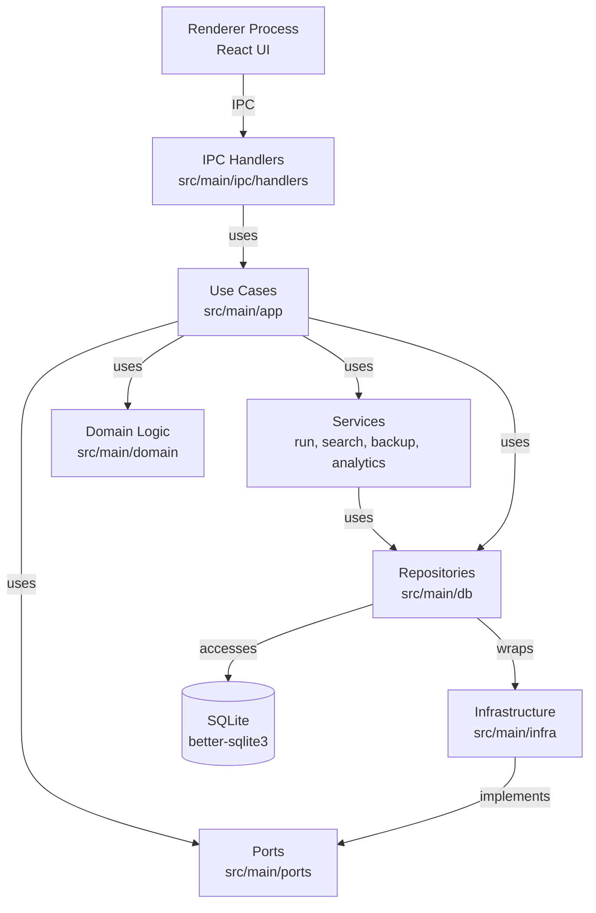
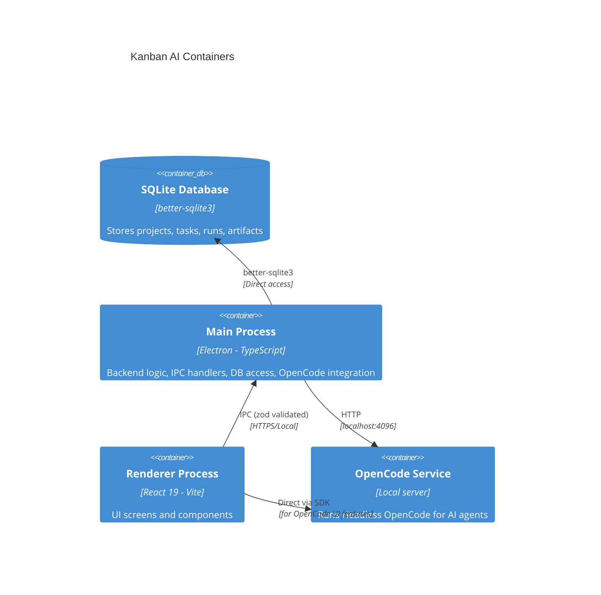
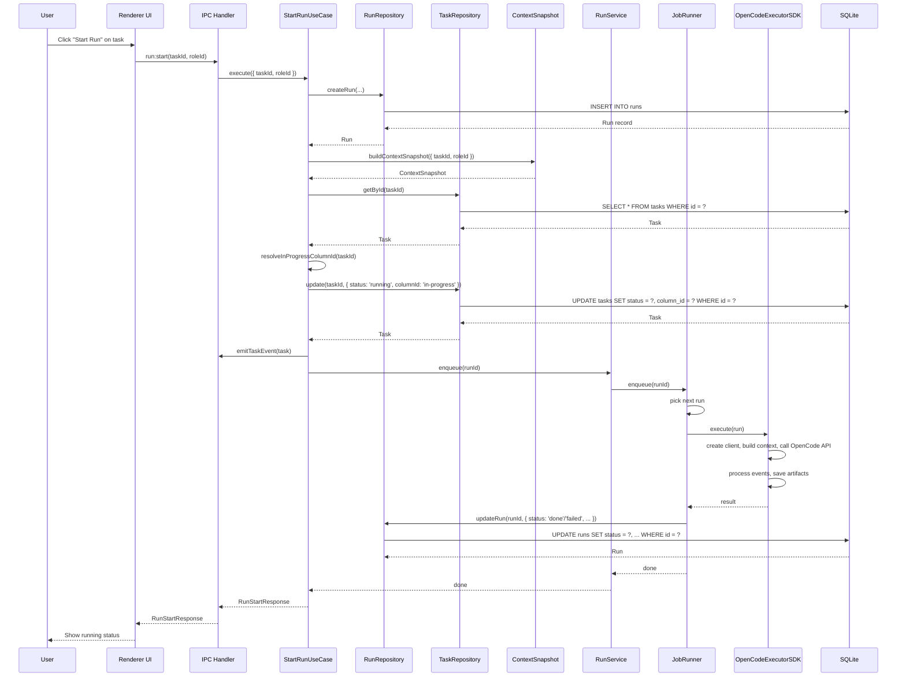
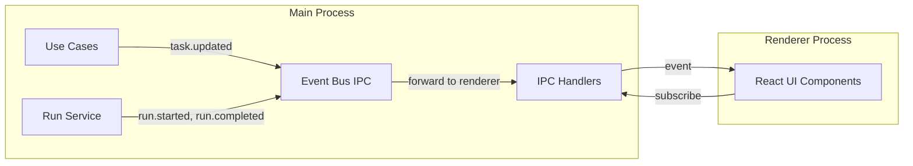

# ARCHITECTURE SNAPSHOT

## 0) Метаданные слепка

**Название и назначение**: Kanban AI — десктопное приложение (Electron) для управления проектами с интеграцией Headless OpenCode и oh-my-opencode. Приложение предоставляет Kanban-доску для управления задачами, запуска AI-агентов для автоматизации задач, интеграцию с системой управления сессиями OpenCode, поиском по задачам и запускам, аналитикой и системой резервного копирования.

**Языки и фреймворки**: TypeScript, React 19.2.4, Vite 7.3.1, Electron 40.0.0, Tailwind CSS 4.1.18, better-sqlite3 (SQLite), zod (валидация), @dnd-kit (drag-and-drop), vosk-browser (STT), @opencode-ai/sdk/v2/client (интеграция с OpenCode).

**Сборка и запуск**:

- **Dev**: `pnpm dev` → запускает `electron-rebuild` для пересборки native модулей, затем `electron-vite dev`
- **Build**: `pnpm build` → собирает Electron приложение с Vite
- **Tests**: `pnpm test` → запускает Vitest после пересборки native модулей для системного Node.js
- **Lint**: `pnpm lint` → ESLint
- **Format**: `pnpm format` → Prettier
- **Quality**: `pnpm quality` → typecheck + lint + format:check + test:run

**Конфиги и секреты**:

- `.env` → загружается через dotenv, используется для переменных окружения (OPENCODE_URL, OPENCODE_PORT, RUN_CONCURRENCY, RUN_PROVIDER_CONCURRENCY, DB_PATH)
- Секреты хранятся в Electron's safeStorage (src/main/secrets/) с fallback на mock для разработки

---

## 1) Карта репозитория

**Дерево папок** (глубина 4-5):

```
kanban-ai/
├── docs/                       # Документация
│   ├── backlog/                  # Планы будущего развития
│   ├── SETUP.md                  # Инструкция по установке
│   ├── STYLE_GUIDE.md            # Гайд по стилю
│   └── ...
├── src/
│   ├── ipc/                      # IPC типы и контракты
│   │   └── types/
│   │       └── index.ts          # Общие типы IPC (LogLevel, AppInfo, Project, ...)
│   ├── lib/                      # Утилиты
│   │   └── utils.ts
│   ├── main/                     # Main process (Electron)
│   │   ├── analytics/             # Аналитика
│   │   │   └── analytics-service.ts
│   │   ├── app/                  # Use Cases (прикладной слой)
│   │   │   ├── opencode/         # OpenCode команды и запросы
│   │   │   │   ├── commands/
│   │   │   │   └── queries/
│   │   │   ├── project/          # Project команды и запросы
│   │   │   │   ├── commands/    # CreateProject, DeleteProject, UpdateProject
│   │   │   │   └── queries/     # GetProjects, GetProjectById
│   │   │   ├── run/              # Run команды и запросы
│   │   │   │   ├── commands/    # StartRun, CancelRun, DeleteRun
│   │   │   │   └── queries/     # ListRunsByTask, GetRun
│   │   │   └── task/             # Task команды и запросы
│   │   │       ├── commands/    # CreateTask, DeleteTask, UpdateTask, MoveTask
│   │   │       └── queries/     # ListTasksByBoard
│   │   ├── backup/                # Сервис резервного копирования
│   │   │   └── backup-service.ts
│   │   ├── db/                   # Доступ к БД + репозитории
│   │   │   ├── migrations.ts     # SQL миграции (версия 16)
│   │   │   ├── index.ts          # DatabaseManager
│   │   │   ├── *-repository.ts  # Репозитории сущностей
│   │   │   └── run-types.ts
│   │   ├── deps/                  # Управление зависимостями
│   │   │   └── dependency-service.ts
│   │   ├── domain/                # Domain логика
│   │   │   └── task/
│   │   │       └── task-move.policy.ts
│   │   ├── infra/                 # Адаптеры репозиториев
│   │   │   ├── project/
│   │   │   │   └── project-repo.adapter.ts
│   │   │   ├── run/
│   │   │   │   └── run-repo.adapter.ts
│   │   │   └── task/
│   │   │       └── task-repo.adapter.ts
│   │   ├── ipc/                   # IPC хендлеры и композиция
│   │   │   ├── composition/
│   │   │   │   └── create-app-context.ts  # DI контейнер
│   │   │   ├── handlers/          # IPC хендлеры (app, backup, board, deps, oh-my-opencode, opencode, task)
│   │   │   ├── handlers.ts
│   │   │   ├── context-menu.ts
│   │   │   └── event-bus-ipc.ts
│   │   ├── ports/                 # Порты репозиториев (интерфейсы)
│   │   │   └── index.ts
│   │   ├── services/               # Внешние сервисы
│   │   │   └── opencode-service.ts  # Запуск OpenCode сервера
│   │   ├── main.ts                # Точка входа main процесса
│   │   ├── run/                   # Run сервис (JobRunner, OpenCodeExecutorSDK)
│   │   │   ├── run-service.ts    # Очередь выполнения и управление
│   │   │   ├── job-runner.ts
│   │   │   └── opencode-executor-sdk.ts
│   │   ├── search/                # Поисковый сервис
│   │   │   └── search-service.ts   # FTS поиск (tasks, runs, artifacts)
│   │   └── secrets/               # SecretStore
│   ├── preload/                   # Preload скрипт
│   │   └── ipc-contract.ts        # IPC интерфейсы (MainToRenderer, RendererToMain)
│   ├── renderer/                  # Renderer process (React)
│   │   ├── screens/               # Экраны приложения
│   │   │   ├── ProjectsScreen.tsx
│   │   │   ├── BoardScreen.tsx
│   │   │   ├── TimelineScreen.tsx
│   │   │   ├── AnalyticsScreen.tsx
│   │   │   ├── SettingsScreen.tsx
│   │   │   └── DiagnosticsScreen.tsx
│   │   ├── components/            # React компоненты
│   │   │   ├── Sidebar.tsx
│   │   │   ├── SearchModal.tsx
│   │   │   └── kanban/
│   │   └── voice/                 # STT (Vosk)
│   │       ├── STTWorkerController.ts
│   │       ├── VoiceCapture.ts
│   │       └── sttControllerSingleton.ts
│   ├── shared/                    # Общие типы
│   │   ├── types/
│   │   │   └── ipc.ts            # IPC типы и Zod схемы
│   │   └── ipc.ts                 # Утилиты для IPC
│   └── lib/                      # Утилиты renderer
│       └── utils.ts
├── electron.vite.config.ts        # Vite конфиг для Electron
├── electron-builder.config.ts       # Конфиг для сборки
├── eslint.config.js               # ESLint конфиг
├── package.json                   # Зависимости и скрипты
└── README.md                     # Документация
```

**Важные узлы**:

- `src/main/main.ts` — точка входа main процесса
- `src/preload/ipc-contract.ts` — IPC контракты (интерфейсы между main и renderer)
- `src/main/ipc/composition/create-app-context.ts` — DI контейнер
- `src/main/db/migrations.ts` — SQL миграции БД (версия 16)
- `src/main/db/index.ts` — DatabaseManager
- `src/renderer/App.tsx` — точка входа renderer процесса

**Главные модули/пакеты**:

- `src/main/app/` — Use Cases (прикладной слой, бизнес-логика)
- `src/main/db/` — Репозитории + миграции БД
- `src/main/infra/` — Адаптеры репозиториев (порт → имплементация)
- `src/main/ports/` — Порты (интерфейсы репозиториев)
- `src/main/ipc/` — IPC хендлеры + композиция DI
- `src/main/run/` — Run сервис (управление очередью выполнения задач AI-агентов)
- `src/main/search/` — Поисковый сервис (FTS поиск по tasks, runs, artifacts)
- `src/main/backup/` — Сервис резервного копирования
- `src/main/analytics/` — Аналитика
- `src/renderer/screens/` — Экраны приложения (Projects, Board, Timeline, Analytics, Settings, Diagnostics)
- `src/renderer/components/` — React компоненты UI

---

## 2) Контекст и границы системы

**Внешние системы/интеграции**:

- **SQLite** (better-sqlite3) — локальное хранилище данных (путь: `~/Library/Application Support/kanban-ai/kanban.db` на macOS)
- **Headless OpenCode** — внешняя система управления сессиями и AI-агентами, интеграция через `@opencode-ai/sdk/v2/client` (SDK v2)
- **Vosk WASM** — оффлайн STT (speech-to-text) для голосового ввода, модели загружаются один раз и кешируются

**Рантаймы/процессы**:

- **Main process** (Electron main) — backend логика, доступ к БД, IPC хендлеры, интеграция с OpenCode
- **Renderer process** (React/Vite) — UI, общение с main через IPC
- **Preload script** — безопасный мост между main и renderer, контекст изоляции включена

**Контракты между частями**:

- **IPC** — коммуникация между main и renderer процессами, типобезопасность через zod схемы
- **Event Bus IPC** — внутренние события (например, task.updated) для синхронизации

---

## 3) Основные сценарии (use-cases)

**UC-01 Создание проекта**: UI → IPC `project:create` → CreateProjectUseCase → ProjectRepoAdapter → SQLite → ответ с Project
**UC-02 Получение списка проектов**: UI → IPC `project:getAll` → GetProjectsUseCase → ProjectRepoAdapter → SQLite → ответ с Project[]
**UC-03 Получение деталей проекта**: UI → IPC `project:getById` → GetProjectByIdUseCase → ProjectRepoAdapter → SQLite → ответ с Project
**UC-04 Обновление проекта**: UI → IPC `project:update` → UpdateProjectUseCase → ProjectRepoAdapter → SQLite → ответ с Project
**UC-05 Удаление проекта**: UI → IPC `project:delete` → DeleteProjectUseCase → ProjectRepoAdapter → SQLite → ответ { ok: boolean }
**UC-06 Создание задачи**: UI → IPC `task:create` → CreateTaskUseCase → TaskRepoAdapter → SQLite → ответ с Task
**UC-07 Получение списка задач по доске**: UI → IPC `task:listByBoard` → ListTasksByBoardUseCase → TaskRepoAdapter → SQLite → ответ с Task[]
**UC-08 Обновление задачи**: UI → IPC `task:update` → UpdateTaskUseCase → TaskRepoAdapter → OpencodeModelRepo (для model_name) → SQLite → событие task.updated → ответ с Task
**UC-09 Перемещение задачи**: UI → IPC `task:move` → MoveTaskUseCase → TaskRepoAdapter → TaskMovePolicy (валидация) → SQLite → ответ с Task
**UC-10 Удаление задачи**: UI → IPC `task:delete` → DeleteTaskUseCase → TaskRepoAdapter → SQLite → ответ { ok: boolean }
**UC-11 Запуск выполнения задачи (AI агент)**: UI → IPC `run:start` → StartRunUseCase → RunRepoAdapter (создание run) → buildContextSnapshot (сбор контекста) → resolveInProgressColumnId (поиск колонки "In Progress") → updateTaskAndEmit (обновление задачи) → runService.enqueue (добавление в очередь) → ответ с Run
**UC-12 Отмена выполнения задачи**: UI → IPC `run:cancel` → CancelRunUseCase → runService.cancel → ответ { ok: boolean }
**UC-13 Получение списка запусков по задаче**: UI → IPC `run:listByTask` → ListRunsByTaskUseCase → RunRepoAdapter → SQLite → ответ с Run[]
**UC-14 Получение деталей запуска**: UI → IPC `run:get` → GetRunUseCase → RunRepoAdapter → SQLite → ответ с Run
**UC-15 Удаление запуска**: UI → IPC `run:delete` → DeleteRunUseCase → RunRepoAdapter → SQLite → ответ { ok: boolean }
**UC-16 Получение хвоста событий запуска**: UI → IPC `events:tail` → search-сервис → FTS по run_events_fts → ответ с RunEvent[]
**UC-17 Поиск задач**: UI → IPC `search:query` → searchService.queryTasks → FTS по tasks_fts → ответ с KanbanTask[]
**UC-18 Поиск запусков**: UI → IPC `search:query` → searchService.queryRuns → FTS по runs_fts + run_events_fts → ответ с Run[]
**UC-19 Поиск артефактов**: UI → IPC `search:query` → searchService.queryArtifacts → FTS по artifacts_fts → ответ с Artifact[]
**UC-20 Экспорт проекта**: UI → IPC `backup:exportProject` → BackupService → сбор данных в zip → ответ с { success, message }
**UC-21 Импорт проекта**: UI → IPC `backup:importProject` → BackupService → разбор zip → импорт данных в SQLite → ответ с { success, message }

---

## 4) Архитектурные слои и зависимости

**Слои (фактическая структура)**:

- **UI Layer** (`src/renderer/`):
  - React компоненты (screens, components)
  - Используют `window.api` для общения с main процессом через IPC

- **Application Layer** (`src/main/app/`):
  - Use Cases (Commands и Queries)
  - Бизнес-логика приложения
  - Зависят от портов (Ports) и сервисов

- **Domain Layer** (`src/main/domain/`):
  - Domain логика (политики, инварианты)
  - Например, TaskMovePolicy — валидация перемещения задач

- **Infrastructure Layer** (`src/main/infra/`):
  - Адаптеры репозиториев (Port → Repository)
  - Реализация интерфейсов портов для SQLite

- **Data Access Layer** (`src/main/db/`):
  - Репозитории сущностей (ProjectRepository, TaskRepository, RunRepository, ...)
  - Миграции БД (migrations.ts)
  - Прямой доступ к SQLite через better-sqlite3

- **IPC Layer** (`src/main/ipc/`):
  - Хендлеры IPC запросов (handlers/)
  - Композиция DI контейнера (composition/create-app-context.ts)
  - Event Bus для внутренних событий

**Где что живёт**:

- Бизнес-логика — Use Cases в `src/main/app/`
- IO/интеграции — репозитории в `src/main/db/`, OpenCode SDK в `src/main/services/opencode-service.ts`
- DTO/контракты/валидация — IPC типы и Zod схемы в `src/ipc/types/index.ts`, `src/shared/types/ipc.ts`
- DI/composition root — `src/main/ipc/composition/create-app-context.ts`

**Dependency Map** (кто от кого зависит):

```
UI Layer (renderer)
  ↓ IPC
IPC Layer (main/ipc)
  ↓
Application Layer (main/app)
  ↓ uses
Ports (main/ports) ← ───
  ↓ implemented by
Infrastructure Layer (main/infra)
  ↓ wraps
Data Access Layer (main/db)
  ↓
SQLite (better-sqlite3)

Domain Layer (main/domain)
  ↑ used by
Application Layer

Services (main/run, main/search, main/backup, main/analytics)
  ↑ used by
Application Layer
```

**Mermaid Dependency Diagram**:



---

## 5) Data flow и runtime flow (Mermaid)

**C4 Context Diagram**:

```mermaid
C4Context
    title Kanban AI Context
    Person(user, "User", "Uses Kanban AI for project management")
    System(kanban_ai, "Kanban AI", "Electron desktop application for project management")
    SystemDb(sqlite, "SQLite", "Local database for projects, tasks, runs")
    SystemExt(opencode, "Headless OpenCode", "AI agents and session management")

    Rel(user, kanban_ai, "Uses")
    Rel(kanban_ai, sqlite, "Reads/Writes")
    Rel(kanban_ai, opencode, "Integrates via SDK")
```

**C4 Container Diagram**:



**Sequence Diagram** (ключевой use-case: запуск выполнения задачи):



**Event/Message Flow** (внутренние события):



---

## 6) Модель данных и база данных

**Тип хранилища**: SQLite (better-sqlite3)
**Драйвер/ORM**: better-sqlite3 (прямой SQL, нет ORM)

**Основные таблицы**:

- **projects** — проекты
  - `id` (TEXT, PK) — UUID
  - `name` (TEXT NOT NULL) — название
  - `path` (TEXT NOT NULL UNIQUE) — путь к проекту в файловой системе
  - `color` (TEXT NOT NULL DEFAULT '') — цвет проекта
  - `created_at` (TEXT NOT NULL) — timestamp ISO
  - `updated_at` (TEXT NOT NULL) — timestamp ISO
  - Индексы: нет (маленькая таблица)

- **boards** — канбан доски
  - `id` (TEXT, PK) — UUID
  - `project_id` (TEXT NOT NULL, FK → projects(id) ON DELETE CASCADE) — проект
  - `name` (TEXT NOT NULL) — название доски
  - `created_at` (TEXT NOT NULL) — timestamp ISO
  - `updated_at` (TEXT NOT NULL) — timestamp ISO
  - Индексы: `idx_boards_project(project_id)`

- **board_columns** — колонки доски
  - `id` (TEXT, PK) — UUID
  - `board_id` (TEXT NOT NULL, FK → boards(id) ON DELETE CASCADE) — доска
  - `name` (TEXT NOT NULL) — название колонки
  - `order_index` (INTEGER NOT NULL) — порядок колонки
  - `wip_limit` (INTEGER) — WIP лимит (опционально)
  - `color` (TEXT NOT NULL DEFAULT '') — цвет колонки
  - `created_at` (TEXT NOT NULL) — timestamp ISO
  - `updated_at` (TEXT NOT NULL) — timestamp ISO
  - Индексы: `idx_columns_board(board_id, order_index)`

- **tasks** — задачи
  - `id` (TEXT, PK) — UUID
  - `project_id` (TEXT NOT NULL, FK → projects(id) ON DELETE CASCADE) — проект
  - `title` (TEXT NOT NULL) — заголовок
  - `description` (TEXT) — описание
  - `status` (TEXT NOT NULL) — 'queued' | 'running' | 'done' | 'archived'
  - `priority` (TEXT NOT NULL) — 'low' | 'normal' | 'urgent'
  - `difficulty` (TEXT NOT NULL DEFAULT 'medium') — сложность
  - `assigned_agent` (TEXT) — назначенный агент (опционально)
  - `board_id` (TEXT, FK → boards(id) ON DELETE SET NULL) — доска (опционально)
  - `column_id` (TEXT, FK → board_columns(id) ON DELETE CASCADE) — колонка (опционально)
  - `order_in_column` (INTEGER DEFAULT 0) — порядок в колонке
  - `type` (TEXT NOT NULL DEFAULT 'task') — тип задачи
  - `tags_json` (TEXT NOT NULL DEFAULT '[]') — теги (JSON массив)
  - `description_md` (TEXT) — описание в Markdown
  - `start_date` (TEXT) — дата начала
  - `due_date` (TEXT) — дата дедлайна
  - `estimate_points` (REAL) — оценка в поинтах
  - `estimate_hours` (REAL) — оценка в часах
  - `assignee` (TEXT) — исполнитель
  - `model_name` (TEXT) — название модели AI (для выполнения)
  - `created_at` (TEXT NOT NULL) — timestamp ISO
  - `updated_at` (TEXT NOT NULL) — timestamp ISO
  - Индексы: `idx_tasks_project_id(project_id)`, `idx_tasks_status(status)`, `idx_tasks_board_id(board_id)`, `idx_tasks_column_id(column_id)`, `idx_tasks_board_col(board_id, column_id, order_in_column)`

- **agent_roles** — роли AI агентов
  - `id` (TEXT, PK) — ID роли (например, 'ba', 'dev', 'qa')
  - `name` (TEXT NOT NULL) — название роли
  - `description` (TEXT NOT NULL DEFAULT '') — описание
  - `preset_json` (TEXT NOT NULL DEFAULT '{}') — пресет роли (JSON)
  - `created_at` (TEXT NOT NULL) — timestamp ISO
  - `updated_at` (TEXT NOT NULL) — timestamp ISO

- **context_snapshots** — снепшоты контекста для запуска
  - `id` (TEXT, PK) — UUID
  - `task_id` (TEXT NOT NULL, FK → tasks(id) ON DELETE CASCADE) — задача
  - `kind` (TEXT NOT NULL) — тип снепшота
  - `summary` (TEXT NOT NULL DEFAULT '') — краткое описание
  - `payload_json` (TEXT NOT NULL) — payload (JSON)
  - `hash` (TEXT NOT NULL) — хеш снепшота
  - `created_at` (TEXT NOT NULL) — timestamp ISO

- **runs** — запуски задач AI агентами
  - `id` (TEXT, PK) — UUID
  - `task_id` (TEXT NOT NULL, FK → tasks(id) ON DELETE CASCADE) — задача
  - `role_id` (TEXT NOT NULL, FK → agent_roles(id)) — роль агента
  - `mode` (TEXT NOT NULL DEFAULT 'execute') — режим запуска
  - `kind` (TEXT NOT NULL DEFAULT 'task-run') — тип запуска
  - `status` (TEXT NOT NULL) — статус (например, 'queued', 'running', 'done', 'failed')
  - `session_id` (TEXT) — ID сессии OpenCode
  - `started_at` (TEXT) — время начала
  - `finished_at` (TEXT) — время завершения
  - `error_text` (TEXT NOT NULL DEFAULT '') — текст ошибки
  - `budget_json` (TEXT NOT NULL DEFAULT '{}') — бюджет (JSON)
  - `context_snapshot_id` (TEXT NOT NULL, FK → context_snapshots(id) ON DELETE CASCADE) — снепшот контекста
  - `ai_tokens_in` (INTEGER NOT NULL DEFAULT 0) — входящие токены AI
  - `ai_tokens_out` (INTEGER NOT NULL DEFAULT 0) — исходящие токены AI
  - `ai_cost_usd` (REAL NOT NULL DEFAULT 0) — стоимость в USD
  - `duration_sec` (REAL NOT NULL DEFAULT 0) — длительность в секундах
  - `created_at` (TEXT NOT NULL) — timestamp ISO
  - `updated_at` (TEXT NOT NULL) — timestamp ISO
  - Индексы: `idx_runs_task(task_id, created_at)`

- **run_events** — события запуска
  - `id` (TEXT, PK) — UUID
  - `run_id` (TEXT NOT NULL, FK → runs(id) ON DELETE CASCADE) — запуск
  - `ts` (TEXT NOT NULL) — timestamp
  - `event_type` (TEXT NOT NULL) — тип события
  - `payload_json` (TEXT NOT NULL) — payload (JSON)
  - `message_id` (TEXT) — ID сообщения (опционально)
  - Индексы: `idx_events_run(run_id, ts)`, `idx_run_events_message(message_id)`

- **artifacts** — артефакты запуска
  - `id` (TEXT, PK) — UUID
  - `run_id` (TEXT NOT NULL, FK → runs(id) ON DELETE CASCADE) — запуск
  - `kind` (TEXT NOT NULL) — тип артефакта
  - `title` (TEXT NOT NULL) — название
  - `content` (TEXT NOT NULL) — контент
  - `metadata_json` (TEXT NOT NULL DEFAULT '{}') — метаданные (JSON)
  - `created_at` (TEXT NOT NULL) — timestamp ISO
  - Индексы: `idx_artifacts_run(run_id, created_at)`

- **tags** — теги
  - `id` (TEXT, PK) — UUID
  - `name` (TEXT NOT NULL) — название (уникально)
  - `color` (TEXT NOT NULL) — цвет
  - `created_at` (TEXT NOT NULL) — timestamp ISO
  - `updated_at` (TEXT NOT NULL) — timestamp ISO
  - UNIQUE(name)

- **task_queue** — очередь задач (для TaskQueueManager)
  - `task_id` (TEXT, PK, FK → tasks(id) ON DELETE CASCADE) — задача
  - `state` (TEXT NOT NULL) — 'queued' | 'running' | 'waiting_user' | 'paused' | 'done' | 'failed'
  - `stage` (TEXT NOT NULL) — стадия (например, 'ba', 'fe', 'be', 'qa')
  - `priority` (INTEGER NOT NULL) — приоритет
  - `enqueued_at` (TEXT NOT NULL) — timestamp добавления
  - `updated_at` (TEXT NOT NULL) — timestamp обновления
  - `last_error` (TEXT NOT NULL DEFAULT '') — последняя ошибка
  - `locked_by` (TEXT NOT NULL DEFAULT '') — заблокировано кем
  - `locked_until` (TEXT NULL) — блокировка до
  - Индексы: `idx_task_queue_state_prio(state, priority, updated_at)`, `idx_task_queue_stage_state(stage, state, priority)`

- **role_slots** — слоты ролей (для TaskQueueManager)
  - `role_key` (TEXT, PK) — ключ роли (например, 'ba', 'fe', 'be', 'qa')
  - `max_concurrency` (INTEGER NOT NULL) — максимальная конкурентность

- **resource_locks** — блокировки ресурсов (для TaskQueueManager)
  - `lock_key` (TEXT, PK) — ключ блокировки (например, 'project:<id>:workspace')
  - `owner` (TEXT NOT NULL) — владелец блокировки
  - `acquired_at` (TEXT NOT NULL) — timestamp приобретения
  - `expires_at` (TEXT NOT NULL) — timestamp истечения
  - Индексы: `idx_resource_locks_expires(expires_at)`

- **releases** — релизы (PM feature)
  - `id` (TEXT, PK) — UUID
  - `project_id` (TEXT NOT NULL, FK → projects(id) ON DELETE CASCADE) — проект
  - `name` (TEXT NOT NULL) — название
  - `status` (TEXT NOT NULL) — статус
  - `target_date` (TEXT) — целевая дата
  - `notes_md` (TEXT NOT NULL DEFAULT '') — заметки в Markdown
  - `created_at` (TEXT NOT NULL) — timestamp ISO
  - `updated_at` (TEXT NOT NULL) — timestamp ISO
  - Индексы: `idx_releases_project(project_id, updated_at)`

- **release_items** — элементы релиза
  - `id` (TEXT, PK) — UUID
  - `release_id` (TEXT NOT NULL, FK → releases(id) ON DELETE CASCADE) — релиз
  - `task_id` (TEXT NOT NULL, FK → tasks(id) ON DELETE CASCADE) — задача
  - `state` (TEXT NOT NULL DEFAULT 'planned') — состояние
  - `created_at` (TEXT NOT NULL) — timestamp ISO
  - `updated_at` (TEXT NOT NULL) — timestamp ISO
  - Индексы: `idx_release_items_release(release_id, state)`

- **task_links** — связи между задачами
  - `id` (TEXT, PK) — UUID
  - `project_id` (TEXT NOT NULL, FK → projects(id) ON DELETE CASCADE) — проект
  - `from_task_id` (TEXT NOT NULL, FK → tasks(id) ON DELETE CASCADE) — от задачи
  - `to_task_id` (TEXT NOT NULL, FK → tasks(id) ON DELETE CASCADE) — к задаче
  - `link_type` (TEXT NOT NULL) — тип связи
  - `created_at` (TEXT NOT NULL) — timestamp ISO
  - `updated_at` (TEXT NOT NULL) — timestamp ISO
  - Индексы: `idx_links_from(from_task_id)`, `idx_links_to(to_task_id)`, `idx_links_project(project_id)`

- **task_schedule** — расписание задач
  - `task_id` (TEXT, PK, FK → tasks(id) ON DELETE CASCADE) — задача
  - `start_date` (TEXT NULL) — дата начала
  - `due_date` (TEXT NULL) — дата дедлайна
  - `estimate_points` (REAL NOT NULL DEFAULT 0) — оценка в поинтах
  - `estimate_hours` (REAL NOT NULL DEFAULT 0) — оценка в часах
  - `assignee` (TEXT NOT NULL DEFAULT '') — исполнитель
  - `updated_at` (TEXT NOT NULL) — timestamp ISO
  - Индексы: `idx_schedule_task(task_id)`

- **task_events** — события задач
  - `id` (TEXT, PK) — UUID
  - `task_id` (TEXT NOT NULL, FK → tasks(id) ON DELETE CASCADE) — задача
  - `ts` (TEXT NOT NULL) — timestamp
  - `event_type` (TEXT NOT NULL) — тип события
  - `payload_json` (TEXT NOT NULL DEFAULT '{}') — payload (JSON)
  - Индексы: `idx_task_events_task(task_id, ts)`

- **plugins** — плагины
  - `id` (TEXT, PK) — UUID
  - `name` (TEXT NOT NULL) — название
  - `version` (TEXT NOT NULL) — версия
  - `enabled` (INTEGER NOT NULL DEFAULT 0) — включен (0/1)
  - `type` (TEXT NOT NULL) — тип
  - `manifest_json` (TEXT NOT NULL) — манифест (JSON)
  - `installed_at` (TEXT NOT NULL) — timestamp ISO
  - `updated_at` (TEXT NOT NULL) — timestamp ISO

- **opencode_models** — модели OpenCode
  - `name` (TEXT, PK) — название модели
  - `enabled` (INTEGER NOT NULL DEFAULT 0) — включена (0/1)
  - `difficulty` (TEXT NOT NULL DEFAULT 'medium') — сложность
  - `variants` (TEXT NOT NULL DEFAULT '') — варианты

- **app_settings** — настройки приложения
  - `key` (TEXT, PK) — ключ
  - `value` (TEXT NOT NULL) — значение
  - `updated_at` (TEXT NOT NULL DEFAULT datetime('now')) — timestamp ISO
  - Индексы: `idx_app_settings_key(key)`

- **schema_migrations** — миграции схемы
  - `id` (INTEGER, PK, AUTOINCREMENT)
  - `version` (INTEGER NOT NULL UNIQUE) — версия миграции
  - `applied_at` (TEXT NOT NULL DEFAULT datetime('now')) — timestamp ISO

**FTS таблицы** (Full-Text Search):

- `tasks_fts` — FTS по задачам (title, description, tags)
- `runs_fts` — FTS по запускам (role_id, status, error_text)
- `run_events_fts` — FTS по событиям запуска (event_type, payload)
- `artifacts_fts` — FTS по артефактам (title, content)

**Триггеры FTS**:

- `tasks_fts_insert`, `tasks_fts_update`, `tasks_fts_delete` — поддержание синхронизации tasks_fts с tasks
- `runs_fts_insert`, `runs_fts_update`, `runs_fts_delete` — синхронизация runs_fts с runs
- `run_events_fts_insert`, `run_events_fts_update`, `run_events_fts_delete` — синхронизация run_events_fts с run_events
- `artifacts_fts_insert`, `artifacts_fts_update`, `artifacts_fts_delete` — синхронизация artifacts_fts с artifacts

**Транзакции/конкурентность/блокировки**:

- Используются транзакции для миграций (`db.transaction(() => { ... })()`)
- WAL режим включён для улучшения конкурентности (`db.pragma('journal_mode = WAL')`)
- FOREIGN KEY CASCADE для каскадного удаления
- TaskQueueManager использует resource_locks и role_slots для управления конкурентностью выполнения задач

**Миграции**:

- Путь: `src/main/db/migrations.ts`
- Запуск: автоматически при старте приложения через DatabaseManager (src/main/db/index.ts)
- Текущая версия: 16
- Система отслеживания: таблица schema_migrations

**Риски роста данных**:

- run_events могут расти быстро (события запуска), FTS таблицы занимают место
- tasks и runs могут расти пропорционально количеству задач и запусков
- Рекомендуемый bottleneck: периодическая архивировка старых данных (например, старше 6 месяцев)

---

## 7) Интерфейсы и контракты (API/IPC/Events/CLI)

**IPC интерфейсы** (MainToRenderer / RendererToMain, определены в src/preload/ipc-contract.ts):

**app**:

- `getInfo()` → `AppInfo` — информация о приложении (name, version, platform, arch)
- `openPath(path)` → `Promise<void>` — открыть путь в файловой системе

**ohMyOpencode**:

- `readConfig(input)` → `OhMyOpencodeReadConfigResponse` — прочитать конфиг oh-my-opencode
- `saveConfig(input)` → `OhMyOpencodeSaveConfigResponse` — сохранить конфиг
- `listPresets(input)` → `OhMyOpencodeListPresetsResponse` — список пресетов
- `loadPreset(input)` → `OhMyOpencodeLoadPresetResponse` — загрузить пресет
- `savePreset(input)` → `OhMyOpencodeSavePresetResponse` — сохранить пресет
- `backupConfig(input)` → `OhMyOpencodeBackupConfigResponse` — бекап конфига
- `restoreConfig(input)` → `OhMyOpencodeRestoreConfigResponse` — восстановить конфиг

**dialog**:

- `showOpenDialog(input)` → `{ canceled, filePaths }` — диалог выбора файлов

**fileSystem**:

- `exists(input)` → `{ exists }` — проверка существования файла

**opencode**:

- `onEvent(sessionId, callback)` → `() => void` — подписка на события сессии OpenCode
- `generateUserStory(input)` → `OpenCodeGenerateUserStoryResponse` — генерация user story
- `getSessionStatus(input)` → `OpenCodeSessionStatusResponse` — статус сессии
- `getActiveSessions()` → `OpenCodeActiveSessionsResponse` — список активных сессий
- `getSessionMessages(input)` → `OpenCodeSessionMessagesResponse` — сообщения сессии
- `getSessionTodos(input)` → `OpenCodeSessionTodosResponse` — TODO сессии
- `listModels()` → `OpencodeModelsListResponse` — список моделей
- `listEnabledModels()` → `OpencodeModelsListResponse` — список включенных моделей
- `refreshModels()` → `OpencodeModelsListResponse` — обновить список моделей
- `toggleModel(input)` → `OpencodeModelToggleResponse` — включить/выключить модель
- `updateModelDifficulty(input)` → `OpencodeModelUpdateDifficultyResponse` — обновить сложность модели
- `sendMessage(input)` → `OpencodeSendMessageResponse` — отправить сообщение в сессию
- `logProviders(input)` → `OpenCodeLogProvidersResponse` — провайдеры логов

**project**:

- `selectFolder()` → `{ path, name } | null` — выбрать папку проекта
- `selectFiles()` → `string[] | null` — выбрать файлы проекта
- `create(input)` → `Project` — создать проект
- `getAll()` → `Project[]` — получить все проекты
- `getById(id)` → `Project | null` — получить проект по ID
- `update(input)` → `Project | null` — обновить проект
- `delete(input)` → `boolean` — удалить проект

**board**:

- `getDefault(input)` → `BoardGetDefaultResponse` — получить дефолтную доску
- `updateColumns(input)` → `BoardUpdateColumnsResponse` — обновить колонки доски

**task**:

- `onEvent(callback)` → `() => void` — подписка на события задач
- `create(input)` → `TaskCreateResponse` — создать задачу
- `listByBoard(input)` → `TaskListByBoardResponse` — получить задачи доски
- `update(input)` → `TaskUpdateResponse` — обновить задачу
- `move(input)` → `TaskMoveResponse` — переместить задачу
- `delete(input)` → `TaskDeleteResponse` — удалить задачу

**tag**:

- `create(input)` → `Tag` — создать тег
- `update(input)` → `Tag` — обновить тег
- `delete(input)` → `{ ok }` — удалить тег
- `list(input)` → `TagListResponse` — получить теги

**deps**:

- `list(input)` → `DepsListResponse` — список зависимостей
- `add(input)` → `DepsAddResponse` — добавить зависимость
- `remove(input)` → `DepsRemoveResponse` — удалить зависимость

**schedule**:

- `get(input)` → `ScheduleGetResponse` — получить расписание задачи
- `update(input)` → `ScheduleUpdateResponse` — обновить расписание

**search**:

- `query(input)` → `SearchQueryResponse` — поиск (tasks, runs, artifacts)

**analytics**:

- `getOverview(input)` → `AnalyticsGetOverviewResponse` — обзор аналитики
- `getRunStats(input)` → `AnalyticsGetRunStatsResponse` — статистика запусков

**plugins**:

- `list()` → `PluginsListResponse` — список плагинов
- `install(input)` → `PluginsInstallResponse` — установить плагин
- `enable(input)` → `PluginsEnableResponse` — включить плагин
- `reload()` → `PluginsReloadResponse` — перезагрузить плагины

**roles**:

- `list()` → `RolesListResponse` — список ролей агентов

**backup**:

- `exportProject(input)` → `BackupExportResponse` — экспорт проекта
- `importProject(input)` → `BackupImportResponse` — импорт проекта

**diagnostics**:

- `getLogs(level?, limit?)` → `LogEntry[]` — получить логи
- `getLogTail(lines?)` → `string[]` — получить хвост логов
- `getSystemInfo()` → `object` — системная информация
- `getDbInfo()` → `object` — информация о БД

**database**:

- `delete(input)` → `DatabaseDeleteResponse` — удалить БД

**run**:

- `start(input)` → `RunStartResponse` — запустить выполнение
- `cancel(input)` → `RunCancelResponse` — отменить выполнение
- `delete(input)` → `RunDeleteResponse` — удалить запуск
- `listByTask(input)` → `RunListByTaskResponse` — список запусков задачи
- `get(input)` → `RunGetResponse` — получить запуск

**events**:

- `tail(input)` → `RunEventsTailResponse` — хвост событий запуска

**artifact**:

- `list(input)` → `ArtifactListResponse` — список артефактов
- `get(input)` → `ArtifactGetResponse` — получить артефакт

**appSetting**:

- `getLastProjectId()` → `AppSettingGetLastProjectIdResponse` — последний проект
- `setLastProjectId(input)` → `AppSettingSetLastProjectIdResponse` — установить последний проект
- `getSidebarCollapsed()` → `AppSettingGetSidebarCollapsedResponse` — состояние sidebar
- `setSidebarCollapsed(input)` → `AppSettingSetSidebarCollapsedResponse` — установить состояние sidebar
- `getDefaultModel(input)` → `AppSettingGetDefaultModelResponse` — дефолтная модель
- `setDefaultModel(input)` → `AppSettingSetDefaultModelResponse` — установить дефолтную модель
- `getOhMyOpencodePath()` → `AppSettingGetOhMyOpencodePathResponse` — путь oh-my-opencode
- `setOhMyOpencodePath(input)` → `AppSettingSetOhMyOpencodePathResponse` — установить путь

**vosk**:

- `downloadModel(input)` → `VoskModelDownloadResponse` — скачать модель Vosk

**stt** (только RendererToMain):

- `start(input)` → `Promise<void>` — начать STT
- `stop(input)` → `Promise<void>` — остановить STT
- `setLanguage(input)` → `Promise<void>` — установить язык STT
- `sendAudio(input)` → `Promise<void>` — отправить аудио STT

**Контракты**:

- IPC типы и Zod схемы определены в `src/ipc/types/index.ts` и `src/shared/types/ipc.ts`
- IPC хендлеры определены в `src/main/ipc/handlers/`

**Ошибки/коды**:

- UNKNOWN (нет явного каталога ошибок)
- IPC возвращает `{ ok: boolean }` или специфические типы ответов
- Требуется дополнительное исследование для полного каталога ошибок

**Авторизация**:

- UNKNOWN (не найдена явная авторизация в коде)

---

## 8) Критические места, риски, качество

**Top-10 критичных модулей**:

1. **`src/main/run/run-service.ts`** — критичен для выполнения задач AI агентами, управляет очередью и конкурентностью
2. **`src/main/db/migrations.ts`** — критичен для структуры БД, миграции должны быть обратимо совместимыми
3. **`src/main/ipc/composition/create-app-context.ts`** — критичен для DI, все use cases зависят от контекста
4. **`src/main/search/search-service.ts`** — критичен для поиска, FTS таблицы должны поддерживаться актуальными
5. **`src/main/app/run/commands/start-run.use-case.ts`** — критичен для запуска задач, собирает контекст и управляет статусами
6. **`src/main/backup/backup-service.ts`** — критичен для резервного копирования, потеря данных при ошибках
7. **`src/main/services/opencode-service.ts`** — критичен для интеграции с OpenCode, управляет локальным сервером
8. **`src/main/db/index.ts`** — критичен для доступа к БД, управляет подключениями и миграциями
9. **`src/preload/ipc-contract.ts`** — критичен для IPC контрактов, изменение ломает связь main ↔ renderer
10. **`src/renderer/App.tsx`** — критичен для UI, точка входа renderer процесса

**Hotspots** (сложность, много ответственностей, высокая связность):

- **`src/main/ipc/composition/create-app-context.ts`** — много ответственностей: DI контейнер, фабрика use cases, интеграция сервисов
- **`src/main/run/run-service.ts`** — управление очередью, конкурентностью, провайдерами, кешем
- **`src/main/search/search-service.ts`** — три типа поиска (tasks, runs, artifacts), сложные SQL запросы с FTS
- **`src/main/db/migrations.ts`** — 16 миграций в одном файле, сложная схема БД

**Performance риски**:

- **FTS поиск** — поиск по большой базе может быть медленным, особенно без индексов на filter полях
- **run_events** — могут расти быстро, хвост событий может быть большим, требуется pagination
- **SQLite** — на больших данных может быть медленнее PostgreSQL, WAL режим помогает, но не решает всё
- **JobRunner** — при высокой нагрузке может быть узким местом, зависит от RUN_CONCURRENCY

**Наблюдаемость**:

- **Логирование** — структурированные логи через Logger (src/main/log/), уровни: info, warn, error, debug
- **Метрики** — UNKNOWN (не найдено явной системы метрик)
- **Трейсинг** — UNKNOWN (не найдено явной системы трейсинга)
- **Error reporting** — UNKNOWN (не найдено явной системы отправки ошибок)

**Безопасность**:

- **Секреты** — хранятся в Electron's safeStorage, fallback на mock для разработки
- **Доступы** — UNKNOWN (не найдена явная система управления доступами)
- **Валидация входа** — IPC валидация через Zod схемы (src/shared/types/ipc.ts)
- **Sandboxing** — Electron контекст изоляция включена, nodeIntegration отключён, но sandbox: false

---

## 9) Тестирование

**Виды тестов**:

- **Unit тесты** — не найдены (UNKNOWN)
- **Integration тесты** — не найдены (UNKNOWN)
- **E2E тесты** — не найдены (UNKNOWN)
- **Smoke тесты** — не найдены (UNKNOWN)

**Что покрыто/не покрыто**:

- UNKNOWN (тестовая инфраструктура не найдена, только скрипты для запуска Vitest)

**Минимальный smoke-набор для CI**:

- UNKNOWN (тесты не найдены)

---

## 10) Рефакторинг: предложения

**Проблемы** (impact/effort):

1. **Высокая связность DI контейнера** — create-app-context.ts содержит всё: фабрики use cases, хелперы, интеграцию сервисов. Impact: HIGH (изменения ломают множество зависимостей), Effort: MEDIUM
2. **Отсутствие тестов** — нет unit/integration/e2e тестов, качество гарантируется только типизацией. Impact: HIGH, Effort: HIGH
3. **Отсутствие метрик и трейсинга** — сложно отлаживать performance проблемы и находить bottlenecks. Impact: MEDIUM, Effort: MEDIUM
4. **Сложные SQL запросы в search-service.ts** — три типа поиска в одном сервисе, сложные запросы с FTS. Impact: MEDIUM, Effort: LOW-MEDIUM
5. **Отсутствие каталога ошибок** — нет явной системы управления ошибками, IPC ответы непоследовательны. Impact: LOW-MEDIUM, Effort: LOW
6. **Отсутствие валидации доменной логики** — только валидация через Zod на IPC, нет валидации бизнес-правил в domain слое. Impact: MEDIUM, Effort: MEDIUM
7. **Отсутствие системы миграций для данных** (не только схемы) — нет миграций данных при изменении бизнес-логики. Impact: LOW-MEDIUM, Effort: MEDIUM
8. **Отсутствие наблюдаемости** (метрики, трейсинг, error reporting) — сложно мониторить production. Impact: MEDIUM, Effort: MEDIUM
9. **Высокая связность run-service.ts** — управление очередью, конкурентностью, провайдерами в одном файле. Impact: MEDIUM, Effort: LOW-MEDIUM
10. **Отсутствие документации API** — IPC контракты не документированы, сложно разработчикам понять интерфейсы. Impact: LOW, Effort: LOW

**Целевая структура папок** (tree):

```
src/
├── main/
│   ├── app/
│   │   ├── use-cases/
│   │   │   ├── project/
│   │   │   │   ├── create-project.use-case.ts
│   │   │   │   ├── delete-project.use-case.ts
│   │   │   │   ├── get-projects.use-case.ts
│   │   │   │   └── get-project-by-id.use-case.ts
│   │   │   ├── task/
│   │   │   │   ├── create-task.use-case.ts
│   │   │   │   ├── delete-task.use-case.ts
│   │   │   │   ├── list-tasks-by-board.use-case.ts
│   │   │   │   ├── move-task.use-case.ts
│   │   │   │   └── update-task.use-case.ts
│   │   │   └── run/
│   │   │       ├── cancel-run.use-case.ts
│   │   │       ├── delete-run.use-case.ts
│   │   │       ├── get-run.use-case.ts
│   │   │       ├── list-runs-by-task.use-case.ts
│   │   │       └── start-run.use-case.ts
│   ├── domain/
│   │   ├── policies/
│   │   │   └── task-move.policy.ts
│   │   ├── validators/
│   │   └── errors/
│   ├── infra/
│   │   ├── repositories/
│   │   │   ├── project-repository.adapter.ts
│   │   │   ├── task-repository.adapter.ts
│   │   │   └── run-repository.adapter.ts
│   │   ├── services/
│   │   │   ├── run-service.ts
│   │   │   ├── search-service/
│   │   │   │   ├── tasks-search.service.ts
│   │   │   │   ├── runs-search.service.ts
│   │   │   │   └── artifacts-search.service.ts
│   │   │   ├── backup-service.ts
│   │   │   └── analytics-service.ts
│   │   └── integrations/
│   │       ├── opencode-integration.ts
│   │       └── vosk-integration.ts
│   ├── db/
│   │   ├── migrations/
│   │   │   └── v16_init.ts
│   │   ├── repositories/
│   │   │   ├── project-repository.ts
│   │   │   ├── task-repository.ts
│   │   │   └── run-repository.ts
│   │   └── index.ts
│   ├── ipc/
│   │   ├── handlers/
│   │   │   ├── app.handlers.ts
│   │   │   ├── task.handlers.ts
│   │   │   └── ...
│   │   ├── context/
│   │   │   └── app-context.ts
│   │   └── validation/
│   │       └── ipc-validator.ts
│   ├── monitoring/
│   │   ├── metrics/
│   │   │   └── metrics-collector.ts
│   │   ├── tracing/
│   │   │   └── tracer.ts
│   │   └── error-reporting/
│   │       └── error-reporter.ts
│   ├── di/
│   │   ├── containers/
│   │   │   └── app-container.ts
│   │   ├── modules/
│   │   │   ├── use-cases.module.ts
│   │   │   ├── repositories.module.ts
│   │   │   └── services.module.ts
│   │   └── app-context-factory.ts
│   └── main.ts
├── renderer/
│   └── ...
├── shared/
│   ├── types/
│   ├── errors/
│   └── utils/
└── tests/
    ├── unit/
    ├── integration/
    └── e2e/
```

**Пошаговый план (PR-ами) с DoD и рисками**:

**PR-01: Добавление модульной структуры DI контейнера**

- Scope: Создание `src/main/di/` с модульной структурой (containers, modules, app-context-factory)
- Steps:
  1. Создать модуль use-cases (регистрация use cases)
  2. Создать модуль repositories (регистрация репозиториев)
  3. Создать модуль services (регистрация сервисов)
  4. Создать app-container (композиция модулей)
  5. Перенести логику из create-app-context.ts в app-context-factory
  6. Обновить импорты в хендлерах
- DoD:
  - DI контейнер собран из модулей
  - Все use cases зарегистрированы в модулях
  - Тесты пройдены (если есть)
- Риски: BREAKING CHANGE — требует обновления импортов во всех хендлерах

**PR-02: Разделение search-service.ts на отдельные сервисы**

- Scope: Создание `src/main/infra/services/search-service/` с отдельными сервисами для tasks, runs, artifacts
- Steps:
  1. Создать tasks-search.service.ts
  2. Создать runs-search.service.ts
  3. Создать artifacts-search.service.ts
  4. Создать search-facade.ts (фасад для backwards compatibility)
  5. Перенести логику из search-service.ts
  6. Обновить импорты в IPC хендлерах
- DoD:
  - Поиск по tasks, runs, artifacts разделён на отдельные сервисы
  - Фасад поддерживает backwards compatibility
  - Тесты пройдены (если есть)
- Риски: LOW — фасад обеспечивает совместимость

**PR-03: Добавление каталога ошибок**

- Scope: Создание `src/shared/errors/` с типами ошибок и фабриками
- Steps:
  1. Создать базовый класс AppError
  2. Создать классы для ошибок (NotFoundError, ValidationError, etc.)
  3. Создать фабрику ошибок
  4. Обновить IPC хендлеры для использования новых ошибок
  5. Обновить типы ответов для единообразия
- DoD:
  - Каталог ошибок создан
  - IPC хендлеры используют новые типы ошибок
  - Ответы IPC унифицированы
- RISKS: MEDIUM — требует обновления IPC контрактов

**PR-04: Добавление базовых unit тестов для use cases**

- Scope: Создание `src/tests/unit/use-cases/` с тестами для критичных use cases
- Steps:
  1. Создать базовый тестовый setup (моки репозиториев, сервисов)
  2. Создать тесты для CreateTaskUseCase
  3. Создать тесты для UpdateTaskUseCase
  4. Создать тесты для StartRunUseCase
  5. Настроить Vitest
- DoD:
  - Базовый тестовый setup создан
  - Критичные use cases покрыты тестами
  - Тесты проходят
- Риски: LOW — не влияет на прод код

**PR-05: Добавление метрик и трейсинга**

- Scope: Создание `src/main/monitoring/` с метриками, трейсингом, error reporting
- Steps:
  1. Создать metrics-collector.ts (сбор метрик: latency, errors, queue size)
  2. Создать tracer.ts (трейсинг для критичных путей: запуски задач)
  3. Создать error-reporter.ts (отправка ошибок, логирование)
  4. Интегрировать метрики в run-service.ts
  5. Интегрировать трейсинг в StartRunUseCase
- DoD:
  - Метрики собираются для критичных путей
  - Трейсинг настроен для запусков задач
  - Error reporting интегрирован
- Риски: MEDIUM — требует настройки систем мониторинга

**Quick wins** (быстрые улучшения):

- Добавление JSDoc комментариев к IPC хендлерам
- Добавление примеров использования в README для IPC контрактов
- Добавление smoke тестов (проверка критичных путей)
- Добавление документации по архитектуре (как этот документ)

**Позже** (долгосрочные улучшения):

- Добавление полных unit тестов
- Добавление integration тестов для критичных путей
- Добавление E2E тестов
- Добавление CI/CD пайплайна с quality gates
- Миграция на PostgreSQL для улучшения масштабируемости
- Добавление системы миграций данных

---

# Architecture Index (JSON)

```json
{
  "snapshot_version": "1.0",
  "generated_at": "2025-02-07",
  "project": {
    "name": "kanban-ai",
    "type": "desktop",
    "primary_language": "TypeScript",
    "frameworks": ["React", "Vite", "Electron", "Tailwind CSS", "better-sqlite3"],
    "build_tools": ["electron-vite", "electron-builder", "vite", "vitest"],
    "how_to_run": {
      "dev": "pnpm dev",
      "prod": "pnpm build",
      "tests": "pnpm test"
    }
  },
  "repo": {
    "root": ".",
    "tree_depth": 5,
    "entrypoints": [
      {
        "id": "EP-01",
        "path": "src/main/main.ts",
        "runtime": "electron-main",
        "notes": "Точка входа main процесса Electron"
      },
      {
        "id": "EP-02",
        "path": "src/renderer/App.tsx",
        "runtime": "electron-renderer",
        "notes": "Точка входа renderer процесса (React)"
      },
      {
        "id": "EP-03",
        "path": "src/preload/ipc-contract.ts",
        "runtime": "electron-preload",
        "notes": "IPC контракты между main и renderer"
      },
      {
        "id": "EP-04",
        "path": "src/main/db/index.ts",
        "runtime": null,
        "notes": "DatabaseManager, доступ к SQLite"
      },
      {
        "id": "EP-05",
        "path": "src/main/ipc/composition/create-app-context.ts",
        "runtime": null,
        "notes": "DI контейнер, композиция use cases"
      }
    ],
    "important_files": [
      {
        "id": "IF-01",
        "path": "package.json",
        "kind": "build",
        "notes": "Зависимости и скрипты сборки"
      },
      {
        "id": "IF-02",
        "path": "electron.vite.config.ts",
        "kind": "build",
        "notes": "Конфиг Vite для Electron"
      },
      {
        "id": "IF-03",
        "path": "electron-builder.config.ts",
        "kind": "build",
        "notes": "Конфиг для сборки приложения"
      },
      { "id": "IF-04", "path": "eslint.config.js", "kind": "ci", "notes": "Конфиг ESLint" },
      {
        "id": "IF-05",
        "path": "src/main/db/migrations.ts",
        "kind": "migration",
        "notes": "SQL миграции (версия 16)"
      },
      {
        "id": "IF-06",
        "path": "src/ipc/types/index.ts",
        "kind": "schema",
        "notes": "IPC типы и Zod схемы"
      },
      {
        "id": "IF-07",
        "path": "src/shared/types/ipc.ts",
        "kind": "schema",
        "notes": "Расширенные IPC типы"
      },
      { "id": "IF-08", "path": "README.md", "kind": "doc", "notes": "Документация проекта" }
    ]
  },
  "modules": [
    {
      "id": "M-01",
      "name": "UI Layer",
      "paths": ["src/renderer/"],
      "responsibility": "React UI компоненты, экраны, компоненты канбан доски",
      "layer": "ui",
      "depends_on": [],
      "exports": [],
      "hotspot": { "is_hotspot": false, "reasons": [] }
    },
    {
      "id": "M-02",
      "name": "IPC Layer",
      "paths": ["src/main/ipc/", "src/preload/"],
      "responsibility": "IPC хендлеры, контракты, валидация",
      "layer": "infra",
      "depends_on": ["M-03", "M-04", "M-05"],
      "exports": ["IPC handlers", "IPC contracts"],
      "hotspot": { "is_hotspot": false, "reasons": [] }
    },
    {
      "id": "M-03",
      "name": "Application Layer",
      "paths": ["src/main/app/"],
      "responsibility": "Use Cases (команды и запросы), бизнес-логика",
      "layer": "application",
      "depends_on": ["M-04", "M-06", "M-07"],
      "exports": ["Use Cases"],
      "hotspot": { "is_hotspot": false, "reasons": [] }
    },
    {
      "id": "M-04",
      "name": "Domain Layer",
      "paths": ["src/main/domain/"],
      "responsibility": "Domain логика, политики, валидация бизнес-правил",
      "layer": "domain",
      "depends_on": [],
      "exports": ["Policies", "Validators"],
      "hotspot": { "is_hotspot": false, "reasons": [] }
    },
    {
      "id": "M-05",
      "name": "Infrastructure Layer",
      "paths": ["src/main/infra/"],
      "responsibility": "Адаптеры репозиториев, реализация портов",
      "layer": "infra",
      "depends_on": ["M-06"],
      "exports": ["Repository adapters"],
      "hotspot": { "is_hotspot": false, "reasons": [] }
    },
    {
      "id": "M-06",
      "name": "Data Access Layer",
      "paths": ["src/main/db/"],
      "responsibility": "Репозитории, миграции, доступ к SQLite",
      "layer": "infra",
      "depends_on": [],
      "exports": ["Repositories"],
      "hotspot": { "is_hotspot": false, "reasons": [] }
    },
    {
      "id": "M-07",
      "name": "Services",
      "paths": ["src/main/run/", "src/main/search/", "src/main/backup/", "src/main/analytics/"],
      "responsibility": "Внешние сервисы, очереди, поиск, бекап, аналитика",
      "layer": "application",
      "depends_on": ["M-06"],
      "exports": ["Run service", "Search service", "Backup service", "Analytics service"],
      "hotspot": {
        "is_hotspot": true,
        "reasons": ["Высокая связность run-service.ts", "Сложные SQL запросы в search-service.ts"]
      }
    },
    {
      "id": "M-08",
      "name": "Ports",
      "paths": ["src/main/ports/"],
      "responsibility": "Интерфейсы портов репозиториев",
      "layer": "domain",
      "depends_on": [],
      "exports": ["Port interfaces"],
      "hotspot": { "is_hotspot": false, "reasons": [] }
    }
  ],
  "use_cases": [
    {
      "id": "UC-01",
      "name": "CreateProject",
      "trigger_interfaces": ["I-01"],
      "main_modules": ["M-03"],
      "data_entities": ["T-01"],
      "side_effects": ["INSERT INTO projects"],
      "errors": []
    },
    {
      "id": "UC-02",
      "name": "GetProjects",
      "trigger_interfaces": ["I-01"],
      "main_modules": ["M-03"],
      "data_entities": ["T-01"],
      "side_effects": [],
      "errors": []
    },
    {
      "id": "UC-03",
      "name": "GetProjectById",
      "trigger_interfaces": ["I-01"],
      "main_modules": ["M-03"],
      "data_entities": ["T-01"],
      "side_effects": [],
      "errors": []
    },
    {
      "id": "UC-04",
      "name": "UpdateProject",
      "trigger_interfaces": ["I-01"],
      "main_modules": ["M-03"],
      "data_entities": ["T-01"],
      "side_effects": ["UPDATE projects"],
      "errors": []
    },
    {
      "id": "UC-05",
      "name": "DeleteProject",
      "trigger_interfaces": ["I-01"],
      "main_modules": ["M-03"],
      "data_entities": ["T-01"],
      "side_effects": ["DELETE FROM projects (CASCADE)"],
      "errors": []
    },
    {
      "id": "UC-06",
      "name": "CreateTask",
      "trigger_interfaces": ["I-02"],
      "main_modules": ["M-03"],
      "data_entities": ["T-02"],
      "side_effects": ["INSERT INTO tasks"],
      "errors": []
    },
    {
      "id": "UC-07",
      "name": "ListTasksByBoard",
      "trigger_interfaces": ["I-02"],
      "main_modules": ["M-03"],
      "data_entities": ["T-02"],
      "side_effects": [],
      "errors": []
    },
    {
      "id": "UC-08",
      "name": "UpdateTask",
      "trigger_interfaces": ["I-02"],
      "main_modules": ["M-03"],
      "data_entities": ["T-02"],
      "side_effects": ["UPDATE tasks", "emit task.updated event"],
      "errors": []
    },
    {
      "id": "UC-09",
      "name": "MoveTask",
      "trigger_interfaces": ["I-02"],
      "main_modules": ["M-03", "M-04"],
      "data_entities": ["T-02"],
      "side_effects": ["UPDATE tasks (order_in_column, column_id)", "TaskMovePolicy validation"],
      "errors": []
    },
    {
      "id": "UC-10",
      "name": "DeleteTask",
      "trigger_interfaces": ["I-02"],
      "main_modules": ["M-03"],
      "data_entities": ["T-02"],
      "side_effects": ["DELETE FROM tasks (CASCADE)"],
      "errors": []
    },
    {
      "id": "UC-11",
      "name": "StartRun",
      "trigger_interfaces": ["I-03"],
      "main_modules": ["M-03", "M-07"],
      "data_entities": ["T-02", "T-03"],
      "side_effects": [
        "INSERT INTO runs",
        "build context snapshot",
        "enqueue to JobRunner",
        "emit task.updated event"
      ],
      "errors": []
    },
    {
      "id": "UC-12",
      "name": "CancelRun",
      "trigger_interfaces": ["I-03"],
      "main_modules": ["M-03", "M-07"],
      "data_entities": ["T-03"],
      "side_effects": ["cancel run in JobRunner", "UPDATE runs status"],
      "errors": []
    },
    {
      "id": "UC-13",
      "name": "ListRunsByTask",
      "trigger_interfaces": ["I-03"],
      "main_modules": ["M-03"],
      "data_entities": ["T-03"],
      "side_effects": [],
      "errors": []
    },
    {
      "id": "UC-14",
      "name": "GetRun",
      "trigger_interfaces": ["I-03"],
      "main_modules": ["M-03"],
      "data_entities": ["T-03"],
      "side_effects": [],
      "errors": []
    },
    {
      "id": "UC-15",
      "name": "DeleteRun",
      "trigger_interfaces": ["I-03"],
      "main_modules": ["M-03"],
      "data_entities": ["T-03"],
      "side_effects": ["DELETE FROM runs (CASCADE)"],
      "errors": []
    },
    {
      "id": "UC-16",
      "name": "TailRunEvents",
      "trigger_interfaces": ["I-04"],
      "main_modules": ["M-07"],
      "data_entities": ["T-04"],
      "side_effects": [],
      "errors": []
    },
    {
      "id": "UC-17",
      "name": "SearchTasks",
      "trigger_interfaces": ["I-05"],
      "main_modules": ["M-07"],
      "data_entities": ["T-02"],
      "side_effects": ["FTS search on tasks_fts"],
      "errors": []
    },
    {
      "id": "UC-18",
      "name": "SearchRuns",
      "trigger_interfaces": ["I-05"],
      "main_modules": ["M-07"],
      "data_entities": ["T-03", "T-04"],
      "side_effects": ["FTS search on runs_fts, run_events_fts"],
      "errors": []
    },
    {
      "id": "UC-19",
      "name": "SearchArtifacts",
      "trigger_interfaces": ["I-05"],
      "main_modules": ["M-07"],
      "data_entities": ["T-05"],
      "side_effects": ["FTS search on artifacts_fts"],
      "errors": []
    },
    {
      "id": "UC-20",
      "name": "ExportProject",
      "trigger_interfaces": ["I-06"],
      "main_modules": ["M-07"],
      "data_entities": ["T-01", "T-02", "T-03", "T-05"],
      "side_effects": ["collect project data to zip"],
      "errors": []
    },
    {
      "id": "UC-21",
      "name": "ImportProject",
      "trigger_interfaces": ["I-06"],
      "main_modules": ["M-07"],
      "data_entities": ["T-01", "T-02", "T-03", "T-05"],
      "side_effects": ["parse zip, import to SQLite"],
      "errors": []
    }
  ],
  "interfaces": [
    {
      "id": "I-01",
      "type": "ipc",
      "name": "project",
      "signature": {
        "ipc": {
          "methods": [
            "create",
            "getAll",
            "getById",
            "update",
            "delete",
            "selectFolder",
            "selectFiles"
          ]
        }
      },
      "request_schema_path": "src/shared/types/ipc.ts",
      "response_schema_path": "src/shared/types/ipc.ts",
      "handler_path": "src/main/ipc/handlers/app.handlers.ts",
      "auth": null,
      "timeouts_retries": null,
      "error_codes": []
    },
    {
      "id": "I-02",
      "type": "ipc",
      "name": "task",
      "signature": {
        "ipc": {
          "methods": ["create", "listByBoard", "update", "move", "delete"],
          "events": ["onEvent"]
        }
      },
      "request_schema_path": "src/shared/types/ipc.ts",
      "response_schema_path": "src/shared/types/ipc.ts",
      "handler_path": "src/main/ipc/handlers/task.handlers.ts",
      "auth": null,
      "timeouts_retries": null,
      "error_codes": []
    },
    {
      "id": "I-03",
      "type": "ipc",
      "name": "run",
      "signature": { "ipc": { "methods": ["start", "cancel", "delete", "listByTask", "get"] } },
      "request_schema_path": "src/shared/types/ipc.ts",
      "response_schema_path": "src/shared/types/ipc.ts",
      "handler_path": "UNKNOWN",
      "auth": null,
      "timeouts_retries": null,
      "error_codes": []
    },
    {
      "id": "I-04",
      "type": "ipc",
      "name": "events",
      "signature": { "ipc": { "methods": ["tail"] } },
      "request_schema_path": "src/shared/types/ipc.ts",
      "response_schema_path": "src/shared/types/ipc.ts",
      "handler_path": "UNKNOWN",
      "auth": null,
      "timeouts_retries": null,
      "error_codes": []
    },
    {
      "id": "I-05",
      "type": "ipc",
      "name": "search",
      "signature": { "ipc": { "methods": ["query"] } },
      "request_schema_path": "src/shared/types/ipc.ts",
      "response_schema_path": "src/shared/types/ipc.ts",
      "handler_path": "UNKNOWN",
      "auth": null,
      "timeouts_retries": null,
      "error_codes": []
    },
    {
      "id": "I-06",
      "type": "ipc",
      "name": "backup",
      "signature": { "ipc": { "methods": ["exportProject", "importProject"] } },
      "request_schema_path": "src/shared/types/ipc.ts",
      "response_schema_path": "src/shared/types/ipc.ts",
      "handler_path": "src/main/ipc/handlers/backup.handlers.ts",
      "auth": null,
      "timeouts_retries": null,
      "error_codes": []
    }
  ],
  "data_model": {
    "datastores": [{ "id": "DS-01", "type": "sqlite", "driver_orm": "better-sqlite3" }],
    "tables_or_collections": [
      {
        "id": "T-01",
        "name": "projects",
        "store": "DS-01",
        "primary_key": ["id"],
        "columns": [
          { "name": "id", "type": "TEXT", "nullable": false, "notes": "UUID" },
          { "name": "name", "type": "TEXT", "nullable": false, "notes": "название проекта" },
          {
            "name": "path",
            "type": "TEXT",
            "nullable": false,
            "notes": "путь к проекту в файловой системе (UNIQUE)"
          },
          {
            "name": "color",
            "type": "TEXT",
            "nullable": false,
            "notes": "цвет проекта (DEFAULT '')"
          },
          { "name": "created_at", "type": "TEXT", "nullable": false, "notes": "timestamp ISO" },
          { "name": "updated_at", "type": "TEXT", "nullable": false, "notes": "timestamp ISO" }
        ],
        "foreign_keys": [],
        "indexes": []
      },
      {
        "id": "T-02",
        "name": "tasks",
        "store": "DS-01",
        "primary_key": ["id"],
        "columns": [
          { "name": "id", "type": "TEXT", "nullable": false, "notes": "UUID" },
          { "name": "project_id", "type": "TEXT", "nullable": false, "notes": "FK → projects(id)" },
          { "name": "title", "type": "TEXT", "nullable": false, "notes": "заголовок задачи" },
          { "name": "description", "type": "TEXT", "nullable": true, "notes": "описание задачи" },
          {
            "name": "status",
            "type": "TEXT",
            "nullable": false,
            "notes": "'queued' | 'running' | 'done' | 'archived'"
          },
          {
            "name": "priority",
            "type": "TEXT",
            "nullable": false,
            "notes": "'low' | 'normal' | 'urgent'"
          },
          {
            "name": "difficulty",
            "type": "TEXT",
            "nullable": false,
            "notes": "сложность (DEFAULT 'medium')"
          },
          {
            "name": "assigned_agent",
            "type": "TEXT",
            "nullable": true,
            "notes": "назначенный агент (опционально)"
          },
          { "name": "board_id", "type": "TEXT", "nullable": true, "notes": "FK → boards(id)" },
          {
            "name": "column_id",
            "type": "TEXT",
            "nullable": true,
            "notes": "FK → board_columns(id)"
          },
          {
            "name": "order_in_column",
            "type": "INTEGER",
            "nullable": false,
            "notes": "порядок в колонке (DEFAULT 0)"
          },
          {
            "name": "type",
            "type": "TEXT",
            "nullable": false,
            "notes": "тип задачи (DEFAULT 'task')"
          },
          {
            "name": "tags_json",
            "type": "TEXT",
            "nullable": false,
            "notes": "теги (JSON массив, DEFAULT '[]')"
          },
          {
            "name": "description_md",
            "type": "TEXT",
            "nullable": true,
            "notes": "описание в Markdown"
          },
          { "name": "start_date", "type": "TEXT", "nullable": true, "notes": "дата начала" },
          { "name": "due_date", "type": "TEXT", "nullable": true, "notes": "дата дедлайна" },
          {
            "name": "estimate_points",
            "type": "REAL",
            "nullable": true,
            "notes": "оценка в поинтах"
          },
          { "name": "estimate_hours", "type": "REAL", "nullable": true, "notes": "оценка в часах" },
          { "name": "assignee", "type": "TEXT", "nullable": true, "notes": "исполнитель" },
          { "name": "model_name", "type": "TEXT", "nullable": true, "notes": "название модели AI" },
          { "name": "created_at", "type": "TEXT", "nullable": false, "notes": "timestamp ISO" },
          { "name": "updated_at", "type": "TEXT", "nullable": false, "notes": "timestamp ISO" }
        ],
        "foreign_keys": [
          { "from": "project_id", "to_table": "projects", "to": "id" },
          { "from": "board_id", "to_table": "boards", "to": "id" },
          { "from": "column_id", "to_table": "board_columns", "to": "id" }
        ],
        "indexes": [
          { "name": "idx_tasks_project_id", "columns": ["project_id"], "unique": false },
          { "name": "idx_tasks_status", "columns": ["status"], "unique": false },
          { "name": "idx_tasks_board_id", "columns": ["board_id"], "unique": false },
          { "name": "idx_tasks_column_id", "columns": ["column_id"], "unique": false },
          {
            "name": "idx_tasks_board_col",
            "columns": ["board_id", "column_id", "order_in_column"],
            "unique": false
          }
        ]
      },
      {
        "id": "T-03",
        "name": "runs",
        "store": "DS-01",
        "primary_key": ["id"],
        "columns": [
          { "name": "id", "type": "TEXT", "nullable": false, "notes": "UUID" },
          { "name": "task_id", "type": "TEXT", "nullable": false, "notes": "FK → tasks(id)" },
          { "name": "role_id", "type": "TEXT", "nullable": false, "notes": "FK → agent_roles(id)" },
          {
            "name": "mode",
            "type": "TEXT",
            "nullable": false,
            "notes": "режим запуска (DEFAULT 'execute')"
          },
          {
            "name": "kind",
            "type": "TEXT",
            "nullable": false,
            "notes": "тип запуска (DEFAULT 'task-run')"
          },
          {
            "name": "status",
            "type": "TEXT",
            "nullable": false,
            "notes": "статус (например, 'queued', 'running', 'done', 'failed')"
          },
          { "name": "session_id", "type": "TEXT", "nullable": true, "notes": "ID сессии OpenCode" },
          { "name": "started_at", "type": "TEXT", "nullable": true, "notes": "время начала" },
          { "name": "finished_at", "type": "TEXT", "nullable": true, "notes": "время завершения" },
          {
            "name": "error_text",
            "type": "TEXT",
            "nullable": false,
            "notes": "текст ошибки (DEFAULT '')"
          },
          {
            "name": "budget_json",
            "type": "TEXT",
            "nullable": false,
            "notes": "бюджет (JSON, DEFAULT '{}')"
          },
          {
            "name": "context_snapshot_id",
            "type": "TEXT",
            "nullable": false,
            "notes": "FK → context_snapshots(id)"
          },
          {
            "name": "ai_tokens_in",
            "type": "INTEGER",
            "nullable": false,
            "notes": "входящие токены AI (DEFAULT 0)"
          },
          {
            "name": "ai_tokens_out",
            "type": "INTEGER",
            "nullable": false,
            "notes": "исходящие токены AI (DEFAULT 0)"
          },
          {
            "name": "ai_cost_usd",
            "type": "REAL",
            "nullable": false,
            "notes": "стоимость в USD (DEFAULT 0)"
          },
          {
            "name": "duration_sec",
            "type": "REAL",
            "nullable": false,
            "notes": "длительность в секундах (DEFAULT 0)"
          },
          { "name": "created_at", "type": "TEXT", "nullable": false, "notes": "timestamp ISO" },
          { "name": "updated_at", "type": "TEXT", "nullable": false, "notes": "timestamp ISO" }
        ],
        "foreign_keys": [
          { "from": "task_id", "to_table": "tasks", "to": "id" },
          { "from": "role_id", "to_table": "agent_roles", "to": "id" },
          { "from": "context_snapshot_id", "to_table": "context_snapshots", "to": "id" }
        ],
        "indexes": [
          { "name": "idx_runs_task", "columns": ["task_id", "created_at"], "unique": false }
        ]
      },
      {
        "id": "T-04",
        "name": "run_events",
        "store": "DS-01",
        "primary_key": ["id"],
        "columns": [
          { "name": "id", "type": "TEXT", "nullable": false, "notes": "UUID" },
          { "name": "run_id", "type": "TEXT", "nullable": false, "notes": "FK → runs(id)" },
          { "name": "ts", "type": "TEXT", "nullable": false, "notes": "timestamp" },
          { "name": "event_type", "type": "TEXT", "nullable": false, "notes": "тип события" },
          { "name": "payload_json", "type": "TEXT", "nullable": false, "notes": "payload (JSON)" },
          {
            "name": "message_id",
            "type": "TEXT",
            "nullable": true,
            "notes": "ID сообщения (опционально)"
          }
        ],
        "foreign_keys": [{ "from": "run_id", "to_table": "runs", "to": "id" }],
        "indexes": [
          { "name": "idx_events_run", "columns": ["run_id", "ts"], "unique": false },
          { "name": "idx_run_events_message", "columns": ["message_id"], "unique": false }
        ]
      },
      {
        "id": "T-05",
        "name": "artifacts",
        "store": "DS-01",
        "primary_key": ["id"],
        "columns": [
          { "name": "id", "type": "TEXT", "nullable": false, "notes": "UUID" },
          { "name": "run_id", "type": "TEXT", "nullable": false, "notes": "FK → runs(id)" },
          { "name": "kind", "type": "TEXT", "nullable": false, "notes": "тип артефакта" },
          { "name": "title", "type": "TEXT", "nullable": false, "notes": "название" },
          { "name": "content", "type": "TEXT", "nullable": false, "notes": "контент" },
          {
            "name": "metadata_json",
            "type": "TEXT",
            "nullable": false,
            "notes": "метаданные (JSON, DEFAULT '{}')"
          },
          { "name": "created_at", "type": "TEXT", "nullable": false, "notes": "timestamp ISO" }
        ],
        "foreign_keys": [{ "from": "run_id", "to_table": "runs", "to": "id" }],
        "indexes": [
          { "name": "idx_artifacts_run", "columns": ["run_id", "created_at"], "unique": false }
        ]
      }
    ],
    "migrations": {
      "path": "src/main/db/migrations.ts",
      "how_to_run": "Автоматически при старте через DatabaseManager.connect()"
    }
  },
  "diagrams": [
    {
      "id": "D-01",
      "type": "dependency",
      "title": "Architecture Dependency Map",
      "mermaid": "graph TD\n    UI[Renderer Process<br/>React UI] -->|IPC| IPC[IPC Handlers<br/>src/main/ipc/handlers]\n    IPC -->|uses| APP[Use Cases<br/>src/main/app]\n    APP -->|uses| PORTS[Ports<br/>src/main/ports]\n    APP -->|uses| SERVICES[Services<br/>run, search, backup, analytics]\n    APP -->|uses| DOMAIN[Domain Logic<br/>src/main/domain]\n    INFRA[Infrastructure<br/>src/main/infra] -->|implements| PORTS\n    REPOS[Repositories<br/>src/main/db] -->|wraps| INFRA\n    REPOS -->|accesses| SQLite[(SQLite<br/>better-sqlite3)]\n    SERVICES -->|uses| REPOS\n    APP -->|uses| REPOS"
    },
    {
      "id": "D-02",
      "type": "c4_context",
      "title": "Kanban AI Context Diagram",
      "mermaid": "C4Context\n    title Kanban AI Context\n    Person(user, \"User\", \"Uses Kanban AI for project management\")\n    System(kanban_ai, \"Kanban AI\", \"Electron desktop application for project management\")\n    SystemDb(sqlite, \"SQLite\", \"Local database for projects, tasks, runs\")\n    SystemExt(opencode, \"Headless OpenCode\", \"AI agents and session management\")\n    \n    Rel(user, kanban_ai, \"Uses\")\n    Rel(kanban_ai, sqlite, \"Reads/Writes\")\n    Rel(kanban_ai, opencode, \"Integrates via SDK\")"
    },
    {
      "id": "D-03",
      "type": "c4_container",
      "title": "Kanban AI Containers Diagram",
      "mermaid": "C4Container\n    title Kanban AI Containers\n    ContainerDb(db, \"SQLite Database\", \"better-sqlite3\", \"Stores projects, tasks, runs, artifacts\")\n    Container(main_process, \"Main Process\", \"Electron - TypeScript\", \"Backend logic, IPC handlers, DB access, OpenCode integration\")\n    Container(renderer_process, \"Renderer Process\", \"React 19 - Vite\", \"UI screens and components\")\n    Container(opencode_service, \"OpenCode Service\", \"Local server\", \"Runs Headless OpenCode for AI agents\")\n    \n    Rel(renderer_process, main_process, \"IPC (zod validated)\", \"HTTPS/Local\")\n    Rel(main_process, db, \"better-sqlite3\", \"Direct access\")\n    Rel(main_process, opencode_service, \"HTTP\", \"localhost:4096\")\n    Rel(renderer_process, opencode_service, \"Direct via SDK\", \"for OpenCode UI features\")"
    },
    {
      "id": "D-04",
      "type": "sequence",
      "title": "Start Run Use-Case Sequence Diagram",
      "mermaid": "sequenceDiagram\n    participant User\n    participant UI as Renderer UI\n    participant IPC as IPC Handler\n    participant UC as StartRunUseCase\n    participant RunRepo as RunRepository\n    participant TaskRepo as TaskRepository\n    participant Snap as ContextSnapshot\n    participant RunSvc as RunService\n    participant JobRunner as JobRunner\n    participant OpenCode as OpenCodeExecutorSDK\n    participant DB as SQLite\n\n    User->>UI: Click \"Start Run\" on task\n    UI->>IPC: run:start(taskId, roleId)\n    IPC->>UC: execute({ taskId, roleId })\n    UC->>RunRepo: createRun(...)\n    RunRepo->>DB: INSERT INTO runs\n    DB-->>RunRepo: Run record\n    RunRepo-->>UC: Run\n    UC->>Snap: buildContextSnapshot({ taskId, roleId })\n    Snap-->>UC: ContextSnapshot\n    UC->>TaskRepo: getById(taskId)\n    TaskRepo->>DB: SELECT * FROM tasks WHERE id = ?\n    DB-->>TaskRepo: Task\n    TaskRepo-->>UC: Task\n    UC->>UC: resolveInProgressColumnId(taskId)\n    UC->>TaskRepo: update(taskId, { status: 'running', columnId: 'in-progress' })\n    TaskRepo->>DB: UPDATE tasks SET status = ?, column_id = ? WHERE id = ?\n    DB-->>TaskRepo: Task\n    TaskRepo-->>UC: Task\n    UC->>IPC: emitTaskEvent(task)\n    UC->>RunSvc: enqueue(runId)\n    RunSvc->>JobRunner: enqueue(runId)\n    JobRunner->>JobRunner: pick next run\n    JobRunner->>OpenCode: execute(run)\n    OpenCode->>OpenCode: create client, build context, call OpenCode API\n    OpenCode->>OpenCode: process events, save artifacts\n    OpenCode-->>JobRunner: result\n    JobRunner->>RunRepo: updateRun(runId, { status: 'done'/'failed', ... })\n    RunRepo->>DB: UPDATE runs SET status = ?, ... WHERE id = ?\n    DB-->>RunRepo: Run\n    JobRunner-->>RunSvc: done\n    RunSvc-->>UC: done\n    UC-->>IPC: RunStartResponse\n    IPC-->>UI: RunStartResponse\n    UI-->>User: Show running status"
    },
    {
      "id": "D-05",
      "type": "event_flow",
      "title": "Internal Event Flow",
      "mermaid": "flowchart LR\n    subgraph Main Process\n        UC[Use Cases] -->|task.updated| EB[Event Bus IPC]\n        RunSvc[Run Service] -->|run.started, run.completed| EB\n        EB -->|forward to renderer| IPC[IPC Handlers]\n    end\n    \n    subgraph Renderer Process\n        IPC -->|event| UI[React UI Components]\n        UI -->|subscribe| IPC\n    end"
    }
  ],
  "hotspots": [
    {
      "id": "H-01",
      "path": "src/main/ipc/composition/create-app-context.ts",
      "reasons": [
        "Высокая связность DI контейнера",
        "Много ответственностей: фабрики use cases, хелперы, интеграция сервисов"
      ],
      "suggested_actions": [
        "Модульная структура DI (модули для use cases, repositories, services)",
        "Вынести хелперы в отдельные модули"
      ]
    },
    {
      "id": "H-02",
      "path": "src/main/run/run-service.ts",
      "reasons": [
        "Управление очередью, конкурентностью, провайдерами в одном файле",
        "Высокая связность"
      ],
      "suggested_actions": [
        "Разделить на QueueManager и ProviderManager",
        "Вынести логику провайдеров в отдельный модуль"
      ]
    },
    {
      "id": "H-03",
      "path": "src/main/search/search-service.ts",
      "reasons": ["Три типа поиска в одном сервисе", "Сложные SQL запросы с FTS"],
      "suggested_actions": [
        "Разделить на отдельные сервисы (tasks-search, runs-search, artifacts-search)",
        "Вынести FTS логику в отдельный модуль"
      ]
    },
    {
      "id": "H-04",
      "path": "src/main/db/migrations.ts",
      "reasons": ["16 миграций в одном файле", "Сложная схема БД"],
      "suggested_actions": [
        "Разделить миграции по версиям в отдельные файлы (migrations/v01, v02, ...)"
      ]
    }
  ],
  "errors_catalog": [],
  "tests": {
    "frameworks": ["Vitest"],
    "suites": [
      { "id": "TS-01", "type": "unit", "path": "UNKNOWN", "how_to_run": "pnpm test" },
      { "id": "TS-02", "type": "integration", "path": "UNKNOWN", "how_to_run": "UNKNOWN" },
      { "id": "TS-03", "type": "e2e", "path": "UNKNOWN", "how_to_run": "UNKNOWN" },
      { "id": "TS-04", "type": "smoke", "path": "UNKNOWN", "how_to_run": "UNKNOWN" }
    ],
    "coverage_notes": "UNKNOWN (тестовая инфраструктура не найдена, только скрипты для запуска Vitest)"
  },
  "refactor_plan": [
    {
      "id": "PR-01",
      "title": "Модульная структура DI контейнера",
      "scope": ["src/main/ipc/composition/create-app-context.ts", "src/main/di/"],
      "steps": [
        "Создать модуль use-cases",
        "Создать модуль repositories",
        "Создать модуль services",
        "Создать app-container",
        "Перенести логику из create-app-context.ts",
        "Обновить импорты"
      ],
      "dod": [
        "DI контейнер собран из модулей",
        "Все use cases зарегистрированы в модулях",
        "Тесты пройдены"
      ],
      "risks": ["BREAKING CHANGE — требуется обновления импортов во всех хендлерах"]
    },
    {
      "id": "PR-02",
      "title": "Разделение search-service.ts",
      "scope": ["src/main/search/search-service.ts"],
      "steps": [
        "Создать tasks-search.service.ts",
        "Создать runs-search.service.ts",
        "Создать artifacts-search.service.ts",
        "Создать search-facade.ts",
        "Перенести логику",
        "Обновить импорты"
      ],
      "dod": [
        "Поиск по tasks, runs, artifacts разделён",
        "Фасад поддерживает backwards compatibility",
        "Тесты пройдены"
      ],
      "risks": ["LOW — фасад обеспечивает совместимость"]
    },
    {
      "id": "PR-03",
      "title": "Добавление каталога ошибок",
      "scope": ["src/shared/errors/"],
      "steps": [
        "Создать базовый класс AppError",
        "Создать классы для ошибок",
        "Создать фабрику ошибок",
        "Обновить IPC хендлеры",
        "Обновить типы ответов"
      ],
      "dod": [
        "Каталог ошибок создан",
        "IPC хендлеры используют новые типы ошибок",
        "Ответы IPC унифицированы"
      ],
      "risks": ["MEDIUM — требуется обновления IPC контрактов"]
    },
    {
      "id": "PR-04",
      "title": "Базовые unit тесты для use cases",
      "scope": ["src/tests/unit/use-cases/"],
      "steps": [
        "Создать базовый тестовый setup",
        "Создать тесты для CreateTaskUseCase",
        "Создать тесты для UpdateTaskUseCase",
        "Создать тесты для StartRunUseCase",
        "Настроить Vitest"
      ],
      "dod": [
        "Базовый тестовый setup создан",
        "Критичные use cases покрыты тестами",
        "Тесты проходят"
      ],
      "risks": ["LOW — не влияет на прод код"]
    },
    {
      "id": "PR-05",
      "title": "Метрики и трейсинг",
      "scope": ["src/main/monitoring/"],
      "steps": [
        "Создать metrics-collector.ts",
        "Создать tracer.ts",
        "Создать error-reporter.ts",
        "Интегрировать метрики в run-service.ts",
        "Интегрировать трейсинг в StartRunUseCase"
      ],
      "dod": [
        "Метрики собираются для критичных путей",
        "Трейсинг настроен для запусков задач",
        "Error reporting интегрирован"
      ],
      "risks": ["MEDIUM — требуется настройки систем мониторинга"]
    }
  ],
  "missing_data": [
    {
      "what": "Каталог ошибок (error catalog)",
      "where_to_find": "Отсутствует в кодовой базе",
      "impact": "medium"
    },
    {
      "what": "Метрики и трейсинг",
      "where_to_find": "Отсутствует в кодовой базе",
      "impact": "medium"
    },
    {
      "what": "Unit тесты",
      "where_to_find": "Отсутствуют в кодовой базе (только скрипты для Vitest)",
      "impact": "high"
    },
    {
      "what": "Integration тесты",
      "where_to_find": "Отсутствуют в кодовой базе",
      "impact": "high"
    },
    { "what": "E2E тесты", "where_to_find": "Отсутствуют в кодовой базе", "impact": "high" },
    { "what": "Smoke тесты", "where_to_find": "Отсутствуют в кодовой базе", "impact": "medium" },
    {
      "what": "Error reporting система",
      "where_to_find": "Отсутствует в кодовой базе",
      "impact": "medium"
    },
    {
      "what": "Авторизация и управление доступами",
      "where_to_find": "Не найдена в кодовой базе",
      "impact": "low"
    },
    {
      "what": "Документация API (IPC контракты)",
      "where_to_find": "Отсутствует в кодовой базе",
      "impact": "low"
    },
    {
      "what": "JobRunner реализация",
      "where_to_find": "src/main/run/job-runner.ts (не найден)",
      "impact": "medium"
    },
    {
      "what": "OpenCodeExecutorSDK реализация",
      "where_to_find": "src/main/run/opencode-executor-sdk.ts (не найден)",
      "impact": "medium"
    },
    {
      "what": "Build context snapshot реализация",
      "where_to_find": "src/main/run/context-snapshot-builder.ts (не найден)",
      "impact": "medium"
    },
    {
      "what": "TaskRepoAdapter реализация",
      "where_to_find": "src/main/infra/task/task-repo.adapter.ts (не найден)",
      "impact": "medium"
    },
    {
      "what": "Event Bus IPC реализация",
      "where_to_find": "src/main/ipc/event-bus-ipc.ts (частично найден)",
      "impact": "low"
    },
    {
      "what": "Use Cases реализации",
      "where_to_find": "src/main/app/*/commands/, src/main/app/*/queries/ (пустые папки)",
      "impact": "high"
    },
    {
      "what": "Secrets реализация",
      "where_to_find": "src/main/secrets/ (не найден)",
      "impact": "low"
    }
  ]
}
```
