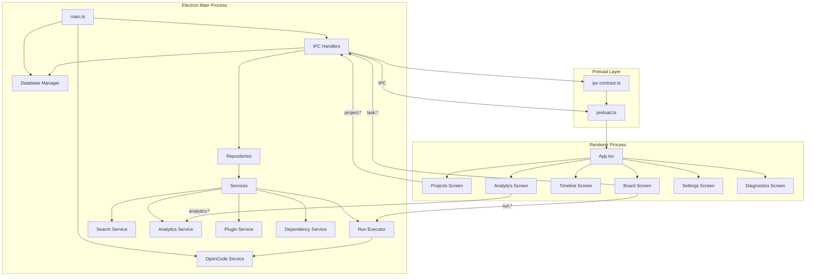
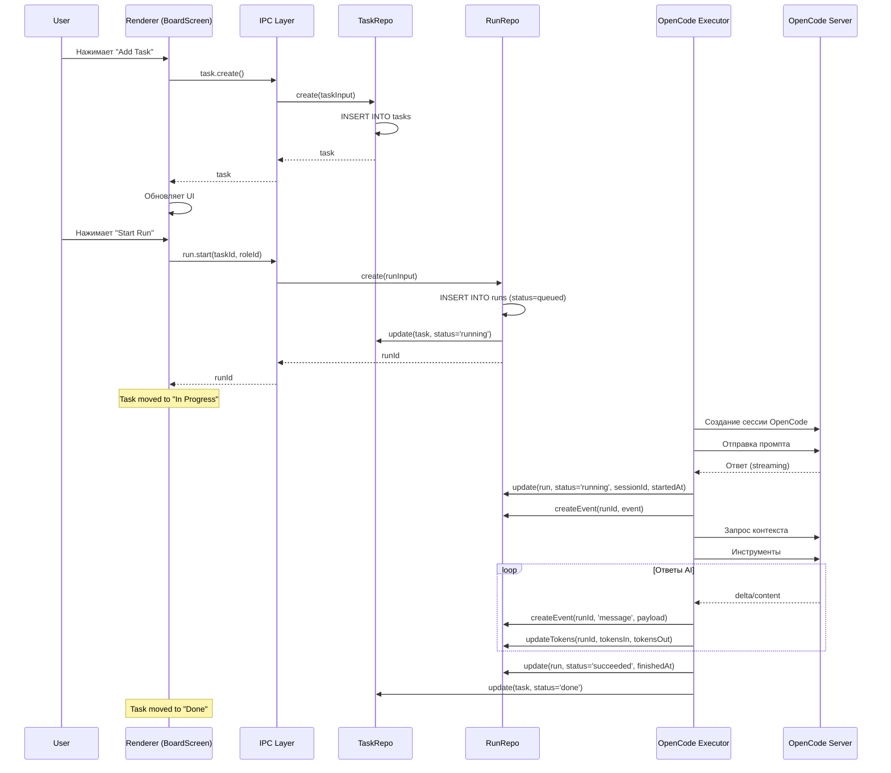
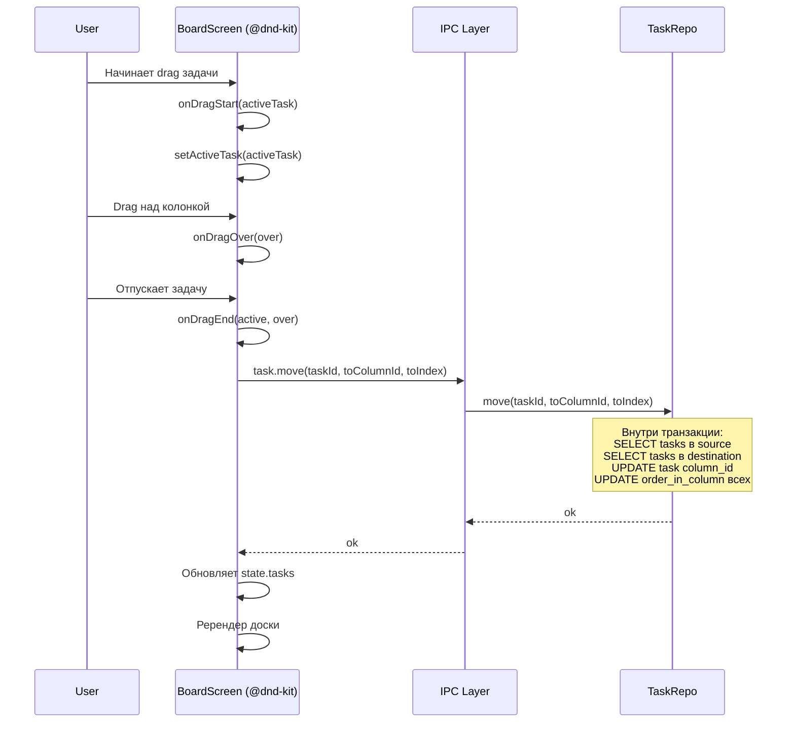
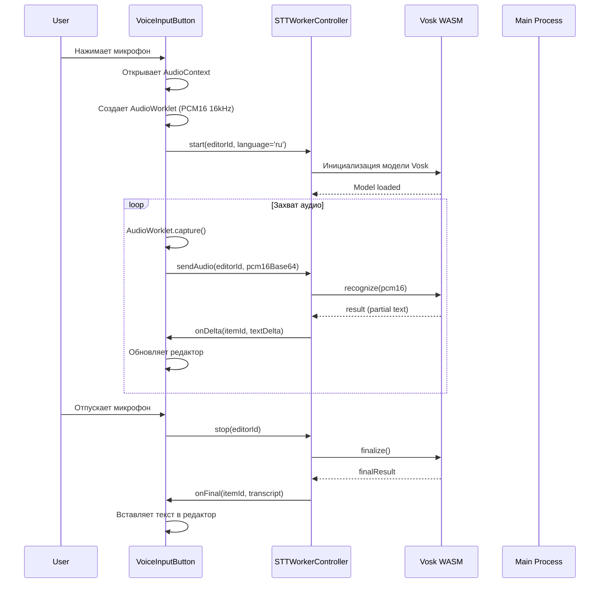

# Kanban AI - Архитектура проекта

## Обзор проекта

**Kanban AI** - это десктопное приложение на базе Electron для управления проектами с интеграцией Headless OpenCode и oh-my-opencode. Приложение предоставляет AI-оптимизированный канбан-подход к управлению задачами с поддержкой голосового ввода и автоматизации.

### Основные технологии

- **Frontend**: React 19.2.4 + TypeScript
- **Desktop**: Electron 40.0.0
- **Build Tool**: Vite + electron-vite
- **Database**: SQLite (better-sqlite3)
- **Styling**: Tailwind CSS 4.1.18
- **Validation**: Zod 4.3.6
- **Drag & Drop**: @dnd-kit (sortable core)
- **Voice**: vosk-browser (WASM Speech-to-Text)
- **AI Integration**: @opencode-ai/sdk/v2/client
- **Package Manager**: pnpm

### Фаза разработки

Проект находится в **Phase 0** - базовый каркас приложения с реализованным:

- ✅ Каркас Electron приложения
- ✅ React UI с горячей перезагрузкой
- ✅ IPC с валидацией через Zod
- ✅ SQLite локальное хранилище с миграциями
- ✅ SecretStore для безопасного хранения секретов
- ✅ Система логирования
- ✅ UI экраны (Projects, Board, Timeline, Analytics, Settings, Diagnostics)

---

## Структура проекта

```
kanban-ai/
├── docs/                           # Документация проекта
├── src/
│   ├── main/                        # Main process (Electron backend)
│   │   ├── analytics/               # Аналитика и метрики
│   │   ├── backup/                  # Экспорт/импорт проектов
│   │   ├── db/                      # Репозитории SQLite
│   │   ├── deps/                    # Управление зависимостями задач
│   │   ├── ipc/                     # IPC handlers + валидация
│   │   ├── log/                     # Система логирования
│   │   ├── plugins/                 # Плагин-система
│   │   ├── run/                     # Запуск AI-задач
│   │   ├── search/                  # Поиск по данным
│   │   ├── secrets/                 # Хранение секретов
│   │   ├── services/                # Бизнес-сервисы
│   │   ├── main.ts                  # Точка входа Electron
│   │   └── vosk-model-loader.ts    # Загрузка голосовых моделей
│   ├── preload/                      # Preload bridge (IPC)
│   │   ├── ipc-contract.ts           # Типы IPC контрактов
│   │   └── preload.ts               # Прокси API для renderer
│   ├── renderer/                     # React UI (Frontend)
│   │   ├── components/              # React компоненты
│   │   │   ├── kanban/             # Компоненты канбан доски
│   │   │   │   ├── board/        # Колонки и карточки
│   │   │   │   └── drawer/       # Боковая панель задачи
│   │   │   ├── chat/               # Чат UI
│   │   │   ├── common/             # Общие UI компоненты
│   │   │   ├── settings/           # Настройки
│   │   │   └── voice/             # Голосовой ввод
│   │   ├── screens/                # Экраны приложения
│   │   │   ├── ProjectsScreen.tsx
│   │   │   ├── BoardScreen.tsx
│   │   │   ├── TimelineScreen.tsx
│   │   │   ├── AnalyticsScreen.tsx
│   │   │   ├── SettingsScreen.tsx
│   │   │   └── DiagnosticsScreen.tsx
│   │   ├── App.tsx                  # Корневой компонент
│   │   ├── main.tsx                 # Точка входа React
│   │   └── types/                  # Типы renderer
│   └── shared/                       # Общие типы и утилиты
│       ├── lightmd/                 # Markdown рендерер
│       ├── opencode-status.ts        # Статусы OpenCode
│       └── types/                   # Shared типы (IPC)
├── electron-builder.config.ts         # Конфигурация сборки
├── electron.vite.config.ts           # Vite конфиг для Electron
├── vite.config.ts                   # Общая Vite конфигурация
├── tsconfig.json                    # TypeScript конфигурация
├── package.json                     # Зависимости проекта
└── pnpm-workspace.yaml              # Workspace конфиг
```

---

## Архитектурные слои

### 1. Electron Main Process (Backend)

**Точка входа**: `src/main/main.ts`

**Ответственность**:

- Запуск Electron приложения
- Инициализация окна браузера
- Запуск OpenCode сервера
- Регистрация IPC хендлеров

**Ключевые сервисы**:

#### OpenCode Service (`src/main/services/opencode-service.ts`)

- Управляет внешним процессом OpenCode сервера
- Проверяет статус сервера (health check)
- Логирует вывод OpenCode
- Graceful shutdown

**Методы**:

- `start()` - Запуск OpenCode на порту 4096
- `stop()` - Остановка сервера
- `shutdown()` - Graceful shutdown
- `isRunning()` - Проверка статуса

#### IPC Handlers (`src/main/ipc/handlers.ts`)

Централизованные обработчики IPC коммуникации (все зарегистрированы через `ipcHandlers.register()`):

**Категории IPC**:

| Категория        | Каналы                                                                                                                                                                                                      | Ответственность                   |
| ---------------- | ----------------------------------------------------------------------------------------------------------------------------------------------------------------------------------------------------------- | --------------------------------- |
| **app**          | `getInfo`, `openPath`                                                                                                                                                                                       | Информация о приложении           |
| **project**      | `selectFolder`, `create`, `getAll`, `getById`, `update`, `delete`                                                                                                                                           | CRUD проектов                     |
| **board**        | `getDefault`, `updateColumns`                                                                                                                                                                               | Управление досками                |
| **task**         | `create`, `listByBoard`, `update`, `move`, `delete`                                                                                                                                                         | CRUD задач + drag-drop            |
| **tag**          | `create`, `update`, `delete`, `list`                                                                                                                                                                        | Управление тегами                 |
| **deps**         | `list`, `add`, `remove`                                                                                                                                                                                     | Зависимости задач                 |
| **schedule**     | `get`, `update`                                                                                                                                                                                             | Расписание задач                  |
| **search**       | `query`                                                                                                                                                                                                     | Полнотекстовый поиск              |
| **analytics**    | `getOverview`, `getRunStats`                                                                                                                                                                                | Метрики и аналитика               |
| **run**          | `start`, `cancel`, `delete`, `listByTask`, `get`, `events:tail`                                                                                                                                             | Запуск AI задач                   |
| **artifact**     | `list`, `get`                                                                                                                                                                                               | Артефакты AI запусков             |
| **plugins**      | `list`, `install`, `enable`, `reload`                                                                                                                                                                       | Плагин-система                    |
| **roles**        | `list`                                                                                                                                                                                                      | Роли AI-агентов                   |
| **backup**       | `exportProject`, `importProject`                                                                                                                                                                            | Бэкап/восстановление              |
| **diagnostics**  | `getLogs`, `getLogTail`, `getSystemInfo`, `getDbInfo`                                                                                                                                                       | Диагностика                       |
| **appSetting**   | `getLastProjectId`, `setLastProjectId`, `getSidebarCollapsed`, `setSidebarCollapsed`                                                                                                                        | Настройки                         |
| **opencode**     | `listModels`, `refreshModels`, `toggleModel`, `updateModelDifficulty`, `generateUserStory`, `sendMessage`, `getSessionStatus`, `getActiveSessions`, `getSessionMessages`, `getSessionTodos`, `logProviders` | Интеграция с OpenCode             |
| **ohMyOpencode** | `readConfig`, `saveConfig`, `listPresets`, `loadPreset`, `savePreset`, `backupConfig`, `restoreConfig`                                                                                                      | Управление конфигурацией OpenCode |
| **stt**          | `downloadModel`                                                                                                                                                                                             | Загрузка голосовых моделей        |

#### IPC Validation (`src/main/ipc/validation.ts`)

Типобезопасная валидация IPC сообщений через Zod схему.

---

### 2. Preload Bridge (IPC Layer)

**Файл**: `src/preload/ipc-contract.ts`, `src/preload/preload.ts`

**Ответственность**:

- Контекстная изоляция (contextIsolation: true)
- Безопасная коммуникация Main ↔ Renderer
- Типизация IPC контрактов

**Структура контракта**:

```typescript
interface MainToRenderer {
  app: { getInfo(), openPath() }
  project: { selectFolder(), create(), getAll(), getById(), update(), delete() }
  board: { getDefault(), updateColumns() }
  task: { onEvent(), create(), listByBoard(), update(), move(), delete() }
  tag: { create(), update(), delete(), list() }
  deps: { list(), add(), remove() }
  schedule: { get(), update() }
  search: { query() }
  analytics: { getOverview(), getRunStats() }
  plugins: { list(), install(), enable(), reload() }
  roles: { list() }
  backup: { exportProject(), importProject() }
  diagnostics: { getLogs(), getLogTail(), getSystemInfo(), getDbInfo() }
  database: { delete() }
  run: { start(), cancel(), delete(), listByTask(), get(), events:tail() }
  events: { tail() }
  artifact: { list(), get() }
  appSetting: { getLastProjectId(), setLastProjectId(), getSidebarCollapsed(), setSidebarCollapsed() }
  opencode: { onEvent(), generateUserStory(), getSessionStatus(), getActiveSessions(), getSessionMessages(), getSessionTodos(), listModels(), refreshModels(), toggleModel(), updateModelDifficulty(), sendMessage(), logProviders() }
  ohMyOpencode: { readConfig(), saveConfig(), listPresets(), loadPreset(), savePreset(), backupConfig(), restoreConfig() }
  vosk: { downloadModel() }
  stt: { start(), stop(), setLanguage(), sendAudio() }
}
```

---

### 3. React Renderer (Frontend)

#### Приложение (`src/renderer/App.tsx`)

**Состояние**:

- `screen` - Текущий экран (projects, board, timeline, analytics, settings, diagnostics)
- `activeProject` - Выбранный проект
- `isSidebarCollapsed` - Состояние сайдбара
- `isSearchOpen` - Состояние поиска (Cmd/Ctrl+K)

**Навигация**:

- Projects → Board (при выборе проекта)
- Board → Timeline/Analytics (через сайдбар)
- Настройки → SettingsScreen

#### Экраны

##### ProjectsScreen (`src/renderer/screens/ProjectsScreen.tsx`)

- Список всех проектов
- Создание новых проектов
- Выбор папки проекта
- Выбор цвета проекта
- Переименование и удаление

##### BoardScreen (`src/renderer/screens/BoardScreen.tsx`)

**Функциональность**:

- Drag-and-drop карточек и колонок (@dnd-kit)
- Создание задач в колонке
- Редактирование/удаление колонок
- Drag-and-drop задач между колонками
- Изменение порядка задач в колонке

**Состояние**:

```typescript
{
  board: Board | null          // Доска проекта
  tasks: KanbanTask[]         // Задачи доски
  globalTags: Tag[]          // Глобальные теги
  activeTask: KanbanTask | null  // Выбранная задача
  selectedTask: KanbanTask | null // Задача для drawer
  drawerOpen: boolean         // Открыт ли drawer
  isColumnModalOpen: boolean // Модалка колонки
  editingColumnId: string | null
}
```

**Обработка событий**:

- `task:onEvent` - Подписка на изменения задач
- Drag start/end - Обработка DnD

##### TimelineScreen (`src/renderer/screens/TimelineScreen.tsx`)

- Представление задач в виде таймлайна
- Фильтрация по датам

##### AnalyticsScreen (`src/renderer/screens/AnalyticsScreen.tsx`)

- Метрики проекта:
  - WIP count
  - Throughput per day
  - Lead time
  - Cycle time
  - AI токены/стоимость

##### SettingsScreen (`src/renderer/screens/SettingsScreen.tsx`)

- Управление проектами
- Настройки OpenCode моделей
- Настройки плагинов
- Теги
- Бэкап и восстановление

##### DiagnosticsScreen (`src/renderer/screens/DiagnosticsScreen.tsx`)

- Просмотр логов приложения
- Системная информация
- Информация о базе данных

#### Компоненты

##### Канбан компоненты (`src/renderer/components/kanban/`)

**SortableColumn** - Сортируемая колонка

- Drag-over обработка
- Сортировка колонок

**SortableTask** - Сортируемая карточка задачи

- Drag-handle
- Отображение тегов, приоритета, статуса
- Иконка статуса

**TaskDrawer** - Боковая панель задачи

- Tabs: Details, Runs, Artifacts, Dependencies
- Редактирование свойств задачи
- Голосовой ввод (STT)

**ColumnModal** - Модальное окно колонки

- Создание/редактирование колонки
- Выбор цвета

**Компоненты настроек**

- ModelsManagement - Управление AI моделями
- TagManagement - Управление тегами
- BackupAndRestore - Бэкап проектов
- DangerZone - Опасные операции (удаление БД)
- OhMyOpencodeSettings - Настройки OpenCode конфига

**Компоненты голоса** (`src/renderer/voice/`)

- `STTWorkerController.ts` - Управление Vosk WASM
- `VoiceCapture.ts` - Захват аудио (PCM16 16kHz)
- `sttControllerSingleton.ts` - Singleton для переиспользования
- `VoiceInputButton.tsx` - Кнопка микрофона

**Общие компоненты**

- `Sidebar.tsx` - Навигация приложения
- `SearchModal.tsx` - Глобальный поиск (Cmd/Ctrl+K)
- `ModelPicker.tsx` - Выбор AI модели
- `PillSelect.tsx` - Select с визуальными пилями
- `LightMarkdown.tsx` - Markdown рендерер

---

## База данных (SQLite)

### Схема базы данных

#### Таблицы и их назначение

**1. projects**

- Хранение информации о проектах
- Поля: id, name, path, color, created_at, updated_at

**2. boards**

- Доски проектов (обычно 1 на проект)
- Поля: id, project_id, name, created_at, updated_at
- FK: project_id → projects(id) ON DELETE CASCADE

**3. board_columns**

- Колонки канбан доски
- Поля: id, board_id, name, order_index, wip_limit, color, created_at, updated_at
- FK: board_id → boards(id) ON DELETE CASCADE

**4. tasks**

- Задачи канбан доски
- Поля:
  - **core**: id, project_id, title, description, status, priority, difficulty, assigned_agent
  - **board placement**: board_id, column_id, order_in_column
  - **extended**: type, tags_json, description_md
  - **scheduling**: start_date, due_date, estimate_points, estimate_hours, assignee
  - **model assignment**: model_name
  - **timestamps**: created_at, updated_at
- FK: project_id, board_id, column_id

**5. tags**

- Глобальные теги
- Поля: id, name, color, created_at, updated_at
- UNIQUE(name)

**6. agent_roles**

- Роли AI агентов с пресетами
- Поля: id, name, description, preset_json, created_at, updated_at
- Seed данные: BA, DEV, QA, Merge Resolver, Release Notes

**7. context_snapshots**

- Снапшоты контекста для AI задач
- Поля: id, task_id, kind, summary, payload_json, hash, created_at
- FK: task_id → tasks(id) ON DELETE CASCADE

**8. runs**

- Запуски AI задач
- Поля: id, task_id, role_id, mode, kind, status, session_id, started_at, finished_at, error_text, budget_json, context_snapshot_id, ai_tokens_in, ai_tokens_out, ai_cost_usd, duration_sec, created_at, updated_at
- FK: task_id, role_id, context_snapshot_id

**9. run_events**

- События во время выполнения AI задачи
- Поля: id, run_id, ts, event_type, payload_json, message_id
- FK: run_id → runs(id) ON DELETE CASCADE

**10. artifacts**

- Артефакты (файлы, патчи, документы)
- Поля: id, run_id, kind, title, content, metadata_json, created_at
- FK: run_id → runs(id) ON DELETE CASCADE

**11. releases**

- Релизы (PM feature)
- Поля: id, project_id, name, status, target_date, notes_md, created_at, updated_at
- FK: project_id → projects(id) ON DELETE CASCADE

**12. release_items**

- Связи релиз-задача
- Поля: id, release_id, task_id, state, created_at, updated_at
- FK: release_id, task_id

**13. task_links**

- Зависимости задач
- Поля: id, project_id, from_task_id, to_task_id, link_type, created_at, updated_at
- FK: project_id, from_task_id, to_task_id

**14. task_schedule**

- Расписание задач
- Поля: task_id, start_date, due_date, estimate_points, estimate_hours, assignee, updated_at
- FK: task_id → tasks(id) ON DELETE CASCADE

**15. task_events**

- События задач (для логирования)
- Поля: id, task_id, ts, event_type, payload_json
- FK: task_id → tasks(id) ON DELETE CASCADE

**16. task_queue**

- Очередь задач TaskQueueManager
- Поля: task_id, state, stage, priority, enqueued_at, updated_at, last_error, locked_by, locked_until
- FK: task_id → tasks(id) ON DELETE CASCADE
- States: queued, running, waiting_user, paused, done, failed
- Stages: ba, fe, be, qa, kb

**17. role_slots**

- Слоты конкурентности ролей
- Поля: role_key, max_concurrency, updated_at
- Keys: ba, fe, be, qa

**18. resource_locks**

- Ресурсные блокировки (для конкурентного выполнения)
- Поля: lock_key, owner, acquired_at, expires_at

**19. plugins**

- Установленные плагины
- Поля: id, name, version, enabled, type, manifest_json, installed_at, updated_at

**20. opencode_models**

- Модели OpenCode
- Поля: name, enabled, difficulty, variants

**21. app_settings**

- Настройки приложения (key-value store)
- Поля: key, value, updated_at
- Keys: lastProjectId, sidebarCollapsed, defaultModel, ohMyOpencodePath

### Full-Text Search (FTS)

**Виртуальные таблицы FTS5**:

1. **tasks_fts** - Поиск по задачам
   - Индексируемые поля: title, description, tags
   - Триггеры: INSERT, UPDATE, DELETE

2. **runs_fts** - Поиск по запускам
   - Индексируемые поля: role_id, status, error_text
   - Триггеры: INSERT, UPDATE, DELETE

3. **run_events_fts** - Поиск по событиям
   - Индексируемые поля: event_type, payload
   - Триггеры: INSERT, UPDATE, DELETE

4. **artifacts_fts** - Поиск по артефактам
   - Индексируемые поля: title, content
   - Триггеры: INSERT, UPDATE, DELETE

### Индексы

**Оптимизирующие индексы**:

```sql
-- Задачи
idx_tasks_project_id
idx_tasks_status
idx_tasks_board_id
idx_tasks_column_id
idx_tasks_board_col (board_id, column_id, order_in_column)

-- Доски
idx_boards_project
idx_columns_board (board_id, order_index)

-- Запуски
idx_runs_task (task_id, created_at)
idx_events_run (run_id, ts)
idx_run_events_message (message_id)
idx_artifacts_run (run_id, created_at)

-- Зависимости
idx_links_from (from_task_id)
idx_links_to (to_task_id)
idx_links_project (project_id)

-- Очередь
idx_task_queue_state_prio (state, priority, updated_at)
idx_task_queue_stage_state (stage, state, priority)
```

---

## Репозитории (Data Access Layer)

### DatabaseManager (`src/main/db/index.ts`)

**Ответственность**:

- Соединение с SQLite
- Применение миграций
- Seed данных (agent_roles)
- Удаление БД

**Ключевые методы**:

```typescript
class DatabaseManager {
  connect(): Database.Database // Получить подключение (singleton)
  disconnect(): void // Закрыть подключение
  deleteDatabase(): void // Удалить файл БД

  private runMigrations(): void // Применить миграции
  private seedAgentRoles(): void // Загрузить дефолтные роли
}
```

### TaskRepository (`src/main/db/task-repository.ts`)

**CRUD операции**:

```typescript
class TaskRepository {
  create(input: CreateTaskInput): KanbanTask
  listByBoard(boardId: string): KanbanTask[]
  getById(taskId: string): KanbanTask | null
  update(id: string, patch: Partial<KanbanTask>): void
  move(taskId: string, toColumnId: string, toIndex: number): void
  delete(taskId: string): boolean
}
```

**Особенности**:

- Автоматическая установка модели по сложности
- Автоматический выбор колонки "In Progress" при запуске
- Переупорядочивание задач при DnD

### RunRepository (`src/main/db/run-repository.ts`)

**CRUD операции**:

```typescript
class RunRepository {
  create(input: CreateRunInput): RunRecord
  getById(runId: string): RunRecord | null
  listByTask(taskId: string): RunRecord[]
  listByStatus(status: RunRecord['status'], limit?: number): RunRecord[]
  update(runId: string, patch: Partial<RunRecord>): void
  delete(runId: string): void
}
```

**Поля RunRecord**:

- id, taskId, roleId, mode, kind, status
- startedAt, finishedAt, errorText
- budget (JSON)
- contextSnapshotId
- aiTokensIn, aiTokensOut, aiCostUsd, durationSec
- sessionId (OpenCode сессия)
- createdAt, updatedAt

**Статусы**: queued, running, succeeded, failed, canceled
**Modes**: plan-only, execute, critique
**Kinds**: task-run, task-description-improve

### Другие репозитории

- **ProjectRepository** - Управление проектами
- **BoardRepository** - Управление досками
- **TagRepository** - Управление тегами
- **AgentRoleRepository** - Управление ролями агентов
- **ArtifactRepository** - Управление артефактами
- **RunEventRepository** - События запусков
- **ContextSnapshotRepository** - Снапшоты контекста
- **OpencodeModelRepository** - Модели OpenCode
- **AppSettingsRepository** - Настройки приложения
- **TaskScheduleRepository** - Расписание задач
- **TaskLinkRepository** - Связи задач

---

## Сервисы

### OpencodeExecutor (`src/main/run/opencode-executor-sdk.ts`)

**Класс**: `OpenCodeExecutorSDK`

**Методы**:

```typescript
class OpenCodeExecutorSDK {
  // Генерация user story для задачи
  generateUserStory(taskId: string): Promise<string> // Возвращает runId

  // Запуск задачи через OpenCode SDK
  executeRun(runId: string): Promise<void>

  // Отмена выполнения
  cancelRun(runId: string): Promise<void>
}
```

### Dependency Service (`src/main/deps/dependency-service.ts`)

**Ответственность**:

- Управление зависимостями задач
- Валидация циклических зависимостей

**Методы**:

```typescript
class DependencyService {
  list(taskId: string): TaskLink[]
  add(link: { fromTaskId; toTaskId; type }): TaskLink
  remove(linkId: string): void
}
```

### Search Service (`src/main/search/search-service.ts`)

**Ответственность**:

- Полнотекстовый поиск (FTS)
- Поиск по задачам, запускам, артефактам

**Методы**:

```typescript
class SearchService {
  queryTasks(q: string, filters?: SearchFilters): TaskSearchResult[]
  queryRuns(q: string, filters?: SearchFilters): RunSearchResult[]
  queryArtifacts(q: string, filters?: SearchFilters): ArtifactSearchResult[]
}
```

### Analytics Service (`src/main/analytics/analytics-service.ts`)

**Метрики**:

```typescript
interface AnalyticsOverview {
  wipCount: number // Work in Progress
  throughputPerDay: number // Завершено в день
  doneCount: number // Всего завершено
  createdCount: number // Всего создано
  leadTimeHours: number // Lead Time (создание → завершение)
  cycleTimeHours: number // Cycle Time (старт → завершение)
  aiTokensIn: number // Входящие токены
  aiTokensOut: number // Исходящие токены
  aiCostUsd: number // Стоимость в $
}
```

### Plugin Service (`src/main/plugins/plugin-service.ts`)

**Ответственность**:

- Управление плагинами
- Загрузка манифестов
- Валидация разрешений

**Типы плагинов**:

- role - Регистрация новых ролей
- executor - Регистрация новых исполнителей
- integration - Интеграции с внешними сервисами
- ui - Дополнительные UI компоненты

---

## Mermaid диаграммы

### Архитектурная диаграмма



### Поток данных: Создание и выполнение задачи



### Поток данных: Drag-and-Drop задачи



### Поток данных: Голосовой ввод (STT)



### Диаграмма базы данных

```mermaid
erDiagram
    PROJECTS ||--o{ BOARDS : contains
    BOARDS ||--o{ BOARD_COLUMNS : has
    BOARD_COLUMNS ||--o{ TASKS : contains

    PROJECTS ||--o{ TASKS : owns
    TASKS ||--o{ TASK_LINKS : has
    TASKS }o--|| TASK_LINKS : blocked_by

    TASKS ||--o{ RUNS : generates
    AGENT_ROLES ||--o{ RUNS : executes
    RUNS ||--o{ RUN_EVENTS : produces
    RUNS ||--o{ ARTIFACTS : creates

    CONTEXT_SNAPSHOTS ||--o{ RUNS : provides_context
    TASKS ||--o{ CONTEXT_SNAPSHOTS : captures

    TASKS ||--o{ TASK_SCHEDULE : scheduled
    TASKS ||--o{ TASK_EVENTS : logs

    TASK_QUEUE ||--|| TASKS : queues

    PLUGINS }o--|| AGENT_ROLES : registers

    APP_SETTINGS ||--o{
        PROJECTS : last_project
    } : references

    TAGS }o--o{ TASKS : tags

    RELEASES ||--o{ PROJECTS : belongs_to
    RELEASE_ITEMS }o--o{ RELEASES : contains
    RELEASE_ITEMS ||--o{ TASKS : includes

    ROLE_SLOTS }o--o{ TASK_QUEUE : limits
    RESOURCE_LOCKS }o--o{ TASK_QUEUE : locks
```

---

## Конфигурация сборки

### electron-builder.config.ts

```typescript
export default {
  appId: 'com.kanbanai.app',
  productName: 'Kanban AI',
  directories: {
    output: 'dist',
    buildResources: 'build',
  },
  files: ['out/**'],
  mac: {
    category: 'public.app-category.productivity',
    target: ['default', 'arm64'],
  },
  win: {
    target: ['nsis', 'portable'],
  },
  linux: {
    target: ['AppImage', 'deb'],
    category: 'Utility',
  },
}
```

### Vite конфигурации

**electron.vite.config.ts** - Конфиг для main процесса

```typescript
export default defineConfig({
  main: {
    build: {
      rollupOptions: {
        input: electronMainEntry,
        output: {
          entryFileNames: '[name].mjs',
          format: 'esm',
        },
      },
    },
  },
  preload: {
    build: {
      rollupOptions: {
        input: electronPreloadEntry,
        output: {
          entryFileNames: '[name].mjs',
          format: 'esm',
        },
      },
    },
  },
})
```

---

## Quality Gates

### Скрипты package.json

```json
{
  "dev": "npm run rebuild:electron && electron-vite dev",
  "build": "electron-vite build",
  "typecheck": "tsc --noEmit",
  "lint": "eslint src --ext .ts,.tsx",
  "lint:fix": "eslint src --ext .ts,.tsx --fix",
  "format": "prettier --write \"src/**/*.{ts,tsx,js,jsx,json,css,md}\"",
  "format:check": "prettier --check \"src/**/*.{ts,tsx,js,jsx,json,css,md}\"",
  "test": "npm run rebuild:node && vitest",
  "test:run": "npm run rebuild:node && vitest run",
  "test:coverage": "npm run rebuild:node && vitest run --coverage",
  "quality": "pnpm typecheck && pnpm lint && pnpm format:check && pnpm test:run",
  "rebuild:electron": "electron-rebuild -f -w better-sqlite3",
  "rebuild:node": "cd node_modules/.pnpm/better-sqlite3@12.6.2/node_modules/better-sqlite3 && npm run install"
}
```

---

## Безопасность

### IPC Безопасность

- **Context Isolation**: Включен (`contextIsolation: true`)
- **Node Integration**: Отключен (`nodeIntegration: false`)
- **Sandbox**: Отключен для preload (требуется для native модулей)
- **Validation**: Все IPC сообщения валидируются через Zod схемы

### Хранение секретов

**SecretStore** (`src/main/secrets/`):

- Использует `app.getSafeStorage()` когда доступно
- Fallback на mock-хранение в development
- Хранит только API ключи и конфиденциальные данные

---

## Интеграции

### OpenCode SDK (`@opencode-ai/sdk/v2/client`)

**Использование**:

```typescript
const client = createOpencodeClient({
  baseUrl: process.env.OPENCODE_URL || 'http://127.0.0.1:4096',
  throwOnError: true,
  directory: projectPath, // Важно для корректного projectId
})
```

**Функции**:

- Создание сессий
- Отправка сообщений
- Получение ответов (streaming)
- Управление todo

### Vosk (Speech-to-Text)

**Архитектура**:

- AudioWorklet (PCM16 16kHz) → Renderer
- STTWorkerController (singleton) → Управление Vosk
- Vosk WASM → model + recognizer

**Модели**:

- Русский: `vosk-model-small-ru-0.22.zip`
- Английский: `vosk-model-small-en-us-0.15.zip`

**Кеширование**:

- Скачивается в `~/Library/Application Support/kanban-ai/vosk-models/`
- Передается как base64 через IPC
- Создается `blob:` URL

---

## Troubleshooting

### Native модули (better-sqlite3)

**Проблема**: Разные версии Node.js для Electron и тестов

**Решение**: Автоматический rebuild перед запуском

```bash
# Dev (Electron)
pnpm dev  # → rebuild:electron

# Tests (System Node)
npm test  # → rebuild:node
```

### Electron binary

**Проблема**: Бинарник не устанавливается

**Решение**:

```bash
rm -rf node_modules/.pnpm/electron@*
pnpm install --force electron@40.0.0
EPOCH=$(date +%s) node node_modules/.pnpm/electron@40.0.0/node_modules/electron/install.js
```

### OpenCode сессии

**Проблема**: NotFoundError в другом проекте

**Решение**: Передавать `directory` при создании клиента

```typescript
createOpencodeClient({
  baseUrl,
  throwOnError: true,
  directory: projectPath, // Обязательно!
})
```

---

## Следующие фазы

Планируемые улучшения:

1. **Git Integration**
   - Clone репозиториев
   - Git status
   - Branch-per-task
   - Коммиты через OpenCode

2. **AI Agents**
   - Sisyphus (оркестратор)
   - Oracle (консультант)
   - Librarian (референсы)

3. **PR Workflow**
   - Автоматизация через OpenCode
   - Review боты

4. **Улучшения канбан доски**
   - Swimlanes
   - Фильтры и группировка
   - Горячие клавиши

---

## Лицензия

MIT
