# Архитектура Kanban AI

> Дата: 20 февраля 2026  
> Версия: 1.0

## Содержание

1. [Обзор системы](#1-обзор-системы)
2. [Технологический стек](#2-технологический-стек)
3. [Структура проекта](#3-структура-проекта)
4. [Архитектурные слои](#4-архитектурные-слои)
5. [Менеджеры](#5-менеджеры)
6. [Сервисы](#6-сервисы)
7. [Репозитории](#7-репозитории)
8. [Потоки данных](#8-потоки-данных)
9. [API Reference](#9-api-reference)
10. [Workflow задач](#10-workflow-задач)
11. [Интеграция OpenCode](#11-интеграция-opencode)

---

## 1. Обзор системы

Kanban AI — веб-приложение для управления проектами с интеграцией Headless OpenCode для автоматизации задач с помощью AI-агентов.

### Ключевые возможности

- **Kanban-доска**: Визуальное управление задачами с drag-and-drop
- **AI-агенты**: Автоматическое выполнение задач через OpenCode
- **Real-time обновления**: SSE для мгновенных обновлений UI
- **Workflow Engine**: Автоматические переходы статусов задач

### Диаграмма высокого уровня

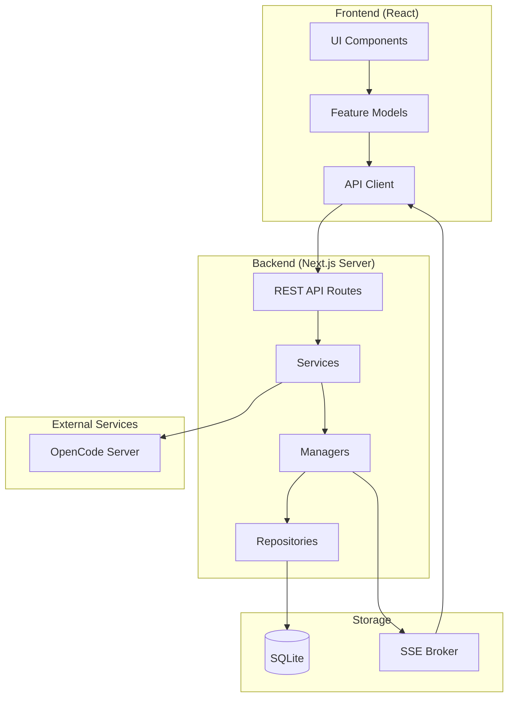

---

## 2. Технологический стек

| Категория | Технология | Версия |
|-----------|------------|--------|
| Framework | Next.js | 14+ (App Router) |
| UI | React | 18+ |
| Language | TypeScript | 5.x |
| Database | SQLite (better-sqlite3) | - |
| Real-time | Server-Sent Events (SSE) | - |
| AI Integration | @opencode-ai/sdk | v2 |
| Styling | Tailwind CSS | - |
| Drag & Drop | @dnd-kit | - |
| Build | pnpm + Turbopack | - |

---

## 3. Структура проекта

```
packages/next-js/
├── src/
│   ├── app/                    # Next.js App Router
│   │   ├── api/               # REST API routes (42 endpoint'а)
│   │   ├── (routes)/          # Page components
│   │   └── layout.tsx         # Root layout
│   │
│   ├── server/                 # Backend logic
│   │   ├── db/                # Database manager & migrations
│   │   ├── events/            # SSE broker
│   │   ├── opencode/          # OpenCode integration
│   │   ├── repositories/      # Data access layer
│   │   ├── run/               # Run management
│   │   └── workflow/          # Workflow engine
│   │
│   ├── lib/                    # Shared utilities
│   │   ├── api-client.ts      # Client-side API wrapper
│   │   ├── logger.ts          # Structured logging
│   │   └── utils.ts           # Helpers
│   │
│   ├── components/             # React components
│   │   ├── kanban/            # Kanban board
│   │   ├── settings/          # Settings pages
│   │   └── common/            # Shared components
│   │
│   ├── features/               # Feature-based modules
│   │   ├── board/model/       # Board state management
│   │   └── task/model/        # Task state management
│   │
│   └── types/                  # TypeScript types
│       ├── ipc.ts             # Shared types
│       └── kanban.ts          # Domain types
│
├── prisma/                     # Schema (if used)
└── package.json
```

---

## 4. Архитектурные слои

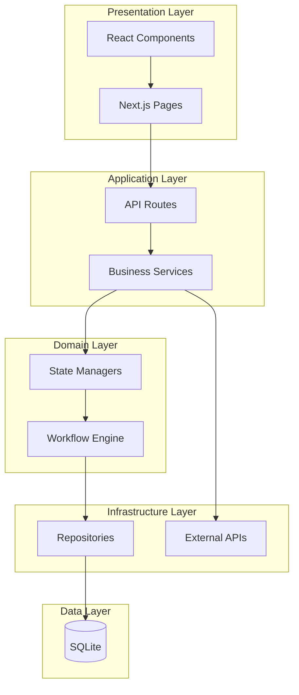

### Ответственность слоёв

| Слой | Компоненты | Ответственность |
|------|------------|-----------------|
| Presentation | Components, Pages | UI, User interactions |
| Application | API Routes, Services | HTTP handling, Orchestration |
| Domain | Managers, Workflow | Business rules, State machines |
| Infrastructure | Repositories, External | Data access, External integrations |
| Data | SQLite | Persistence |

---

## 5. Менеджеры

### 5.1 RunsQueueManager

**Файл**: `server/run/runs-queue-manager.ts`

**Назначение**: Управление очередью AI-выполнений с ограничением конкурентности.

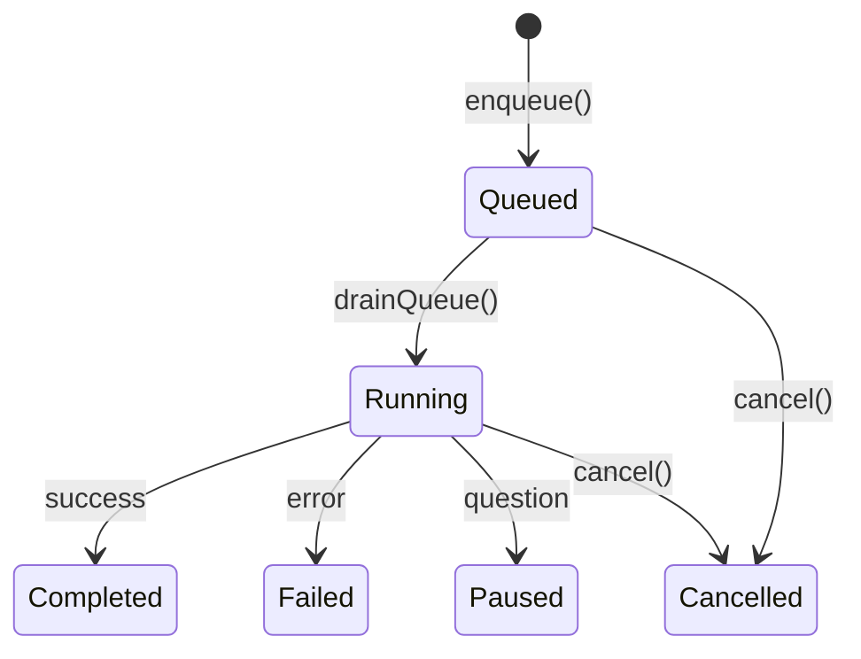

#### Внутреннее состояние

| Поле | Тип | Описание |
|------|-----|----------|
| `providerQueues` | `Map<string, string[]>` | Очереди по провайдерам |
| `providerRunning` | `Map<string, Set<string>>` | Активные выполнения |
| `runInputs` | `Map<string, QueuedRunInput>` | Входные данные run |
| `sessionSubscribers` | `Map<string, string>` | Подписки на сессии |

#### Ключевые методы

```typescript
class RunsQueueManager {
  // Добавить run в очередь
  enqueue(runId: string, input: QueuedRunInput): void
  
  // Отменить выполнение
  async cancel(runId: string): Promise<void>
  
  // Статистика очереди
  getQueueStats(): QueueStats
  
  // Внутренние методы
  private drainQueue(): Promise<void>
  private executeRun(runId: string): Promise<void>
  private handleSessionEvent(runId: string, event: SessionEvent): Promise<void>
}
```

#### Конфигурация конкурентности

```bash
# .env
RUNS_DEFAULT_CONCURRENCY=1           # Дефолт для всех провайдеров
RUNS_PROVIDER_CONCURRENCY=openai:3,anthropic:2  # Override по провайдерам
```

#### Формирование provider key

```
providerKey = provider:model (если указаны в preset)
           | provider (если только provider)
           | model:modelName (если только model)
           | role:roleId (fallback)
```

---

### 5.2 OpencodeSessionManager

**Файл**: `server/opencode/session-manager.ts`

**Назначение**: Управление сессиями OpenCode, сообщениями и событиями.

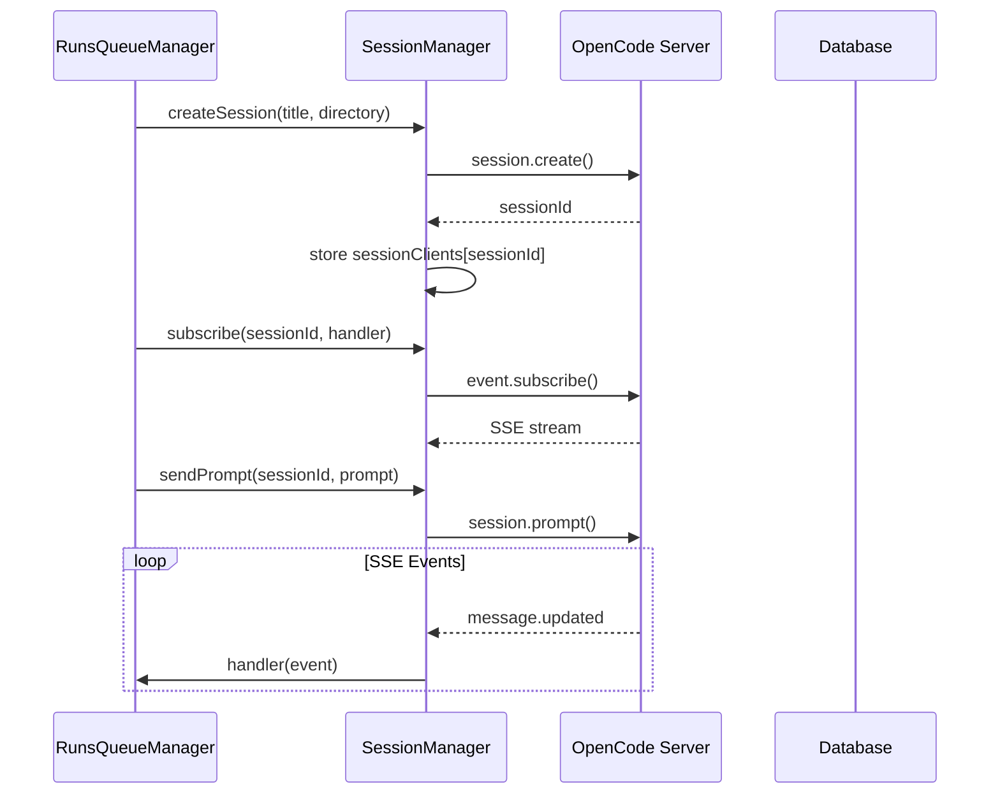

#### Ключевые методы

```typescript
class OpencodeSessionManager {
  // Создать сессию
  async createSession(title: string, directory: string): Promise<string>
  
  // Отправить промпт
  async sendPrompt(sessionId: string, prompt: string): Promise<void>
  
  // Получить сообщения
  async getMessages(sessionId: string, limit?: number): Promise<OpenCodeMessage[]>
  
  // Получить todos
  async getTodos(sessionId: string): Promise<OpenCodeTodo[]>
  
  // Подписаться на события
  async subscribe(sessionId: string, subscriberId: string, handler: Subscriber): Promise<void>
  
  // Отписаться
  async unsubscribe(sessionId: string, subscriberId: string): Promise<void>
  
  // Прервать сессию
  async abortSession(sessionId: string): Promise<void>
}
```

#### Типы событий

| Тип | Описание | Payload |
|-----|----------|---------|
| `message.updated` | Сообщение создано/обновлено | `{sessionId, message}` |
| `message.part.updated` | Часть сообщения обновлена | `{sessionId, messageId, part, delta?}` |
| `message.removed` | Сообщение удалено | `{sessionId, messageId}` |
| `todo.updated` | Todo-лист обновлён | `{sessionId, todos[]}` |
| `error` | Ошибка | `{sessionId, error}` |

---

### 5.3 DatabaseManager

**Файл**: `server/db/DatabaseManager.ts`

**Назначение**: Управление SQLite соединением, миграциями и сидингом.

#### Жизненный цикл

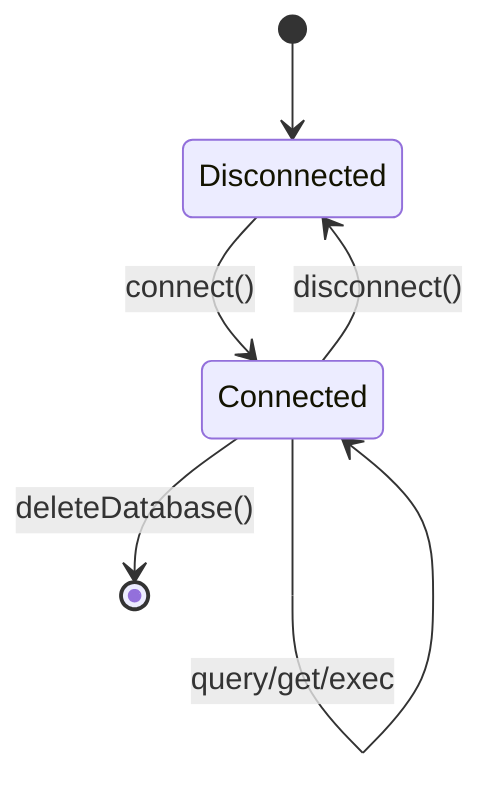

#### Миграции

```typescript
interface Migration {
  version: number;
  sql: string;
}

// Автоматическое применение
runMigrations(): void {
  const currentVersion = db.prepare("SELECT MAX(version) FROM schema_migrations").get();
  for (const migration of migrations) {
    if (migration.version > currentVersion) {
      db.exec(migration.sql);
      db.prepare("INSERT INTO schema_migrations (version) VALUES (?)").run(migration.version);
    }
  }
}
```

#### Seed ролей агентов

| ID | Name | Description |
|----|------|-------------|
| `ba` | BA | Business Analyst |
| `dev` | DEV | Developer |
| `qa` | QA | Quality Assurance |
| `merge-resolver` | Merge Resolver | Resolve merge conflicts |
| `release-notes` | Release Notes | Summarize changes |

---

### 5.4 TaskWorkflowManager

**Файл**: `server/workflow/task-workflow-manager.ts`

**Назначение**: State machine для workflow задач на Kanban-доске. Конфигурация workflow **хранится в базе данных** и загружается при инициализации.

#### Архитектура хранения workflow

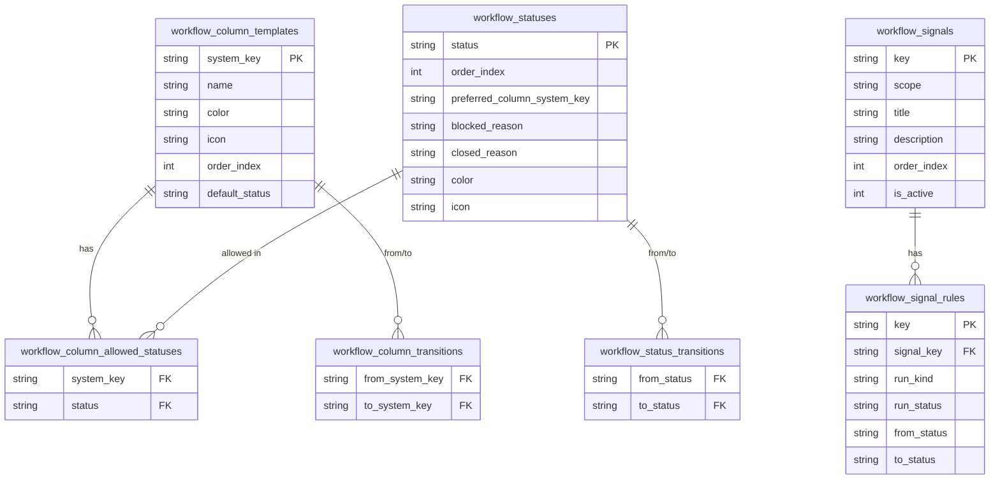

#### Workflow колонки (по умолчанию)

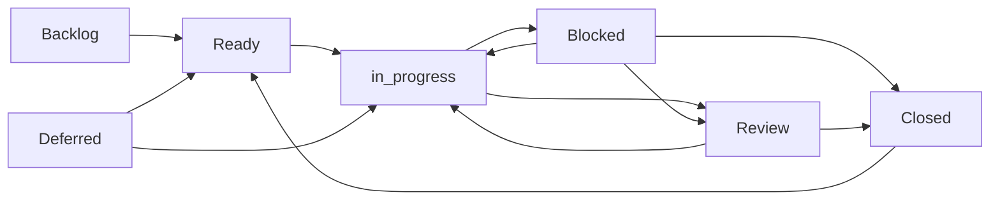

#### Дефолтные статусы

> **Важно**: `WorkflowTaskStatus = string` — динамический тип, статусы определяются конфигурацией в БД.

| Status | Preferred Column | Blocked Reason | Closed Reason | Color | Icon |
|--------|------------------|----------------|---------------|-------|------|
| pending | ready | - | - | 🔵 #64748b | clock |
| running | in_progress | - | - | 🔵 #3b82f6 | play |
| generating | in_progress | - | - | 🟣 #8b5cf6 | sparkles |
| question | blocked | question | - | 🟠 #f97316 | help-circle |
| paused | blocked | paused | - | 🟡 #eab308 | pause |
| failed | blocked | failed | failed | 🔴 #ef4444 | x-circle |
| done | review | - | done | 🟢 #10b981 | check-circle |

#### Разрешённые статусы по колонкам

| Column | Allowed Statuses |
|--------|-----------------|
| backlog | pending |
| ready | pending |
| deferred | pending |
| in_progress | running, generating |
| blocked | question, paused, failed |
| review | done |
| closed | done, failed |

#### Signals (триггеры автоматических переходов)

Workflow поддерживает сигналы для автоматических переходов статусов:

| Scope | Signals Count | Examples |
|-------|---------------|----------|
| run | 11 | run_started, run_completed, run_failed, run_question |
| user_action | 13 | task_reopened, task_closed, task_moved_to_column |

#### Ключевые функции

```typescript
interface WorkflowConfig {
  statuses: WorkflowStatusConfig[];
  columns: WorkflowColumnConfig[];
  statusTransitions: StatusTransition[];
  columnTransitions: ColumnTransition[];
  signals: WorkflowSignalConfig[];
  signalRules: WorkflowSignalRuleConfig[];
}

// Загрузка конфигурации из БД
function loadWorkflowConfigFromDb(db: Database): WorkflowConfig

// Проверка возможности перехода
function canTransitionStatus(from: TaskStatus, to: TaskStatus): boolean
function canTransitionColumn(from: WorkflowColumnSystemKey, to: WorkflowColumnSystemKey): boolean

// Определение причин блокировки/закрытия
function getBlockedReasonForStatus(status: TaskStatus): BlockedReason | null
function getClosedReasonForStatus(status: TaskStatus): ClosedReason | null

// Определение предпочтительной колонки
function getPreferredColumnIdForStatus(board: Board, status: TaskStatus): string | null
```

---

### 5.5 RunTaskProjector

**Файл**: `server/run/run-task-projector.ts`

**Назначение**: Проекция результатов run на обновления задач.

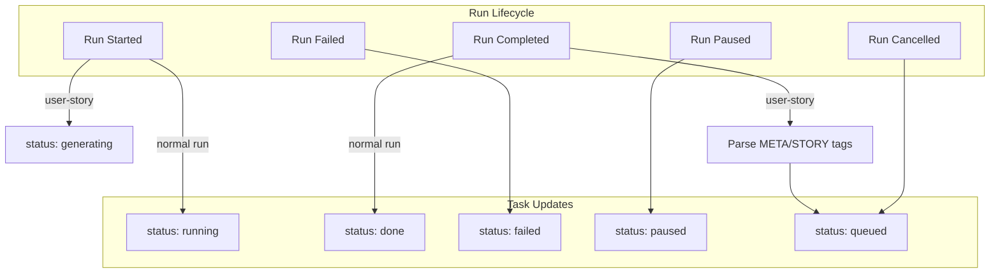

#### Парсинг User Story

```html
<META>
{
  "tags": ["frontend", "api"],
  "type": "feature",
  "difficulty": "medium"
}
</META>

<STORY>
## Название
Implement user authentication

As a user I want to log in...
</STORY>
```

---

## 6. Сервисы

### 6.1 RunService

**Файл**: `server/run/run-service.ts`

**Назначение**: Бизнес-логика для управления run'ами.

```typescript
class RunService {
  // Запустить задачу
  async start(input: StartRunInput): Promise<{ runId: string }>
  
  // Сгенерировать User Story
  async generateUserStory(taskId: string): Promise<{ runId: string }>
  
  // Получить runs задачи
  listByTask(taskId: string): Run[]
  
  // Отменить run
  async cancel(runId: string): Promise<void>
  
  // Удалить run
  async delete(runId: string): Promise<void>
  
  // Статистика очереди
  getQueueStats(): QueueStats
}
```

#### Flow запуска run

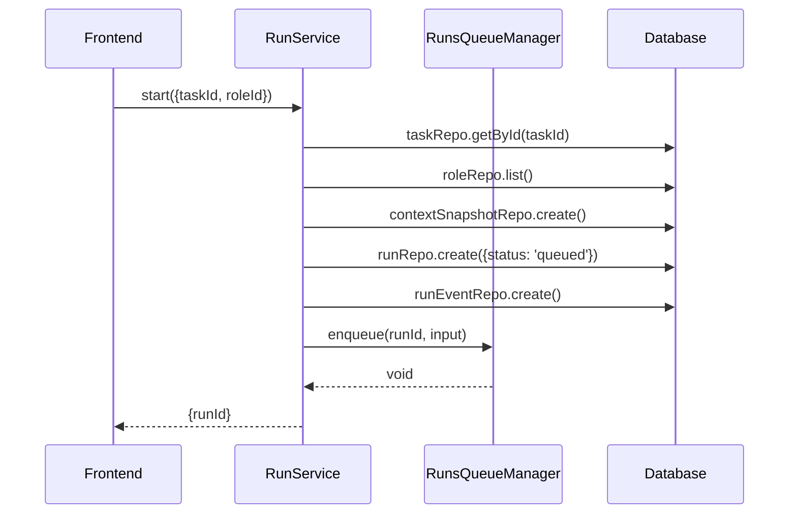

### 6.2 OpencodeService

**Файл**: `server/opencode/opencode-service.ts`

**Назначение**: Управление процессом `opencode serve`.

```typescript
class OpencodeService {
  // Запустить/проверить сервер
  async start(): Promise<void>
  
  // Остановить сервер
  async stop(): Promise<void>
  
  // Проверить доступность
  async isRunning(port?: number): Promise<boolean>
  
  // Найти существующий процесс
  async findRunningOpenCode(): Promise<number | null>
  
  // Получить порт
  getPort(): number
  
  // Внешний процесс?
  isExternal(): boolean
}
```

#### Логика запуска

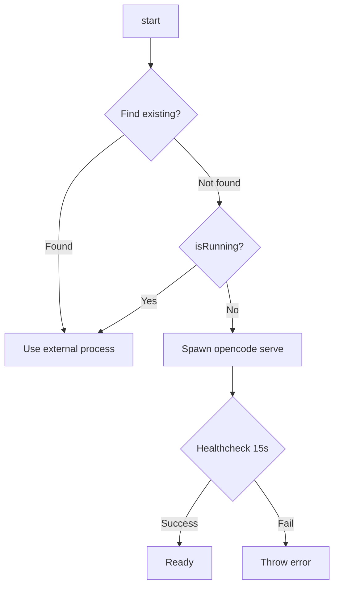

---

## 7. Репозитории

### Обзор

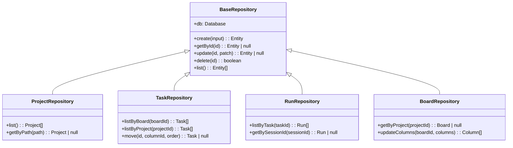

### Перечень репозиториев

| Репозиторий | Файл | Сущность |
|-------------|------|----------|
| `projectRepo` | `repositories/project.ts` | Project |
| `taskRepo` | `repositories/task.ts` | Task |
| `boardRepo` | `repositories/board.ts` | Board, BoardColumn |
| `runRepo` | `repositories/run.ts` | Run |
| `runEventRepo` | `repositories/run-event.ts` | RunEvent |
| `artifactRepo` | `repositories/artifact.ts` | Artifact |
| `roleRepo` | `repositories/role.ts` | AgentRole |
| `taskLinkRepo` | `repositories/task-link.ts` | TaskLink |
| `contextSnapshotRepo` | `repositories/context-snapshot.ts` | ContextSnapshot |
| `appSettingsRepo` | `repositories/app-settings.ts` | AppSetting |

---

## 8. Потоки данных

### 8.1 Создание и выполнение задачи

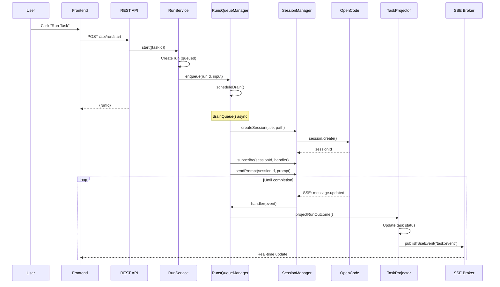

### 8.2 Real-time обновления

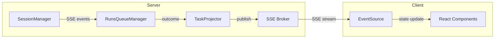

### 8.3 SSE Broker

```typescript
// server/events/sse-broker.ts

type SseListener = (channel: string, payload: unknown) => void;

const listeners = new Map<string, SseListener>();

export function subscribeSse(listenerId: string, listener: SseListener): () => void {
  listeners.set(listenerId, listener);
  return () => listeners.delete(listenerId);
}

export function publishSseEvent(channel: string, payload: unknown): void {
  for (const listener of listeners.values()) {
    listener(channel, payload);
  }
}
```

#### Каналы SSE

| Канал | Событие | Payload |
|-------|---------|---------|
| `run:event` | Обновление run | `{runId, status, ...}` |
| `task:event` | Обновление task | `{taskId, boardId, updatedAt}` |

---

## 9. API Reference

### Структура API routes

```
/api
├── /projects                    # CRUD проектов
│   └── /[id]
├── /tasks                       # CRUD задач
│   └── /[id]
│       └── /move               # Перемещение задачи
├── /boards
│   └── /project/[id]           # Board по проекту
│   └── /[id]/columns           # Обновление колонок
├── /run
│   ├── /start                  # Запустить run
│   ├── /cancel                 # Отменить
│   ├── /delete                 # Удалить
│   ├── /get                    # Получить по ID
│   ├── /listByTask             # Список по задаче
│   └── /queueStats             # Статистика очереди
├── /opencode
│   ├── /generate-user-story    # Генерация User Story
│   ├── /models                 # Управление моделями
│   │   ├── /toggle
│   │   ├── /difficulty
│   │   ├── /refresh
│   │   ├── /enabled
│   │   └── /config
│   ├── /restart
│   └── /sessions/[sessionId]
│       ├── /messages
│       └── /todos
├── /tags                        # CRUD тегов
│   └── /[id]
├── /deps                        # Зависимости задач
│   └── /[linkId]
├── /roles/list                  # Список ролей
├── /artifact
│   ├── /list
│   └── /get
├── /omc                         # Oh-My-OpenCode config
│   ├── /presets
│   ├── /backup
│   └── /restore
├── /browse                      # File system browser
├── /filesystem/exists
├── /app-settings
├── /database/delete
├── /schema                      # JSON Schema fetch
└── /app/open-path              # Open path in OS
```

### Примеры запросов

#### Запуск задачи

```http
POST /api/run/start
Content-Type: application/json

{
  "taskId": "task_abc123",
  "roleId": "dev",
  "mode": "execute"
}

Response: { "runId": "run_xyz789" }
```

#### Получение статистики очереди

```http
GET /api/run/queueStats

Response: {
  "totalQueued": 5,
  "totalRunning": 2,
  "providers": [
    {"providerKey": "openai:gpt-4", "queued": 3, "running": 1, "concurrency": 2},
    {"providerKey": "anthropic:claude-3", "queued": 2, "running": 1, "concurrency": 1}
  ]
}
```

---

## 10. Workflow задач

### 10.1 Диаграмма состояний задачи

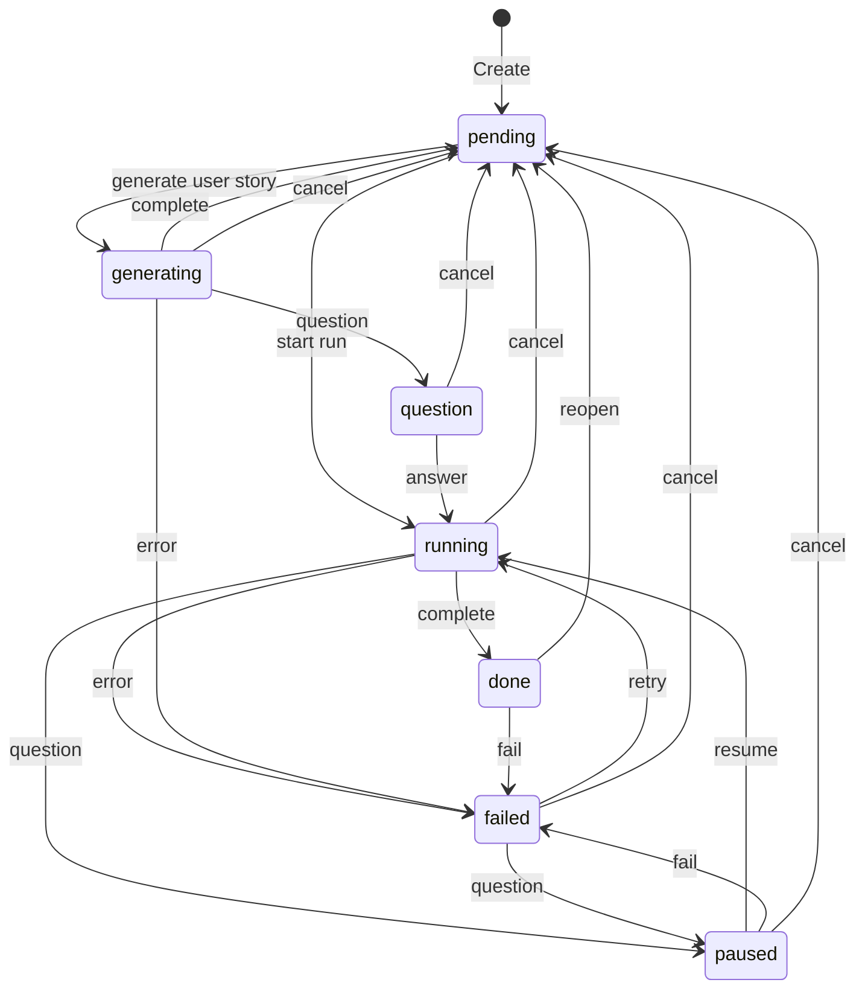

### 10.2 Таблица переходов статусов

| From | To | Trigger |
|------|-----|---------|
| pending | running | RunService.start() |
| pending | generating | RunService.generateUserStory() |
| running | done | OpenCode completes |
| running | failed | OpenCode errors |
| running | paused | OpenCode asks question |
| paused | running | Resume from pause |
| done | pending | Reopen task |
| failed | running | Retry |

### 10.3 Маппинг статус → UI колонка

| Status | Column | UI Color | Icon |
|--------|--------|----------|------|
| pending | Ready | 🔵 Blue | Clock |
| running | In Progress | 🟡 Yellow | Loader |
| generating | In Progress | 🟡 Yellow | Sparkles |
| question | Blocked | 🔴 Red | HelpCircle |
| paused | Blocked | 🔴 Red | Pause |
| failed | Blocked | 🔴 Red | XCircle |
| done | Review | 🟢 Green | CheckCircle |

---

## 11. Интеграция OpenCode

### 11.1 Архитектура

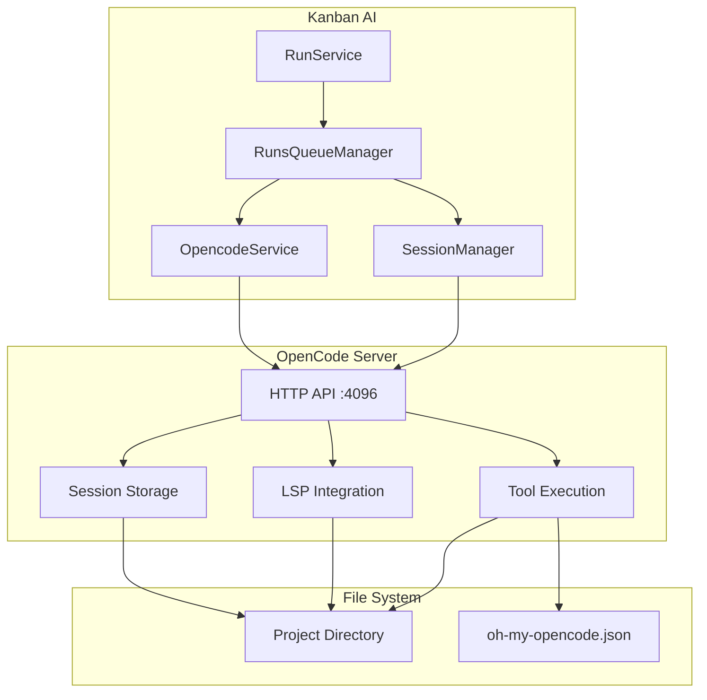

### 11.2 SDK Client

```typescript
import { createOpencodeClient } from '@opencode-ai/sdk/v2/client';

const client = createOpencodeClient({
  baseUrl: 'http://127.0.0.1:4096',
  throwOnError: true,
  directory: '/path/to/project',  // Важно! Определяет projectId
});

// API методы
client.session.create({ title, directory })
client.session.prompt({ sessionID, parts })
client.session.messages({ sessionID, limit })
client.session.todo({ sessionID })
client.session.abort({ sessionID })
client.event.subscribe({ directory, signal })
```

### 11.3 Обработка статусов OpenCode

```typescript
// Парсинг статуса из ответа ассистента
function mapOpencodeStatusToRunStatus(text: string): RunStatus | null {
  const parsed = extractOpencodeStatus(text);
  if (!parsed) return null;
  
  switch (parsed.status) {
    case 'done':     return 'completed';
    case 'fail':     return 'failed';
    case 'question': return 'paused';
    default:         return null;
  }
}
```

### 11.4 Промпты

#### Task Execution Prompt

```typescript
// server/run/prompts/task.ts
export function buildTaskPrompt(task: {title, description}, project: {id, path}): string {
  return `
# Task: ${task.title}

## Description
${task.description}

## Project Context
- Project ID: ${project.id}
- Project Path: ${project.path}

## Instructions
Execute this task using the available tools.
When complete, output a status marker: [STATUS: done] or [STATUS: fail]
  `.trim();
}
```

#### User Story Generation Prompt

```typescript
// server/run/prompts/user-story.ts
export function buildUserStoryPrompt(
  task: {title, description, tags, type, difficulty},
  project: {id, name, path},
  options: {availableTags, availableTypes, availableDifficulties}
): string {
  return `
# Generate User Story

## Task Title
${task.title}

## Current Description
${task.description}

## Output Format
<META>
{
  "tags": ["tag1", "tag2"],
  "type": "feature|bug|chore|improvement|task",
  "difficulty": "easy|medium|hard|epic"
}
</META>

<STORY>
## Название
[Title]

[User story content...]
</STORY>
  `.trim();
}
```

---

## Приложение A: Диаграмма базы данных

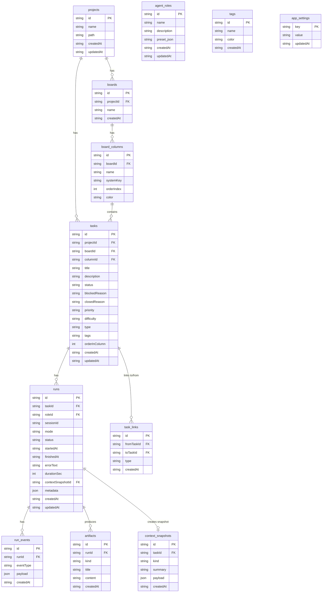

---

## Приложение B: Типы данных

### TaskStatus

```typescript
type TaskStatus = 
  | 'queued'      // Готова к выполнению
  | 'running'     // Выполняется
  | 'generating'  // Генерация User Story
  | 'question'    // Вопрос от AI
  | 'paused'      // Приостановлена
  | 'done'        // Завершена
  | 'failed';     // Ошибка
```

### RunStatus

```typescript
type RunStatus = 
  | 'queued'      // В очереди
  | 'running'     // Выполняется
  | 'completed'   // Успешно завершён
  | 'failed'      // Ошибка
  | 'paused'      // Приостановлен
  | 'cancelled'   // Отменён
  | 'timeout';    // Таймаут
```

### WorkflowColumnSystemKey

```typescript
type WorkflowColumnSystemKey =
  | 'backlog'     // Бэклог
  | 'ready'       // Готово к выполнению
  | 'deferred'    // Отложено
  | 'in_progress' // В работе
  | 'blocked'     // Заблокировано
  | 'review'      // На ревью
  | 'closed';     // Закрыто
```

### BlockedReason

```typescript
type BlockedReason =
  | 'question'    // Ожидает ответа
  | 'paused'      // Приостановлено
  | 'failed';     // Ошибка выполнения
```

### ClosedReason

```typescript
type ClosedReason =
  | 'done'        // Выполнено
  | 'failed';     // Провалено
```

---

## Приложение C: Конфигурация

### Переменные окружения

| Переменная | По умолчанию | Описание |
|------------|-------------|----------|
| `RUNS_DEFAULT_CONCURRENCY` | `1` | Дефолтная конкурентность |
| `RUNS_PROVIDER_CONCURRENCY` | - | Override по провайдерам |
| `OPENCODE_URL` | `http://127.0.0.1:4096` | URL OpenCode сервера |
| `DATABASE_PATH` | `./data/kanban.db` | Путь к SQLite |

### oh-my-opencode.json

```json
{
  "model": {
    "provider": "openai",
    "name": "gpt-4"
  },
  "llm": {
    "temperature": 0.7,
    "maxTokens": 4096
  },
  "output": "markdown",
  "template": "Custom output template..."
}
```

---

*Документ сгенерирован автоматически на основе анализа кодовой базы.*
