# Data Flow Diagrams for Testing

> Reference: [ARCHITECTURE.md](./ARCHITECTURE.md) for component details

## 1. System Data Flow Overview

### High-Level Architecture

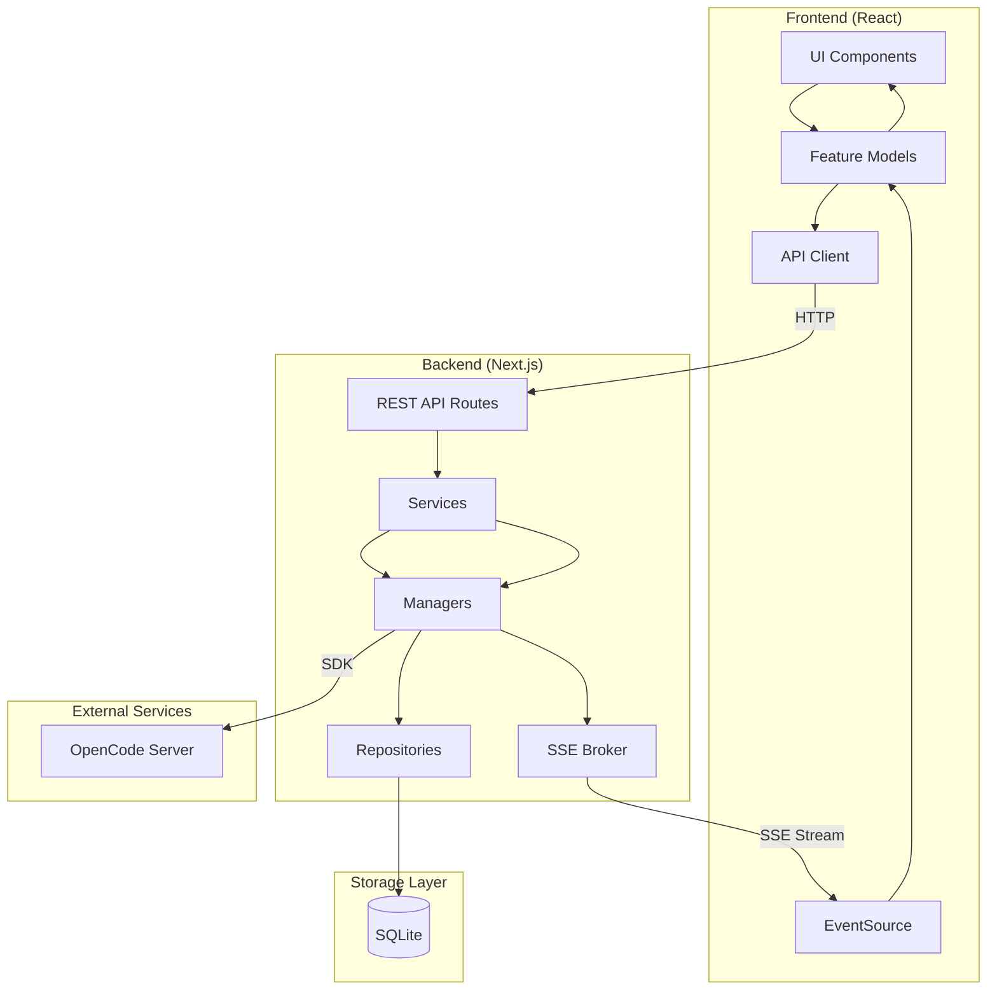

### Entity Relationships

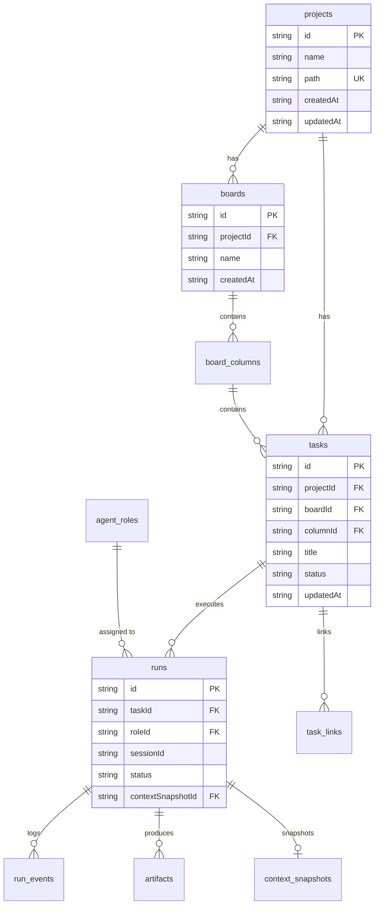

---

## 2. Detailed Flow Diagrams

### 2.1 Project CRUD Flow

#### Sequence Diagram

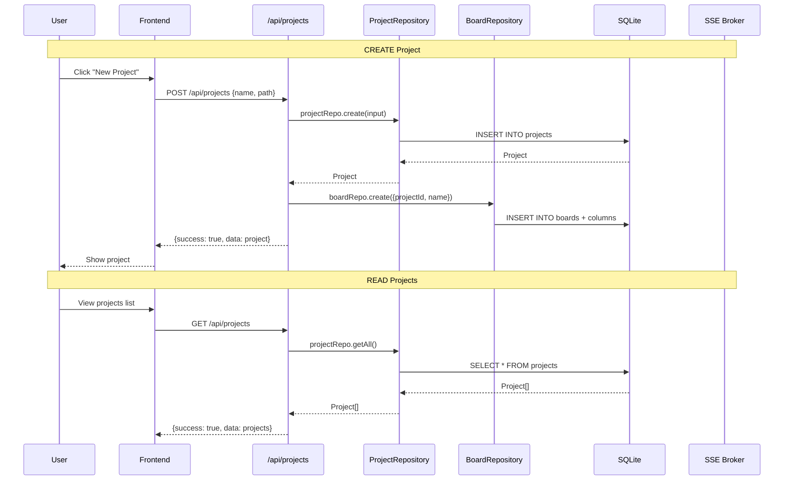

#### Flow Specification

| Aspect | Details |
|--------|---------|
| **Trigger** | User creates/updates/deletes a project |
| **Participants** | Frontend, API Route, ProjectRepository, BoardRepository, SQLite |
| **Steps** | 1. Validate input (name, path required) 2. Create project record 3. Create default board with columns 4. Return project data |
| **Output** | Project object with id, name, path, timestamps |
| **Error Handling** | 400: Missing required fields, 409: Duplicate path, 500: Server error |
| **Test Points** | Mock `projectRepo.create()`, assert DB insert called, verify board creation |

---

### 2.2 Task CRUD Flow

#### Sequence Diagram

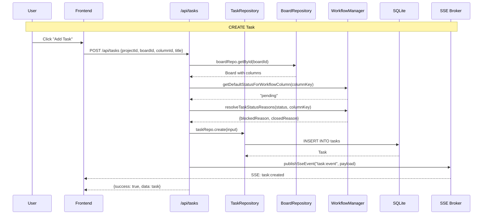

#### Data Transformation Map

```
Request                    Service                    Repository                 DB
------------------------   ------------------------   ------------------------   ------------------------
{                          Validate board             Add defaults:              INSERT INTO tasks (
  projectId,               Resolve status             - id: UUID                   id, project_id, board_id,
  boardId,      ------>    Resolve reasons  ------>   - status: "pending"  ------> column_id, title, status,
  columnId,                                           - orderInColumn: max+1       blocked_reason, ...
  title,                                               - createdAt/updatedAt      )
  description?                                                                   VALUES (?, ?, ...)
  status?                                             }
}
```

#### Flow Specification

| Aspect | Details |
|--------|---------|
| **Trigger** | User creates a new task |
| **Participants** | Frontend, API Route, TaskRepository, BoardRepository, WorkflowManager, SSE Broker |
| **Steps** | 1. Validate required fields 2. Resolve workflow column 3. Determine default status 4. Calculate blocked/closed reasons 5. Create task with auto-incremented order 6. Publish SSE event |
| **Output** | Task object with workflow-compliant status |
| **Error Handling** | 400: Missing fields, invalid column, unsupported status 500: DB error |
| **Test Points** | Mock `taskRepo.create()`, verify `publishSseEvent()` called, assert status resolution |

---

### 2.3 Task Drag-and-Drop Flow

#### Sequence Diagram

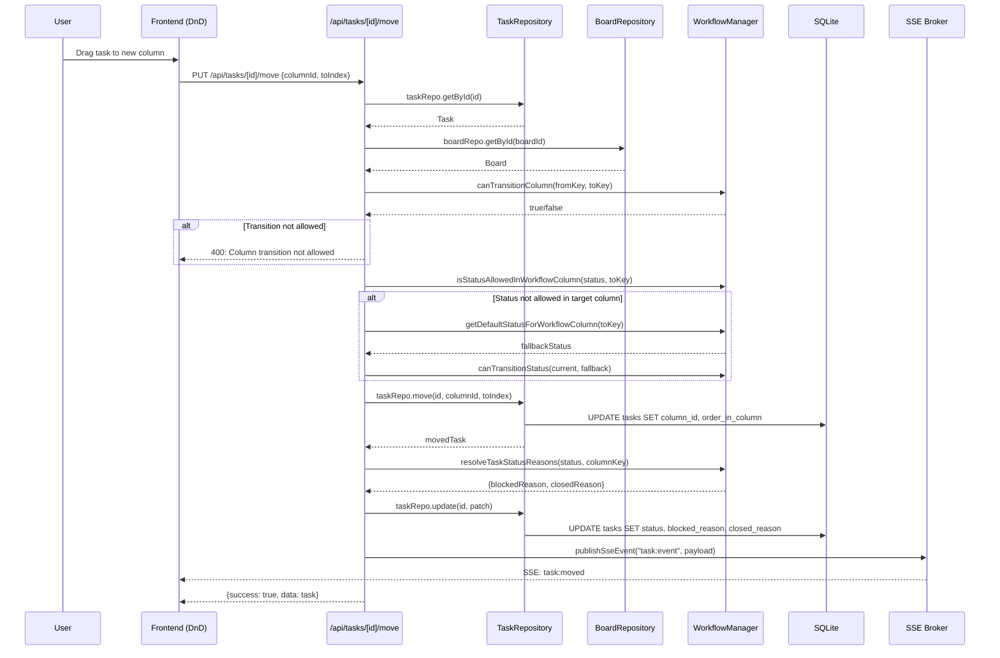

#### Flow Specification

| Aspect | Details |
|--------|---------|
| **Trigger** | User drags task to different column |
| **Participants** | Frontend DnD, API Route, TaskRepository, WorkflowManager, SSE Broker |
| **Steps** | 1. Validate task exists 2. Check column transition allowed 3. Check status compatibility 4. Move task (update column + reorder) 5. Update status/blockedReason/closedReason 6. Publish SSE |
| **Output** | Updated task with new column, order, and potentially new status |
| **Error Handling** | 404: Task not found, 400: Invalid column/transition, 500: DB error |
| **Test Points** | Mock `canTransitionColumn()`, verify order recalculation, assert SSE payload |

---

### 2.4 Run Start Flow

#### Sequence Diagram

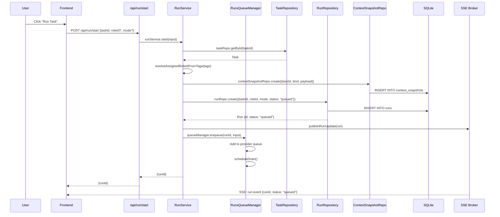

#### Data Transformation Map

```
Request                    RunService                 Queue Input                DB
------------------------   ------------------------   ------------------------   ------------------------
{                          Resolve role:              Build queue input:         INSERT INTO runs (
  taskId,                  - from tags or       --->   - projectPath               id, task_id, role_id,
  roleId?,                 - from param               - sessionTitle              mode, status, ...
  mode?,                   - default                  - prompt              --->  status = "queued"
  modelName?                                          - sessionPreferences       )
}                                                                                 INSERT INTO run_events (
                                                                                    run_id, event_type, payload
                                                                                  )
```

#### Flow Specification

| Aspect | Details |
|--------|---------|
| **Trigger** | User clicks "Run Task" button |
| **Participants** | Frontend, API Route, RunService, RunsQueueManager, RunRepository, ContextSnapshotRepo |
| **Steps** | 1. Validate task exists 2. Resolve role from tags/param/default 3. Create context snapshot 4. Create run record (status: queued) 5. Build prompt 6. Enqueue in RunsQueueManager 7. Publish SSE |
| **Output** | `{runId: string}` |
| **Error Handling** | 400: Task not found, no roles configured, project not found 500: DB error |
| **Test Points** | Mock `runRepo.create()`, verify enqueue called, assert SSE event published |

---

### 2.5 Run Execution Flow (Queue Processing)

#### Sequence Diagram

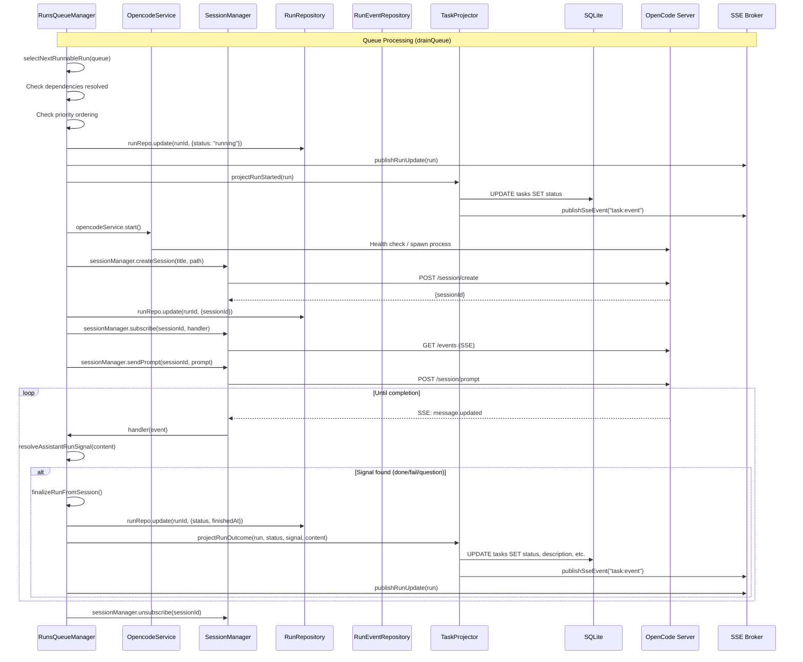

#### Flow Specification

| Aspect | Details |
|--------|---------|
| **Trigger** | RunsQueueManager drains queue (after enqueue or run completion) |
| **Participants** | RunsQueueManager, OpencodeService, SessionManager, RunRepository, TaskProjector |
| **Steps** | 1. Select next runnable (check deps, priority) 2. Update run status to running 3. Start OpenCode service 4. Create session 5. Subscribe to events 6. Send prompt 7. Handle events until signal 8. Finalize run 9. Project outcome to task |
| **Output** | Run with status: completed/failed/paused, Task with updated status/description |
| **Error Handling** | On error: set status to failed, set errorText, project failure |
| **Test Points** | Mock `sessionManager.createSession()`, verify event handling, assert status transitions |

---

### 2.6 Workflow Signal Processing Flow

#### Sequence Diagram

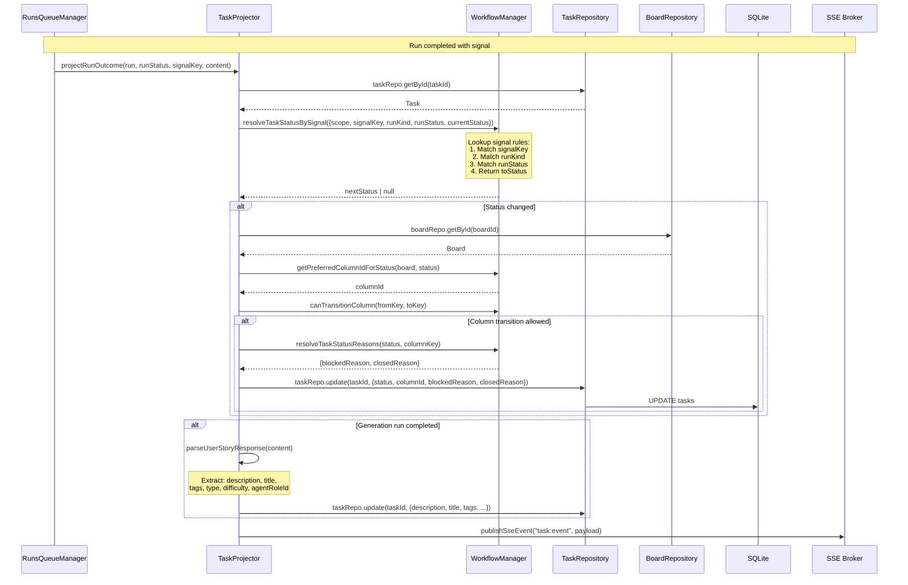

#### Signal Rule Resolution

```
resolveTaskStatusBySignal(input) lookup:
┌─────────────────────────────────────────────────────────────────────────────┐
│ Input: {scope, signalKey, runKind, runStatus, currentStatus, currentColumn}│
├─────────────────────────────────────────────────────────────────────────────┤
│ 1. Filter rules by signalKey                                                 │
│ 2. Match runKind (null matches any)                                         │
│ 3. Match runStatus (null matches any)                                       │
│ 4. Match fromColumnSystemKey (null matches any)                             │
│ 5. Match fromStatus (null matches any)                                      │
│ 6. Return first matching rule's toStatus                                    │
└─────────────────────────────────────────────────────────────────────────────┘

Example rules:
| signalKey      | runKind                   | runStatus  | toStatus   |
|----------------|---------------------------|------------|------------|
| run_started    | null                      | running    | running    |
| generation_started | task-description-improve | running | generating |
| done           | task-description-improve  | completed  | pending    |
| done           | null                      | completed  | done       |
| fail           | null                      | failed     | failed     |
| question       | null                      | paused     | paused     |
```

#### Flow Specification

| Aspect | Details |
|--------|---------|
| **Trigger** | Run completes/fails/pauses with signal |
| **Participants** | TaskProjector, WorkflowManager, TaskRepository, BoardRepository |
| **Steps** | 1. Get current task 2. Resolve next status via signal rules 3. Determine preferred column 4. Check column transition 5. Resolve blocked/closed reasons 6. Update task 7. Parse generation content if applicable 8. Publish SSE |
| **Output** | Task with updated status, column, reasons, and optionally description |
| **Error Handling** | Invalid status returns null (no update), invalid transitions blocked |
| **Test Points** | Mock `resolveTaskStatusBySignal()`, verify rule matching, assert column resolution |

---

### 2.7 SSE Subscription Flow

#### Sequence Diagram

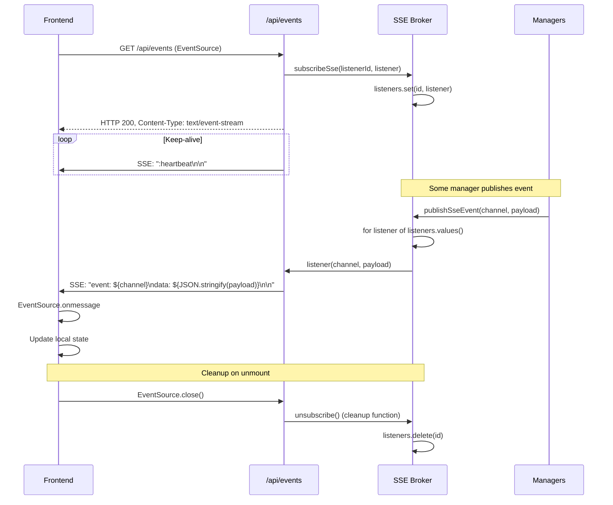

#### SSE Event Payloads

```typescript
// Task events (channel: "task:event")
interface TaskSsePayload {
  taskId: string;
  boardId: string;
  projectId: string;
  eventType?: "task:created" | "task:moved" | "task:updated";
  updatedAt: string;
}

// Run events (channel: "run:event")
interface RunSsePayload {
  runId: string;
  taskId: string;
  status: RunStatus;
  sessionId?: string;
  errorText?: string;
  updatedAt: string;
}
```

#### Flow Specification

| Aspect | Details |
|--------|---------|
| **Trigger** | Frontend component mounts (EventSource connection) |
| **Participants** | Frontend EventSource, API Route, SSE Broker, Managers |
| **Steps** | 1. Open EventSource connection 2. Register listener with SSE Broker 3. Send heartbeats 4. Broadcast events to all listeners 5. Update frontend state 6. Cleanup on unmount |
| **Output** | Real-time UI updates without polling |
| **Error Handling** | Reconnection on disconnect, cleanup on close |
| **Test Points** | Mock `publishSseEvent()`, verify listener registration, assert event format |

---

## 3. Data Transformation Maps

### 3.1 Request to Database (Create Task)

```
┌──────────────────────────────────────────────────────────────────────────────┐
│ REQUEST (POST /api/tasks)                                                    │
├──────────────────────────────────────────────────────────────────────────────┤
│ {                                                                            │
│   projectId: "proj_abc",                                                     │
│   boardId: "board_123",                                                      │
│   columnId: "col_456",                                                       │
│   title: "Implement feature X",                                              │
│   description: "Detailed description...",                                    │
│   priority: "normal",        // optional, default: "normal"                  │
│   difficulty: "medium",      // optional, default: "medium"                  │
│   type: "feature",           // optional, default: "chore"                   │
│   tags: ["frontend", "api"], // optional, default: []                        │
│   status: "pending"          // optional, resolved via workflow              │
│ }                                                                            │
└──────────────────────────────────────────────────────────────────────────────┘
                                    │
                                    ▼
┌──────────────────────────────────────────────────────────────────────────────┐
│ SERVICE LAYER TRANSFORMATIONS                                                │
├──────────────────────────────────────────────────────────────────────────────┤
│ 1. Validate board exists and column belongs to board                         │
│ 2. Resolve workflow column system key                                        │
│ 3. Get default status for column: getDefaultStatusForWorkflowColumn(key)     │
│ 4. Validate status allowed in column: isStatusAllowedInWorkflowColumn()      │
│ 5. Resolve reasons: resolveTaskStatusReasons(status, columnKey)              │
│ 6. Calculate order: MAX(order_in_column) + 1 for board+column                │
└──────────────────────────────────────────────────────────────────────────────┘
                                    │
                                    ▼
┌──────────────────────────────────────────────────────────────────────────────┐
│ DATABASE INSERT                                                              │
├──────────────────────────────────────────────────────────────────────────────┤
│ INSERT INTO tasks (                                                          │
│   id,                   -- UUID generated                                    │
│   project_id,           -- from request                                      │
│   board_id,             -- from request                                      │
│   column_id,            -- from request                                      │
│   title,                -- from request                                      │
│   description,          -- from request or null                              │
│   description_md,       -- null initially                                    │
│   status,               -- resolved via workflow                             │
│   blocked_reason,       -- resolved via workflow                             │
│   closed_reason,        -- resolved via workflow                             │
│   priority,             -- from request or "normal"                          │
│   difficulty,           -- from request or "medium"                          │
│   type,                 -- from request or "chore"                           │
│   order_in_column,      -- calculated                                        │
│   tags_json,            -- JSON.stringify(tags)                              │
│   created_at,           -- ISO timestamp                                     │
│   updated_at            -- ISO timestamp                                     │
│ )                                                                            │
└──────────────────────────────────────────────────────────────────────────────┘
```

### 3.2 Database to Response (Get Task)

```
┌──────────────────────────────────────────────────────────────────────────────┐
│ DATABASE SELECT                                                              │
├──────────────────────────────────────────────────────────────────────────────┤
│ SELECT                                                                       │
│   id, project_id as projectId, board_id as boardId, column_id as columnId,   │
│   title, description, description_md as descriptionMd, status,               │
│   blocked_reason as blockedReason, closed_reason as closedReason,            │
│   priority, difficulty, type, order_in_column as orderInColumn,              │
│   tags_json as tags, start_date as startDate, due_date as dueDate,           │
│   created_at as createdAt, updated_at as updatedAt                           │
│ FROM tasks WHERE id = ?                                                      │
└──────────────────────────────────────────────────────────────────────────────┘
                                    │
                                    ▼
┌──────────────────────────────────────────────────────────────────────────────┐
│ REPOSITORY TRANSFORMATION                                                    │
├──────────────────────────────────────────────────────────────────────────────┤
│ - Map snake_case columns to camelCase properties                             │
│ - tags field remains as JSON string (parsed by frontend)                     │
│ - Return null for optional fields not set                                    │
└──────────────────────────────────────────────────────────────────────────────┘
                                    │
                                    ▼
┌──────────────────────────────────────────────────────────────────────────────┐
│ API RESPONSE                                                                 │
├──────────────────────────────────────────────────────────────────────────────┤
│ {                                                                            │
│   success: true,                                                             │
│   data: {                                                                    │
│     id: "task_xyz",                                                          │
│     projectId: "proj_abc",                                                   │
│     boardId: "board_123",                                                    │
│     columnId: "col_456",                                                     │
│     title: "Implement feature X",                                            │
│     description: "Detailed description...",                                  │
│     status: "pending",                                                       │
│     blockedReason: null,                                                     │
│     closedReason: null,                                                      │
│     priority: "normal",                                                      │
│     difficulty: "medium",                                                    │
│     type: "feature",                                                         │
│     orderInColumn: 0,                                                        │
│     tags: "[\"frontend\",\"api\"]",                                          │
│     createdAt: "2026-03-06T10:00:00.000Z",                                   │
│     updatedAt: "2026-03-06T10:00:00.000Z"                                    │
│   }                                                                          │
│ }                                                                            │
└──────────────────────────────────────────────────────────────────────────────┘
```

### 3.3 SSE Event Payload Transformation

```
┌──────────────────────────────────────────────────────────────────────────────┐
│ TASK UPDATE TRIGGER                                                          │
├──────────────────────────────────────────────────────────────────────────────┤
│ taskRepo.update(taskId, {status: "running", columnId: "col_789"})            │
│ const updatedTask = taskRepo.getById(taskId)                                 │
└──────────────────────────────────────────────────────────────────────────────┘
                                    │
                                    ▼
┌──────────────────────────────────────────────────────────────────────────────┐
│ SSE PUBLICATION                                                              │
├──────────────────────────────────────────────────────────────────────────────┤
│ publishSseEvent("task:event", {                                              │
│   taskId: updatedTask.id,                                                    │
│   boardId: updatedTask.boardId,                                              │
│   projectId: updatedTask.projectId,                                          │
│   eventType: "task:updated",  // optional discriminator                      │
│   updatedAt: updatedTask.updatedAt                                           │
│ })                                                                           │
└──────────────────────────────────────────────────────────────────────────────┘
                                    │
                                    ▼
┌──────────────────────────────────────────────────────────────────────────────┐
│ SSE WIRE FORMAT                                                              │
├──────────────────────────────────────────────────────────────────────────────┤
│ event: task:event                                                            │
│ data: {"taskId":"task_xyz","boardId":"board_123","projectId":"proj_abc",     │
│ data: "updatedAt":"2026-03-06T10:05:00.000Z"}                                │
│                                                                              │
└──────────────────────────────────────────────────────────────────────────────┘
                                    │
                                    ▼
┌──────────────────────────────────────────────────────────────────────────────┐
│ FRONTEND HANDLER                                                             │
├──────────────────────────────────────────────────────────────────────────────┤
│ eventSource.onmessage = (event) => {                                         │
│   const payload = JSON.parse(event.data);                                    │
│   // payload: { taskId, boardId, projectId, updatedAt }                      │
│   // Trigger refetch of task or optimistic update                            │
│ }                                                                            │
└──────────────────────────────────────────────────────────────────────────────┘
```

---

## 4. Concurrency Flows

### 4.1 Multiple Runs in Queue

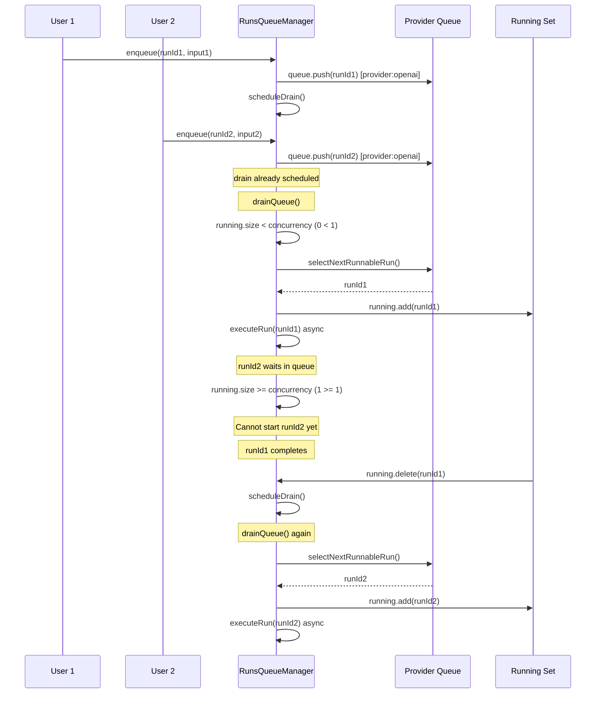

### 4.2 Concurrent Task Updates

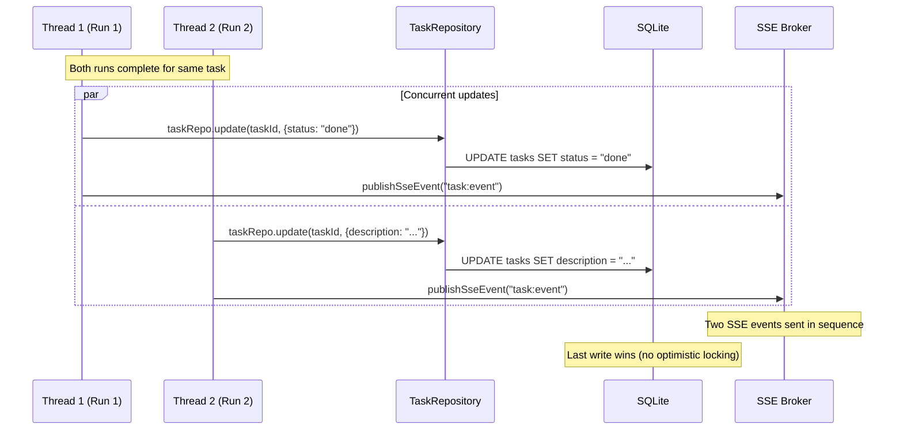

### 4.3 SSE Event Ordering

```
Event Order Guarantee:
┌─────────────────────────────────────────────────────────────────────────────┐
│                                                                              │
│  Manager 1                    SSE Broker                  Client            │
│     │                            │                          │               │
│     │ publishSseEvent(A)         │                          │               │
│     │───────────────────────────>│                          │               │
│     │                            │ broadcast(A)             │               │
│     │                            │─────────────────────────>│               │
│     │                            │                          │ process(A)    │
│     │                            │                          │               │
│  Manager 2                    SSE Broker                  Client            │
│     │                            │                          │               │
│     │ publishSseEvent(B)         │                          │               │
│     │───────────────────────────>│                          │               │
│     │                            │ broadcast(B)             │               │
│     │                            │─────────────────────────>│               │
│     │                            │                          │ process(B)    │
│                                                                              │
│  Order: A arrives before B (single-threaded broadcast)                      │
│                                                                              │
└─────────────────────────────────────────────────────────────────────────────┘

No-Order Scenario (different clients):
┌─────────────────────────────────────────────────────────────────────────────┐
│  Client 1 and Client 2 may receive events in different orders              │
│  if they subscribe at different times or have different latencies.          │
│  Each client sees a consistent order, but clients may differ.               │
└─────────────────────────────────────────────────────────────────────────────┘
```

---

## 5. Test Verification Points

### 5.1 Project CRUD Tests

```typescript
// Test: Create project with board
describe("Project CRUD Flow", () => {
  // Mock points
  const mockProjectRepo = {
    create: vi.fn(),
    getAll: vi.fn(),
  };
  const mockBoardRepo = {
    create: vi.fn(),
  };

  // Assertions
  it("should create project and default board", async () => {
    mockProjectRepo.create.mockReturnValue({ id: "proj_1", name: "Test" });
    
    const response = await POST(createRequest({ name: "Test", path: "/test" }));
    
    expect(mockProjectRepo.create).toHaveBeenCalledWith({
      name: "Test",
      path: "/test",
      color: undefined,
    });
    expect(mockBoardRepo.create).toHaveBeenCalledWith({
      projectId: "proj_1",
      name: "Main Board",
    });
    expect(response.status).toBe(200);
  });

  // Error path test
  it("should return 409 for duplicate path", async () => {
    mockProjectRepo.create.mockImplementation(() => {
      throw new Error("UNIQUE constraint failed: projects.path");
    });
    
    const response = await POST(createRequest({ name: "Test", path: "/test" }));
    
    expect(response.status).toBe(409);
  });
});
```

### 5.2 Task CRUD Tests

```typescript
// Test: Create task with workflow resolution
describe("Task CRUD Flow", () => {
  const mockTaskRepo = { create: vi.fn(), getById: vi.fn() };
  const mockBoardRepo = { getById: vi.fn() };
  const mockPublishSse = vi.fn();

  it("should resolve default status from workflow column", async () => {
    mockBoardRepo.getById.mockReturnValue({
      id: "board_1",
      columns: [{ id: "col_1", systemKey: "ready" }],
    });
    mockTaskRepo.create.mockReturnValue({ id: "task_1", status: "pending" });

    await POST(createRequest({
      projectId: "proj_1",
      boardId: "board_1",
      columnId: "col_1",
      title: "Task",
    }));

    expect(mockTaskRepo.create).toHaveBeenCalledWith(
      expect.objectContaining({
        status: "pending", // Default for "ready" column
        blockedReason: null,
        closedReason: null,
      })
    );
  });

  it("should publish SSE event after creation", async () => {
    mockTaskRepo.create.mockReturnValue({
      id: "task_1",
      boardId: "board_1",
      projectId: "proj_1",
      updatedAt: "2026-03-06T10:00:00Z",
    });

    await POST(createRequest({ ... }));

    expect(mockPublishSse).toHaveBeenCalledWith("task:event", {
      taskId: "task_1",
      boardId: "board_1",
      projectId: "proj_1",
      eventType: "task:created",
      updatedAt: "2026-03-06T10:00:00Z",
    });
  });
});
```

### 5.3 Run Flow Tests

```typescript
// Test: Run start flow
describe("Run Start Flow", () => {
  const mockRunRepo = { create: vi.fn(), update: vi.fn() };
  const mockTaskRepo = { getById: vi.fn() };
  const mockQueueManager = { enqueue: vi.fn() };
  const mockPublishRunUpdate = vi.fn();

  it("should create run in queued status and enqueue", async () => {
    mockTaskRepo.getById.mockReturnValue({
      id: "task_1",
      projectId: "proj_1",
      title: "Task",
    });
    mockRunRepo.create.mockReturnValue({
      id: "run_1",
      taskId: "task_1",
      status: "queued",
    });

    const result = await runService.start({ taskId: "task_1" });

    expect(mockRunRepo.create).toHaveBeenCalledWith(
      expect.objectContaining({
        taskId: "task_1",
        status: "queued",
      })
    );
    expect(mockQueueManager.enqueue).toHaveBeenCalledWith(
      "run_1",
      expect.objectContaining({
        prompt: expect.any(String),
        projectPath: expect.any(String),
      })
    );
    expect(result).toEqual({ runId: "run_1" });
  });
});

// Test: Run execution and completion
describe("Run Execution Flow", () => {
  it("should project run outcome to task", () => {
    const mockTaskRepo = { getById: vi.fn(), update: vi.fn() };
    const mockPublishSse = vi.fn();

    mockTaskRepo.getById.mockReturnValue({
      id: "task_1",
      status: "running",
      boardId: "board_1",
    });
    mockTaskRepo.update.mockReturnValue({
      id: "task_1",
      status: "done",
    });

    const projector = new RunTaskProjector();
    projector.projectRunOutcome(
      { taskId: "task_1", metadata: {} },
      "completed",
      "done",
      "Task completed"
    );

    expect(mockTaskRepo.update).toHaveBeenCalledWith(
      "task_1",
      expect.objectContaining({
        status: "done",
      })
    );
    expect(mockPublishSse).toHaveBeenCalled();
  });
});
```

### 5.4 Workflow Signal Tests

```typescript
// Test: Signal resolution
describe("Workflow Signal Resolution", () => {
  it("should resolve status from run signal", () => {
    const result = resolveTaskStatusBySignal({
      scope: "run",
      signalKey: "done",
      runKind: null,
      runStatus: "completed",
      currentStatus: "running",
    });

    expect(result).toBe("done");
  });

  it("should resolve different status for generation run", () => {
    const result = resolveTaskStatusBySignal({
      scope: "run",
      signalKey: "done",
      runKind: "task-description-improve",
      runStatus: "completed",
      currentStatus: "generating",
    });

    expect(result).toBe("pending"); // Generation goes back to pending
  });

  it("should return null for invalid transition", () => {
    const result = resolveTaskStatusBySignal({
      scope: "run",
      signalKey: "invalid_signal",
      runKind: null,
      runStatus: "completed",
      currentStatus: "running",
    });

    expect(result).toBeNull();
  });
});
```

### 5.5 SSE Tests

```typescript
// Test: SSE subscription and broadcast
describe("SSE Flow", () => {
  it("should broadcast event to all listeners", () => {
    const listener1 = vi.fn();
    const listener2 = vi.fn();

    const unsub1 = subscribeSse("listener_1", listener1);
    const unsub2 = subscribeSse("listener_2", listener2);

    publishSseEvent("task:event", { taskId: "task_1" });

    expect(listener1).toHaveBeenCalledWith("task:event", { taskId: "task_1" });
    expect(listener2).toHaveBeenCalledWith("task:event", { taskId: "task_1" });

    unsub1();
    publishSseEvent("task:event", { taskId: "task_2" });

    expect(listener1).toHaveBeenCalledTimes(1); // Not called after unsubscribe
    expect(listener2).toHaveBeenCalledTimes(2);
  });
});
```

### 5.6 Integration Test Checklist

| Flow | Mock Points | Assertions | Data Integrity Checks |
|------|-------------|------------|----------------------|
| Project Create | `projectRepo.create`, `boardRepo.create` | Status 200, project.id returned | Board created with project FK |
| Task Create | `taskRepo.create`, `publishSseEvent` | Correct status resolved, SSE called | orderInColumn auto-incremented |
| Task Move | `taskRepo.move`, `canTransitionColumn` | Column/status updated together | blockedReason matches status |
| Run Start | `runRepo.create`, `queueManager.enqueue` | Run queued, context snapshot created | Run linked to task |
| Run Execute | `sessionManager`, `taskProjector` | Session created, task updated | Run duration calculated |
| Signal Process | `resolveTaskStatusBySignal`, `taskRepo.update` | Correct status, column, reasons | Generation content parsed |
| SSE Subscribe | `subscribeSse`, `publishSseEvent` | Events received in order | Cleanup on unsubscribe |

---

## 6. Error Handling Paths

### 6.1 API Error Responses

```typescript
// Standard error response format
interface ErrorResponse {
  success: false;
  error: string;
  details?: string; // Only in non-production
}

// Common error scenarios
const ERROR_SCENARIOS = {
  // Project errors
  PROJECT_NOT_FOUND: { status: 404, error: "Project not found" },
  PROJECT_PATH_EXISTS: { status: 409, error: "Project path already exists" },
  
  // Task errors
  TASK_NOT_FOUND: { status: 404, error: "Task not found" },
  INVALID_COLUMN: { status: 400, error: "Column does not belong to board" },
  INVALID_STATUS: { status: 400, error: "Unsupported task status" },
  TRANSITION_NOT_ALLOWED: { status: 400, error: "Column transition is not allowed" },
  
  // Run errors
  NO_ROLES_CONFIGURED: { status: 400, error: "No agent roles configured" },
  RUN_NOT_FOUND: { status: 404, error: "Run not found" },
  
  // Generic
  VALIDATION_ERROR: { status: 400, error: "Missing required fields" },
  SERVER_ERROR: { status: 500, error: "Internal server error" },
};
```

### 6.2 Run Execution Error Flow

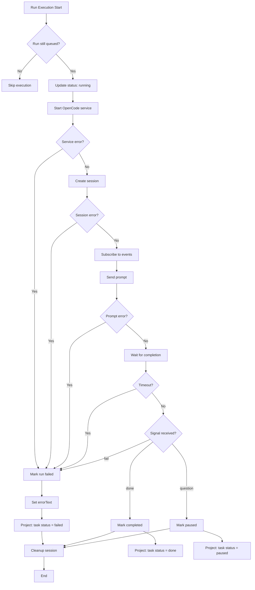

---

## 7. Quick Reference

### SSE Event Types

| Channel | Event Types | Trigger |
|---------|-------------|---------|
| `task:event` | `task:created`, `task:moved`, `task:updated` | Task CRUD, status changes, moves |
| `run:event` | `run:queued`, `run:started`, `run:completed`, `run:failed`, `run:paused` | Run lifecycle |

### Run Status Transitions

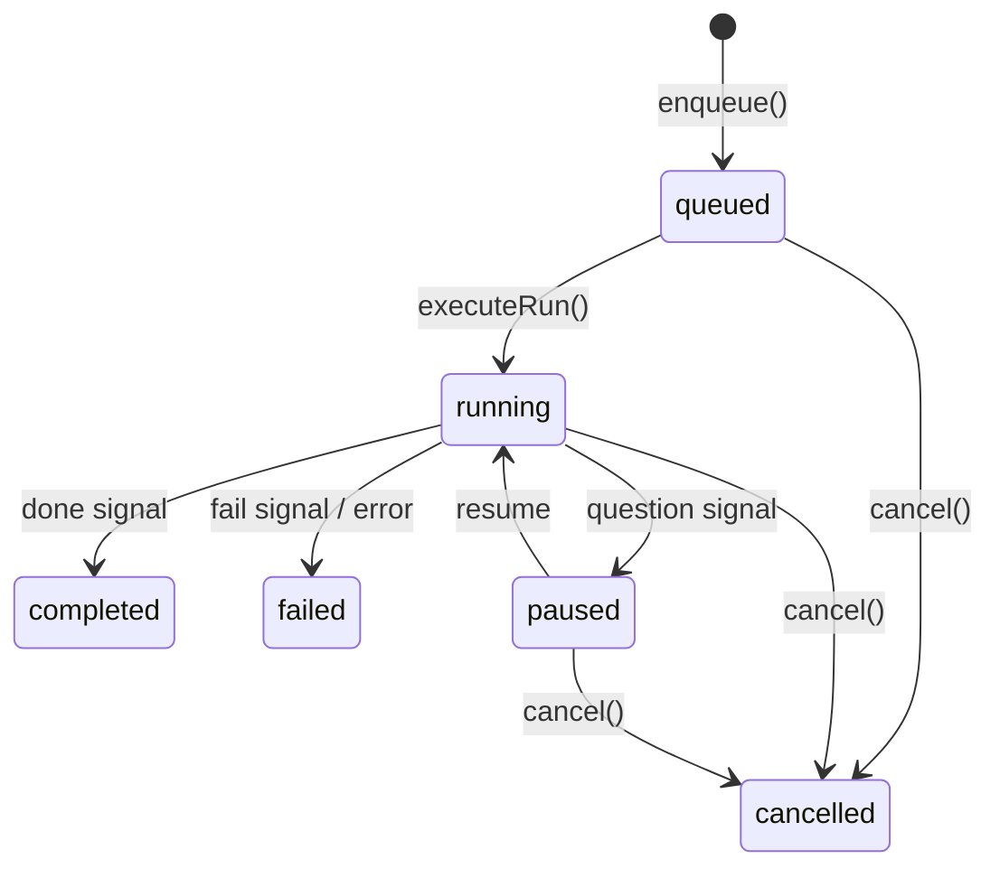

### Task Status by Column

| Column | Default Status | Allowed Statuses |
|--------|---------------|------------------|
| backlog | pending | pending |
| ready | pending | pending |
| deferred | pending | pending |
| in_progress | running | running, generating |
| blocked | paused | question, paused, failed |
| review | done | done |
| closed | done | done, failed |

### Test Mock Priority

1. **Repository methods** - Mock for unit isolation
2. **SSE Broker** - Mock to verify event publishing
3. **Workflow functions** - Mock for deterministic status resolution
4. **External services** - Mock OpenCode SDK calls
