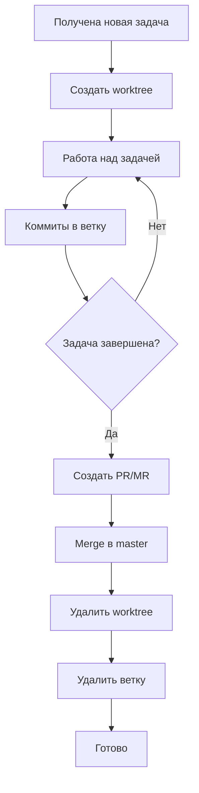

# Git Worktrees в проекте

> Дата: 8 марта 2026  
> Версия: 1.0

## Обзор

Проект использует **Git Worktrees** для параллельной разработки нескольких задач без конфликтов.

## Структура директорий

```
/Volumes/128GBSSD/Projects/
├── kanban-ai/                          # Главная директория (master branch)
│   └── .git/                           # Основной репозиторий
│
└── kanban-ai.worktrees/                # Worktrees для параллельных задач
    ├── 0a1f9bee-2d3a-4fa9-a736-8e986fd5c47f-git-worktrees-ebee7450/
    │   └── .git                        # Ссылка на основной репозиторий
    ├── 13c64252-8380-4141-ad61-38e9163756ba-git-worktrees-6f80d776/
    ├── 85557ea5-9954-408b-a95e-9e95eb55c135-git-worktrees-0964655f/
    ├── c5ce713c-d65f-4a3c-86b5-690e314629ac-git-worktrees-0cab0ea9/
    └── feb684b5-f052-44d9-beb1-93d33c3c1fab-git-worktrees-eaa743dd/
```

## Нейминг Worktrees

Формат имени директории:
```
{task-id}-git-worktrees-{short-sha}
```

- `task-id`: UUID задачи (генерируется системой управления задачами)
- `short-sha`: Короткий SHA коммита (7 символов)

Формат ветки:
```
task/{task-id}-{short-suffix}
```

## Просмотр Worktrees

```bash
# Список всех worktrees
git worktree list

# Пример вывода:
# /Volumes/128GBSSD/Projects/kanban-ai                                        13be3f6 [master]
# /Volumes/128GBSSD/Projects/kanban-ai.worktrees/0a1f9bee...ebee7450  13be3f6 [task/0a1f9bee...-3b7]
```

## Создание Worktree

### Способ 1: Новая ветка

```bash
# Создать worktree с новой веткой
git worktree add -b task/TASK-ID-SUFFIX ../kanban-ai.worktrees/TASK-ID-git-worktrees-SHORTSHA
```

### Способ 2: Существующая ветка

```bash
# Создать worktree для существующей ветки
git worktree add ../kanban-ai.worktrees/TASK-ID-git-worktrees-SHORTSHA task/TASK-ID-SUFFIX
```

## Удаление Worktree

```bash
# После завершения задачи и мержа ветки
git worktree remove ../kanban-ai.worktrees/TASK-ID-git-worktrees-SHORTSHA

# Или принудительно (если есть незакоммиченные изменения)
git worktree remove --force ../kanban-ai.worktrees/TASK-ID-git-worktrees-SHORTSHA

# Удалить ветку
git branch -d task/TASK-ID-SUFFIX
```

## Преимущества подхода

1. **Изоляция**: Каждая задача работает в отдельной директории
2. **Параллелизм**: Можно работать над несколькими задачами одновременно
3. **Нет stash**: Не нужно делать `git stash` при переключении контекста
4. **Чистота**: Каждая директория содержит только изменения для конкретной задачи
5. **Независимые IDE**: Можно открыть каждый worktree в отдельном окне IDE

## Важные ограничения

### Общие файлы

- **Нельзя** иметь незакоммиченные изменения в одном worktree и переключиться в другой worktree с изменениями в тех же файлах
- `.git` — это ссылка, не настоящий репозиторий

### Рекомендации

1. **Всегда коммитьте изменения** перед переключением между worktrees
2. **Удаляйте worktrees** после завершения работы над задачей
3. **Не создавайте** worktrees для тривиальных изменений (опечатки, документация)

## Workflow разработки



## Интеграция с Kanban AI

Приложение Kanban AI автоматически создаёт worktrees при запуске AI-агента для выполнения задачи:

1. Создаётся ветка `task/{task-id}-{suffix}`
2. Создаётся worktree в директории `kanban-ai.worktrees/`
3. AI-агент работает в изолированном окружении
4. После завершения worktree удаляется

### Project ID и Worktrees

> **Важно**: Каждый worktree имеет свой `projectId`, вычисляемый из пути директории.

При использовании `@opencode-ai/sdk` всегда передавайте актуальный `directory`:

```typescript
const client = createOpencodeClient({
  baseUrl: process.env.OPENCODE_URL || 'http://127.0.0.1:4096',
  throwOnError: true,
  directory: projectPath, // Путь к текущему worktree, не к основному репозиторию
})
```

## Команды для cleanup

```bash
# Показать все worktrees
git worktree list

# Удалить все удалённые worktrees (те, чьи директории не существуют)
git worktree prune

# Проверить статус всех worktrees
git worktree list | while read path commit branch; do
  if [ -d "$path" ]; then
    echo "✅ $branch: $path"
  else
    echo "❌ $branch: $path (missing)"
  fi
done
```

## Troubleshooting

### "already checked out at..."

**Проблема**: Git не позволяет checkout ветку, если она уже активна в другом worktree.

**Решение**:
```bash
# Найти где активна ветка
git worktree list

# Либо работайте в том worktree, либо удалите его
git worktree remove path/to/worktree
```

### Конфликты при prune

**Проблема**: `git worktree prune` не удаляет записи о worktrees.

**Решение**:
```bash
# Ручное удаление из .git/worktrees/
rm -rf .git/worktrees/old-worktree-name
```

### Зависший процесс в worktree

**Проблема**: OpenCode сервер или другой процесс запущен в worktree.

**Решение**:
```bash
# Найти процесс
lsof +D /path/to/worktree

# Убить процесс
kill -9 <PID>
```

---

*Документ создан для поддержки параллельной разработки с использованием Git Worktrees.*
