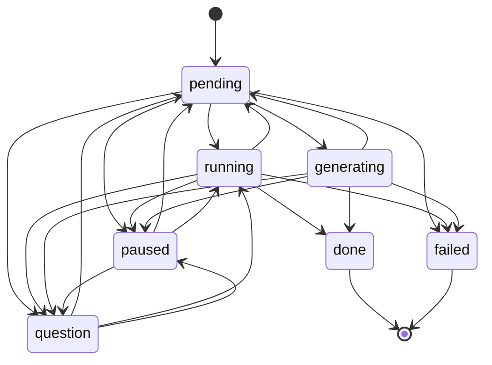
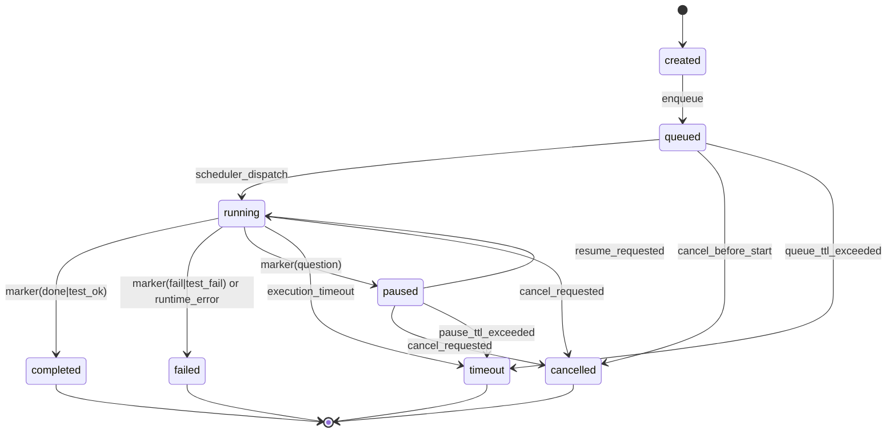

# State Machine Specifications for Testing

This document defines formal, test-first state machines for:

1. Task workflow status management
2. Run lifecycle execution management

It is intended to be executable as a specification: every allowed transition is testable, every forbidden transition is rejectable, and each signal has explicit behavior.

---

## 1) Task Workflow State Machine

### 1.1 States, Columns, and Signal Scopes

**Statuses**

- `pending`
- `running`
- `generating`
- `question`
- `paused`
- `done` (terminal)
- `failed` (terminal)

**Columns**

- `backlog`
- `ready`
- `deferred`
- `in_progress`
- `blocked`
- `review`
- `closed`

**Signal scopes**

- `run`
- `user_action`

### 1.2 State Diagram (Mermaid)

### 1.3 Complete Transition Table (Guards + Expected Behavior)

| ID | From | To | Allowed Signals | Guards / Conditions | Expected Behavior |
|---|---|---|---|---|---|
| WF-01 | `pending` | `running` | `run_started`, `testing_started`, `start_execution` | Signal scope is valid; task not terminal | Task enters active execution |
| WF-02 | `pending` | `generating` | `generation_started`, `start_generation` | Signal scope is valid; generation mode selected | Task enters AI generation phase |
| WF-03 | `pending` | `paused` | `pause_run` | User pause is explicit and accepted | Task blocks as paused before/without active execution |
| WF-04 | `pending` | `question` | `question` | Run emits question before completion | Task waits for user input |
| WF-05 | `pending` | `failed` | `fail` | Pre-start failure or setup failure is reported | Task becomes failed |
| WF-06 | `running` | `pending` | `cancel_run`, `cancelled` | Cancellation accepted | Task returns to pending |
| WF-07 | `running` | `paused` | `pause_run` | Pause accepted | Task becomes paused |
| WF-08 | `running` | `question` | `question` | Run requests user input | Task moves to question |
| WF-09 | `running` | `failed` | `fail`, `timeout` | Failure/timeout emitted by run | Task moves to failed |
| WF-10 | `running` | `done` | `done` | Completion signal is valid | Task completes |
| WF-11 | `generating` | `pending` | `approve_generation`, `cancel_run`, `cancelled` | Generation approved or cancelled | Task returns to pending |
| WF-12 | `generating` | `paused` | `pause_run` | Pause accepted during generation | Task becomes paused |
| WF-13 | `generating` | `question` | `question` | Generator asks for clarification | Task waits for user input |
| WF-14 | `generating` | `failed` | `reject_generation`, `fail`, `timeout` | Generation rejected/failed/timed out | Task becomes failed |
| WF-15 | `generating` | `done` | `done` | Generation completed and accepted by workflow | Task completes |
| WF-16 | `question` | `pending` | `approve_generation`, `cancel_run`, `cancelled` | User resolves question context or cancels | Task returns to pending |
| WF-17 | `question` | `running` | `run_started`, `testing_started`, `start_execution`, `resume_run` | Question resolved and execution resumes | Task resumes running |
| WF-18 | `question` | `paused` | `pause_run` | User explicitly keeps work blocked | Task remains blocked as paused |
| WF-19 | `paused` | `pending` | `cancel_run`, `cancelled` | Cancellation accepted | Task returns to pending |
| WF-20 | `paused` | `running` | `run_started`, `testing_started`, `resume_run`, `start_execution` | Resume/start accepted | Task resumes running |
| WF-21 | `paused` | `question` | `question` | New question context is raised | Task switches from paused to question |

**Terminal rules**

- `done` has no outgoing transitions.
- `failed` has no outgoing transitions.

### 1.4 Signal Mapping (Signal -> Status Change)

#### Run scope

| Signal | Typical From | To | Rejection Rule |
|---|---|---|---|
| `run_started` | `pending`, `question`, `paused` | `running` | Reject from `done`, `failed`, `generating` |
| `generation_started` | `pending` | `generating` | Reject from any non-`pending` state |
| `testing_started` | `pending`, `question`, `paused` | `running` | Reject from terminal states |
| `done` | `running`, `generating` | `done` | Reject from other states |
| `fail` | `pending`, `running`, `generating` | `failed` | Reject from terminal states |
| `question` | `pending`, `running`, `generating`, `paused` | `question` | Reject from `done`, `failed` |
| `timeout` | `running`, `generating` | `failed` | Reject from non-active states |
| `cancelled` | `running`, `generating`, `question`, `paused` | `pending` | Reject from terminal states |

#### User action scope

| Signal | Typical From | To | Rejection Rule |
|---|---|---|---|
| `start_generation` | `pending` | `generating` | Reject if current status is not `pending` |
| `start_execution` | `pending`, `question`, `paused` | `running` | Reject from terminal states |
| `pause_run` | `pending`, `running`, `generating`, `question` | `paused` | Reject from `done`, `failed` |
| `resume_run` | `paused`, `question` | `running` | Reject if not blocked by pause/question |
| `cancel_run` | `running`, `generating`, `question`, `paused` | `pending` | Reject from terminal states |
| `approve_generation` | `generating`, `question` | `pending` | Reject if generation context absent |
| `reject_generation` | `generating` | `failed` | Reject outside generation context |

### 1.5 Column Constraints

#### Column -> allowed statuses

| Column | Allowed Statuses |
|---|---|
| `backlog` | `pending` |
| `ready` | `pending` |
| `deferred` | `pending` |
| `in_progress` | `running`, `generating` |
| `blocked` | `question`, `paused`, `failed` |
| `review` | `done` |
| `closed` | `done`, `failed` |

#### Status -> allowed columns

| Status | Allowed Columns |
|---|---|
| `pending` | `backlog`, `ready`, `deferred` |
| `running` | `in_progress` |
| `generating` | `in_progress` |
| `question` | `blocked` |
| `paused` | `blocked` |
| `done` | `review`, `closed` |
| `failed` | `blocked`, `closed` |

### 1.6 Invariants

1. **Status validity**: task status is always one of the 7 allowed statuses.
2. **Column compatibility**: task column must allow current status.
3. **Transition legality**: `(from, to)` must exist in transition table.
4. **Scope legality**: signal scope must match signal definition.
5. **Terminal immutability**: no outgoing transition from `done` or `failed`.
6. **Single-step atomicity**: one accepted signal changes status at most once.
7. **Deterministic outcome**: same `(from, signal, guards)` yields same `to`.

---

## 2) Run Lifecycle State Machine

### 2.1 States

- `created`
- `queued`
- `running`
- `completed`
- `failed`
- `paused`
- `timeout`
- `cancelled`

### 2.2 State Diagram (Mermaid)

### 2.3 Transition Table (Guards + Expected Behavior)

| ID | From | To | Trigger | Guards / Conditions | Expected Behavior |
|---|---|---|---|---|---|
| RL-01 | `created` | `queued` | `enqueue` | Run payload is valid | Run enters scheduler queue |
| RL-02 | `queued` | `running` | `scheduler_dispatch` | Provider slot available and run is highest runnable priority | Run starts execution |
| RL-03 | `queued` | `cancelled` | `cancel_before_start` | Cancel request accepted before start | Run stops without execution |
| RL-04 | `queued` | `timeout` | `queue_ttl_exceeded` | Queue wait exceeds configured threshold | Run times out in queue |
| RL-05 | `running` | `completed` | marker `done` or `test_ok` | Completion marker parsed successfully | Run completes successfully |
| RL-06 | `running` | `failed` | marker `fail` or `test_fail`, runtime error | Failure marker/error captured | Run fails with reason |
| RL-07 | `running` | `paused` | marker `question` | User input is required | Run pauses awaiting user action |
| RL-08 | `running` | `timeout` | `execution_timeout` | Runtime exceeds configured threshold | Run times out and execution is aborted |
| RL-09 | `running` | `cancelled` | `cancel_requested` | Cancel request accepted while running | Run is cancelled and underlying session is aborted |
| RL-10 | `paused` | `running` | `resume_requested` | Resume request accepted and resources available | Run continues |
| RL-11 | `paused` | `cancelled` | `cancel_requested` | Cancel accepted while paused | Run is cancelled |
| RL-12 | `paused` | `timeout` | `pause_ttl_exceeded` | Pause exceeds configured threshold | Run moves to timeout |

### 2.4 Queue Rules

1. **Provider concurrency**: dispatch only when `running(provider) < provider_concurrency(provider)`.
2. **Priority order**: `generation > urgent > normal > low > postpone`.
3. **Dispatch tie-breaker**: for same priority, oldest `created_at` first.
4. **Postpone policy**: `postpone` runs stay queued until no higher runnable runs remain or policy override applies.

### 2.5 Prompt Status Marker Mapping

| Marker | Run State | Notes |
|---|---|---|
| `done` | `completed` | Successful completion |
| `test_ok` | `completed` | Completion with tests passing |
| `fail` | `failed` | Explicit failure |
| `test_fail` | `failed` | QA/test failure |
| `question` | `paused` | User input required |

### 2.6 Error Recovery Flows

1. **Paused recovery**
   - Path: `running -> paused -> running`.
   - Trigger: `resume_requested` after user response.
   - Expectation: same run id continues; no duplicate run created.

2. **Failed recovery (retry)**
   - Path: `failed -> created` (new run id).
   - Trigger: explicit retry action.
   - Expectation: failed run remains immutable; retry run starts fresh.

3. **Timeout recovery (retry)**
   - Path: `timeout -> created` (new run id).
   - Trigger: explicit retry action.
   - Expectation: timed-out run remains terminal with timeout reason preserved.

4. **Cancellation recovery (restart)**
   - Path: `cancelled -> created` (new run id).
   - Trigger: explicit restart action.
   - Expectation: cancelled run remains terminal; restart is independent.

### 2.7 Timeout Handling

1. **Detection**
   - Queue timeout while in `queued`.
   - Execution timeout while in `running`.
   - Pause timeout while in `paused`.

2. **Transition**
   - Emit timeout event.
   - Move run to `timeout`.

3. **Side effects**
   - Persist timeout reason and final timestamp.
   - Abort active provider/session if one exists.
   - Publish state update exactly once.

4. **Post-timeout policy**
   - Same run id remains terminal.
   - Retry, if allowed, must create a new run id.

---

## 3) Test Validation Rules

## 3.1 Task Workflow Validation

### Valid transitions to test

Test one positive case per transition ID `WF-01` through `WF-21`.

Minimum assertion set per case:

1. transition is accepted
2. final status equals `to`
3. resulting column is compatible with final status
4. terminal rule remains enforced after transition when applicable

### Invalid transitions to reject

At minimum, reject all of the following:

- Any outgoing transition from `done`.
- Any outgoing transition from `failed`.
- `pending -> done`.
- `pending -> blocked-only states` via unsupported signal.
- `running -> generating`.
- `generating -> running`.
- `question -> done`.
- `paused -> done`.
- Any transition where signal scope is wrong (for example, run signal passed as `user_action`).

### Guard conditions to verify

1. Signal scope matches signal definition.
2. Current status is non-terminal for non-terminal transitions.
3. `(from, to)` pair exists in workflow transition table.
4. For generation-specific actions (`approve_generation`, `reject_generation`), generation context is active.
5. Post-transition column compatibility holds.

### Edge cases to cover

1. Duplicate signal delivery (idempotency/no double transition).
2. Out-of-order signals (`done` received before `run_started`).
3. Concurrent conflicting signals (`pause_run` and `done` racing).
4. `question` followed by `cancel_run`.
5. Transition attempt while already terminal.

## 3.2 Run Lifecycle Validation

### Valid transitions to test

Test one positive case per transition ID `RL-01` through `RL-12`.

Minimum assertion set per case:

1. transition is accepted
2. final run state equals `to`
3. terminal states reject further transitions
4. side effects (timestamps, reasons, cancellation hooks) are written when required

### Invalid transitions to reject

At minimum, reject all of the following:

- `created -> running` (must pass through `queued`).
- `queued -> completed`.
- `queued -> failed` without execution.
- `running -> queued`.
- `completed -> running`.
- `failed -> running` (same run id).
- `timeout -> running` (same run id).
- `cancelled -> running` (same run id).

### Guard conditions to verify

1. Provider concurrency gate on `queued -> running`.
2. Priority ordering at dispatch time.
3. Marker parsing maps exactly to expected states.
4. Timeout thresholds are enforced for queue/run/pause phases.
5. Resume is only allowed from `paused`.

### Edge cases to cover

1. Late completion marker arrives after timeout/failure.
2. Cancel and completion race while `running`.
3. Resume request arrives after pause timeout.
4. Provider slot becomes free while high-priority run arrives concurrently.
5. Multiple queued runs with same priority and creation timestamp.

---

## 4) Test Data Requirements

### 4.1 Initial States for Testing

#### Task fixtures

| Fixture ID | Status | Column | Notes |
|---|---|---|---|
| `task_pending_backlog` | `pending` | `backlog` | baseline pending state |
| `task_pending_ready` | `pending` | `ready` | pending in active queue |
| `task_running` | `running` | `in_progress` | active execution |
| `task_generating` | `generating` | `in_progress` | generation flow |
| `task_question` | `question` | `blocked` | waiting for user answer |
| `task_paused` | `paused` | `blocked` | manually paused |
| `task_done_review` | `done` | `review` | terminal success |
| `task_failed_blocked` | `failed` | `blocked` | terminal failure |

#### Run fixtures

| Fixture ID | State | Priority | Provider | Notes |
|---|---|---|---|---|
| `run_created` | `created` | `normal` | `openai` | pre-queue |
| `run_queued_generation` | `queued` | `generation` | `openai` | highest priority |
| `run_queued_urgent` | `queued` | `urgent` | `openai` | high priority |
| `run_queued_postpone` | `queued` | `postpone` | `openai` | lowest priority |
| `run_running` | `running` | `normal` | `anthropic` | active execution |
| `run_paused` | `paused` | `normal` | `anthropic` | waiting for input |

### 4.2 Transition Sequences to Test

1. **Task happy path: execution**
   - `pending -> running -> done`
   - Expected: terminal `done`, column `review` or `closed`

2. **Task happy path: generation approval**
   - `pending -> generating -> question -> pending -> running -> done`
   - Expected: generation feedback loop resolves, then execution completes

3. **Task error path: runtime failure**
   - `pending -> running -> failed`
   - Expected: terminal `failed`, column `blocked` or `closed`

4. **Task error path: timeout**
   - `pending -> running -> failed` via `timeout`
   - Expected: failure reason indicates timeout cause

5. **Run happy path**
   - `created -> queued -> running -> completed`
   - Expected: run terminal `completed`, completion marker persisted

6. **Run pause/resume recovery**
   - `created -> queued -> running -> paused -> running -> completed`
   - Expected: same run id resumes and completes

7. **Run cancellation**
   - `created -> queued -> running -> cancelled`
   - Expected: session aborted, terminal cancelled state

8. **Run timeout**
   - `created -> queued -> running -> timeout`
   - Expected: timeout reason persisted, terminal state enforced

9. **Queue priority order**
   - Queue: generation, urgent, normal, low, postpone
   - Expected dispatch order: generation -> urgent -> normal -> low -> postpone

10. **Provider concurrency gating**
   - Two runs same provider, concurrency=1
   - Expected: second run remains queued until first leaves running

### 4.3 Error Scenarios

1. Invalid signal for current state (must reject with validation error).
2. Invalid column/status pair after transition (must reject or auto-correct per policy).
3. Unknown signal key or unknown scope (must reject).
4. Duplicate terminal marker after run already terminal (must no-op).
5. Completion and cancellation race in same processing window (exactly one terminal state must win; loser event ignored).
6. Timeout fires after run already completed (must no-op).
7. Retry attempt on terminal run id (must create new run id, never mutate terminal run).

---

## 5) Coverage Checklist

Use this checklist for CI test completeness:

- [ ] All 21 task workflow transitions (`WF-*`) have positive tests.
- [ ] All 12 run lifecycle transitions (`RL-*`) have positive tests.
- [ ] Terminal-state rejection tests exist for both state machines.
- [ ] Signal-scope validation tests exist.
- [ ] Column-constraint validation tests exist.
- [ ] Queue priority and provider concurrency tests exist.
- [ ] Timeout behavior tests exist for queued/running/paused phases.
- [ ] Race-condition tests exist for cancel vs complete and timeout vs complete.
