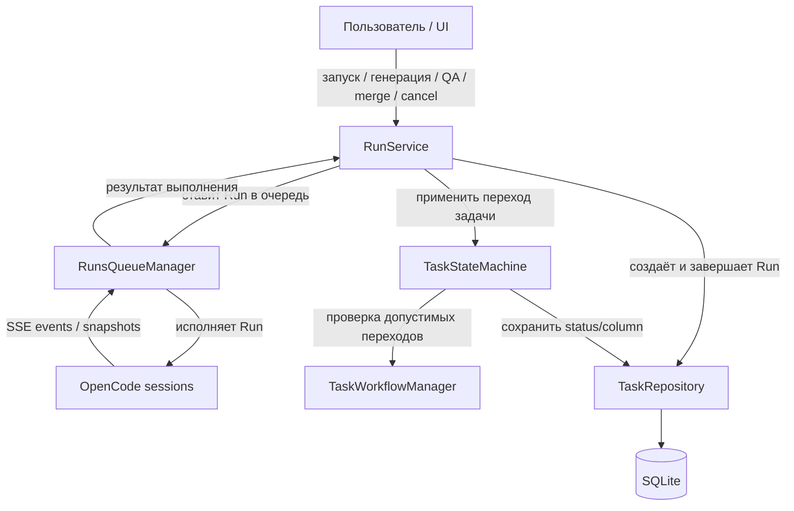
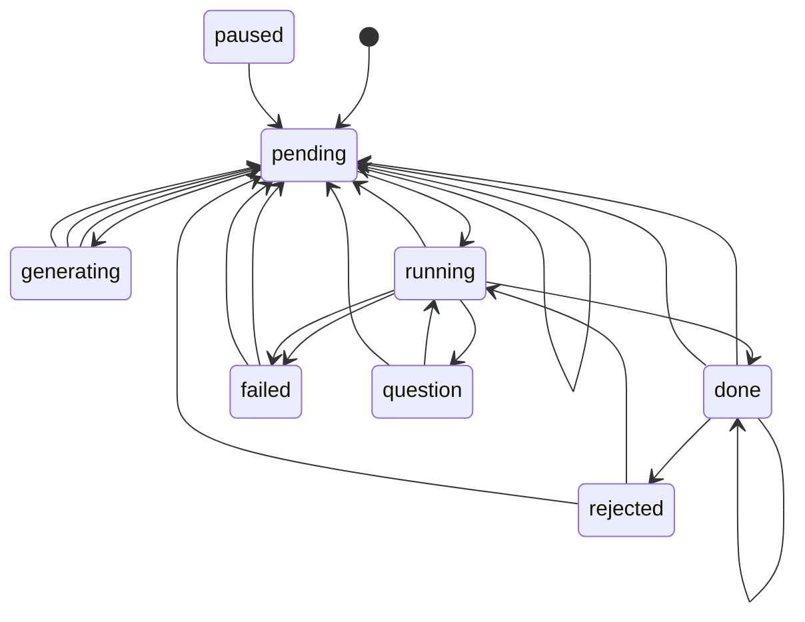
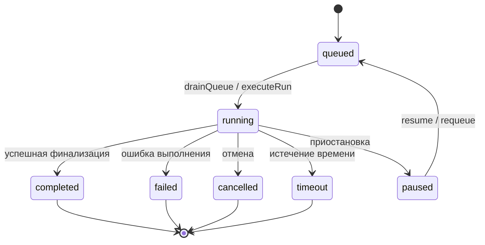
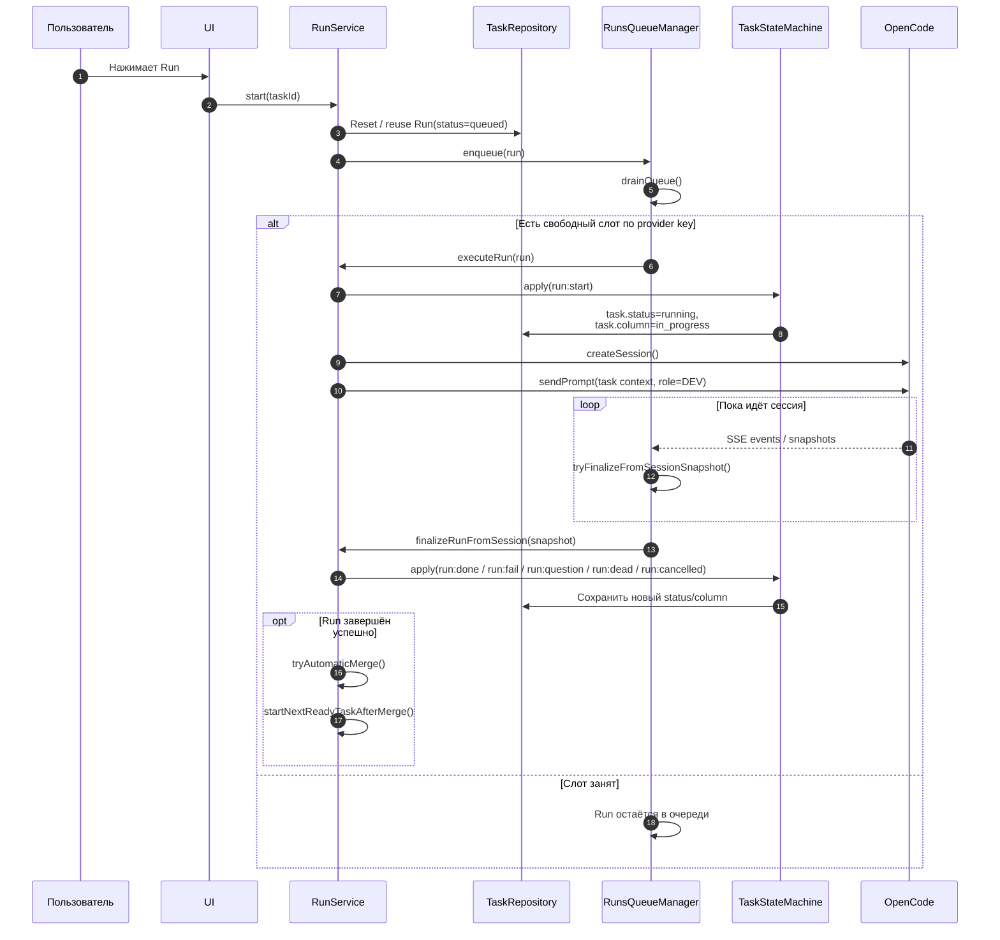
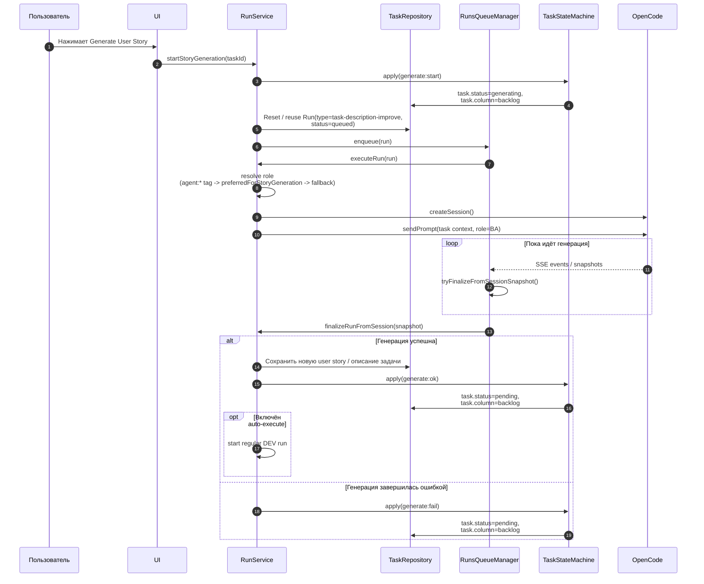
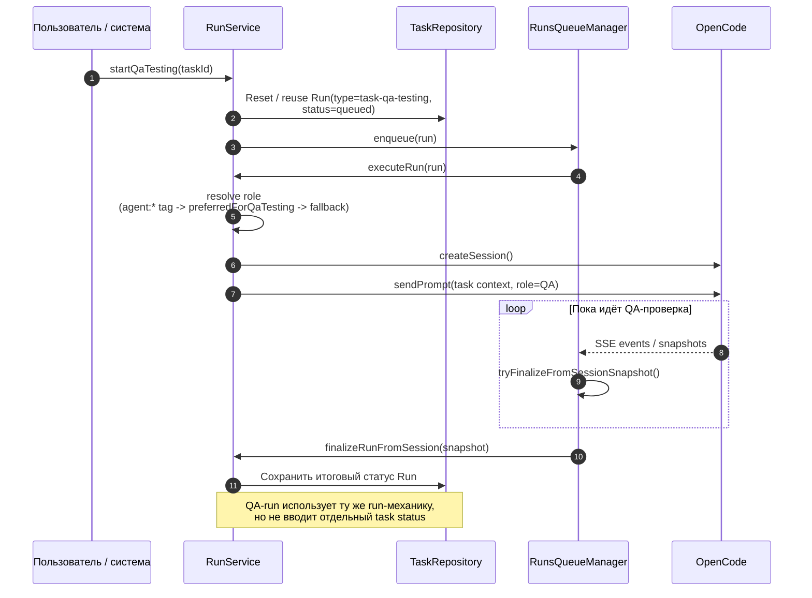
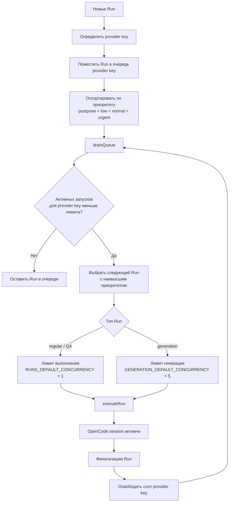
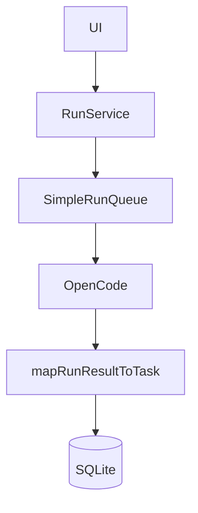

# Task Flow в Kanban AI

## 1. Обзор

Task Flow в Kanban AI — это связка правил и сервисов, которые переводят задачу между статусами и колонками, запускают для неё автоматизированные выполнения через OpenCode и фиксируют результат в SQLite. Важный момент: **статус задачи** и **колонка на доске** — это разные измерения; статус отражает фактическое состояние работы, а колонка — место задачи в workflow.

Основной поток выглядит так: пользователь инициирует действие в UI, `RunService` оркестрирует запуск, `RunsQueueManager` исполняет и поллит OpenCode, `TaskStateMachine` вычисляет новый статус задачи, а `TaskRepository` сохраняет итоговое состояние. В актуальной версии упрощения workflow-правила уже живут в `TaskStateMachine`, а не в отдельном runtime-слое.

---

## 2. Архитектура управления задачей

Ниже показано, какие компоненты управляют задачей и как между ними распределена ответственность.

### Роли компонентов

- **RunService** — главный orchestration-слой. Запускает обычные run'ы, генерацию user story, QA-тестирование, отмену, merge и пост-обработку.
- **RunsQueueManager** — отвечает за очередь, приоритеты, concurrency по provider key, запуск OpenCode session и финализацию по session snapshot.
- **TaskStateMachine** — переводит задачу в следующий статус по триггеру (`run:done`, `review:reject` и т.д.).
- **TaskWorkflowManager** — совместимый shim/re-export; отдельным источником логики больше не является.
- **TaskRepository** — слой чтения/записи задачи в SQLite.

---

## 3. Жизненный цикл задачи

Статус задачи меняется через фиксированный набор триггеров. Колонка при этом пересчитывается отдельно по workflow-правилам.

### Что важно в этой модели

- `generating` — специальный статус для генерации user story; после успеха или ошибки задача возвращается в `pending`.
- `running` — активное исполнение задачи DEV-агентом.
- `question` — run остановился на вопросе и ждёт ответа.
- `done` не означает автоматически «закрыто»: обычно задача попадает в `review`, а затем либо утверждается, либо отклоняется.
- `paused` присутствует в модели статусов, но в предоставленном наборе триггеров для него нет отдельного автоматического входа, кроме общего возврата через `run:cancelled`.

---

## 4. Жизненный цикл запуска (Run)

Run — это отдельная сущность исполнения. В текущей упрощённой модели **у задачи хранится только один run**, который переиспользуется между обычным выполнением, генерацией user story и QA-проверкой. При новом запуске система не создаёт новую строку, а reset-ит существующий run задачи.

Типовой путь — `queued → running → completed|failed|cancelled|timeout`. Статус `paused` используется как временное состояние приостановленного запуска, который затем может быть возвращён в очередь.

---

## 5. Флоу запуска выполнения

Это основной сценарий: пользователь запускает задачу, система получает единственный `Run` задачи, reset-ит его в `queued`, ставит в очередь, OpenCode выполняет работу, а затем итог применяется обратно к задаче.

### Ключевые точки

- `RunService.start()` не исполняет задачу напрямую; он сначала переводит единственный run задачи в `queued`.
- `RunsQueueManager` принимает решение, когда именно run можно стартовать.
- Финализация идёт не по одному событию, а по состоянию OpenCode session через `tryFinalizeFromSessionSnapshot()`.
- После успешного завершения возможны автоматический merge и запуск следующей готовой задачи.

---

## 6. Флоу генерации User Story

Генерация user story — это отдельный тип run: `task-description-improve`. Он использует ту же очередь, но другой бизнес-смысл: задача временно переходит в `generating`, а затем возвращается в `pending`. Важно, что при этом всё равно используется тот же единственный run задачи, а не отдельная историческая запись.

### Особенности генерации

- Используется **BA-роль**.
- Выбор роли идёт в порядке приоритета:
  1. тег задачи вида `agent:roleId`
  2. роль с `preferredForStoryGeneration`
  3. первая доступная роль
- Генерация работает с более высоким default concurrency, чем обычное выполнение.

---

## 7. Флоу QA-тестирования

QA-тестирование — это ещё один специальный тип запуска: `task-qa-testing`. Оно проходит через ту же очередь и тот же механизм OpenCode sessions, но использует **QA-роль** и обычно применяется после основного DEV-run для проверки результата перед финальным review/merge. Как и другие сценарии, QA переиспользует единственный run задачи.

Практически это означает: QA — это не отдельная ветка state machine задачи, а специализированный запуск, результат которого затем используется в review-процессе.

---

## 8. Очередь выполнений

Очередь управляется `RunsQueueManager`. Она учитывает **priority ordering**, **provider key** и **лимиты concurrency**.

### Как это работает

- Очередь не просто FIFO: сначала учитывается доступность слота по **provider key**, затем приоритет.
- Более срочные run'ы (`urgent`) вытесняют по порядку менее срочные (`normal`, `low`, `postpone`), но только в пределах доступного слота.
- Генерация и обычное выполнение имеют разные concurrency defaults:
  - **обычные run'ы и QA**: `1`
  - **генерация**: `5`

---

## 9. Маппинг статус → колонка

Ниже — фактический маппинг статусов задачи на workflow-колонки.

| Статус      | Возможные колонки                      | Комментарий                                                                                          |
| ----------- | -------------------------------------- | ---------------------------------------------------------------------------------------------------- |
| `pending`   | `backlog`, `ready`, `deferred`         | Задача существует, но ещё не исполняется.                                                            |
| `rejected`  | Явный фиксированный маппинг не указан  | Для повторного запуска задача должна оказаться в `ready`, потому что `run:start` допускает `rejected → running` только оттуда. |
| `generating`| `backlog`                              | Идёт генерация user story / описания задачи.                                                         |
| `running`   | `in_progress`                          | Активное исполнение DEV-run.                                                                         |
| `question`  | `blocked`                              | Исполнение остановилось и ждёт ответа.                                                               |
| `paused`    | `blocked`                              | Задача приостановлена.                                                                               |
| `done`      | `review`, `closed`                     | Сначала обычно попадает в `review`, после утверждения может перейти в `closed`.                      |
| `failed`    | `blocked`, `closed`                    | Ошибка во время исполнения или финализированная неуспешная задача.                                   |

### Разрешённые column transitions

| Из колонки    | В колонку                                                        |
| ------------- | ---------------------------------------------------------------- |
| `backlog`     | `ready`, `deferred`, `in_progress`                               |
| `ready`       | `backlog`, `deferred`, `in_progress`                             |
| `deferred`    | `backlog`, `ready`, `in_progress`                                |
| `in_progress` | `blocked`, `review`, `ready`, `deferred`, `backlog`              |
| `blocked`     | `in_progress`, `review`, `ready`, `deferred`, `backlog`, `closed`|
| `review`      | `in_progress`, `blocked`, `ready`, `closed`                      |
| `closed`      | `ready`, `review`, `backlog`                                     |

---

## 10. Автоматические переходы

Автоматические переходы вычисляются `TaskStateMachine` на основе триггера, текущего статуса и текущей колонки.

| Триггер          | Откуда                          | Куда        | Типичный результат по колонке       | Назначение                                         |
| ---------------- | ------------------------------- | ----------- | ----------------------------------- | -------------------------------------------------- |
| `generate:start` | `pending` в `backlog`           | `generating`| `backlog`                           | Старт генерации user story                         |
| `generate:ok`    | `generating`                    | `pending`   | `backlog`                           | Генерация завершилась успешно                      |
| `generate:fail`  | `generating`                    | `pending`   | `backlog`                           | Генерация завершилась ошибкой                      |
| `run:start`      | `pending` или `rejected` в `ready` | `running` | `in_progress`                       | Старт обычного выполнения                          |
| `run:cancelled`  | любой статус                    | `pending`   | Пересчитывается workflow-правилами  | Отмена run и возврат задачи в безопасное состояние |
| `run:done`       | `running`                       | `done`      | Обычно `review`                     | Исполнение завершилось успешно                     |
| `run:fail`       | `running`                       | `failed`    | Обычно `blocked`                    | Исполнение завершилось ошибкой                     |
| `run:question`   | `running`                       | `question`  | `blocked`                           | Агент задал вопрос и ждёт ответа                   |
| `run:answer`     | `question`                      | `running`   | `in_progress`                       | После ответа исполнение продолжается               |
| `run:dead`       | `running`                       | `failed`    | Обычно `blocked`                    | Run признан «мёртвым» или потерянным               |
| `review:approve` | `done` в `review`               | `done`      | Обычно `closed`                     | Ревью подтверждено, статус остаётся `done`         |
| `review:reject`  | `done`                          | `rejected`  | Возвращается в исполнимый workflow  | Ревью отклонено                                    |
| `recover:retry`  | `failed`                        | `pending`   | Повторная подготовка к запуску      | Ручное восстановление после ошибки                 |
| `recover:reopen` | `done`                          | `pending`   | Возврат в рабочий workflow          | Повторное открытие завершённой задачи              |

---

## 11. Восстановление после ошибок

В Task Flow есть несколько встроенных механизмов восстановления.

### Retry и reopen

- **`recover:retry`** переводит задачу из `failed` обратно в `pending`, чтобы её можно было снова подготовить и запустить.
- **`recover:reopen`** переводит задачу из `done` в `pending`, если результат нужно пересмотреть или доработать.

### Project polling

Отдельного фонового reconciliation-сервиса больше нет. Актуальная модель проще: когда у проекта есть активный viewer, `RunsQueueManager` запускает **project polling** и именно он становится единственным контуром синхронизации runtime-состояния.

Во время polling система:

- инспектирует активные run'ы проекта;
- обновляет `run.metadata.lastExecutionStatus`;
- дофинализирует run, если OpenCode session уже фактически завершилась;
- восстанавливает recoverable `fetch failed` run'ы этого проекта;
- синхронизирует task status/column с фактическим состоянием выполнения.

### Orphaned runs

Под orphaned run понимается запуск, который есть в БД, но потерял нормальную связь с активной очередью, session watcher или управляющим процессом. Для таких случаев система пытается:

- восстановить run по session snapshot;
- корректно завершить его как `completed` / `failed` / `cancelled` / `timeout`;
- если run нельзя безопасно продолжить, перевести связанную задачу в состояние, из которого её можно повторно обработать.

### Dead runs

Триггер **`run:dead`** нужен для случаев, когда выполнение перестало продвигаться и run считается «мертвым». В этом сценарии задача переводится в `failed`, чтобы её можно было явно восстановить через `recover:retry`.

---

## 12. Git Worktrees

Git worktree даёт изоляцию рабочей директории на уровне файлов и веток. Для task execution это означает, что отдельные run'ы могут работать в своём изолированном контексте, не мешая основной рабочей копии и соседним запускам.

Практическая польза такой изоляции:

- параллельные задачи не конфликтуют по незакоммиченным изменениям;
- отмена, QA и повторный запуск проще выполнять в предсказуемом окружении;
- merge-процедура безопаснее, потому что изменения уже отделены по task-specific рабочему контексту.

---

## 13. Что здесь можно упростить

Да, для небольшого проекта здесь действительно есть заметный архитектурный оверхед. Основная причина в том, что одна и та же бизнес-операция — «запустить задачу и отразить результат» — сейчас проходит через несколько отдельных слоёв, часть из которых полезна только при росте нагрузки, числа агентов или количества параллельных сценариев.

### Что выглядит избыточным сейчас

1. **Отдельные `TaskStateMachine` и `TaskWorkflowManager`**  
   Если статусы и колонки в проекте почти фиксированы, их можно держать в одном модуле с обычным объектом-конфигом и функцией `applyTaskTransition()`.

2. **Слишком богатая модель `Run` для локального single-user сценария**  
   Если одновременно обычно выполняется 1–2 задачи, то `paused`, `timeout`, reconciliation, orphan recovery и часть событийной модели можно сильно упростить.

3. **Сложная очередь по `providerKey`**  
   Для текущего масштаба часто достаточно одной глобальной очереди с `concurrency = 1` или максимум разделения на `generation` и `execution`.

4. **Отдельные специальные run types для всего**  
   `task-description-improve`, `task-qa-testing`, обычный run и merge-логика — это удобно, но можно сократить до более простой схемы: `generation | execution | qa`.

5. **Автоматический post-processing после completion**  
   Авто-merge, auto-start следующей задачи и сложная recovery-логика хороши для pipeline, но для маленького проекта часто делают поведение менее прозрачным.

6. **Git worktrees как обязательный инфраструктурный слой**  
   Если нет реального параллельного исполнения нескольких задач с конфликтующими изменениями, worktree лучше оставить как опциональный режим, а не как часть основного mental model.

### Что я бы оставил обязательно

- `RunService` как единый orchestration entry point;
- `taskRepo` / `runRepo`;
- один понятный mapping `task status -> board column`;
- базовую очередь запусков;
- один механизм финализации по статус-маркерам OpenCode.

### Что я бы сплющил в первую очередь

#### Вариант 1 — минимальное упрощение без потери возможностей

- оставить `RunService`;
- оставить `RunsQueueManager`;
- убрать отдельный `TaskWorkflowManager`;
- перенести правила статусов и колонок прямо в `TaskStateMachine`;
- оставить только статусы задачи: `pending | running | question | done | failed | generating`;
- сделать одну таблицу переходов в коде вместо нескольких уровней конфигурации.

Это даст меньше когнитивной нагрузки без серьёзного переписывания.

#### Вариант 2 — pragmatic small-project mode

- `RunService` создаёт run;
- run кладётся в **одну** очередь;
- `RunsQueueManager` просто запускает следующий run;
- результат OpenCode сразу маппится в `task.status` через один helper;
- колонка вычисляется функцией `getColumnByStatus(status)`.

В этом варианте можно вообще отказаться от отдельной workflow-системы и хранить правила прямо в коде.

### Упрощённая модель статусов

Для такого проекта я бы рассматривал даже более компактную модель:

| Сущность | Текущая модель | Упрощённая модель |
| --- | --- | --- |
| Task | `pending`, `rejected`, `running`, `question`, `paused`, `done`, `failed`, `generating` | `pending`, `running`, `blocked`, `done`, `failed`, `generating` |
| Run | `queued`, `running`, `completed`, `failed`, `cancelled`, `timeout`, `paused` | `queued`, `running`, `completed`, `failed`, `cancelled` |

Идея простая: для small-project режима `question` и `paused` можно часто схлопнуть в один `blocked`, а `timeout` обрабатывать как частный случай `failed` с причиной.

### Практический вывод

Если коротко: **да, архитектуру можно упростить без потери основной ценности продукта**. Самые выгодные упрощения:

1. убрать отдельный `TaskWorkflowManager`;
2. сократить число task/run statuses;
3. заменить очередь по provider key на одну простую очередь;
4. сделать статус → колонка обычной функцией;
5. оставить worktrees и auto-merge как optional advanced mode.

Именно эти изменения дадут максимальное снижение сложности при минимальной потере гибкости.

### Что уже упрощено в коде

На текущем этапе уже сделан первый реальный шаг к модели «одна state machine, минимум manager-слоёв»:

- workflow-правила и helper-логика перенесены в `src/server/run/task-state-machine.ts`;
- `src/server/workflow/task-workflow-manager.ts` больше не является отдельным источником логики и оставлен как **shim/re-export** для совместимости;
- server-side маршруты задач и внутренние runtime-модули переключены на прямой импорт из `task-state-machine.ts`;
- board API-маршруты больше не обращаются к `RunsQueueManager` напрямую и используют `runService` как единый orchestration facade;
- фактическим source of truth для правил переходов статусов и колонок стала state machine.

Это ещё не финальная точка упрощения, но уже убирает один отдельный слой абстракции и подготавливает код к следующему шагу: дальнейшему схлопыванию orchestration вокруг run lifecycle.

### Что ещё уже упрощено

Следующий этап упрощения тоже уже внедрён в код:

- **у задачи теперь один run**, а не история из нескольких execution/generation/qa run rows;
- при новом запуске, QA или генерации система **reset-ит существующий run**, очищает связанные events/artifacts и переиспользует тот же `runId`;
- `runService.listByTask()` и API по-прежнему возвращают массив для совместимости, но фактически это массив длины `0` или `1`;
- auto-execute after generation и auto-start after merge тоже работают через тот же single-run механизм.

### Быстрый мета-статус выполнения

Чтобы не вычислять мета-статус заново из всей истории, в `run.metadata` теперь хранится поле:

- `lastExecutionStatus`

Оно обновляется во время project polling и содержит последний наблюдённый execution snapshot:

- `kind`: `running | permission | question | completed | failed | dead`
- `marker`: например `done`, `generated`, `test_ok`, `fail`, `test_fail`
- `sessionId`
- при необходимости `permissionId` или `questionId`
- `updatedAt`

Практически это означает, что UI и сервер могут быстро понять текущее состояние выполнения по самому run, не перечитывая всю историю сообщений и не пытаясь вывести meta-status из нескольких run записей.
